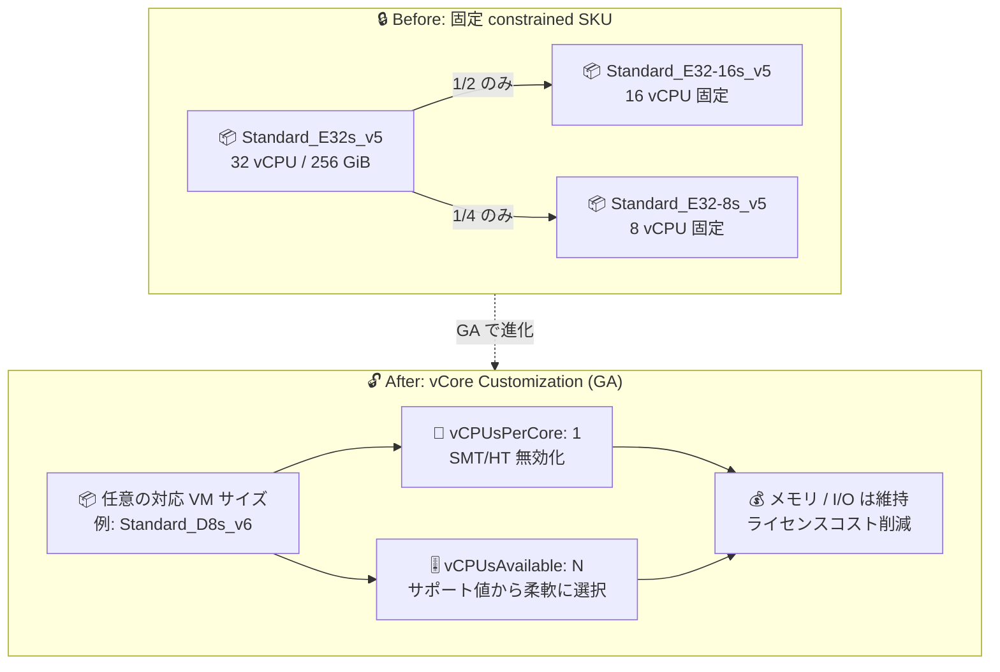

# Azure Virtual Machines: vCore Customization (SMT/HT 無効化 + 構成可能な Constrained Cores) が一般提供開始

**リリース日**: 2026-08-19

**サービス**: Azure Virtual Machines

**機能**: vCore Customization: Disable Multithreading and Configurable Constrained Cores

**ステータス**: Launched (GA)

[このアップデートのインフォグラフィックを見る](https://takech9203.github.io/azure-news-summary/20260819-vm-vcore-customization-smt-constrained-cores.html)

## 概要

Azure Virtual Machines の VM vCore Customization が一般提供 (GA) となりました。本機能は 2 つの新しい機能で構成されます。1 つ目は「Simultaneous Multi-Threading / Hyper-Threading (SMT/HT) の無効化」で、物理コアあたりのスレッド数を 1 に設定することで、ワークロードに物理コアへの排他的アクセスを提供し、レイテンシーの一貫性とパフォーマンスを向上させます。2 つ目は「構成可能な Constrained Cores (Customize vCPUs)」で、VM のメモリ・ストレージ・ネットワーク帯域幅を変えることなく、サポートされる vCPU 数の中から任意の値を選択できます。

アクティブなコア数を VM サイズから切り離す (デカップリングする) ことで、大容量メモリや高帯域幅の VM をデプロイしつつ、必要な vCore だけをアクティブ化できます。SQL Server、Oracle、SAP のようにライセンスコストがコア数に紐づくライセンス型ソフトウェアワークロードで特に有効です。

VM vCore Customization はすべての Azure パブリックリージョンで利用可能で、Virtual Machine Scale Sets (VMSS) の Uniform オーケストレーションモードもサポートします。Azure Portal、ARM テンプレート、Azure CLI、PowerShell から構成できます。

**アップデート前の課題**

- vCPU を制限した VM は、Microsoft が事前定義した固定の constrained vCPU SKU (例: `Standard_E32-16s_v5`、`Standard_E32-8s_v5`) のみ利用可能で、削減できる vCPU 数は元のサイズの 1/2 または 1/4 に限定されていた
- 事前定義 SKU が用意されている VM ファミリー・サイズでしか vCPU 制限を利用できなかった
- SMT/HT を無効化してスレッド間の競合を排除する構成を、VM のプロパティとして標準的に指定する手段がなかった

**アップデート後の改善**

- VM サイズごとにサポートされる vCPU 数の選択肢から柔軟に vCPU 数を構成可能になり、固定 SKU に縛られなくなった
- `vCPUsPerCore: 1` の指定により SMT/HT を無効化し、物理コアへの排他的アクセスによるレイテンシー一貫性・シングルスレッド性能の向上が可能になった
- SMT 無効化と vCPU 制限を同一 VM で組み合わせて利用可能。VMSS Uniform オーケストレーションモードにも対応

## アーキテクチャ図



従来は事前定義された固定の constrained vCPU SKU (1/2 または 1/4) しか選べませんでしたが、GA により VM プロパティとして SMT 無効化と vCPU 数を柔軟に指定できるようになりました。

## サービスアップデートの詳細

### 主要機能

1. **SMT/HT の無効化 (Threads Per Core = 1)**
   - 物理 CPU コアあたり 1 スレッドで VM を実行し、SMT (Hyper-Threading) を実質的にオフにする
   - 同一コア上のスレッド間競合を排除し、HPC やレイテンシーセンシティブなアプリケーションでより一貫した (場合によってはより高い) シングルスレッド性能を実現
   - SMT 無効時、OS からは通常の半分の論理プロセッサ数が見える

2. **構成可能な Constrained Cores (Customize vCPUs)**
   - VM サイズのデフォルト vCPU 数より少ないカスタム vCPU 数を指定可能
   - メモリ・ストレージ・ネットワーク帯域幅はフルサイズのまま維持
   - コア単位でライセンスされるソフトウェア (データベース、分析サーバーなど) のライセンスコスト削減に有効

3. **両機能の組み合わせ**
   - 同一 VM で SMT 無効化と vCPU 制限を同時に適用可能
   - 例: `Standard_D8s_v6` で `vCPUsPerCore: 1` + `vCPUsAvailable: 2` → 物理コア 2 個に 1:1 対応する 2 論理プロセッサ構成

## 技術仕様

| 項目 | 詳細 |
|------|------|
| 設定プロパティ | `hardwareProfile.vmSizeProperties` 配下の `vCPUsPerCore` / `vCPUsAvailable` |
| SMT 無効化 | `vCPUsPerCore: 1` (デフォルトは 2 スレッド/コア。省略または 2 で HT 有効) |
| vCPU 制限 | `vCPUsAvailable` にデフォルト以下の値を指定 (増加は不可) |
| vCPU 数の制約 | HT 有効 (2 スレッド/コア) のサイズではカスタム vCPU 数は偶数のみ |
| 変更タイミング | VM 作成時またはリサイズ操作時のみ (割り当て済み VM の動的変更は不可、割り当て解除が必要) |
| ARM API バージョン | `Microsoft.Compute/virtualMachines` の 2021-07-01 以降 |
| VMSS 対応 | Uniform オーケストレーションモードをサポート (GA 時点) |
| 対応イメージ | ファーストパーティ Azure OS イメージ (Windows Server、Ubuntu、Red Hat、SUSE など) およびカスタムイメージ。サードパーティライセンスを含む Marketplace イメージ (SQL Server on VM など) は非対応 |
| 利用可能リージョン | すべての Azure パブリックリージョン |
| 追加料金 | なし (ベース VM 料金はフルサイズと同一) |

## 設定方法

### 前提条件

1. 対象の VM サイズが vCore Customization をサポートしていること (多くの VM ファミリーでサポート)
2. SMT 無効化は、デフォルトで Hyper-Threading を使用する (2 スレッド/コア) VM サイズでのみ可能
3. ファーストパーティ Azure OS イメージまたはカスタムイメージを使用すること

### サポートされる vCPU 構成の確認

```bash
# リージョン内の VM SKU について、サポートされる vCPU 構成を確認
# "vCPUsConstraintsAllowed" フィールドにサポートされる vCore が示される
az vm list-skus --location {location} --resource-type virtualMachines --query "[name=='VM_NAME_HERE']"
```

### Azure CLI

```bash
# Standard_D8s_v6 (デフォルト 8 vCPU) で vCPU を 4 に制限し、SMT を無効化して VM を作成
az vm create \
  --resource-group myResourceGroup \
  --name myVM \
  --image Ubuntu2204 \
  --size Standard_D8s_v6 \
  --location eastus2 \
  --admin-username azureuser \
  --generate-ssh-keys \
  --v-cpus-available 4 \
  --v-cpus-per-core 1
```

### PowerShell

```powershell
$vmConfig = New-AzVMConfig -VMName "MyVM" -VMSize "Standard_D8s_v6"
$vmConfig.HardwareProfile.VmSizeProperties = New-Object Microsoft.Azure.Management.Compute.Models.VMSizeProperties
$vmConfig.HardwareProfile.VmSizeProperties.VCPUsAvailable = 4
$vmConfig.HardwareProfile.VmSizeProperties.VCPUsPerCore = 1
# 以降、OS・ネットワーク等を設定して New-AzVM で作成
```

### ARM テンプレート

```json
"properties": {
  "hardwareProfile": {
    "vmSize": "Standard_D8s_v6",
    "vmSizeProperties": {
      "vCPUsPerCore": 1,
      "vCPUsAvailable": 2
    }
  }
}
```

## メリット

### ビジネス面

- コア数課金のソフトウェア (SQL Server、Oracle、SAP など) のライセンスコストを、VM のメモリ・I/O 性能を犠牲にせずに削減できる
- 追加料金なしで利用可能 (ベース VM 料金はデフォルト構成のフルサイズ VM と同一)
- 固定 SKU の制約がなくなり、ワークロード要件とライセンス要件に合わせた最適なサイジングが可能

### 技術面

- SMT 無効化により、同一コア上のスレッド間競合を排除し、HPC やレイテンシーセンシティブなワークロードで一貫した性能を確保
- メモリ・ストレージ・ネットワーク帯域幅を維持したまま vCPU 数のみを調整可能
- Azure Portal、ARM テンプレート、Azure CLI、PowerShell と複数の構成手段に対応し、IaC への組み込みが容易
- 同一ファミリー内でこの機能をサポートするサイズへリサイズする場合、設定はデフォルトで引き継がれる

## デメリット・制約事項

- vCPU 数は削減のみ可能で、VM サイズのデフォルトを超える増加はできない
- HT 有効 (2 スレッド/コア) のサイズでは、カスタム vCPU 数は偶数である必要がある
- SMT 無効化は、デフォルトで HT を使用する VM サイズでのみ可能
- CPU オプションの指定は VM 作成時またはリサイズ時のみ。実行中 (割り当て済み) の VM では動的に変更できず、変更には割り当て解除が必要
- リサイズには VM の再起動が伴うため、ダウンタイムを計画する必要がある
- 機能をサポートしないサイズへのリサイズはブロックまたはエラーとなる
- サードパーティライセンスを含む Marketplace イメージ (SQL Server on Virtual Machines などの特殊オファー) は現時点で非対応
- ドキュメントによると、Portal サポートは今後提供予定 (GA 時点では CLI / PowerShell / ARM テンプレートでの構成が確実)

## ユースケース

### ユースケース 1: SQL Server のライセンスコスト最適化

**シナリオ**: 高メモリ・高 I/O 帯域幅が必要だが多数のコアは不要なデータベースワークロードで、コア単位ライセンスの SQL Server を運用する。

**実装例**:

```bash
# メモリ最適化 VM で vCPU を半分に制限し、ライセンス対象コア数を削減
az vm create \
  --resource-group db-rg \
  --name sqlvm01 \
  --image <ファーストパーティ Windows Server イメージ> \
  --size Standard_E32s_v5 \
  --v-cpus-available 16
```

**効果**: 256 GiB のメモリと 80,000 IOPS の I/O 帯域幅を維持しつつ、ライセンス対象の vCPU 数を 32 → 16 に削減し、コア数比例のライセンス費用を抑制。

### ユースケース 2: HPC・レイテンシーセンシティブワークロードの性能一貫性向上

**シナリオ**: 物理コアへの排他的アクセスが性能に効く HPC アプリケーションや低レイテンシー処理を実行する。

**実装例**:

```bash
# SMT を無効化して物理コア 1:1 の論理プロセッサ構成で VM を作成
az vm create \
  --resource-group hpc-rg \
  --name hpcvm01 \
  --image Ubuntu2204 \
  --size Standard_D8s_v6 \
  --v-cpus-per-core 1
```

**効果**: スレッド間競合を排除し、より一貫した (場合によってはより高い) シングルスレッド性能を実現。

## 料金

vCore Customization の利用に追加料金はありません。ベース VM の料金は、デフォルト設定のフルサイズ VM をデプロイした場合と同一です (vCPU を削減しても VM 料金自体は下がりません)。コスト削減効果は、vCPU 単位で課金されるソフトウェアのライセンス費用の削減として得られます。

| 項目 | 料金 |
|------|------|
| vCore Customization 機能 | 追加料金なし |
| VM 本体 | 元の VM サイズと同一料金 |

詳細は [Azure Virtual Machines の料金ページ](https://azure.microsoft.com/pricing/details/virtual-machines/) を参照してください。

## 利用可能リージョン

すべての Azure パブリックリージョンで利用可能です。

## 関連サービス・機能

- **Virtual Machine Scale Sets (VMSS)**: Uniform オーケストレーションモードで vCore Customization をサポート。スケールセット全体で SMT 無効化・vCPU 制限を適用可能
- **Constrained vCPU capable VM sizes (事前定義 SKU)**: 従来からの固定 constrained vCPU SKU (例: `Standard_E32-16s_v5`)。本機能はこれを一般化し、柔軟な vCPU 構成を可能にしたもの
- **SQL Server on Azure VMs**: コア単位ライセンスのコスト最適化の代表的な適用先。専用ガイダンス (VM vCore Customization for SQL) が公開されている (ただし SQL Server の Marketplace 特殊イメージ自体は現時点で非対応)

## 参考リンク

- [インフォグラフィック](https://takech9203.github.io/azure-news-summary/20260819-vm-vcore-customization-smt-constrained-cores.html)
- [公式アップデート情報](https://azure.microsoft.com/updates?id=569051)
- [VM vCore Customization - Azure Virtual Machines (Microsoft Learn)](https://learn.microsoft.com/azure/virtual-machines/vm-customization)
- [Constrained vCPU capable VM sizes (Microsoft Learn)](https://learn.microsoft.com/azure/virtual-machines/constrained-vcpu)
- [VM vCore Customization - SQL Server on Azure VMs (Microsoft Learn)](https://learn.microsoft.com/azure/azure-sql/virtual-machines/windows/vm-vcore-customization-for-sql)
- [料金ページ (Azure Virtual Machines)](https://azure.microsoft.com/pricing/details/virtual-machines/)

## まとめ

VM vCore Customization の GA により、固定の constrained vCPU SKU に縛られず、任意の対応 VM サイズで SMT/HT の無効化と vCPU 数の柔軟な構成が可能になりました。追加料金なしで、SQL Server・Oracle・SAP などコア単位ライセンスのワークロードのライセンスコストを削減しつつ、メモリ・I/O 性能を維持できます。コア数課金のソフトウェアを Azure VM で運用している場合は、`az vm list-skus` で対象サイズのサポート状況 (`vCPUsConstraintsAllowed`) を確認し、次回の VM 作成・リサイズ時に vCPU 構成の最適化を検討することを推奨します。なお、変更は VM 作成時・リサイズ時のみ可能で再起動を伴うため、適用はメンテナンスウィンドウに合わせて計画してください。

---

**タグ**: Azure Virtual Machines, Compute, vCore Customization, SMT, Hyper-Threading, Constrained Cores, ライセンスコスト最適化, GA
