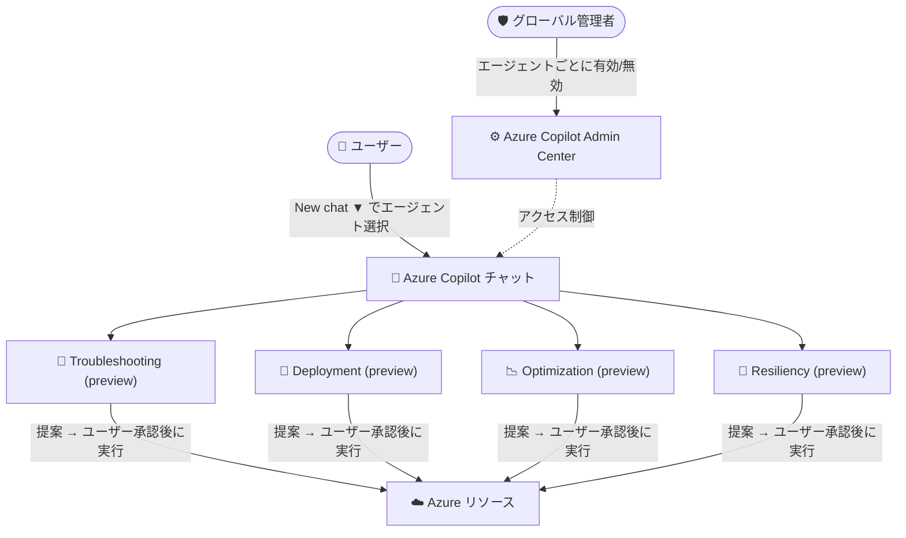

# Azure Copilot: エージェントへの直接アクセスを発表

**リリース日**: 2026-08-20

**サービス**: Azure Copilot

**機能**: エージェントへの直接アクセス (Direct access to agents)

**ステータス**: Announcement (2026 年 8 月より提供開始)

[このアップデートのインフォグラフィックを見る](https://takech9203.github.io/azure-news-summary/20260820-azure-copilot-agents-direct-access.html)

## 概要

2026 年 8 月より、Azure Copilot のチャット画面からエージェントを直接呼び出せるようになることが発表された。ユーザーは目的に最適なエージェント (Troubleshooting、Deployment、Optimization、Resiliency の 4 種類) を自分で選択して対話を開始でき、「質問から実行 (アクション)」までをより迅速に進められるようになる。

エージェント機能は Azure Copilot へのアクセス権を持つユーザーに対してデフォルトで有効化される。一方で、グローバル管理者は Azure Copilot Admin Center から個々のエージェントの有効/無効をきめ細かく制御できるため、組織のガバナンスポリシーに沿った運用が可能である。

なお、Observability Agent (GA) と Migration Agent (プレビュー) は、従来どおりそれぞれ Azure Monitor と Azure Migrate 内の既存エクスペリエンスから呼び出す方式が継続される。

**アップデート前の課題**

- Azure Copilot のエージェントを目的に応じて明示的に選択して対話を開始する手段がなかった
- Solutions Architect や運用者が特定タスク (トラブルシューティング、デプロイなど) に特化した支援を受けるための入口が分かりにくかった

**アップデート後の改善**

- チャット画面の **New chat** ボタンのドロップダウンから目的に合ったエージェントを直接選択して対話を開始できる
- フルスクリーンモードのナビゲーションバー、サイドカーモードのドロップダウンメニューの 2 つの方法でエージェントを選択できる
- 管理者は Azure Copilot Admin Center でエージェントごとにアクセスを有効化/無効化できる

## アーキテクチャ図

ユーザーはチャット画面から目的別エージェントを直接選択でき、エージェントが提案するアクションはユーザーの承認を経て実行される。管理者は Admin Center でエージェントごとのアクセスを制御する。

## サービスアップデートの詳細

### 主要機能

1. **目的に合ったエージェントの直接選択**
   - Azure Copilot チャットの **New chat** ボタン横のドロップダウンから、Troubleshooting / Deployment / Optimization / Resiliency の各エージェントを選択して対話を開始できる
   - フルスクリーンモード (ナビゲーションバー) とサイドカーモード (ドロップダウンメニュー) の両方に対応

2. **デフォルトで有効化**
   - ほとんどの Azure テナントでエージェントはデフォルトで有効化され、Azure Copilot にアクセスできるすべてのユーザーが利用可能
   - 新しいエージェントが利用可能になると、テナントのアクセスポリシーに従って自動的にユーザーへ展開される

3. **管理者によるきめ細かな制御**
   - グローバル管理者は Azure Copilot Admin Center から個々のエージェントの有効/無効を設定できる
   - Microsoft Entra のユーザー/グループ単位で Azure Copilot 自体へのアクセスを制限することも可能

4. **承認ベースのアクション実行**
   - エージェントはユーザーに代わってアクションを実行できるが、提案内容をユーザーが確認・承認するまでアクションは実行されない
   - スクリプトなどの成果物 (アーティファクト) を生成し、Azure 環境へデプロイできる

## 技術仕様

| エージェント | ステータス | 呼び出し方法 |
|------|------|------|
| Troubleshooting | Preview | Azure Copilot チャットから直接選択 |
| Deployment | Preview | Azure Copilot チャットから直接選択 |
| Optimization | Preview | Azure Copilot チャットから直接選択 |
| Resiliency | Preview | Azure Copilot チャットから直接選択 |
| Migration | Preview | Azure Migrate 内の既存エクスペリエンスから (従来どおり) |
| Observability | GA | Azure Monitor 内の既存エクスペリエンスから (従来どおり) |

## 設定方法

### 前提条件

1. Azure Copilot へのアクセス権があること (テナントの管理者がアクセスを制限している場合を除き、エージェントはデフォルトで有効)
2. エージェントへのアクセスは段階的にロールアウトされるため、テナントによってはまだ表示されない場合がある

### Azure Portal

1. Azure Copilot のチャットウィンドウ上部にある **New chat** ボタンの下向き矢印を選択する
2. 利用したいエージェントを選択してチャットを開始する
3. エージェントに質問や指示を送ると、情報・推奨事項・実行可能なアクションが提示される
4. エージェントが提案するアクションを確認し、承認すると実行される

管理者は Azure Copilot Admin Center からエージェントごとの有効/無効を設定できる。

## メリット

### ビジネス面

- 質問から実行 (アクション) までの時間を短縮し、クラウド運用の生産性を向上できる
- デフォルト有効化により、追加の展開作業なしに組織全体でエージェントを活用できる
- Admin Center による集中管理で、組織のガバナンス要件に沿ったエージェント利用を実現できる

### 技術面

- 目的特化型エージェント (トラブルシューティング、デプロイ、最適化、レジリエンシー) により、タスクに応じた的確な支援を受けられる
- アクションは必ずユーザーの承認を経て実行されるため、意図しない変更を防止できる
- Azure プラットフォームにネイティブに統合されており、個別の AI/自動化ツールを組み合わせる場合と異なり、エージェント・コンテキスト・ガバナンスが一体で提供される

## デメリット・制約事項

- チャットから直接呼び出せる 4 エージェント (Troubleshooting / Deployment / Optimization / Resiliency) はいずれもプレビュー段階である
- エージェントへのアクセスは段階的にロールアウトされるため、テナントによってはまだ利用できない場合がある
- すべてのリソースタイプに対応しているとは限らない
- フルサポートは英語のみで、他言語での会話のサポートは限定的である
- Azure Copilot の一般的な制限事項も併せて適用される

## 関連サービス・機能

- **Azure Monitor**: Observability Agent (GA) は Azure Monitor 内の既存エクスペリエンスから呼び出す
- **Azure Migrate**: Migration Agent (プレビュー) は Azure Migrate 内の既存エクスペリエンスから呼び出す
- **Microsoft Entra ID**: ユーザー/グループ単位で Azure Copilot およびエージェントへのアクセスを制限する際に使用する
- **Azure Copilot Admin Center**: テナントレベルでエージェントごとのアクセスを管理する

## 参考リンク

- [インフォグラフィック](https://takech9203.github.io/azure-news-summary/20260820-azure-copilot-agents-direct-access.html)
- [公式アップデート情報](https://azure.microsoft.com/updates?id=569685)
- [Azure Infrastructure Blog: Azure Copilot Introduces Direct Access to Agents](https://techcommunity.microsoft.com/blog/AzureInfrastructureBlog/azure-copilot-introduces-direct-access-to-agents/4547932)
- [Microsoft Learn: Agents in Azure Copilot](https://learn.microsoft.com/azure/copilot/agents)
- [Microsoft Learn: Manage access to Azure Copilot](https://learn.microsoft.com/azure/copilot/manage-access)

## まとめ

Azure Copilot のチャット画面から目的別エージェント (Troubleshooting / Deployment / Optimization / Resiliency) を直接選択できるようになり、「質問から実行」までの流れが大幅に効率化される。エージェントはデフォルトで有効化されるため、Solutions Architect はまず自社テナントでのロールアウト状況を確認し、Admin Center でのアクセス制御ポリシー (エージェントごとの有効/無効、Entra ユーザー/グループによる制限) を組織のガバナンス要件に合わせて整備することを推奨する。アクションは承認ベースで実行されるため、運用チームへの展開時にはこの承認フローを含めた利用ガイドラインの周知が有効である。

---

**タグ**: Azure Copilot, AI Agents, Management and governance, Announcement
