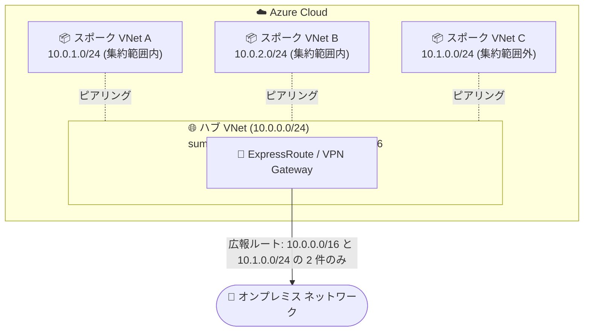

# Azure ExpressRoute / VPN Gateway: 集約ゲートウェイプレフィックスによるルート広報 (Summarized Advertised Gateway Prefixes) が GA

**リリース日**: 2026-08-20

**サービス**: Azure ExpressRoute / Azure VPN Gateway / Azure Virtual Network

**機能**: Summarized advertised gateway prefixes for route advertisement (ルート広報用の集約ゲートウェイプレフィックス)

**ステータス**: Launched (GA)

[このアップデートのインフォグラフィックを見る](https://takech9203.github.io/azure-news-summary/20260820-expressroute-vpn-gateway-summarized-prefixes.html)

## 概要

Azure のハイブリッド接続ゲートウェイ (ExpressRoute Gateway / VPN Gateway) からオンプレミスネットワークへ広報するルートを、集約 (サマライズ) されたプレフィックスとして指定できる機能が一般提供 (GA) となりました。仮想ネットワークの `summarizedGatewayPrefixes` プロパティに集約 CIDR のリストを設定すると、既定の「すべての個別プレフィックスを広報する」動作に代わって、指定した集約プレフィックスが広報されます。

従来、ゲートウェイはハブ仮想ネットワークとピアリングされたすべてのスポーク仮想ネットワークのアドレス空間を個別にオンプレミスへ広報していました。大規模なハブ & スポーク構成ではスポークの追加に伴い広報プレフィックス数が増加し、ExpressRoute の広報プレフィックス上限 (IPv4: 1,000 / IPv6: 100) に近づくという課題がありました。本機能により、例えば `10.0.0.0/16` のような包括的プレフィックス 1 つで数百のスポークプレフィックスを置き換えられ、アドレス計画の再設計や仮想ネットワークの分割なしに環境を拡張し続けられます。ExpressRoute Gateway と VPN Gateway の両方、IPv4 / IPv6 の両アドレス空間に対応します。

**アップデート前の課題**

- ゲートウェイはハブおよびピアリングされた全スポーク仮想ネットワークのアドレス空間を個別にオンプレミスへ広報するため、スポーク数の増加に伴い広報ルート数が増大していた
- 大規模なハブ & スポーク構成では ExpressRoute の広報プレフィックス上限 (IPv4: 1,000 / IPv6: 100) に近づき、拡張を続けるにはアドレス計画の再設計や仮想ネットワークの分割が必要になるケースがあった

**アップデート後の改善**

- 集約プレフィックス (例: `10.0.0.0/16`) を指定することで、多数の個別プレフィックス (例: 複数の `/24`) の広報を 1 つに集約でき、広報ルート数を大幅に削減できる
- 集約プレフィックスに含まれないスポークのアドレス空間は引き続き個別に広報されるため、機能を有効化しても既存の接続性は維持される
- Azure Route Server を導入することなく、仮想ネットワークのプロパティ設定のみでルート集約を実現できる

## アーキテクチャ図

ハブ VNet に集約プレフィックス `10.0.0.0/16` を設定すると、その範囲内のハブ・スポークの個別プレフィックスは広報されず集約ルート 1 件に置き換わり、範囲外のスポーク (10.1.0.0/24) は従来どおり個別に広報されます。

## サービスアップデートの詳細

### 主要機能

1. **集約プレフィックスの広報 (`summarizedGatewayPrefixes`)**
   - ゲートウェイを持つ仮想ネットワーク (ハブ) に集約 CIDR のリストを設定すると、既定の広報動作に代わって集約プレフィックスがオンプレミスへ広報される
   - ハブのアドレス空間およびピアリングされたスポークのアドレス空間のうち、集約プレフィックスに包含されるものは個別広報が抑制される

2. **カバーされないプレフィックスのフォールバック広報**
   - 集約プレフィックスに包含されないアドレス空間は引き続き個別に広報されるため、設定漏れによる接続断のリスクが低減される

3. **ExpressRoute Gateway / VPN Gateway と IPv4 / IPv6 の両対応**
   - ハイブリッド接続の両ゲートウェイタイプで利用でき、IPv4・IPv6 双方のアドレス空間をカバーする

4. **事前設定のサポート**
   - ゲートウェイサブネットやゲートウェイが存在しない仮想ネットワークにもプロパティを設定可能 (ゲートウェイサブネットとゲートウェイが作成されるまでは効果を発揮しない)

### 動作の仕組み

| 動作 | 内容 |
|------|------|
| 既定動作 (未設定時) | ハブ VNet の全アドレス空間と、ピアリングされた全スポーク VNet のアドレス空間を個別にオンプレミスへ広報 |
| `summarizedGatewayPrefixes` 設定時 | ハブ VNet の集約プレフィックスリストを広報。ハブおよび各スポークのアドレス空間が集約範囲に包含される場合、その個別広報を抑制。包含されない場合は従来どおり広報 |

## 技術仕様

| 項目 | 詳細 |
|------|------|
| 設定対象 | 仮想ネットワークのプロパティ `summarizedGatewayPrefixes` |
| 有効になる VNet | ゲートウェイサブネットを含むハブ VNet のみがこのプロパティを読み取る (スポーク VNet に設定しても無視される) |
| 対応ゲートウェイ | Azure ExpressRoute Gateway、Azure VPN Gateway |
| 対応アドレス | IPv4 / IPv6 |
| プレフィックスリストの性質 | VNet のアドレス空間とは独立した値であり、VNet のアドレス空間外の CIDR も指定可能 |
| リスト内の制約 | リスト内でのプレフィックスの重複 (オーバーラップ) は不可。ピアリングされた VNet のアドレス空間との重複は許容され、ハブ & スポーク設計では想定される動作 |
| 推奨事項 | 集約プレフィックスにはゲートウェイ VNet (ハブ) のアドレス空間を含めること |
| Azure Route Server | 不要 (集約に Route Server は必要ない) |
| 関連する上限 | ExpressRoute の広報プレフィックス上限: IPv4 1,000 件 / IPv6 100 件 |

## メリット

### ビジネス面

- ExpressRoute の広報プレフィックス上限を理由としたアドレス計画の再設計や仮想ネットワーク分割が不要になり、大規模環境の拡張を継続できる
- オンプレミス側ルーターの経路テーブルが簡素化され、ネットワーク運用の管理負荷を軽減できる

### 技術面

- 集約プレフィックス 1 つで数百のスポークプレフィックスを置き換え可能で、広報ルート数を大幅に削減できる
- 集約範囲外のアドレス空間は自動的に個別広報が継続されるため、段階的な導入が可能
- Azure Route Server や NVA を追加導入することなく、VNet プロパティの設定のみで実現できる

## デメリット・制約事項

- ハブ (ゲートウェイサブネットを含む VNet) に設定した場合のみ有効で、スポーク VNet への設定は無視される
- プレフィックスリスト内で重複するプレフィックスは使用できない
- 集約プレフィックスがゲートウェイ VNet のアドレス空間を包含するように設定する必要がある
- ゲートウェイサブネットとゲートウェイが存在するまでプロパティは効果を発揮しない
- 集約プレフィックスは VNet のアドレス空間外も指定できるため、実際に存在しないアドレス範囲を広報しないよう設計上の注意が必要

## ユースケース

### ユースケース 1: 大規模ハブ & スポーク環境での ExpressRoute 広報上限の回避

**シナリオ**: 数百のスポーク VNet (それぞれ `/24`) をハブにピアリングしている企業が、ExpressRoute の広報プレフィックス上限 (IPv4: 1,000) に近づいており、今後のスポーク追加が制限されそうになっている。

**実装方針**: スポーク群のアドレス空間を包含する集約 CIDR (例: `10.0.0.0/16`) をハブ VNet の `summarizedGatewayPrefixes` に設定する。

**効果**: 数百件の個別プレフィックス広報が集約ルート 1 件に置き換わり、上限を気にせずスポークを追加し続けられる。集約範囲外のスポークは個別広報が維持されるため接続性も損なわれない。

### ユースケース 2: オンプレミスルーターの経路テーブル簡素化

**シナリオ**: ExpressRoute / VPN 経由で Azure から受信する経路数が多く、オンプレミス側ルーターの経路管理・トラブルシューティングが煩雑になっている。

**実装方針**: 環境のアドレス計画に沿った集約プレフィックスをハブ VNet に設定し、Azure から広報される経路を集約する。

**効果**: オンプレミス側で受信する経路が集約され、経路テーブルの可読性と運用性が向上する。

## 料金

本アップデートに固有の追加料金情報はアナウンスされていません。ExpressRoute および VPN Gateway 自体の料金は以下を参照してください。

- [Azure ExpressRoute の料金](https://azure.microsoft.com/pricing/details/expressroute/)
- [Azure VPN Gateway の料金](https://azure.microsoft.com/pricing/details/vpn-gateway/)

## 関連サービス・機能

- **Azure ExpressRoute**: 広報プレフィックス上限 (IPv4: 1,000 / IPv6: 100) の制約を受けるプライベート接続サービス。本機能により大規模環境での上限到達を回避できる
- **Azure VPN Gateway**: サイト間 VPN 接続でも同様に集約プレフィックス広報が利用可能
- **Azure Virtual Network (VNet ピアリング)**: ハブ & スポーク構成の基盤。スポークのアドレス空間が集約範囲に包含されるかどうかで広報動作が決まる
- **Azure Route Server**: BGP による動的ルーティングを提供するサービス。本機能による集約に Route Server は不要であり、シンプルな代替手段となる

## 参考リンク

- [インフォグラフィック](https://takech9203.github.io/azure-news-summary/20260820-expressroute-vpn-gateway-summarized-prefixes.html)
- [公式アップデート情報](https://azure.microsoft.com/updates?id=569743)
- [Microsoft Learn: Advertised gateway prefixes in Azure virtual networks](https://learn.microsoft.com/en-us/azure/virtual-network/advertised-gateway-prefixes-overview)
- [Azure ExpressRoute の料金](https://azure.microsoft.com/pricing/details/expressroute/)
- [Azure VPN Gateway の料金](https://azure.microsoft.com/pricing/details/vpn-gateway/)

## まとめ

大規模なハブ & スポーク構成を運用する組織にとって、ExpressRoute の広報プレフィックス上限は拡張性のボトルネックでした。本機能の GA により、ハブ VNet の `summarizedGatewayPrefixes` プロパティを設定するだけで広報ルートを集約でき、アドレス再設計や Route Server の導入なしにこの課題を解決できます。スポーク数が多い環境や今後の拡張を見込む環境では、アドレス計画を確認のうえ、集約プレフィックスの導入を検討することを推奨します。集約範囲外のプレフィックスは自動的に個別広報が継続されるため、段階的な適用も可能です。

---

**タグ**: Azure ExpressRoute, VPN Gateway, Virtual Network, Networking, Hybrid + multicloud, Security, BGP, Route Advertisement, GA
