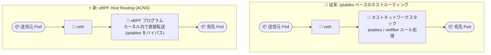

# Azure Kubernetes Service (AKS): Advanced Container Networking Services の eBPF Host Routing が一般提供 (GA)

**リリース日**: 2026-08-24

**サービス**: Azure Kubernetes Service (AKS)

**機能**: Advanced Container Networking Services (ACNS) - eBPF Host Routing

**ステータス**: Launched (GA)

[このアップデートのインフォグラフィックを見る](https://takech9203.github.io/azure-news-summary/20260824-aks-acns-ebpf-host-routing.html)

## 概要

Azure Kubernetes Service (AKS) 向け Advanced Container Networking Services (ACNS) の eBPF Host Routing が一般提供 (GA) となりました。eBPF Host Routing は、パケット転送とルーティングの判断を eBPF によって Linux カーネル内で直接処理することで、Kubernetes のネットワークパフォーマンスを向上させる機能です。iptables ベースの処理によるオーバーヘッドを排除し、ホストネットワークスタックへの依存を減らすことで、アプリケーショントラフィックのレイテンシ低減、ネットワークホップ数の削減、スループット向上を実現します。

大規模な AKS デプロイでは、eBPF Host Routing によってより効率的なネットワークパフォーマンスとスケーラビリティが得られ、レイテンシに敏感なワークロードや高トラフィックなワークロードの体験が改善されます。

今回のリリースでは、既存のネットワーク接続を尊重する強化された有効化エクスペリエンスも導入されました。既存クラスターで eBPF Host Routing を有効化すると、AKS は制御されたノードローテーション (ノードプールのローリングアップグレード) を実行して新しいネットワークモードに移行し、接続の継続性を維持して実行中のアプリケーションへの中断を最小限に抑えます。

**アップデート前の課題**

- Kubernetes ホスト上の従来のルーティングでは、ホストネットワーク名前空間での iptables / netfilter ルール処理によるオーバーヘッドが発生していた
- パケットがホストネットワークスタックを経由するため、ホップ数と処理レイヤーが多く、Pod 間通信のレイテンシ・スループットに影響していた
- iptables ベースの SNAT・ルーティング処理が CPU リソースを消費していた

**アップデート後の改善**

- ルーティングロジックが eBPF プログラムとして実装され、Cilium eBPF がホスト名前空間の iptables をバイパスすることで、パケット配送が高速化された
- iptables バイパスにより Pod 間レイテンシが低減し、ノード間の Pod 間トラフィックのスループットが大幅に向上した
- iptables ベースの SNAT・ルーティングロジックの排除により CPU 使用率が低減した
- 既存クラスターでの有効化時に、ノードドレインタイムアウトを通じて既存接続を尊重するローリングアップグレードが実行されるようになった

## アーキテクチャ図



従来はホストネットワーク名前空間の iptables / netfilter ルール処理を経由していたパケット経路が、eBPF Host Routing ではカーネル内の eBPF プログラムによる直接転送に置き換わります。ホップ数と処理レイヤーが減ることで、より高速なパケット配送が実現します。

## サービスアップデートの詳細

### 主要機能

1. **eBPF によるホストルーティング**
   - ルーティングロジックを eBPF プログラムとして実装し、Cilium eBPF がホスト名前空間の iptables をバイパス。ホップ数と処理レイヤーを削減し、パケット配送を高速化

2. **iptables blocker (init コンテナー)**
   - ホストネットワーク名前空間への iptables ルールの新規インストールを防止する init コンテナー (eBPF Host Routing 有効時、そのようなルールはバイパスされるため)

3. **BPF ベースの SNAT (IP Masquerade)**
   - eBPF Host Routing がアクティブな間、Cilium が BPF ベースのマスカレードで SNAT を担当。`ip-masq-agent` は後で無効化した場合の一貫性維持のため稼働し続けるが、その iptables ルールは無視される

4. **接続を尊重した有効化エクスペリエンス**
   - 既存クラスターでの有効化時、ノードプールのローリングアップグレードによりノードを移行。ノードドレインタイムアウトを通じて既存接続を尊重し、中断を最小化。有効化されたノードには `kubernetes.azure.com/ebpf-host-routing=true` ラベルが付与される

## 技術仕様

| 項目 | 詳細 |
|------|------|
| Azure CLI バージョン | 2.71.0 以降 |
| Kubernetes バージョン | 1.33 以降 |
| ノード OS | Azure Linux 3.0 または Ubuntu 24.04 |
| データプレーン | Azure CNI Powered by Cilium が必須 |
| デュアルスタック | サポート (IPv4/IPv6) |
| 有効化スコープ | クラスター内の全ノードに対してのみ有効化可能 (ハイブリッドノードシナリオ非対応) |
| ノードラベル | 有効化済みノードに `kubernetes.azure.com/ebpf-host-routing=true` が付与 |

## 設定方法

### 前提条件

1. Azure CLI 2.71.0 以降
2. Kubernetes 1.33 以降の AKS クラスター
3. Azure CNI Powered by Cilium (`--network-dataplane cilium`) を使用していること
4. ノード OS が Azure Linux 3.0 または Ubuntu 24.04 であること
5. ホストネットワーク名前空間で iptables ルールを使用していないこと (使用中のクラスターでは AKS が有効化を検出・ブロックする)

### Azure CLI

```bash
# 新規クラスターの作成 (ACNS + eBPF Host Routing 有効)
az aks create \
    --name $CLUSTER_NAME \
    --resource-group $RESOURCE_GROUP \
    --location $LOCATION \
    --network-plugin azure \
    --network-plugin-mode overlay \
    --network-dataplane cilium \
    --kubernetes-version 1.33 \
    --os-sku AzureLinux \
    --enable-acns \
    --acns-datapath-acceleration-mode BpfVeth \
    --generate-ssh-keys

# 既存クラスターで有効化 (制御されたノードローテーションが実行される)
az aks update \
    --resource-group $RESOURCE_GROUP \
    --name $CLUSTER_NAME \
    --enable-acns \
    --acns-datapath-acceleration-mode BpfVeth

# eBPF Host Routing のみ無効化 (他の ACNS 機能には影響しない)
az aks update \
    --resource-group $RESOURCE_GROUP \
    --name $CLUSTER_NAME \
    --enable-acns \
    --acns-datapath-acceleration-mode None
```

## メリット

### ビジネス面

- レイテンシに敏感なワークロードや高トラフィックワークロードのユーザー体験が向上する
- iptables 処理の排除による CPU 使用率低減で、同一ノードでより多くのアプリケーション処理にリソースを充当できる
- 大規模 AKS デプロイにおけるネットワークのスケーラビリティが向上する

### 技術面

- ホストの iptables をバイパスすることで Pod 間レイテンシが低減する
- 従来ルーティングと比較して、ノード間の Pod 間トラフィックで大幅なスループット向上が見込める
- iptables ベースの SNAT・ルーティングロジックの排除により CPU 使用率が低減する
- 既存クラスターでの有効化時もローリングアップグレードにより接続の継続性が維持される

## デメリット・制約事項

- ノード OS は Ubuntu 24.04 または Azure Linux 3.0 のみ対応。Confidential VM および Pod Sandboxing とは併用不可
- クラスター内の全ノードに対してのみ有効化可能で、ハイブリッドノードシナリオは非対応
- Windows ノードは非対応 (Azure CNI Powered by Cilium 自体が Windows 非対応のため)
- Static Egress Gateway とは併用不可
- セルフマネージドインストールによる Istio Ambient と ACNS Performance モードの組み合わせは非対応
- 有効化するとホストネットワーク名前空間の iptables ルールがバイパスされるため、iptables ルール使用中のクラスターでは AKS が有効化をブロックする
- 有効化済みクラスターではホストネットワーク名前空間への iptables ルールのインストールが AKS によってブロックされる。このブロックの回避を試みるとクラスターが動作不能になる可能性がある
- 既存クラスターでの有効化はノードローテーションを伴うため、既存接続に影響が及ぶ可能性がある

## ユースケース

### ユースケース 1: 高スループットなマイクロサービスの性能改善

**シナリオ**: 多数のマイクロサービスが Pod 間で大量の東西トラフィックを交換する大規模 AKS クラスターで、iptables 処理によるレイテンシとCPU オーバーヘッドが課題になっている。

**実装例**:

```bash
az aks update \
    --resource-group $RESOURCE_GROUP \
    --name $CLUSTER_NAME \
    --enable-acns \
    --acns-datapath-acceleration-mode BpfVeth
```

**効果**: Pod 間レイテンシの低減とスループット向上により、サービス間通信が効率化される。iptables ベースの SNAT 処理排除により CPU 使用率も低減する。

### ユースケース 2: リアルタイムサービス・AI/ML ワークロード

**シナリオ**: リアルタイム処理や AI/ML など、ネットワーク性能がクリティカルなワークロードを AKS 上で運用している。

**効果**: カーネル内での直接パケット転送によりネットワークホップ数と処理レイヤーが削減され、レイテンシに敏感なワークロードの応答性能が改善される。

## 料金

Advanced Container Networking Services は有料オファリングです。料金はノードあたり・時間あたりの課金体系です。具体的な単価はリージョン・通貨によって異なるため、料金ページで確認してください。

- [Advanced Container Networking Services 料金ページ](https://azure.microsoft.com/pricing/details/azure-container-networking-services/)

## 関連サービス・機能

- **Azure CNI Powered by Cilium**: eBPF Host Routing の前提となるデータプレーン。eBPF ベースのネットワーク処理を提供する
- **Container Network Observability (ACNS)**: Hubble メトリクスやネットワークログによるネットワーク可観測性機能。`--enable-acns` で同時に有効化される
- **Container Network Security (ACNS)**: FQDN フィルタリングや L7 ポリシーなど、eBPF によるカーネルレベルのネットワークポリシー適用機能
- **ノードプールのローリングアップグレード**: 既存クラスターでの eBPF Host Routing 有効化時に、既存接続を尊重したノード移行に使用される仕組み

## 参考リンク

- [インフォグラフィック](https://takech9203.github.io/azure-news-summary/20260824-aks-acns-ebpf-host-routing.html)
- [公式アップデート情報](https://azure.microsoft.com/updates?id=569873)
- [eBPF Host Routing の概要 (Microsoft Learn)](https://learn.microsoft.com/azure/aks/container-network-performance-ebpf-host-routing)
- [eBPF Host Routing の有効化手順 (Microsoft Learn)](https://learn.microsoft.com/azure/aks/how-to-enable-ebpf-host-routing)
- [Advanced Container Networking Services 概要 (Microsoft Learn)](https://learn.microsoft.com/azure/aks/advanced-container-networking-services-overview)
- [料金ページ](https://azure.microsoft.com/pricing/details/azure-container-networking-services/)

## まとめ

ACNS の eBPF Host Routing が GA となり、AKS クラスターの Pod 間通信を eBPF によるカーネル内直接転送に切り替えて、レイテンシ低減・スループット向上・CPU 使用率低減を本番環境で利用できるようになりました。Azure CNI Powered by Cilium、Kubernetes 1.33 以降、Azure Linux 3.0 / Ubuntu 24.04 という前提条件と、iptables ルールがバイパスされる点や Static Egress Gateway との非互換などの制約を確認したうえで、高トラフィック・低レイテンシ要件のワークロードを持つクラスターから `--acns-datapath-acceleration-mode BpfVeth` による有効化を検討することを推奨します。

---

**タグ**: Azure Kubernetes Service, AKS, Advanced Container Networking Services, ACNS, eBPF, Cilium, ネットワーク, パフォーマンス, GA
