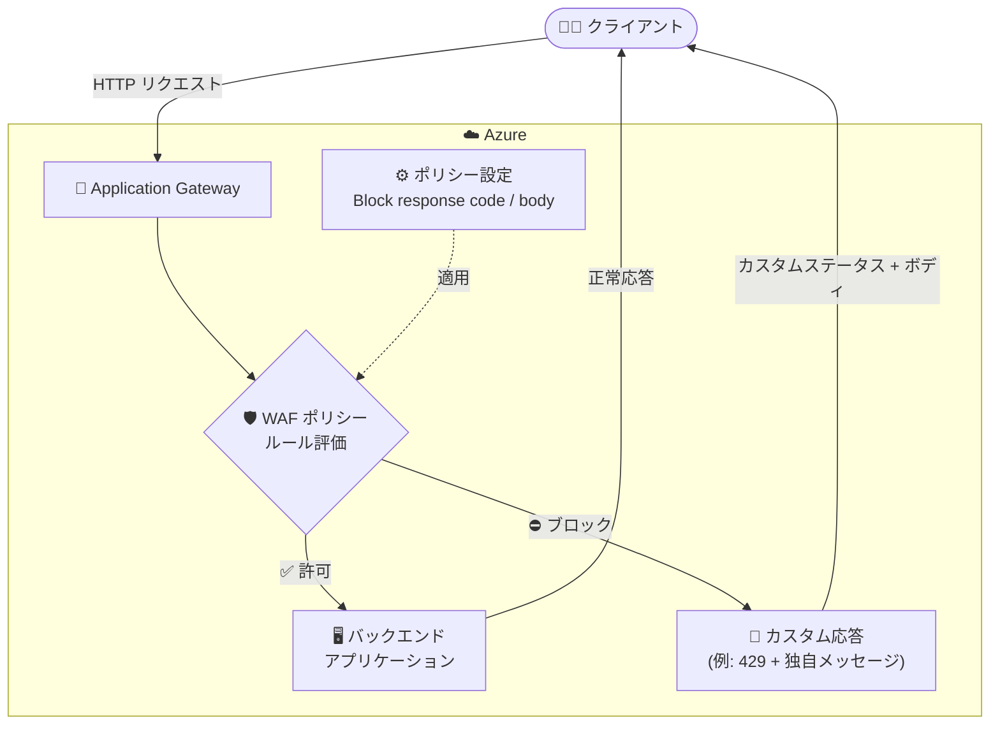

# Azure Web Application Firewall (Application Gateway): カスタムブロック応答コード・ボディの一般提供開始

**リリース日**: 2026-08-24

**サービス**: Azure Web Application Firewall (Application Gateway 統合)

**機能**: ブロック時のカスタム応答ステータスコード・応答ボディ

**ステータス**: Launched (GA)

[このアップデートのインフォグラフィックを見る](https://takech9203.github.io/azure-news-summary/20260824-app-gateway-waf-custom-block-response.html)

## 概要

Application Gateway に統合された Azure Web Application Firewall (WAF) で、ブロックされたリクエストに対する応答ステータスコードと応答ボディをカスタマイズする機能が一般提供 (GA) されました。

これまで、Application Gateway WAF がルールに一致したリクエストをブロックすると、固定で 403 ステータスコードと「The request is blocked」というメッセージを返していました。今回の GA により、Azure Front Door 統合の WAF と同様に、Application Gateway でも WAF がリクエストをブロックした際のカスタム応答ステータスコードとメッセージを定義できるようになりました。

このカスタマイズは WAF ポリシーレベルの設定であり、ブロックされたすべてのリクエストが同一のカスタム応答ステータスとメッセージを受け取ります。

**アップデート前の課題**

- WAF がリクエストをブロックすると、固定の 403 ステータスコードと「The request is blocked」メッセージしか返せなかった
- Azure Front Door 統合の WAF ではカスタム応答が可能だったが、Application Gateway 統合の WAF では対応していなかった

**アップデート後の改善**

- ブロック時の応答ステータスコード (例: 403 → 429) と応答ボディをポリシーレベルで自由に定義可能になった
- Azure Front Door WAF と Application Gateway WAF でブロック応答のカスタマイズ体験が揃い、より柔軟な制御が可能になった

## アーキテクチャ図



WAF ポリシーのポリシー設定で定義したカスタムステータスコードとボディが、ブロックされたすべてのリクエストへの応答として返されるフローを示しています。従来は固定の 403 応答でしたが、ポリシーレベルで応答内容を制御できます。

## サービスアップデートの詳細

### 主要機能

1. **カスタム応答ステータスコード**
   - デフォルトの 403 に代えて、200, 403, 405, 406, 429, 990〜999 のいずれかのステータスコードを指定可能

2. **カスタム応答ボディ**
   - デフォルトの「The request is blocked」に代えて、独自のメッセージ (最大 32 KB) を返却可能
   - ARM API 経由で設定する場合、応答ボディは Base64 エンコードが必要

3. **ポリシーレベルの設定**
   - WAF ポリシー単位の設定であり、そのポリシーでブロックされたすべてのリクエストに同一のカスタム応答が適用される

## 技術仕様

| 項目 | 詳細 |
|------|------|
| 設定単位 | WAF ポリシーレベル (Policy settings) |
| デフォルト動作 | 403 + 「The request is blocked」 |
| 指定可能なステータスコード | 200, 403, 405, 406, 429, 990, 991, 992, 993, 994, 995, 996, 997, 998, 999 |
| 応答ボディの最大サイズ | 32 KB |
| ARM API 使用時 | 応答ボディは Base64 エンコード必須 |
| 1 つの Application Gateway あたり | カスタムブロック応答を有効化した WAF ポリシーは最大 20 個 |
| 非対応 | Application Gateway for Containers の WAF では未サポート |

## 設定方法

### 前提条件

1. Application Gateway (WAF v2) と、それに関連付けられた WAF ポリシーが作成済みであること

### Azure Portal

1. Azure Portal で対象の Application Gateway WAF ポリシーに移動する
2. **Settings** の **Policy settings** を選択する
3. **Custom response** セクションの **Block response status code** と **Block response body** に、カスタム応答ステータスコードと応答ボディをそれぞれ入力する
4. **Save** を選択する

### Azure CLI

```bash
# WAF ポリシーのポリシー設定でカスタムブロック応答を構成
# --custom-body は Base64 エンコードした文字列を指定する
az network application-gateway waf-policy policy-setting update \
  --policy-name MyPolicy \
  --resource-group MyResourceGroup \
  --custom-status-code 429 \
  --custom-body "$(echo -n 'The request has been blocked' | base64)"
```

PowerShell では `New-AzApplicationGatewayFirewallPolicySetting` で同様の設定が可能です。

## メリット

### ビジネス面

- ブロック時の応答をブランドやサービスの体裁に合わせたメッセージにでき、ユーザー体験を統一できる
- Azure Front Door WAF と Application Gateway WAF で一貫したブロック応答ポリシーを運用できる

### 技術面

- 429 などのステータスコードを返すことで、クライアント側のリトライ処理やエラーハンドリングを制御しやすくなる
- 990〜999 のカスタムコードを利用して、WAF によるブロックを他のエラーと区別して監視・分析しやすくなる

## デメリット・制約事項

- カスタム応答はポリシーレベルの設定であり、ルールごとに異なる応答を返すことはできない (ブロックされたすべてのリクエストに同一の応答)
- 1 つの Application Gateway で、カスタムブロック応答を有効化できる WAF ポリシーは最大 20 個
- 指定可能なステータスコードは 200, 403, 405, 406, 429, 990〜999 に限定される
- 応答ボディの最大サイズは 32 KB
- ARM API 使用時は応答ボディの Base64 エンコードが必須
- Application Gateway for Containers の WAF ではサポートされない

## ユースケース

### ユースケース 1: ブロック応答を 429 に変更して WAF の存在を隠す

**シナリオ**: 攻撃者に WAF によるブロックであることを悟られないよう、403 の代わりに 429 (Too Many Requests) と汎用的なメッセージを返し、正規クライアントには適切なリトライ動作を促す。

**実装例**:

```bash
az network application-gateway waf-policy policy-setting update \
  --policy-name MyPolicy \
  --resource-group MyResourceGroup \
  --custom-status-code 429 \
  --custom-body "$(echo -n 'The request has been blocked' | base64)"
```

**効果**: ブロック理由の露出を抑えつつ、クライアント側の挙動を制御できる。

### ユースケース 2: カスタムコード (990 番台) による監視・分析の分離

**シナリオ**: 990〜999 のカスタムステータスコードを割り当て、ログや監視ダッシュボード上で WAF ブロックをアプリケーション起因の 4xx/5xx エラーと明確に区別する。

**効果**: 障害対応時に WAF ブロックとアプリケーションエラーの切り分けが迅速になる。

## 料金

このアップデートに固有の追加料金情報は公式発表には記載されていません。Application Gateway / WAF の料金は以下を参照してください。

- [Application Gateway 料金ページ](https://azure.microsoft.com/pricing/details/application-gateway/)

## 関連サービス・機能

- **Azure Application Gateway**: 本機能が統合されるレイヤー 7 ロードバランサー。WAF v2 SKU で WAF ポリシーを利用する
- **Azure Front Door WAF**: 先行して同等のカスタムブロック応答機能を提供しており、今回のアップデートで Application Gateway 側も同様の体験に揃った
- **Application Gateway for Containers**: 同じく WAF を統合できるが、本カスタムブロック応答機能は未サポート

## 参考リンク

- [インフォグラフィック](https://takech9203.github.io/azure-news-summary/20260824-app-gateway-waf-custom-block-response.html)
- [公式アップデート情報](https://azure.microsoft.com/updates?id=569504)
- [Microsoft Learn: Configure a Custom Response for Azure Application Gateway WAF](https://learn.microsoft.com/en-us/azure/web-application-firewall/ag/configure-custom-response-code)
- [Azure CLI: az network application-gateway waf-policy policy-setting](https://learn.microsoft.com/en-us/cli/azure/network/application-gateway/waf-policy/policy-setting)
- [料金ページ](https://azure.microsoft.com/pricing/details/application-gateway/)

## まとめ

Application Gateway 統合の Azure WAF で、ブロック時のカスタム応答ステータスコードとボディが GA になりました。従来の固定 403 応答から脱却し、Azure Front Door WAF と同等の柔軟なブロック応答制御が可能になります。Application Gateway WAF を運用中の場合は、WAF ポリシーの Policy settings からカスタム応答を検討し、ブロック応答のステータスコード設計 (429 や 990 番台の活用) をユーザー体験と監視要件の両面から見直すことを推奨します。

---

**タグ**: Networking, Security, Application Gateway, Web Application Firewall, GA, Feature
