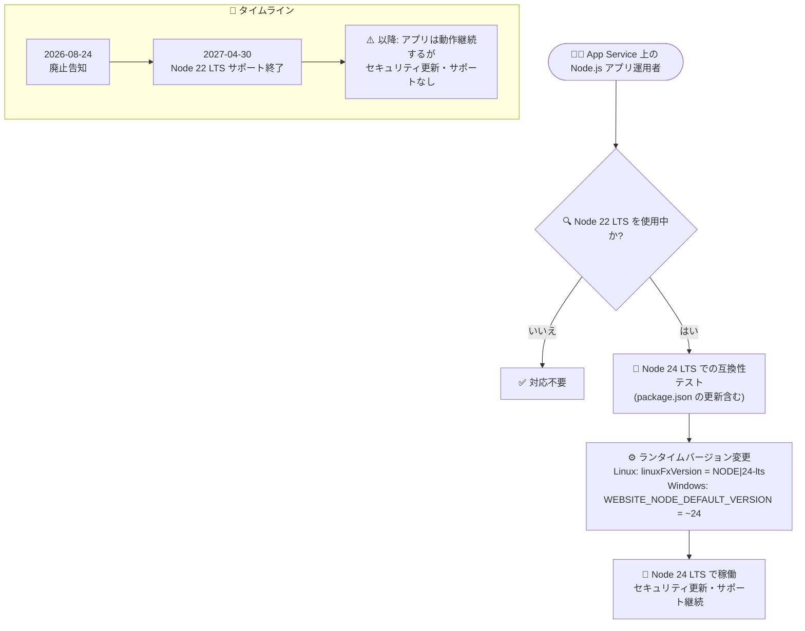

# Azure App Service: Node 22 LTS サポート終了 (2027 年 4 月 30 日)

**リリース日**: 2026-08-24

**サービス**: Azure App Service

**機能**: Node 22 LTS ランタイムのサポート終了 (Retirement)

**ステータス**: Retirement (廃止告知)

[このアップデートのインフォグラフィックを見る](https://takech9203.github.io/azure-news-summary/20260824-app-service-node-22-retirement.html)

## 概要

2027 年 4 月 30 日に、Azure App Service における Node 22 LTS のサポートが終了することが発表された。サポート終了後も App Service 上でホストされている Node 22 LTS のアプリは引き続き動作するが、セキュリティ更新プログラムの提供が停止し、Node 22 LTS に対するカスタマーサポートも受けられなくなる。

App Service の言語ランタイムサポートポリシーでは、各言語コミュニティのサポートタイムラインに従ってランタイムのライフサイクルが管理される。コミュニティサポートが終了した言語バージョンは、アプリ自体はそのまま動作し続けるものの、App Service はそのランタイムバージョンに対するセキュリティパッチや関連するカスタマーサポートを提供できなくなる。また、サポート対象外の言語バージョンを使用しているアプリは、サポートされているバージョンにアップグレードしないと App Service のサポートを受けられない。

Microsoft は、セキュリティ上の脆弱性を回避しリスクを最小限に抑えるため、2027 年 4 月 30 日より前に Node 24 LTS へアップグレードすることを求めている。

**廃止スケジュールと影響**

- **2027 年 4 月 30 日**: Node 22 LTS のサポート終了
- サポート終了後もアプリは引き続き動作する (強制停止はされない)
- セキュリティ更新プログラムが提供されなくなる
- Node 22 LTS に対するカスタマーサービス (サポート) が終了する

**必要なアクション**

- 2027 年 4 月 30 日より前に、App Service 上の Node.js アプリを **Node 24 LTS** へアップグレードする
- アプリケーションコードの Node 24 互換性を検証し、`package.json` の Node.js バージョン指定も合わせて更新する

## アーキテクチャ図



Node 22 LTS を使用しているアプリの移行フローと廃止タイムライン。サポート終了前に Node 24 LTS への互換性検証とランタイム変更を完了させる必要がある。

## サービスアップデートの詳細

### 廃止の内容

1. **セキュリティ更新の停止**
   - 2027 年 4 月 30 日以降、Node 22 LTS に対するセキュリティ更新プログラムは提供されない

2. **カスタマーサポートの終了**
   - Node 22 LTS に関する App Service のカスタマーサービスが終了する
   - サポート対象外の言語バージョンを使用しているアプリは、サポートされているバージョンへアップグレードするまで App Service のサポートを受けられない

3. **アプリの動作は継続**
   - サポート終了後も、Node 22 LTS でホストされているアプリは変更なく動作し続ける (即時の強制停止・削除はない)
   - なお、古いランタイムはポータルの作成・構成ページから非表示になるが、既存アプリはそのまま動作する。ポータルに表示されなくなったバージョンでアプリを作成する場合は Azure CLI、ARM テンプレート、Bicep を使用できる

### 通知について

- ランタイムバージョンのサポート終了日は各言語コミュニティ (スタックオーナー) が独自に決定するもので、App Service の管理外
- App Service はサポート終了日が近づくと、サブスクリプション所有者にリマインダー通知を送信する
- 通知を受け取るロールはアカウント管理者、サービス管理者、共同管理者。Contributor や Reader などのロールは、[Service Health アラート](https://learn.microsoft.com/azure/service-health/alerts-activity-log-service-notifications-portal)にオプトインしない限り直接通知を受け取らない

## 技術仕様

| 項目 | 詳細 |
|------|------|
| 対象サービス | Azure App Service (Windows / Linux) |
| 対象ランタイム | Node 22 LTS |
| サポート終了日 | 2027 年 4 月 30 日 |
| 終了後の動作 | アプリは継続動作、セキュリティ更新・カスタマーサポートは停止 |
| 推奨移行先 | Node 24 LTS |
| バージョン管理ポリシー | App Service はメジャーバージョンを更新するが、特定のマイナー / パッチバージョンは保証しない (特定バージョンが必要な場合はカスタムコンテナーを使用) |

## 設定方法 (Node 24 LTS へのアップグレード)

### 前提条件

1. アプリケーションが Node 24 LTS で動作することをローカルまたはステージング環境で検証済みであること
2. `package.json` の Node.js バージョン指定を更新すること (デプロイエンジンは別プロセス / コンテナーで動作するため)

### Azure CLI

**現在のバージョンを確認 (Linux):**

```bash
az webapp config show --resource-group <resource-group-name> --name <app-name> --query linuxFxVersion
```

**現在のバージョンを確認 (Windows):**

```bash
az webapp config appsettings list --name <app-name> --resource-group <resource-group-name> --query "[?name=='WEBSITE_NODE_DEFAULT_VERSION'].value"
```

**Node 24 LTS に変更 (Linux):**

```bash
az webapp config set --resource-group <resource-group-name> --name <app-name> --linux-fx-version "NODE|24-lts"
```

**Node 24 LTS に変更 (Windows):**

```bash
az webapp config appsettings set --name <app-name> --resource-group <resource-group-name> --settings WEBSITE_NODE_DEFAULT_VERSION="~24"
```

Windows ではチルダ構文 (`~24`) の使用が推奨されており、App Service 上で利用可能な Node.js 24 ランタイムの最新バージョンが自動的に適用される。プラットフォームが定期的にパッチを適用するため、特定のマイナー / パッチバージョンの指定は推奨されない。

**サポートされている Node.js バージョンの一覧を確認:**

```bash
# Linux
az webapp list-runtimes --os linux | grep NODE

# Windows
az webapp list-runtimes --os windows | grep NODE
```

## 影響・注意事項

- サポート終了後に Node 22 LTS を使い続けた場合、既知のセキュリティ脆弱性が修正されないままアプリが公開され続けるリスクがある
- サポート対象外バージョンのアプリで問題が発生しても、App Service のカスタマーサポートを受けるにはまずサポート対象バージョンへのアップグレードが必要
- 特定のマイナー / パッチバージョンに依存するアプリは、App Service のマネージドランタイムではバージョン固定が保証されないため、カスタムコンテナーの利用を検討する

## 料金への影響

このアップデートによる料金への影響はない。ランタイムバージョンの変更に追加料金は発生しない。

## 関連サービス・機能

- **Azure Service Health**: サポート終了通知をアカウント管理者以外のロールでも受け取るには、Service Health アラートへのオプトインが必要
- **App Service カスタムコンテナー**: 特定の Node.js マイナー / パッチバージョンが必要な場合の代替手段
- **Azure Functions**: Node.js ランタイムを使用する他の Azure サービスでも、各サービスのサポートポリシーに基づき同様のバージョン管理が必要 (本アナウンスの対象は App Service)

## 参考リンク

- [インフォグラフィック](https://takech9203.github.io/azure-news-summary/20260824-app-service-node-22-retirement.html)
- [公式アップデート情報](https://azure.microsoft.com/updates?id=567334)
- [App Service 言語ランタイムサポートポリシー](https://learn.microsoft.com/azure/app-service/language-support-policy)
- [App Service での Node.js アプリの構成 (バージョン確認・変更手順)](https://learn.microsoft.com/azure/app-service/configure-language-nodejs)
- [Node.js リリーススケジュール](https://aka.ms/noderelease)

## まとめ

Azure App Service における Node 22 LTS のサポートが 2027 年 4 月 30 日に終了する。アプリは終了後も動作し続けるが、セキュリティ更新とカスタマーサポートが停止するため、実質的に本番運用のリスクが大きく高まる。告知から終了まで約 1 年 8 か月の猶予があるため、App Service 上で Node 22 LTS を使用しているアプリを棚卸しし、Node 24 LTS での互換性テストとランタイム変更 (Linux は `NODE|24-lts`、Windows は `WEBSITE_NODE_DEFAULT_VERSION=~24`) を計画的に進めることを推奨する。

---

**タグ**: App Service, Node.js, Retirement, Web, Compute
