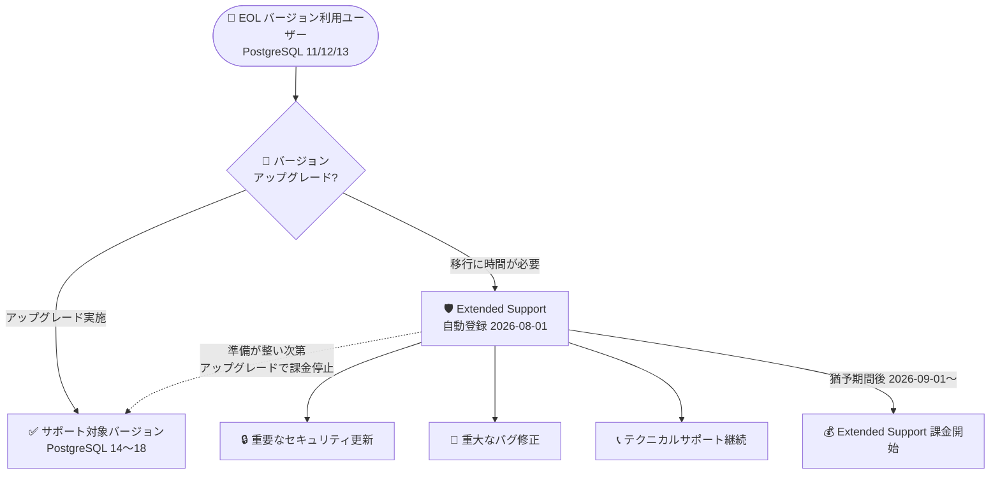

# Azure Database for PostgreSQL Flexible Server: Extended Support の発表

**リリース日**: 2026-08-24

**サービス**: Azure Database for PostgreSQL Flexible Server

**機能**: Extended Support (延長サポート)

**ステータス**: Announcement (2026 年 8 月より有効)

[このアップデートのインフォグラフィックを見る](https://takech9203.github.io/azure-news-summary/20260824-postgresql-flexible-server-extended-support.html)

## 概要

Azure Database for PostgreSQL Flexible Server 向けの Extended Support (延長サポート) が発表された。PostgreSQL コミュニティのサポートが終了した (EOL を迎えた) メジャーバージョンを実行しているサーバーに対して、標準サポート終了後も重要なセキュリティ更新プログラム、重大なバグ修正、Azure サポートチャネル経由のテクニカルサポートを継続して提供する。

Extended Support は標準サポート終了後、最大 3 年間の追加サポートを提供する。これにより、EOL バージョンを利用中のワークロードをセキュアかつサポート対象のまま維持しながら、自社のスケジュールで新しい PostgreSQL バージョンへの移行を計画・実施できる。

2026 年 8 月 1 日以降、サポート対象外バージョンを実行しているサーバーは自動的に Extended Support に登録される。PostgreSQL 11/12/13 には 1 か月の猶予期間 (無償) が設けられ、課金は 2026 年 9 月 1 日に開始される。課金を停止するには、サポート対象バージョンへアップグレードする必要がある。

**アップデート前の課題**

- コミュニティが PostgreSQL バージョンをリタイアすると、Azure はデータベースエンジンへのバグ修正・セキュリティパッチの適用を停止し、サーバーがセキュリティリスクにさらされる可能性があった
- PostgreSQL エンジン自体に起因するサポート問題は、コミュニティのパッチ提供が終了しているため、Microsoft がサポートを提供できない場合があった
- コンプライアンス要件のある環境では、EOL バージョンの継続利用が監査・セキュリティ上の問題となり、アップグレード完了までのサポート空白期間が課題だった

**アップデート後の改善**

- 標準サポート終了後も最大 3 年間、重要なセキュリティパッチと重大なバグ修正を受け取れる
- 既存のサポートプランに従い、Azure サポートチャネル経由でテクニカルサポートを継続利用できる
- 標準サポート終了から Extended Support への移行は自動で行われ、サポートカバレッジに空白期間が生じない
- 複雑なワークロードのアップグレード計画に十分な時間を確保でき、コンプライアンス・セキュリティ要件を満たしながら移行できる

## アーキテクチャ図

EOL バージョンのサーバーは 2026 年 8 月 1 日に Extended Support へ自動登録され、セキュリティ更新・バグ修正・サポートを受けながら移行準備ができる。サポート対象バージョンへアップグレードすれば課金は停止する。

## サービスアップデートの詳細

### 主要機能

1. **標準サポート終了後、最大 3 年間の延長サポート**
   - 重要なセキュリティパッチと重大なバグ修正を継続提供
   - 既存のサポートプランに応じた Azure サポートチャネル経由のテクニカルサポート

2. **自動登録 (オプトイン不要)**
   - 2026 年 8 月 1 日に、サポート対象外バージョンを実行中のサーバーが自動的に Extended Support に登録される
   - 標準サポート終了と Extended Support の間にサポート空白期間は発生しない
   - オプトアウトの方法はサポート対象バージョンへのアップグレードのみ

3. **猶予期間 (無償期間)**
   - PostgreSQL 11/12/13 には 1 か月の猶予期間があり、この間は無償で Extended Support の恩恵を受けられる
   - 課金開始は 2026 年 9 月 1 日

4. **柔軟な課金**
   - 課金はサーバーが Succeeded (実行中) 状態の場合のみ適用。停止・削除・プロビジョニング失敗状態のサーバーには課金されない
   - 月の途中でアップグレードした場合、Extended Support で稼働していた時間分のみ課金される
   - リージョンのキャパシティ制約でアップグレードできない場合、一時的に課金対象から除外される可能性がある (Microsoft サポートが適格性を案内)

### Extended Support に含まれないもの

- 新機能の提供
- パフォーマンス強化
- 一般的なバグ修正
- パフォーマンスチューニング支援
- セキュリティ・重大な修正以外のバックポート
- マイナーバージョンアップグレードのサポート

## 技術仕様

### 対象バージョンとスケジュール

| PostgreSQL バージョン | コミュニティリタイア日 | Azure 標準サポート終了日 | Extended Support 開始日 | Extended Support 終了日 |
|------|------|------|------|------|
| 11 | 2023-11-09 | 2026-07-31 | 2026-08-01 | 2027-03-31 |
| 12 | 2024-11-14 | 2026-07-31 | 2026-08-01 | 2027-11-13 |
| 13 | 2025-11-13 | 2026-07-31 | 2026-08-01 | 2028-11-12 |
| 14 | 2026-11-12 | 2026-12-11 | 2026-12-12 | 2029-11-11 |

### 登録・課金の仕様

| 項目 | 詳細 |
|------|------|
| 登録方法 | 自動登録 (2026-08-01、対象外バージョン実行中のサーバー) |
| オプトアウト | サポート対象バージョンへのアップグレードのみ |
| 猶予期間 | PostgreSQL 11/12/13 は 1 か月無償、課金開始は 2026-09-01 |
| 課金条件 | Succeeded (実行中) 状態のサーバーのみ。稼働時間ベースの課金 |
| 登録状態の確認 | Azure Portal / Azure CLI のサーバープロパティおよびサービス通知で確認可能 |
| アップグレード先の制約 | インプレースメジャーバージョンアップグレードは、その時点でサポート対象のバージョンのみ選択可能 |

## メリット

### ビジネス面

- EOL バージョン利用中もセキュリティ・コンプライアンス要件を満たした状態を維持できる
- アップグレードのスケジュールを自社の都合に合わせて計画でき、拙速な移行によるリスクを回避できる
- 重要な本番環境でテクニカルサポートが途切れない

### 技術面

- 重要なセキュリティパッチと重大なバグ修正が EOL 後も適用され続ける
- 標準サポートから Extended Support への移行が自動で、サポートカバレッジに空白がない
- Azure Portal でサポート終了が近いサーバーや Extended Support 登録済みサーバーを可視化できる

## デメリット・制約事項

- Extended Support は有償 (PostgreSQL 11/12/13 は 2026 年 9 月 1 日から課金開始)。課金を避けるにはアップグレードが必要
- 「Extended Support なしで EOL バージョンを継続利用する」選択肢はない (対象サーバーは自動登録される)
- 新機能、パフォーマンス強化、一般的なバグ修正、マイナーバージョンアップグレードは含まれない
- あくまで一時的なブリッジとして位置づけられており、長期的な解決策ではない (公式ドキュメントでも PostgreSQL 15/16 などへのアップグレードが推奨されている)
- メジャーバージョンアップグレードでは、非推奨パラメーター、非互換の拡張機能、SQL 動作の差異などによりアプリケーションに影響が出る可能性があるため、非本番環境での事前検証が必要
- 非コア拡張機能 (pgvector、timescaledb など) はエンジンアップグレード時に自動更新されず、`ALTER EXTENSION ... UPDATE` などによる手動更新が必要

## ユースケース

### ユースケース 1: 複雑な基幹システムの計画的アップグレード

**シナリオ**: PostgreSQL 12 上で稼働する基幹システムが多数の拡張機能とアプリケーション依存を持ち、2026 年 7 月末の標準サポート終了までにアップグレード検証が完了しない。

**対応**: Extended Support により 2027 年 11 月 13 日までセキュリティ更新とサポートを受けながら、非本番環境での互換性検証 (拡張機能、パラメーター、SQL 動作) を実施し、準備が整った時点でサポート対象バージョンへインプレースアップグレードする。アップグレード完了後は Extended Support の課金が停止する。

**効果**: サポート空白期間なしにコンプライアンスを維持しつつ、検証不足による本番障害リスクを回避できる。

### ユースケース 2: EOL サーバーの棚卸しとコスト最適化

**シナリオ**: 多数のサブスクリプションに PostgreSQL 11/13 のサーバーが散在しており、2026 年 9 月 1 日以降 Extended Support 料金が発生する。

**対応**: Azure Portal のサポート終了インジケーターで対象サーバーを特定し、猶予期間 (2026 年 8 月) 中に不要サーバーの削除・統合と、必要なサーバーのアップグレードを優先度順に実施する。

**効果**: 不要な Extended Support 課金を最小化し、環境全体を最新のサポート対象バージョンへ計画的に移行できる。

## 料金

Extended Support は有償の提供であり、PostgreSQL 11/12/13 については 1 か月の猶予期間 (無償) を経て 2026 年 9 月 1 日に課金が開始される。課金は EOL バージョンで稼働していた時間に基づき、停止・削除状態のサーバーには適用されない。

具体的な単価は公式料金ページで確認のこと。

- [Azure Database for PostgreSQL Flexible Server 料金ページ](https://azure.microsoft.com/pricing/details/postgresql/flexible-server/)

## 関連サービス・機能

- **メジャーバージョンアップグレード (インプレース)**: Extended Support から抜けるための主要な手段。その時点でサポート対象のバージョンのみをターゲットに選択可能
- **Azure Portal / Azure CLI**: サーバーの Extended Support 登録状態やサポート終了が近いサーバーの可視化に利用
- **Azure サポートプラン**: Extended Support 中のテクニカルサポートは既存のサポートプランに従って提供される

## 参考リンク

- [インフォグラフィック](https://takech9203.github.io/azure-news-summary/20260824-postgresql-flexible-server-extended-support.html)
- [公式アップデート情報](https://azure.microsoft.com/updates?id=569526)
- [Extended Support in Azure Database for PostgreSQL Flexible Server (Microsoft Learn)](https://learn.microsoft.com/azure/postgresql/configure-maintain/extended-support)
- [バージョンサポートポリシー (Microsoft Learn)](https://learn.microsoft.com/azure/postgresql/configure-maintain/concepts-version-policy)
- [メジャーバージョンアップグレード (Microsoft Learn)](https://learn.microsoft.com/azure/postgresql/configure-maintain/concepts-major-version-upgrade)
- [料金ページ](https://azure.microsoft.com/pricing/details/postgresql/flexible-server/)

## まとめ

Azure Database for PostgreSQL Flexible Server の Extended Support により、EOL を迎えた PostgreSQL 11/12/13 (および 2026 年 12 月以降の 14) のサーバーは、標準サポート終了後も最大 3 年間、重要なセキュリティ更新・重大なバグ修正・テクニカルサポートを受けられるようになった。対象サーバーは 2026 年 8 月 1 日に自動登録され、猶予期間後の 2026 年 9 月 1 日から課金が開始される。EOL バージョンを利用中の場合は、まず Azure Portal で対象サーバーを棚卸しし、Extended Support を一時的なブリッジとして活用しながら、PostgreSQL 15/16 以降のサポート対象バージョンへの計画的なアップグレードを進めることを推奨する。

---

**タグ**: Azure Database for PostgreSQL, Flexible Server, Extended Support, EOL, メジャーバージョンアップグレード, Databases, Announcement
