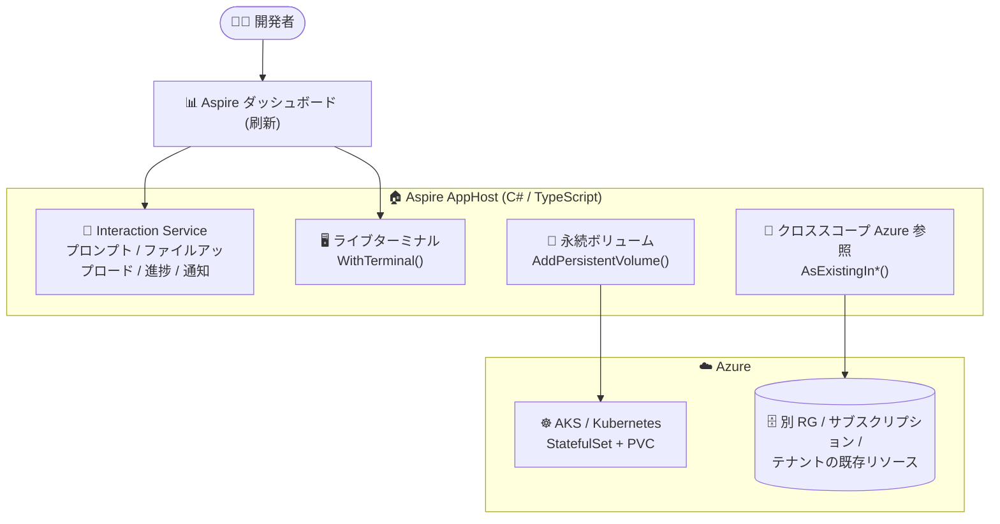

# Aspire: Aspire 13.5 リリース

**リリース日**: 2026-08-25 (Azure Updates 掲載日、Aspire 13.5.0 本体は 2026-08-18 リリース)

**サービス**: Aspire

**機能**: Aspire 13.5 リリース (ダッシュボード刷新、Interaction Service 拡張、クロススコープ Azure 参照、Kubernetes 永続ボリューム、ライブターミナル)

**ステータス**: Announcement

[このアップデートのインフォグラフィックを見る](https://takech9203.github.io/azure-news-summary/20260825-aspire-13-5.html)

## 概要

分散アプリケーション開発フレームワーク Aspire のバージョン 13.5 がリリースされた。開発者体験 (Developer Experience) に焦点を当てたリリースで、C# と TypeScript の AppHost 間の機能パリティ強化が中心テーマとなっている。

主な内容は、(1) 公式ブランディングと新デザイントークンシステムによるダッシュボードおよび aspire.dev の刷新、(2) プロンプト・ファイルアップロード・進捗ダイアログ・通知に対応した Interaction Service の拡張、(3) リソースグループ / サブスクリプション / テナントを横断する Azure リソース参照 (クロススコープ参照)、(4) Kubernetes / AKS 向けの永続ボリュームの第一級リソース化、(5) ダッシュボードから REPL やシェルに接続できるライブターミナル (`WithTerminal()`) の 5 点。

このほか、TypeScript AppHost の一般提供 (GA)、npm / Nix 経由での CLI インストール対応、`aspire doctor` などの CLI 改善、VS Code 拡張機能の「Aspire」への改名とエディタ内ダッシュボード対応も含まれる。リリース後、修正版として 13.5.1 / 13.5.2 (8 月 21 日)、13.5.3 (8 月 25 日) が公開されている。

**アップデート前の課題**

- Interaction Service のコア API は実験的扱いで、`ASPIREINTERACTION001` 診断の抑制が必要だった。またファイルアップロードのような入力手段がなかった
- 既存 Azure リソースの参照 (`AsExisting`) は同一スコープが前提で、別のリソースグループ・サブスクリプション・テナントにあるリソースをパラメーター経由で柔軟に参照する仕組みがなかった
- Kubernetes へのデプロイで永続ストレージ (PVC) を Aspire のアプリモデル上で第一級リソースとして宣言的にモデル化できなかった
- 実行中リソースの REPL やシェルに接続するには、Aspire の外部でツールを用意する必要があった
- GitHub Models 統合やダッシュボード AI アシスタントなど、方向性が整理されていない機能が残っていた

**アップデート後の改善**

- Interaction Service のコア API (`PromptInputAsync` / `PromptInputsAsync` 等) が安定版になり、`InputType.File` によるファイルアップロード (安定版) や進捗ダイアログ (実験的) が追加。C# / TypeScript の両 AppHost で同一の動作となった
- `AsExistingInResourceGroup` / `AsExistingInSubscription` / `AsExistingInTenant` (および `RunAsExisting*` / `PublishAsExisting*` バリアント) により、リテラル文字列または `ParameterResource` でスコープを指定してクロススコープの既存 Azure リソースを参照可能になった
- `AddPersistentVolume(name)` で PVC を第一級リソースとして定義し、`WithStorageClass` / `WithCapacity` / `WithAccessMode` で構成、`WithPersistentVolume(...)` でワークロードにバインドできるようになった。バインドしたワークロードは `StatefulSet` として出力される
- `WithTerminal()` を付与したリソースに対し、ダッシュボードからライブターミナルで接続 / 切断できるようになった (実験的)
- ダッシュボードは新デザイントークンシステムで刷新され、テレメトリのタイムスタンプフィルターやコンソールログのテキスト検索などの実用機能も強化された

## アーキテクチャ図



Aspire 13.5 では AppHost に Interaction Service・ライブターミナル・永続ボリューム・クロススコープ参照の各機能が追加/拡張され、刷新されたダッシュボードから開発者が対話的に操作できる。

## サービスアップデートの詳細

### 主要機能

1. **ダッシュボードと aspire.dev の刷新**
   - 公式ブランディングと新しいデザイントークンシステムを採用し、ビジュアルとアクセシビリティを改善
   - テレメトリのタイムスタンプフィルター、数値の `==` / `!=` 演算子、コンソールログのテキスト検索を追加
   - 接続断時の再接続モーダル、ヘルスチェックエラーの分かりやすい表示、レプリカ表示名の重複排除
   - なお、ダッシュボードの AI アシスタントチャットは削除された

2. **Interaction Service の拡張**
   - C# と TypeScript の両 AppHost で同一の動作 (プロンプト、メッセージボックス、通知、動的入力)
   - コア API (`PromptInputAsync` / `PromptInputsAsync` 等) が安定版に昇格し、`ASPIREINTERACTION001` の抑制が不要に
   - ファイルアップロード: `InputType.File` で `FileFilter` / `MaxFileSize` 付きのファイルピッカーを表示 (安定版)。C# は `InteractionFile`、TypeScript は `file.filePath` で読み取り
   - 進捗ダイアログ: `PromptProgressAsync` (実験的、`ASPIREINTERACTION001` の抑制が必要)
   - CLI から実行されるコマンドは非対話モードのため、`IsAvailable` の確認が推奨される

3. **クロススコープ Azure リソース参照**
   - `AsExistingInResourceGroup(name, resourceGroup, subscription)`、`AsExistingInSubscription(name, subscription)`、`AsExistingInTenant(name)` を追加
   - それぞれに `RunAsExisting*` / `PublishAsExisting*` バリアントがあり、実行時と発行時で挙動を分けられる
   - リテラル文字列または `ParameterResource` を受け付けるため、スコープ情報をパラメーターやシークレットから供給できる

4. **Kubernetes / AKS 永続ボリューム**
   - `AddPersistentVolume(name)` で PVC (PersistentVolumeClaim) を第一級リソースとしてモデル化
   - `WithStorageClass`、`WithCapacity`、`WithAccessMode` で構成し、`WithPersistentVolume(...)` でワークロードにバインド
   - 永続ボリュームをバインドしたワークロードは `Deployment` ではなく `StatefulSet` として出力される
   - AKS 環境でも `Aspire.Hosting.Azure.Kubernetes` 経由で同じ API が利用可能
   - 実験的機能 (`ASPIRECOMPUTE002` の抑制が必要)

5. **ライブターミナル (AppHost 内の対話型ターミナル)**
   - リソースに `WithTerminal()` を付けると、ダッシュボードから REPL やシェルへ接続 / 切断できる
   - `TerminalOptions` で `Columns` (既定 120)、`Rows` (既定 30)、`ShowTerminalHost` を構成可能 (C# のみ。TypeScript はパラメーターなし)
   - 実験的機能 (`ASPIRETERMINAL001` の抑制が必要)。CLI コマンドは `aspire config set features.terminalCommandsEnabled true` で有効化

6. **その他の改善**
   - TypeScript AppHost が GA (実験的診断 `ASPIREATS001` が不要に。カスタムヘルスチェック、コンテナファイルコピーを追加)
   - CLI: npm (`@microsoft/aspire-cli`) や Nix 経由のインストール、`aspire stop --force`、`aspire update --migrate`、`aspire doctor` の強化
   - VS Code 拡張機能を「Aspire」に改名し、エディタ内ダッシュボードや Bun / MAUI デバッグに対応
   - Azure Container Apps の決定的な命名、Radius デプロイ (プレビュー)、Redis モジュール等の統合追加

## 技術仕様

| 項目 | 詳細 |
|------|------|
| バージョン | 13.5.0 (2026-08-18)。パッチ: 13.5.1 / 13.5.2 (8/21)、13.5.3 (8/25) |
| 対応 AppHost 言語 | C#、TypeScript (13.5 で GA) |
| Interaction Service コア API | 安定版 (`PromptInputAsync` / `PromptInputsAsync` 等) |
| ファイルアップロード | 安定版。`InputType.File`、`FileFilter` / `MaxFileSize` 指定可 |
| 進捗ダイアログ | 実験的 (`ASPIREINTERACTION001` の抑制が必要) |
| Kubernetes 永続ボリューム | 実験的 (`ASPIRECOMPUTE002` の抑制が必要)。バインド先は `StatefulSet` として出力 |
| ライブターミナル | 実験的 (`ASPIRETERMINAL001` の抑制が必要)。既定サイズ 120 列 x 30 行 |
| CLI インストール方法 | Homebrew、npm、NuGet、WinGet、mise、Nix、インストールスクリプト |

## 設定方法

### 前提条件

1. 既存の Aspire プロジェクト (13.4 以前) または新規プロジェクト
2. SDK とすべての `Aspire.Hosting.*` パッケージのバージョンを 13.5 系に揃えること (混在すると `MissingMethodException` / `TypeLoadException` で起動失敗の恐れあり)

### CLI でのアップグレード

```bash
# Aspire CLI 自体を更新
aspire update --self

# リポジトリのルートで実行し、Aspire パッケージを更新
aspire update

# (任意) ライブターミナルの CLI コマンドを有効化
aspire config set features.terminalCommandsEnabled true
```

## メリット

### ビジネス面

- ローカル開発から Kubernetes / Azure へのデプロイまでを単一のアプリモデルで扱えるため、開発・運用のリードタイムを短縮できる
- ダッシュボードの刷新とアクセシビリティ改善により、チーム全体での可観測性ツールとしての利用がしやすくなる
- 無償のオープンソースフレームワークであり、追加のライセンスコストなしで導入できる

### 技術面

- Interaction Service の安定版化により、デプロイ時のパラメーター入力やファイル受け渡しを AppHost 内で完結できる
- クロススコープ Azure 参照により、共有インフラ (別サブスクリプションの共通リソースなど) を持つエンタープライズ構成をコードで表現できる
- 永続ボリュームの第一級リソース化により、ステートフルワークロードの Kubernetes / AKS 発行が宣言的に行える
- ライブターミナルにより、実行中リソースのデバッグや REPL 操作をダッシュボードから直接行える
- C# / TypeScript の機能パリティにより、チームの言語スタックに合わせて AppHost を選択できる

## デメリット・制約事項

- **実験的機能が多い**: ライブターミナル (`ASPIRETERMINAL001`)、Kubernetes 永続ボリューム (`ASPIRECOMPUTE002`)、進捗ダイアログ (`ASPIREINTERACTION001`) は実験的で、診断の抑制が必要。将来変更される可能性がある
- **破壊的変更**: `ServiceProvider` プロパティの `Services` への改名、`PublishAsConnectionString` の非推奨化 (`AddConnectionString` へ移行)、`aspire ps --resources` / `--include-hidden` の削除 (`aspire describe` を使用)、`TerminalOptions.Shell` の削除など
- **機能の削除・非推奨**: ダッシュボードの AI アシスタント削除、GitHub Models 統合の非推奨化 (Azure AI Foundry へ移行)、VS Code 拡張のダッシュボード自動起動削除 (`dashboardBrowser` 設定でオプトイン)
- **パッケージ混在のリスク**: 13.4 と 13.5 のパッケージが混在すると起動に失敗する恐れがあるため、一括更新が必要
- **プロキシポートの割り当て変更**: プロキシのポートがサービス準備時に `10000-32767` の範囲で割り当てられるようになった
- CLI から実行されるコマンドは非対話モードのため、Interaction Service 利用時は `IsAvailable` の確認が必要

## ユースケース

### ユースケース 1: 別サブスクリプションの共有リソースを参照するエンタープライズ構成

**シナリオ**: プラットフォームチームが管理する共有サブスクリプション上の既存 Azure リソースを、アプリケーションチームの Aspire アプリから参照する。スコープ情報はパラメーターとして環境ごとに供給する。

**実装例**: `AsExistingInSubscription(name, subscription)` に `ParameterResource` を渡し、サブスクリプション ID を環境ごとのパラメーター / シークレットから注入する。

**効果**: 環境ごとに異なるスコープの既存リソースをコード変更なしで切り替えられ、マルチサブスクリプション構成の IaC 管理が簡素化される。

### ユースケース 2: AKS 上のステートフルワークロード

**シナリオ**: データベースやキューなどステートを持つコンテナワークロードを Aspire から AKS に発行する。

**実装例**: `AddPersistentVolume("data")` で PVC を定義し、`WithStorageClass` / `WithCapacity` / `WithAccessMode` を構成のうえ `WithPersistentVolume(...)` でワークロードにバインドする (`Aspire.Hosting.Azure.Kubernetes` 経由で AKS でも同一 API)。

**効果**: PVC と `StatefulSet` のマニフェストを手書きせず、Aspire のアプリモデルからステートフルワークロードを宣言的にデプロイできる。

### ユースケース 3: ダッシュボードからの対話的デバッグ

**シナリオ**: ローカル開発中に、実行中のコンテナやリソースのシェル / REPL に入って状態を調査したい。

**実装例**: 対象リソースに `WithTerminal()` を付与し (`ASPIRETERMINAL001` を抑制)、ダッシュボードのターミナルから接続する。CLI からは `aspire terminal` コマンドも利用可能 (要 `features.terminalCommandsEnabled`)。

**効果**: 外部ツールなしで、開発ループの中で実行中リソースの対話的な調査・操作ができる。

## 料金

Aspire はオープンソースの無償フレームワークであり、Aspire 自体の利用に料金は発生しない。デプロイ先の Azure サービス (AKS、Azure Container Apps など) には各サービスの料金が適用される。

## 関連サービス・機能

- **Azure Kubernetes Service (AKS)**: 永続ボリューム API は `Aspire.Hosting.Azure.Kubernetes` 経由で AKS 環境でも利用可能。ステートフルワークロードを `StatefulSet` + PVC として発行できる
- **Azure Container Apps**: Aspire の主要な発行先の 1 つ。13.5 でリソースの決定的な命名 (deterministic naming) が導入された
- **Azure AI Foundry**: GitHub Models 統合の非推奨化に伴う移行先として案内されている
- **Radius**: 13.5 でプレビューとしてデプロイ対応が追加された

## 参考リンク

- [インフォグラフィック](https://takech9203.github.io/azure-news-summary/20260825-aspire-13-5.html)
- [公式アップデート情報](https://azure.microsoft.com/updates?id=569910)
- [Aspire 13.5 What's New (aspire.dev)](https://aspire.dev/whats-new/aspire-13-5/)
- [Aspire GitHub Releases](https://github.com/dotnet/aspire/releases)
- [Aspire 公式サイト](https://aspire.dev/)

## まとめ

Aspire 13.5 は、ダッシュボード刷新、Interaction Service の安定版化と拡張、クロススコープ Azure 参照、Kubernetes 永続ボリューム、ライブターミナルを柱とする開発者体験重視のリリースである。特にクロススコープ参照と永続ボリュームは、マルチサブスクリプション構成や AKS 上のステートフルワークロードといったエンタープライズシナリオでの Aspire 採用を後押しする。

アップグレード時は、`ServiceProvider` → `Services` の改名や `PublishAsConnectionString` の非推奨化などの破壊的変更を確認し、SDK と `Aspire.Hosting.*` パッケージを必ず 13.5 系に一括で揃えること。実験的機能 (ターミナル、永続ボリューム、進捗ダイアログ) は診断抑制が必要で今後変更の可能性がある点に留意し、まずは開発環境で評価することを推奨する。パッチリリース (13.5.3 時点) で Dashboard Graph view のクラッシュ等が修正されているため、最新パッチの適用が望ましい。

---

**タグ**: Aspire, .NET, TypeScript, AKS, Azure Container Apps, Kubernetes, Dashboard, Developer Experience, Announcement
