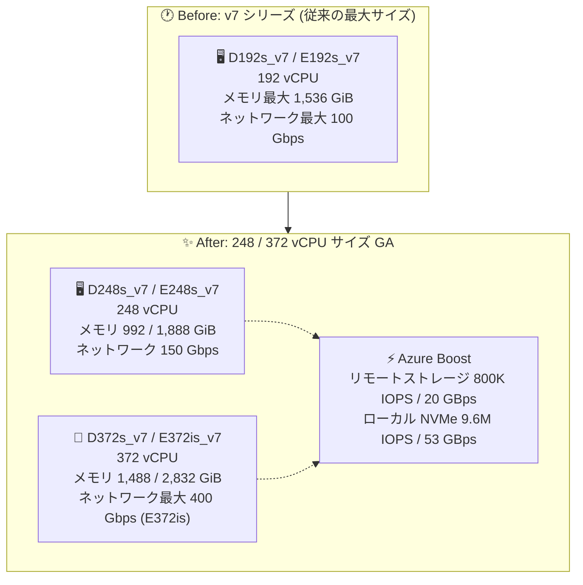

# Azure Virtual Machines: D/E v7 シリーズ 248 / 372 vCPU サイズの一般提供開始

**リリース日**: 2026-08-25

**サービス**: Azure Virtual Machines

**機能**: Dl/D/E v7 シリーズ VM の 248 vCPU および 372 vCPU サイズ (Intel Xeon 6 搭載)

**ステータス**: Launched (GA)

[このアップデートのインフォグラフィックを見る](https://takech9203.github.io/azure-news-summary/20260825-d-e-v7-248-372-vcpu.html)

## 概要

Microsoft は、Intel Xeon 6 プロセッサを搭載した Dl/D/E v7 シリーズ VM の 248 vCPU および 372 vCPU サイズの一般提供 (GA) を発表しました。これらの汎用 (Dl/D) およびメモリ最適化 (E) VM は、前世代の Intel ベース v6 VM と比較して最大 20% 高いコンピュート性能を実現し、スケール・ネットワーキング・ストレージの各面で大幅な向上を果たしています。

新しい VM は最大 372 vCPU、2.8 TiB のメモリまでスケールし、より大規模なインメモリデータベース、より大きなコンテキストウィンドウを扱うエージェント型 AI ワークロード、ノード間ネットワークホップの削減による低レイテンシーアプリケーションを可能にします。

248 / 372 vCPU サイズの追加により、Dlsv7・Dsv7・Esv7 VM は、[Azure Boost](https://azure.microsoft.com/en-us/products/virtual-machines/boost) の最新機能を活用して、主要ハイパースケーラーの同等 VM の中で最高水準のネットワーキング・リモートストレージ・ローカルストレージ性能を提供するとされています。

**アップデート前の課題**

- v7 シリーズの最大サイズは 192 vCPU (D192s_v7 / E192s_v7) までで、それを超えるスケールアップが必要なワークロードは複数ノードへの分散 (スケールアウト) が必要だった
- 大規模なインメモリデータベースや AI ワークロードでは、ノード間のネットワークホップがレイテンシー増加の要因となっていた

**アップデート後の改善**

- 単一 VM で最大 372 vCPU / 2,832 GiB (約 2.8 TiB) メモリまでスケールアップ可能になった
- 372 vCPU の Esv7/Edsv7 サイズで最大 400 Gbps のネットワーク帯域幅を利用可能になった
- 372 vCPU の Esv7/Edsv7 サイズで Premium SSD v2 / Ultra Disk に対して最大 800K IOPS・20 GBps のリモートストレージ性能を利用可能になった
- 372 vCPU の Ddsv7/Edsv7 サイズでローカル NVMe 一時ディスクに対して最大 9.6M IOPS・53 GBps のスループットを利用可能になった

## アーキテクチャ図



v7 シリーズの最大サイズが 192 vCPU から 372 vCPU へ拡大し、Azure Boost によりネットワーク・ストレージ性能も大幅に向上しています。

## サービスアップデートの詳細

### 主要機能

1. **単一 VM で最大 372 vCPU / 2.8 TiB メモリへのスケールアップ**
   - 汎用の Dlsv7/Dsv7 とメモリ最適化の Esv7 に 248 vCPU と 372 vCPU のサイズが追加
   - 大規模インメモリデータベースや大きなコンテキストウィンドウを扱うエージェント型 AI ワークロードに対応

2. **Intel Xeon 6 6973P-C (Granite Rapids) プロセッサ**
   - 全コアターボ 3.6 GHz、最大ターボ 4.2 GHz
   - Intel Turbo Boost Technology、Intel AVX-512、Intel Advanced Matrix Extensions (AMX) をサポート
   - 前世代の Intel ベース v6 VM 比で最大 20% 高いコンピュート性能

3. **Azure Boost による高いネットワーク・ストレージ性能**
   - ネットワーク帯域幅: 372 vCPU の Esv7/Edsv7 サイズで最大 400 Gbps
   - リモートストレージ: 372 vCPU の Esv7/Edsv7 サイズで Premium SSD v2 / Ultra Disk に対して最大 800K IOPS・20 GBps
   - ローカルストレージ: 372 vCPU の Ddsv7/Edsv7 サイズでローカル NVMe 一時ディスクに対して最大 9.6M IOPS・53 GBps

## 技術仕様

### Dsv7 シリーズ (汎用・ローカル一時ディスクなし)

| 項目 | 詳細 |
|------|------|
| プロセッサ | Intel Xeon 6 6973PC (Granite Rapids)、全コアターボ 3.6 GHz / 最大 4.2 GHz |
| D248s_v7 | 248 vCPU / 992 GiB メモリ |
| D372s_v7 | 372 vCPU / 1,488 GiB メモリ |
| リモートストレージ (D248s_v7) | Premium SSD: 396,800 IOPS / 13,145 MBps、Premium SSD v2 / Ultra Disk: 620,000 IOPS / 16,740 MBps |
| リモートストレージ (D372s_v7) | Premium SSD: 500,000 IOPS / 16,000 MBps、Premium SSD v2 / Ultra Disk: 800,000 IOPS / 20,000 MBps |
| ネットワーク帯域幅 | D248s_v7: 150,000 Mbps、D372s_v7: 200,000 Mbps (最大 15 NIC) |
| ネットワークインターフェイス | NetVSC、MANA (Microsoft Azure Network Adapter) |
| ローカル一時ディスク | なし (Ddsv7 系はローカル NVMe あり) |
| 最大データディスク数 | 64 |

### Esv7 シリーズ (メモリ最適化・ローカル一時ディスクなし)

| 項目 | 詳細 |
|------|------|
| プロセッサ | Intel Xeon 6 6973P-C (Granite Rapids)、全コアターボ 3.6 GHz / 最大 4.2 GHz |
| E248s_v7 | 248 vCPU / 1,888 GiB メモリ |
| E372is_v7 | 372 vCPU / 2,832 GiB メモリ |
| リモートストレージ (E248s_v7) | Premium SSD: 396,800 IOPS / 13,145 MBps、Premium SSD v2 / Ultra Disk: 620,000 IOPS / 16,740 MBps |
| リモートストレージ (E372is_v7) | Premium SSD: 500,000 IOPS / 16,000 MBps、Premium SSD v2 / Ultra Disk: 800,000 IOPS / 20,000 MBps |
| ネットワーク帯域幅 | E248s_v7: 150,000 Mbps、E372is_v7: 400,000 Mbps (最大 15 NIC) |
| ネットワークインターフェイス | NetVSC、MANA (Microsoft Azure Network Adapter) |
| 最大データディスク数 | 64 |

### 機能サポート (Dsv7 / Esv7 共通の主な項目)

| 機能 | サポート状況 |
|------|------|
| Premium Storage / Premium Storage キャッシュ | サポート |
| 第 2 世代 (Generation 2) VM | サポート (第 1 世代は非サポート) |
| Accelerated Networking | サポート |
| Nested Virtualization | サポート |
| Live Migration | サポート |
| OS イメージ要件 | NVMe 対応 OS イメージが必須 |

## 設定方法

### 前提条件

1. 対象リージョン (下記「利用可能リージョン」参照) でのデプロイであること
2. NVMe 対応の OS イメージを使用すること (非対応イメージではエラーとなる)
3. 大規模サイズのため、サブスクリプションの vCPU クォータが十分であることを確認すること

### Azure CLI

```bash
# 利用可能な v7 サイズの確認 (例: East US)
az vm list-sizes --location eastus --output table | grep -E "D248s_v7|D372s_v7|E248s_v7|E372is_v7"

# E372is_v7 VM の作成例
az vm create \
  --resource-group myResourceGroup \
  --name myLargeVM \
  --image Ubuntu2404 \
  --size Standard_E372is_v7 \
  --location eastus \
  --accelerated-networking true
```

## メリット

### ビジネス面

- スケールアウト構成を単一の大型 VM に集約でき、アーキテクチャの簡素化と運用負荷の軽減が期待できる
- 前世代 v6 比で最大 20% のコンピュート性能向上により、同一ワークロードをより少ないリソースで処理できる可能性がある
- Spot VM や従量課金など柔軟な料金オプションで大規模サイズを利用できる

### 技術面

- 単一 VM で 372 vCPU / 2.8 TiB メモリまでスケールアップでき、ノード間ネットワークホップの削減によりレイテンシーを低減できる
- Azure Boost により最大 400 Gbps のネットワーク帯域幅、リモートストレージ最大 800K IOPS / 20 GBps を実現
- Intel AVX-512 / AMX 対応により、AI 推論やベクトル演算を含むワークロードの高速化が見込める

## デメリット・制約事項

- 利用可能リージョンは現時点で 8 リージョンに限定される
- NVMe 対応 OS イメージが必須であり、古い OS イメージでは起動できない
- 第 1 世代 (Generation 1) VM は非サポート
- Dsv7 / Esv7 はローカル一時ディスクを持たない (ローカル NVMe が必要な場合は Ddsv7 / Edsv7 系を選択する)
- 248 / 372 vCPU の大規模サイズはサブスクリプションの vCPU クォータ引き上げ申請が必要になる場合がある

## ユースケース

### ユースケース 1: 大規模インメモリデータベースのスケールアップ

**シナリオ**: SAP や Redis などのインメモリデータベース、大規模なリレーショナルデータベースを、複数ノードに分散せず単一 VM で運用したい。

**実装例**:

```bash
# メモリ最適化 E372is_v7 (372 vCPU / 2,832 GiB) をデプロイ
az vm create \
  --resource-group myDbRg \
  --name myInMemoryDb \
  --image Ubuntu2404 \
  --size Standard_E372is_v7 \
  --location swedencentral
```

**効果**: 2.8 TiB のメモリと 800K IOPS / 20 GBps のリモートストレージ性能により、大規模データベースを単一ノードで低レイテンシーに運用できる。

### ユースケース 2: エージェント型 AI ワークロードの CPU 推論基盤

**シナリオ**: 大きなコンテキストウィンドウを扱うエージェント型 AI ワークロードを、AMX / AVX-512 対応の大規模 CPU VM で実行する。

**効果**: 372 vCPU と大容量メモリにより、ノード間通信を減らしながら大規模なコンテキスト処理を単一 VM 内で完結できる。

## 料金

従量課金 (Pay-as-you-go) の East US リージョンにおける参考価格 (Azure Retail Prices API、2026-08-26 時点):

| サイズ | vCPU / メモリ | Linux (USD/時) | Windows (USD/時) |
|------|------|------|------|
| Standard_D248s_v7 | 248 / 992 GiB | $16.405 | $27.813 |
| Standard_D372s_v7 | 372 / 1,488 GiB | $24.608 | $41.72 |
| Standard_E248s_v7 | 248 / 1,888 GiB | $21.534 | $32.942 |
| Standard_E372is_v7 | 372 / 2,832 GiB | $35.531 | $52.643 |

Spot VM も利用可能で、大幅な割引価格が提供されています (例: Linux E372is_v7 Spot は $6.566/時、East US、変動あり)。最新の料金は [Virtual Machines の料金ページ](https://azure.microsoft.com/pricing/details/virtual-machines/linux/) および [料金計算ツール](https://azure.microsoft.com/pricing/calculator/) で確認してください。

## 利用可能リージョン

以下の 8 リージョンで一般提供:

- Central US
- East US
- East US 2
- Germany West Central
- South Central US
- Sweden Central
- West US 2
- West US 3

## 関連サービス・機能

- **Azure Boost**: ネットワーク・ストレージ処理を専用ハードウェアにオフロードする基盤技術。本サイズの 400 Gbps ネットワークや 800K IOPS のストレージ性能を支える
- **Premium SSD v2 / Ultra Disk**: 最大 800K IOPS / 20 GBps のリモートストレージ性能を引き出すために組み合わせるマネージドディスク
- **MANA (Microsoft Azure Network Adapter)**: v7 シリーズがサポートする次世代ネットワークインターフェイス
- **Accelerated Networking**: SR-IOV によるネットワーク遅延の低減。本シリーズでサポート

## 参考リンク

- [インフォグラフィック](https://takech9203.github.io/azure-news-summary/20260825-d-e-v7-248-372-vcpu.html)
- [公式アップデート情報](https://azure.microsoft.com/updates?id=569546)
- [Dsv7 シリーズ (Microsoft Learn)](https://learn.microsoft.com/en-us/azure/virtual-machines/sizes/general-purpose/dsv7-series)
- [Esv7 シリーズ (Microsoft Learn)](https://learn.microsoft.com/en-us/azure/virtual-machines/sizes/memory-optimized/esv7-series)
- [Azure Boost](https://azure.microsoft.com/en-us/products/virtual-machines/boost)
- [料金ページ (Linux Virtual Machines)](https://azure.microsoft.com/pricing/details/virtual-machines/linux/)

## まとめ

Intel Xeon 6 (Granite Rapids) を搭載した Dl/D/E v7 シリーズに 248 / 372 vCPU の大規模サイズが GA となり、単一 VM で最大 372 vCPU / 2.8 TiB メモリ、400 Gbps ネットワーク、800K IOPS のストレージ性能を利用できるようになりました。大規模インメモリデータベースやエージェント型 AI など、これまでスケールアウトが必要だったワークロードのスケールアップ集約を検討する価値があります。導入時は、対象 8 リージョンでの提供状況、NVMe 対応 OS イメージ、vCPU クォータを事前に確認してください。

---

**タグ**: Azure Virtual Machines, Compute, Intel Xeon 6, Granite Rapids, Dsv7, Esv7, Azure Boost, GA
