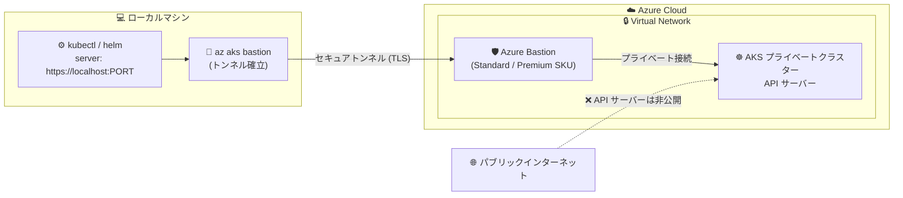

# Azure Bastion: AKS クラスターへの接続機能が一般提供 (GA)

**リリース日**: 2026-08-26

**サービス**: Azure Bastion / Azure Kubernetes Service (AKS)

**機能**: Azure Bastion を使用した AKS クラスターへの接続 (Generally Available)

**ステータス**: Launched (GA)

[このアップデートのインフォグラフィックを見る](https://takech9203.github.io/azure-news-summary/20260826-bastion-aks-connect.html)

## 概要

Azure Bastion と Azure Kubernetes Service (AKS) の統合が一般提供 (GA) となりました。ローカルマシンから Azure Bastion を経由して AKS クラスターの API サーバーへセキュアなトンネルを確立できるようになります。

この統合により、プライベートクラスターの API サーバーエンドポイントをパブリックインターネットに公開することなく、`kubectl` や `helm` などの標準的な Kubernetes ツールをローカルマシンからそのまま利用できます。Bastion のネイティブクライアントトンネリング機能を利用するため、追加のクライアントソフトウェアやエージェントのインストールは不要です。

従来、プライベート AKS クラスターの運用アクセスにはジャンプボックス (踏み台 VM) や VPN サーバーの構築・維持が必要でしたが、この統合によりそれらの追加インフラが不要になります。

**アップデート前の課題**

- プライベート AKS クラスターの API サーバーへは、クラスターの VNet 内・ピアリングされたネットワーク・プライベートエンドポイント経由での接続が必要で、VPN や ExpressRoute、ジャンプボックス VM などの追加インフラの構築・維持が必要だった
- 代替手段の `az aks command invoke` (Run command) はクラスター内に一時 Pod を起動してコマンドを実行する方式のため、出力サイズ上限 (512 KB) や Pod スケジューリング依存などの制約があり、プログラムからの継続的なアクセスには不向きだった
- ローカルマシンから標準の `kubectl` / `helm` を直接使ったインタラクティブな操作が困難だった

**アップデート後の改善**

- ローカルマシンから Azure Bastion 経由で AKS API サーバーへのセキュアなトンネルを `az aks bastion` コマンド 1 つで確立できるようになった
- プライベートクラスターのエンドポイントを公開せずに、標準の Kubernetes ツール (`kubectl`、`helm` など) をローカルからそのまま利用可能になった
- ジャンプボックス、VPN サーバー、追加のアクセスエージェントの導入・維持が不要になり、運用コストと攻撃対象領域を削減できるようになった

## アーキテクチャ図



ローカルマシンの `kubectl` は localhost のトンネルポートに接続し、Azure Bastion がプライベート API サーバーへの通信を中継します。API サーバーのエンドポイントはインターネットに公開されません。

## サービスアップデートの詳細

### 主要機能

1. **Bastion ネイティブクライアントトンネリングによる API サーバー接続**
   - `az aks bastion` コマンドでローカルマシンと AKS API サーバー間のセキュアなトンネルを確立
   - KUBECONFIG のサーバーアドレスを `https://localhost:<ポート>` に向けることで、標準ツールがトンネル経由で動作

2. **プライベートクラスターの安全な運用アクセス**
   - API サーバーエンドポイントをパブリックに公開せずにクラスターを操作可能
   - VNet 内にデプロイ済みの Bastion から、同一 VNet または到達可能な (ピアリングされた) VNet 内の AKS クラスターに接続可能

3. **追加インフラの排除**
   - ジャンプボックス VM、VPN サーバー、専用アクセスエージェントが不要
   - 既存の Azure Bastion (Standard 以上) を VM 接続と共用できる

## 技術仕様

| 項目 | 詳細 |
|------|------|
| 必要な Bastion SKU | Standard または Premium (ネイティブクライアントサポートの有効化が必要) |
| 接続コマンド | `az aks bastion --name <クラスター名> --resource-group <RG> --bastion <Bastion リソース ID>` |
| 対象クラスター | 同一 VNet または Bastion から到達可能な VNet 内の AKS クラスター |
| 必要なロール | AKS クラスター、Bastion リソース、(ピアリング構成の場合) 対象 VNet に対する Reader ロール |
| 接続方式 | ローカルの kubeconfig を `https://localhost:<トンネルポート>` に向けて接続 |
| パブリッククラスターでの利用 | API サーバー承認済み IP 範囲を使用している場合、Bastion のパブリック IP を承認済み IP 範囲に追加する必要あり |

## 設定方法

### 前提条件

1. AKS クラスターと同じ VNet (または到達可能な VNet) に Azure Bastion ホストがデプロイ済みであること
2. Bastion の SKU が Standard または Premium で、構成設定でネイティブクライアントサポートが有効になっていること
3. AKS クラスター・Bastion リソース・(ピアリング構成の場合) 対象 VNet に対する Reader ロールが付与されていること

### Azure CLI

```bash
# 1. Azure にサインインし、サブスクリプションを選択
az login
az account set --subscription <サブスクリプション ID>

# 2. AKS クラスターの資格情報を取得
az aks get-credentials --admin --name <AKSクラスター名> --resource-group <リソースグループ名>

# 3. Bastion 経由のトンネルを確立
az aks bastion --name <AKSクラスター名> --resource-group <リソースグループ名> \
  --admin --bastion <Bastion リソース ID>

# 4. KUBECONFIG をトンネルの localhost ポートに向ける
export BASTION_PORT=$(ps aux | sed -n 's/.*--port \([0-9]*\).*/\1/p' | head -1)
sed -i "s|server: https://.*|server: https://localhost:${BASTION_PORT}|" $KUBECONFIG

# 5. 標準ツールでクラスターを操作
kubectl get nodes
```

## メリット

### ビジネス面

- ジャンプボックス VM や VPN サーバーの構築・パッチ適用・監視といった維持コストを削減できる
- API サーバーを非公開に保つことで攻撃対象領域を縮小し、セキュリティ・コンプライアンス要件を満たしやすくなる
- GA となったため、本番環境での利用が SLA の対象となり安心して採用できる

### 技術面

- ローカルマシンから標準の `kubectl` / `helm` をそのまま利用でき、開発者のワークフローを変えずにプライベートクラスターへアクセスできる
- 追加のクライアントソフトウェアやエージェントのインストールが不要
- `az aks command invoke` と異なり、出力サイズ制限やクラスター内 Pod のスケジューリングに依存しない対話的な接続が可能
- VM への接続に使用している既存の Bastion デプロイメントを AKS アクセスにも共用できる

## デメリット・制約事項

- Bastion の Basic / Developer SKU では利用できず、Standard または Premium SKU が必要 (Basic からのアップグレードによるコスト増の可能性)
- Bastion 側でネイティブクライアントサポートを有効化する必要がある
- API サーバー承認済み IP 範囲を使用しているパブリッククラスターでは、Bastion のパブリック IP を承認済み IP 範囲に追加する追加設定が必要
- トンネル確立後、KUBECONFIG のサーバーアドレスを localhost のトンネルポートに手動で書き換える手順が必要

## ユースケース

### ユースケース 1: プライベート AKS クラスターの日常運用

**シナリオ**: セキュリティ要件により API サーバーを非公開にしたプライベート AKS クラスターに対して、運用チームがローカルマシンからトラブルシューティングやデプロイ作業を行いたい。従来はジャンプボックス VM を経由していた。

**実装例**:

```bash
# Bastion 経由でトンネルを確立し、そのままローカルの kubectl で運用
az aks bastion --name prod-aks --resource-group rg-prod \
  --admin --bastion /subscriptions/<subId>/resourceGroups/rg-network/providers/Microsoft.Network/bastionHosts/bastion-hub

kubectl get pods -A
helm upgrade my-app ./chart -n app
```

**効果**: ジャンプボックス VM を廃止でき、VM の維持管理コストとセキュリティリスクを削減。運用者はローカル環境のツールチェーン (kubectl プラグイン、エディタ連携など) をそのまま活用できる。

### ユースケース 2: ハブ & スポーク構成での集中アクセス管理

**シナリオ**: ハブ VNet に Bastion を配置し、ピアリングされたスポーク VNet 内の複数のプライベート AKS クラスターへのアクセスを一元管理したい。

**実装例**:

```bash
# ハブ VNet の Bastion から、ピアリングされたスポーク VNet 内のクラスターへ接続
# (対象 VNet への Reader ロールが必要)
az aks bastion --name spoke1-aks --resource-group rg-spoke1 \
  --bastion /subscriptions/<subId>/resourceGroups/rg-hub/providers/Microsoft.Network/bastionHosts/bastion-hub
```

**効果**: 1 つの Bastion デプロイメントで複数クラスターへのアクセス経路を集約し、アクセス制御 (RBAC) と監査を一元化できる。

## 料金

Azure Bastion 自体の料金が適用されます。本機能には Standard または Premium SKU が必要です。

- Bastion はデプロイからリソース削除まで、SKU・スケールユニット数に基づき時間単位で課金されます (Standard / Premium は基本料金に 2 インスタンスを含み、追加インスタンスは別料金)
- アウトバウンドデータ転送は月間最初の 5 GB が無料で、以降は従量課金となります

具体的な単価はリージョンにより異なるため、[Azure Bastion 料金ページ](https://azure.microsoft.com/pricing/details/azure-bastion/) を参照してください。

## 利用可能リージョン

公式アップデートにリージョン情報の記載はありません。最新の提供状況は [Microsoft Learn ドキュメント](https://learn.microsoft.com/en-us/azure/bastion/bastion-connect-to-aks-private-cluster) および [リージョン別の利用可能な製品ページ](https://azure.microsoft.com/global-infrastructure/services/) を確認してください。

## 関連サービス・機能

- **AKS プライベートクラスター**: API サーバーをプライベートエンドポイント経由でのみ公開するクラスター構成。本機能の主な接続対象
- **az aks command invoke (Run command)**: クラスター内に一時 Pod を起動してコマンドを実行するプライベートクラスターへの代替アクセス手段。単発コマンド向けで、対話的・継続的なアクセスには Bastion 統合が適する
- **Azure VPN Gateway / ExpressRoute**: オンプレミスや拠点からの恒常的なネットワーク接続手段。Bastion 統合は個別ユーザーのアドホックな管理アクセスを補完する
- **API サーバー承認済み IP 範囲 (Authorized IP ranges)**: パブリッククラスターで API サーバーへのアクセス元 IP を制限する機能。Bastion 経由で接続する場合は Bastion のパブリック IP の追加が必要

## 参考リンク

- [インフォグラフィック](https://takech9203.github.io/azure-news-summary/20260826-bastion-aks-connect.html)
- [公式アップデート情報](https://azure.microsoft.com/updates?id=570030)
- [Microsoft Learn: Connect to AKS Private Cluster Using Azure Bastion](https://learn.microsoft.com/en-us/azure/bastion/bastion-connect-to-aks-private-cluster)
- [Microsoft Learn: AKS プライベートクラスターの作成](https://learn.microsoft.com/en-us/azure/aks/private-clusters)
- [Microsoft Learn: command invoke によるプライベートクラスターへのアクセス](https://learn.microsoft.com/en-us/azure/aks/access-private-cluster)
- [料金ページ](https://azure.microsoft.com/pricing/details/azure-bastion/)

## まとめ

Azure Bastion と AKS の統合 GA により、プライベート AKS クラスターへの管理アクセスがジャンプボックスや VPN なしで実現できるようになりました。API サーバーを非公開に保ちながらローカルの標準 Kubernetes ツールをそのまま使えるため、セキュリティと運用効率を両立できます。プライベートクラスターを運用中で踏み台 VM や VPN を管理アクセス用に維持しているチームは、Bastion (Standard 以上) への移行によるインフラ簡素化を検討する価値があります。既存の Bastion が Basic SKU の場合は、SKU アップグレードのコストを含めて評価してください。

---

**タグ**: Azure Bastion, Azure Kubernetes Service, AKS, Networking, Security, Compute, Containers, GA
