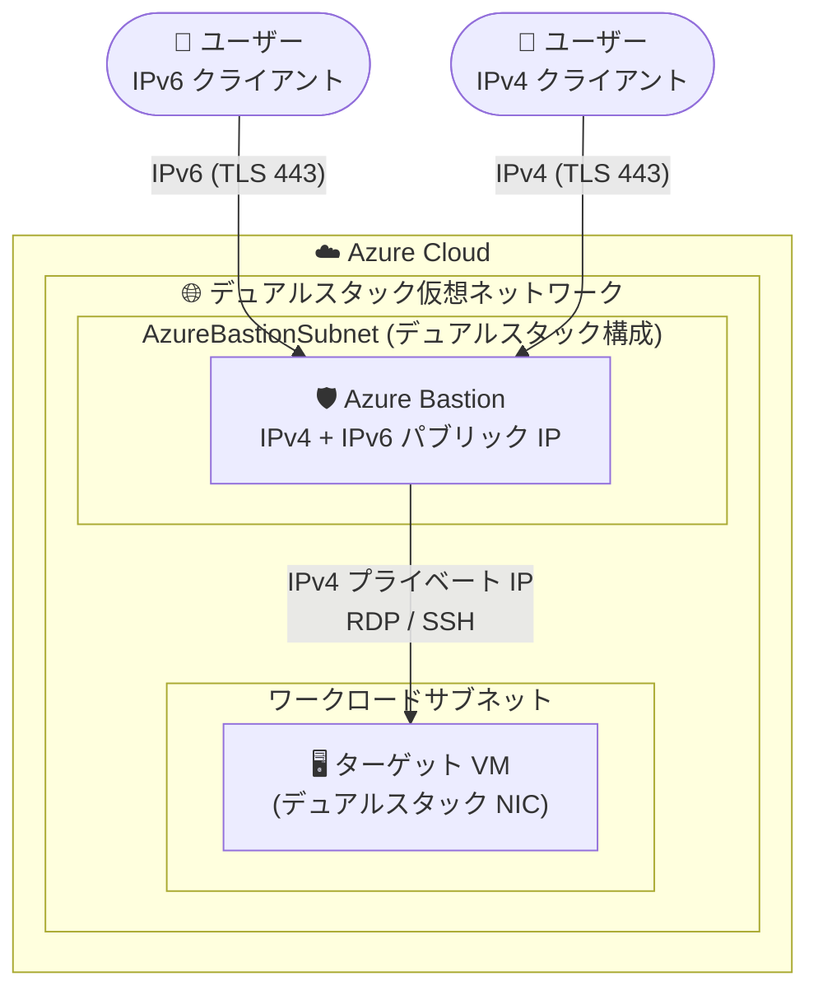

# Azure Bastion: IPv6 デュアルスタック対応 (Public Preview)

**リリース日**: 2026-08-26

**サービス**: Azure Bastion

**機能**: IPv6 デュアルスタック (IPv4 + IPv6) 構成のサポート

**ステータス**: In preview

[このアップデートのインフォグラフィックを見る](https://takech9203.github.io/azure-news-summary/20260826-bastion-ipv6-dual-stack.html)

## 概要

Azure Bastion で IPv4 と IPv6 のデュアルスタック構成がパブリックプレビューとして利用可能になった。新規に作成する Bastion デプロイメントに対して、IPv4 と IPv6 の両方のパブリック IP アドレスを構成できるようになる。

IPv6 がサポートされるのは「ユーザーと Azure Bastion 間」の接続であり、Bastion からターゲット VM への接続は引き続き IPv4 が使用される。これにより、IPv6 のみ、あるいは IPv6 優先のネットワーク環境にいるユーザーでも、Azure Bastion 経由で VM への安全な RDP/SSH 接続が可能になる。

なお、デュアルスタック構成は Bastion の作成時に指定する必要があり、既存の IPv4 のみの Bastion をデュアルスタックに変換することはできない。

**アップデート前の課題**

- Azure Bastion は IPv4 のみをサポートしており、Bastion リソースに割り当てられるパブリック IP アドレスは IPv4 に限られていた
- デュアルスタックのターゲット VM に接続することはできたが、Bastion 経由で送受信できるのは IPv4 トラフィックのみだった
- IPv6 のみのクライアント環境からは Bastion に直接接続できなかった

**アップデート後の改善**

- 新規作成の Bastion デプロイメントに IPv4 と IPv6 の両方のパブリック IP アドレスを構成可能になった
- IPv6 クライアントからユーザー ~ Bastion 間の接続を IPv6 で確立できるようになった
- IPv6 への移行が進む環境 (ISP・企業ネットワークなど) からのセキュアな VM アクセス経路を確保できるようになった

## アーキテクチャ図

ユーザーから Bastion への接続は IPv4 / IPv6 のどちらでも可能になるが、Bastion からターゲット VM への接続は従来どおり IPv4 (プライベート IP) が使用される。

## サービスアップデートの詳細

### 主要機能

1. **デュアルスタックパブリック IP の構成**
   - 新規作成する Bastion デプロイメントに IPv4 と IPv6 の両方のパブリック IP アドレスを割り当てられる
   - デュアルスタックは Bastion 作成時に構成する必要がある

2. **ユーザー ~ Bastion 間の IPv6 接続**
   - IPv6 がサポートされるのはユーザーと Azure Bastion 間の接続のみ
   - Bastion からターゲット VM への接続は引き続き IPv4 を使用するため、VM 側の接続構成を変更する必要はない

## 技術仕様

| 項目 | 詳細 |
|------|------|
| 対応構成 | IPv4 のみ、または IPv4 + IPv6 デュアルスタック (IPv6 のみは非対応) |
| IPv6 の適用範囲 | ユーザー ~ Bastion 間の接続のみ (Bastion ~ ターゲット VM 間は IPv4) |
| 構成タイミング | Bastion 作成時のみ (既存の IPv4 のみの Bastion は変換不可) |
| 仮想ネットワーク要件 | VNet と AzureBastionSubnet がデュアルスタック構成であること |
| ターゲット VM 要件 | デュアルスタック対応 VNet 内で、デュアルスタック対応 NIC に関連付けられていること |
| AzureBastionSubnet | サブネット名は AzureBastionSubnet 固定、サイズは /26 以上 |
| パブリック IP | Standard SKU、静的 (Static) 割り当て |

## 設定方法

### 前提条件

1. 仮想ネットワークと **AzureBastionSubnet** が IPv6 デュアルスタック用に構成されていること
2. ターゲット VM が、IPv6 デュアルスタックをサポートする仮想ネットワーク内で、デュアルスタック対応のネットワークインターフェイスに関連付けられていること
3. デュアルスタック構成は Bastion の新規作成時に指定すること (作成後の変更は不可)

## メリット

### ビジネス面

- IPv6 への移行が進む組織・ネットワーク環境において、Bastion によるセキュアな VM 管理アクセスを継続できる
- ターゲット VM 側は IPv4 のままでよいため、既存ワークロードの改修なしで IPv6 クライアントに対応できる

### 技術面

- IPv6 のみ / IPv6 優先のクライアント環境からユーザー ~ Bastion 間を IPv6 で接続できる
- Bastion ~ VM 間は IPv4 のままのため、VNet 内部のアドレス設計やターゲット VM の NSG 設計への影響が限定的

## デメリット・制約事項

- **IPv6 のみ (IPv6 single-stack) の構成は非対応** (デュアルスタックのみサポート)
- **Private Only Bastion デプロイメントでは IPv6 は非対応**
- **Bastion ~ ターゲット VM 間の IPv6 接続は非対応** (VM への接続は IPv4 のみ)
- **既存の IPv4 のみの Bastion をデュアルスタックに変換できない** (新規作成が必要)
- パブリックプレビューのため、本番環境での利用は SLA 等の観点で注意が必要
- Azure 仮想ネットワークにおける IPv6 自体の制限事項も適用される ([IPv6 for Azure Virtual Network: Limitations](https://learn.microsoft.com/en-us/azure/virtual-network/ip-services/ipv6-overview#limitations) を参照)

## ユースケース

### ユースケース 1: IPv6 優先ネットワークからのセキュアな VM 管理

**シナリオ**: 社内ネットワークや ISP が IPv6 優先 / IPv6 のみの構成に移行しており、管理者が IPv6 クライアントから Azure 上の VM に RDP/SSH 接続する必要がある。

**実装のポイント**:

- VNet と AzureBastionSubnet をデュアルスタックで構成する
- Bastion を新規作成時に IPv4 + IPv6 のデュアルスタックパブリック IP 構成でデプロイする
- ターゲット VM はデュアルスタック対応 NIC に関連付ける (VM への接続自体は IPv4 で行われる)

**効果**: IPv6 クライアントから VM にパブリック IP を付与することなく、TLS (443) 経由のセキュアな RDP/SSH 接続を実現できる。

## 料金

このプレビュー機能自体に関する追加料金の情報は、アップデート発表内には記載されていない。

Azure Bastion の料金は、SKU とインスタンス数 (スケールユニット) に基づく時間課金と、送信データ転送料金の組み合わせで構成される。課金は Bastion をデプロイした時点から、使用量に関係なく開始される。

| 項目 | 内容 |
|------|------|
| SKU 時間課金 | Developer (無料) / Basic / Standard / Premium (Standard・Premium はベース 2 インスタンス含む) |
| 追加インスタンス | Standard / Premium で追加スケールユニットごとに時間課金 |
| 送信データ転送 | 月間最初の 5 GB は無料、以降は従量課金 |

最新の料金は [Azure Bastion 料金ページ](https://azure.microsoft.com/pricing/details/azure-bastion/) を参照。

## 関連サービス・機能

- **Azure Virtual Network (IPv6 デュアルスタック)**: 本機能の前提となる VNet / サブネットのデュアルスタック構成を提供する。VNet 側の IPv6 制限事項も本機能に適用される
- **Azure Public IP アドレス (Standard SKU)**: Bastion に割り当てる IPv4 / IPv6 パブリック IP。静的割り当てが必要
- **Azure Virtual Machines**: 接続対象のターゲット VM。デュアルスタック対応 NIC への関連付けが必要
- **Private Only Bastion (Premium SKU)**: パブリック IP を持たないプライベート専用デプロイメント。ただし IPv6 は非対応

## 参考リンク

- [インフォグラフィック](https://takech9203.github.io/azure-news-summary/20260826-bastion-ipv6-dual-stack.html)
- [公式アップデート情報](https://azure.microsoft.com/updates?id=570025)
- [Azure Bastion 構成設定 - IPv6 デュアルスタックサポート (Preview)](https://learn.microsoft.com/en-us/azure/bastion/configuration-settings#ipv6-dual-stack-support-preview)
- [What's new in Azure Bastion?](https://learn.microsoft.com/en-us/azure/bastion/whats-new)
- [Azure Bastion の概要](https://learn.microsoft.com/en-us/azure/bastion/bastion-overview)
- [料金ページ](https://azure.microsoft.com/pricing/details/azure-bastion/)

## まとめ

Azure Bastion の IPv6 デュアルスタック対応 (パブリックプレビュー) により、これまで IPv4 のみだったユーザー ~ Bastion 間の接続に IPv6 が利用できるようになった。IPv6 への移行が進むネットワーク環境から、VM にパブリック IP を付与せずにセキュアな RDP/SSH アクセスを維持したい組織にとって重要なアップデートである。

一方で、IPv6 のみの構成や Private Only Bastion での IPv6、Bastion ~ VM 間の IPv6 接続は非対応であり、既存 Bastion のデュアルスタックへの変換もできない点に注意が必要。導入を検討する場合は、VNet / AzureBastionSubnet のデュアルスタック化を含めて新規デプロイメントとして設計することを推奨する。

---

**タグ**: Azure Bastion, Networking, Security, IPv6, Dual-Stack, Public Preview
