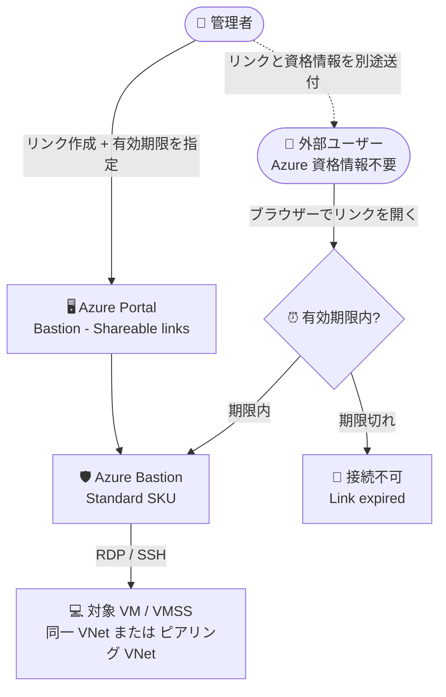

# Azure Bastion: 共有可能リンク (Shareable Link) の有効期限設定が一般提供開始

**リリース日**: 2026-08-26

**サービス**: Azure Bastion

**機能**: 共有可能リンク (Shareable Link) の有効期限 (Expiration) 設定

**ステータス**: Launched (GA)

[このアップデートのインフォグラフィックを見る](https://takech9203.github.io/azure-news-summary/20260826-bastion-shareable-link-expiration.html)

## 概要

Azure Bastion の共有可能リンク (Shareable Link) に有効期限を設定する機能が一般提供 (GA) されました。共有可能リンクは、Azure Portal にアクセスせずに (Azure 資格情報を持たないユーザーでも) ブラウザー経由で対象の VM / Virtual Machine Scale Sets に RDP / SSH 接続できるリンクを発行する機能です。

今回の GA により、管理者は共有可能リンクの作成時にリンクが失効する日時を指定できるようになりました。設定した有効期限を過ぎると、そのリンクからは対象リソースに接続できなくなります。有効期限切れのリンクは「Shareable links」ページの Resource status 列に「Link expired」と表示され、ステータスフィルターで失効済みリンクを一覧できます。永続的なアクセス経路が残るリスクを低減し、一時的な接続の管理を効率化することを目的とした機能です。

**アップデート前の課題**

- 共有可能リンクは一度作成すると、管理者が手動で削除するまで有効なままであり、削除漏れが永続的なアクセス経路として残るリスクがあった
- ベンダーや外部ユーザーへの期間限定アクセスを提供する場合、期限到来後に管理者がリンクを削除する運用 (棚卸し) が必要だった

**アップデート後の改善**

- リンク作成時に失効日時 (日付・時刻) を指定でき、期限を過ぎたリンクは自動的に接続不能になる
- 「Shareable links」ページの Expiration 列で各リンクの有効期限を確認でき、失効したリンクは Resource status が「Link expired」に変わるためフィルターで抽出できる

## アーキテクチャ図

管理者が有効期限付きの共有可能リンクを作成し、外部ユーザーはブラウザーから Bastion 経由で VM に接続します。期限を過ぎたリンクは接続不可となり、ステータスが「Link expired」に変わります。

## サービスアップデートの詳細

### 主要機能

1. **リンク作成時の有効期限指定**
   - 「Create shareable link」でサブスクリプション、リソースグループ、リソースを選択し、「Expiration」でリンクの失効日時 (日付と時刻) を指定して作成する

2. **失効後の自動的な接続遮断**
   - 設定した有効期限を過ぎると、そのリンクでは対象リソースへ接続できなくなる。手動でのリンク削除は不要

3. **有効期限と失効状態の可視化**
   - 「Shareable links」ページの Expiration 列に各リンクの失効日時が表示される。失効後は Resource status が「Link expired」となり、ステータスフィルターで失効済みリンクを抽出できる

### 共有可能リンク機能の基本仕様 (再掲)

- Azure 資格情報を持たないユーザーがリンクをクリックすると、ブラウザーで RDP / SSH のサインインページが開く
- リンク自体に認証資格情報は含まれない。管理者はサインイン資格情報 (ユーザー名/パスワードまたは秘密鍵) を別途ユーザーに提供する
- カスタムポートとプロトコルに対応

## 技術仕様

| 項目 | 詳細 |
|------|------|
| 必要 SKU | Standard SKU が必須 (Basic からのアップグレードで利用可) |
| 対象リソース | 仮想マシン (VM)、Virtual Machine Scale Sets |
| 対象ネットワーク | Bastion がデプロイされた VNet、または直接ピアリングされた VNet 内のリソース |
| 認証 | リンクには資格情報を含まない。ユーザー名/パスワードまたは秘密鍵で対象リソースに認証 |
| 有効期限 | リンク作成時に失効日時 (日付・時刻) を指定。失効後は接続不可 |
| リンク数の上限 | 1 Bastion リソースあたり 500 リンクまで |
| 同時リクエスト上限 | 作成・削除を含め同時に 50 リクエストまで |
| 既定のアクセス権 | 組織内ユーザーは既定で Read のみ (リンクの閲覧・利用は可、作成・削除は不可) |

## 設定方法

### 前提条件

1. Azure Bastion が対象 VNet にデプロイ済みであること
2. Bastion が Standard SKU で構成されていること (Shareable Link 機能の構成時に Basic から Standard へアップグレード可能)
3. 接続先の VM が、Bastion のデプロイ先 VNet または直接ピアリングされた VNet 内に存在すること

### Azure Portal

1. **機能の有効化**: Bastion リソースの「Configuration」ページで Tier に「Standard」を選択し、「Shareable Link」機能にチェックを入れて「Apply」する (設定反映に約 10 分)
2. **有効期限付きリンクの作成**: Bastion リソースの「Shareable links」ページで「+ Add」をクリックし、「Create shareable link」でサブスクリプション、リソースグループ、リソースを選択する
3. 「Expiration」でリンクを失効させる日付と時刻を選択する
4. 「Apply」でリンクを作成し、生成されたリンクをコピーしてユーザーに送付する (資格情報は別途提供)
5. 「Shareable links」ページの Expiration 列で有効期限を確認できる。失効後は Resource status が「Link expired」に変わる

### アクセス許可 (IAM)

リンクの作成・削除には、Bastion ホストの Access control (IAM) で以下のアクションの許可が必要です。

- `Microsoft.Network/bastionHosts/createShareableLinks/action`
- `Microsoft.Network/bastionHosts/deleteShareableLinks/action`
- `Microsoft.Network/bastionHosts/deleteShareableLinksByToken/action`
- `Microsoft.Network/bastionHosts/getShareableLinks/action` (未許可の場合、リンクを表示できない)

## メリット

### ビジネス面

- ベンダーや委託先への VM アクセスを期間限定で提供でき、契約期間・作業期間に合わせたアクセス管理が容易になる
- 永続的なアクセス経路の削除漏れによるリスクを低減し、コンプライアンス・監査対応を強化できる

### 技術面

- リンクの失効が自動化され、期限到来後の手動削除や定期的な棚卸し運用が不要になる
- Expiration 列と「Link expired」ステータス (フィルター対応) により、リンクのライフサイクルを可視化して管理できる

## デメリット・制約事項

- Standard SKU が必須 (Basic SKU では Shareable Link 機能自体が利用不可)
- テナントをまたぐピアリングされた VNet では共有可能リンクはサポートされない
- Virtual WAN 経由では共有可能リンクはサポートされない
- オンプレミスや Azure 外の VM / Virtual Machine Scale Sets への接続はサポートされない
- 共有可能リンクは 1 Bastion リソースあたり 500 個まで、同時リクエスト (作成・削除) は 50 まで
- リンクに資格情報は含まれないため、資格情報の受け渡しは別途安全な方法で行う必要がある

## ユースケース

### ユースケース 1: 外部ベンダーへの期間限定メンテナンスアクセス

**シナリオ**: 外部ベンダーに Azure 資格情報を発行せず、メンテナンス作業期間 (例: 1 週間) に限定して特定 VM への RDP アクセスを提供したい。

**実装例**: Azure Portal で Bastion の「Shareable links」から対象 VM のリンクを作成し、Expiration に作業終了日時を設定。リンクと VM の資格情報を別経路でベンダーに送付する。

**効果**: 作業期間終了後にリンクが自動失効するため、削除漏れによるアクセス経路の残存を防止できる。

### ユースケース 2: 一時的なトラブルシューティング支援

**シナリオ**: 障害対応のため、サポート担当者に数時間だけ対象 VM への SSH アクセスを許可したい。

**実装例**: 有効期限を数時間後に設定した共有可能リンクを作成して担当者に共有。対応完了後は期限到来により自動的に接続不能となる。

**効果**: 短期アクセスの発行・失効が自動化され、対応後のクリーンアップ作業が不要になる。

## 料金

有効期限機能自体の追加料金に関する記載はありません。Azure Bastion は SKU に応じた時間課金 (リソースのデプロイから削除まで) とアウトバウンドデータ転送量に基づく課金です。Shareable Link 機能には Standard SKU が必要です。

| 項目 | 料金 |
|------|------|
| Developer SKU | 無料 |
| Basic / Standard / Premium SKU | 時間課金 (Standard / Premium は基本価格に 2 インスタンスを含む。リージョンにより異なる) |
| アウトバウンドデータ転送 | 最初の 5 GB/月は無料、以降は従量課金 |

具体的な単価はリージョンによって異なるため、[Azure Bastion 料金ページ](https://azure.microsoft.com/pricing/details/azure-bastion/) を参照してください。

## 関連サービス・機能

- **Azure Virtual Network / VNet ピアリング**: Bastion のデプロイ先 VNet または直接ピアリングされた VNet 内の VM が共有可能リンクの接続対象となる
- **Azure Virtual Machines / Virtual Machine Scale Sets**: 共有可能リンクの接続先リソース
- **Azure RBAC (Access control / IAM)**: 共有可能リンクの作成・削除・閲覧権限を Bastion ホストのアクションレベルで制御

## 参考リンク

- [インフォグラフィック](https://takech9203.github.io/azure-news-summary/20260826-bastion-shareable-link-expiration.html)
- [公式アップデート情報](https://azure.microsoft.com/updates?id=570020)
- [Microsoft Learn: Create a shareable link for Azure Bastion](https://learn.microsoft.com/azure/bastion/shareable-link)
- [料金ページ](https://azure.microsoft.com/pricing/details/azure-bastion/)

## まとめ

Azure Bastion の共有可能リンクに有効期限を設定できる機能が GA となり、外部ユーザーへの一時的な VM アクセス提供において「期限到来後の自動失効」が実現しました。これまで手動削除に依存していたリンクのライフサイクル管理が自動化され、永続的なアクセス経路が残るリスクを大きく低減できます。共有可能リンクを利用している環境では、既存の運用 (手動削除・棚卸し) を見直し、新規リンク作成時に有効期限を設定する運用への移行を推奨します。なお、本機能には Standard SKU が必要な点、リンク数上限 (500) やテナント間ピアリング・Virtual WAN 非対応などの制約がある点に留意してください。

---

**タグ**: Azure Bastion, Networking, Security, Shareable Link, GA
