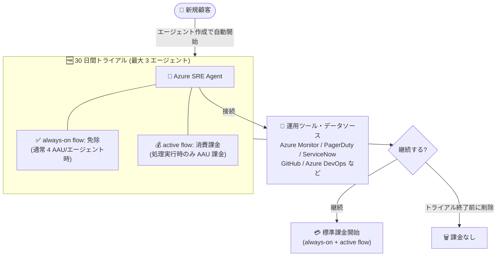

# Azure SRE Agent: 30 日間トライアルの一般提供開始

**リリース日**: 2026-08-26

**サービス**: Azure SRE Agent

**機能**: 30 日間トライアル (always-on 課金の免除)

**ステータス**: Launched (GA)

[このアップデートのインフォグラフィックを見る](https://takech9203.github.io/azure-news-summary/20260826-sre-agent-30-day-trial.html)

## 概要

Azure SRE Agent を初めて利用する顧客向けに、30 日間のトライアルが一般提供された。トライアル期間中は、エージェントを常時利用可能な状態に保つためのベースライン課金 (always-on flow: 4 AAU/エージェント時) が免除され、エージェントが実際に処理を行った分の消費課金 (active flow の Azure Agent Units: AAU) のみが発生する。

トライアル中に SRE Agent を作成し、テレメトリ (ログ・メトリック・トレース・アラート)、ソースコードリポジトリ、インシデント管理プラットフォームなどの運用ツールに接続して、機能制限なしに自分のペースで評価できる。トライアルはポータル (sre.azure.com) で最初のエージェントを作成すると自動的に開始される。

**アップデート前の課題**

- SRE Agent はエージェントを作成した時点から always-on flow (4 AAU/エージェント時) の固定課金が発生し、評価目的でもベースライン費用がかかっていた
- ツール接続やナレッジ登録などのセットアップ中もベースライン課金が続くため、じっくり評価しにくかった

**アップデート後の改善**

- 新規顧客はエージェント作成から 30 日間、always-on 課金なしで SRE Agent を評価できる (エージェントが処理を行った分の active flow 消費課金のみ)
- 1 顧客あたり最大 3 エージェントまでトライアル対象となり、各エージェントに作成日から個別の 30 日間トライアル期間が設定される
- トライアル期間中も機能制限はない

## アーキテクチャ図

トライアル中は always-on 課金が免除され、エージェントが実際に処理した分のみ課金される。31 日目に always-on 課金が自動的に開始されるため、継続しない場合はトライアル終了前にエージェントを削除する必要がある。

## サービスアップデートの詳細

### トライアル条件

| 項目 | 内容 |
|------|------|
| オファー内容 | always-on の AAU 課金なしで 30 日間利用可能 |
| 対象者 | 2026 年 8 月 25 日時点で SRE Agent を利用していない Azure 顧客 |
| エージェント数 | 1 顧客あたり 3 エージェントまで (削除済みエージェントも含む) |
| 期間 | エージェント作成から 30 日間。各エージェントに個別のトライアル期間が設定される |
| 課金対象 | エージェントが処理を実行した際の消費課金 (active flow) は発生する |
| トライアル終了後 | 作成から 30 日経過すると、トライアル終了前に削除しない限り always-on 課金が自動的に開始される |
| 機能制限 | トライアル期間中の機能制限はなし |
| 開始方法 | SRE Agent ポータル (sre.azure.com) で最初のエージェントを作成すると自動的に開始 |

- トライアルの残り時間は SRE Agent ポータルのバナーに表示され、always-on 課金が開始される 31 日目に消える
- トライアル中の active flow の AAU 消費は、ポータルの **Agent consumption** で確認できる
- 不正利用や規約違反が疑われる場合、Microsoft はトライアルアクセスを制限・停止・終了できる

### トライアルで推奨されている評価シナリオ

1. **根本原因調査**: アラート・ログ・メトリック・トレース・リソース状態・コード・直近のデプロイを横断的に分析し、推定原因と緩和策を提案
2. **アラート対応の自動化**: Azure Monitor、Datadog、Dynatrace、PagerDuty などから調査をトリガーし、チームの既存 Runbook に沿って対応
3. **プロアクティブなリスク管理**: デプロイ後のヘルスチェック、証明書期限の監視、構成ドリフト検出、コストレビュー、コンプライアンス支援
4. **結果の連携**: 調査結果・緩和策・フォローアップタスクを GitHub、ServiceNow、Jira、Azure DevOps に送信

### 同時期の関連発表 (Azure Developer Blog より)

- **VNet 統合 (GA)**: 委任サブネット経由でアウトバウンド通信をルーティングし、NSG ルール・プライベート DNS・ファイアウォールを適用可能
- **Live Reports (パブリックプレビュー)**: チャットからレポートを作成し、開くたびに最新データを取得

## デメリット・制約事項

- トライアルは「always-on 課金の免除」であり完全無料ではない。エージェントが処理を行うと active flow の AAU 消費課金が発生する
- 31 日目に標準課金 (always-on 含む) が自動開始されるため、継続しない場合はトライアル終了前のエージェント削除が必要
- トライアル対象は 2026 年 8 月 25 日時点で SRE Agent 未利用の顧客のみ (既存利用者は対象外)
- 対象エージェント数は削除済みを含めて 3 つまでのため、作成と削除を繰り返してもトライアル枠は増えない
- チャットインターフェイスは英語のみサポート
- 提供状況はリージョンとテナント構成によって異なる

## 料金

Azure SRE Agent の課金は Azure Agent Unit (AAU) 単位で行われ、以下の 2 要素で構成される。

| 課金要素 | 内容 | トライアル中の扱い |
|------|------|------|
| Always-on flow (固定) | 4 AAU/エージェント時。エージェントが存在する限り (削除まで) 発生 | **30 日間免除** |
| Active flow (変動) | エージェントが処理を実行した際の LLM トークン消費を AAU に換算して課金 | 課金対象 |

Active flow の AAU レート (100 万トークンあたり) はエージェントに設定するモデルにより異なる。

| モデル | Input | Output | Cache read | Cache write |
|------|------|------|------|------|
| Claude Opus 4.6 | 100 AAU | 500 AAU | 10 AAU | 125 AAU |
| GPT 5.3 Codex | 35 AAU | 280 AAU | 3.5 AAU | 0 AAU |
| GPT 5.2 | 35 AAU | 280 AAU | 3.5 AAU | 0 AAU |

タスク規模別の目安 (公式ドキュメントの例): 簡単な質問で約 1.3〜3.8 AAU、インシデント調査で約 11.7〜35.3 AAU、フル修復で約 30.1〜86.5 AAU (モデルによる)。

コスト管理として、ポータルの **Settings > Agent consumption** で月間の active flow AAU 上限 (最小 500、最大 1,000,000) を設定できる。AAU の単価はリージョンにより異なるため、詳細は [料金ページ](https://azure.microsoft.com/pricing/details/sre-agent/) を参照。

## 関連サービス・機能

- **Azure Monitor / Application Insights / Log Analytics**: SRE Agent が調査時に参照するテレメトリソース。アラートから調査をトリガー可能
- **PagerDuty / ServiceNow**: インシデント管理プラットフォーム連携。アラート受信とチケット作成・更新に対応
- **GitHub / Azure DevOps**: ソースコード連携によりデプロイとの相関分析が可能。調査結果を Issue や Work Item として送信
- **Datadog / Dynatrace / Grafana など**: MCP サーバー経由で 40 以上のマネージドコネクタに接続可能
- **Azure Cost Management**: 複数エージェント・リソース横断の詳細な課金分析に利用

## 参考リンク

- [インフォグラフィック](https://takech9203.github.io/azure-news-summary/20260826-sre-agent-30-day-trial.html)
- [公式アップデート情報](https://azure.microsoft.com/updates?id=569760)
- [Azure Developer Blog: Try Azure SRE Agent with no always-on charges](https://developer.microsoft.com/blog/try-azure-sre-agent-with-no-always-on-charges/)
- [Microsoft Learn: Evaluate Azure SRE Agent (トライアル条件)](https://learn.microsoft.com/azure/sre-agent/evaluate)
- [Microsoft Learn: Pricing and billing for Azure SRE Agent](https://learn.microsoft.com/azure/sre-agent/pricing-billing)
- [Microsoft Learn: Overview of Azure SRE Agent](https://learn.microsoft.com/azure/sre-agent/overview)
- [料金ページ](https://azure.microsoft.com/pricing/details/sre-agent/)
- [SRE Agent ポータル](https://sre.azure.com)

## まとめ

Azure SRE Agent の導入障壁だった always-on の固定課金が、新規顧客向けに 30 日間免除されるトライアルが GA した。機能制限なしで最大 3 エージェントを評価でき、課金はエージェントが実際に処理した分の AAU 消費のみとなる。SRE Agent の導入を検討していたチームにとって、実環境のテレメトリや Runbook を接続して MTTR 削減効果を検証する好機と言える。ただし 31 日目には always-on 課金が自動開始されるため、評価期間中に継続判断を行い、継続しない場合はトライアル終了前にエージェントを削除すること。また active flow の消費課金は発生するため、Agent consumption での AAU 上限設定を併用したコスト管理を推奨する。

---

**タグ**: Azure SRE Agent, Pricing & Offerings, Trial, AAU, AIOps, GA
