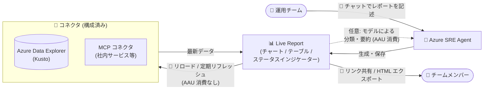

# Azure SRE Agent: Live Reports (Public Preview)

**リリース日**: 2026-08-26

**サービス**: Azure SRE Agent

**機能**: Live Reports - 会話から生成する動的な運用レポート

**ステータス**: In preview

[このアップデートのインフォグラフィックを見る](https://takech9203.github.io/azure-news-summary/20260826-sre-agent-live-reports.html)

## 概要

Azure SRE Agent の新機能「Live Reports」がパブリックプレビューとして発表された。Live Reports は、SRE Agent とのチャット会話から動的な運用ビュー (ダッシュボード) を直接作成し、接続された環境の最新データで継続的に更新し続ける機能である。

従来はダッシュボードを手動で再構築したり、複数のツールを横断して情報を収集したりする必要があったが、Live Reports では欲しいビューをチャットで記述するだけで SRE Agent が自動的にレポートを生成・保存する。ユーザーが定義した日次・週次・月次のサイクルで最新データが反映され、いつでも戻って参照できる。

インシデントの追跡、サービスヘルス、運用トレンド、繰り返し行われる調査など、定常的な運用ビューを、一貫性があり共有可能で常に最新の状態に保つことで、チームのより迅速で情報に基づいた意思決定を支援する。

**アップデート前の課題**

- 運用ダッシュボードを手動で構築・再構築する必要があり、複数のツールを横断した情報収集に手間がかかっていた
- SRE Agent との会話で得られた分析結果は会話スレッド内に留まり、再利用可能な形で保存・共有する仕組みがなかった
- 頻繁に参照する運用ビューのたびにエージェントへの問い合わせが発生し、モデル利用コスト (AAU) が繰り返し発生していた

**アップデート後の改善**

- チャットで記述するだけで、チャート・テーブル・ステータスインジケーターを含むレポートをエージェントが自動生成し、Live Reports ページに保存できるようになった
- レイアウトと構成を保持したままデータのみを更新できるため、一貫性のあるビューを常に最新の状態で参照できる
- コネクタ経由のデータ取得のみのリフレッシュはアクティブフロー AAU を消費しないため、頻繁に利用する運用ビューのモデルコストを削減できる
- リンク共有や HTML エクスポートにより、チーム内でのレポート共有が容易になった

## アーキテクチャ図



チャットでの記述から SRE Agent がレポートを生成・保存し、以降は構成済みコネクタ経由で最新データを取得して同じレイアウトで表示する。コネクタのみのリフレッシュはアクティブフロー AAU を消費しない。

## サービスアップデートの詳細

### 主要機能

1. **会話からのレポート生成**
   - Live Reports ページで「+ New report」を選択し、必要なビューをチャットで記述するとエージェントがレポートを構築・保存する
   - 時間範囲、フィルター、データソース、希望するビジュアライゼーションをプロンプトに含めることが推奨される

2. **一貫したレイアウトとリフレッシュ可能なデータ**
   - レポートのチャート・テーブル構成は保存され、開くたびに構成済みコネクタ経由で最新データを取得して表示する
   - コネクタの結果は最大 5 分間キャッシュされ、「Reload」でキャッシュをバイパスして最新データを取得できる

3. **モデル支援分析 (オプション)**
   - 取得したデータの分類、グルーピング、要約をモデルが実行できる
   - モデル支援分析を含むリフレッシュはアクティブフロー AAU を消費する

4. **バージョン管理と編集**
   - 「Open authoring thread」からチャットでレイアウト・フィルター・データソースの変更を指示し、新しいバージョンとして保存できる
   - バージョンピッカーで過去の保存バージョンを確認できる (保持されるのはレイアウトと構成であり、過去のデータではない)

5. **共有・エクスポート**
   - Azure Portal の「Copy link to report」でリンク共有が可能 (受信者には SRE Agent Standard User または SRE Agent Administrator ロールが必要)
   - 「Download HTML」でサニタイズされた静的スナップショットを保存できる (ツール呼び出しや外部リソース読み込みは不可)

6. **レポートからのアクション実行**
   - レポートにツールを呼び出すボタン (更新の投稿、ワークフローの開始など) を含めることができる
   - ツール呼び出しには構成済みのツールポリシーとコネクタ権限が適用され、承認が必要な呼び出しはその実行・引数に限って承認される

## 技術仕様

| 項目 | 詳細 |
|------|------|
| 対応データソース | エージェントに構成済みのコネクタ (Azure Data Explorer (Kusto) を含む MCP コネクタなど) |
| ビジュアライゼーション | チャート、ソート可能なテーブル、ダイアグラム、ステータスインジケーター |
| データ更新サイクル | ユーザー定義 (日次・週次・月次)、手動リロードも可能 |
| コネクタ結果のキャッシュ | 最大 5 分 (Reload でバイパス可能) |
| レポートサイズ上限 | 生成される HTML は 10 MB 以下 (超過時は保存が拒否される) |
| 必要な権限 (作成) | エージェントに対する読み取り・書き込み権限 |
| 必要な権限 (閲覧) | SRE Agent Standard User または SRE Agent Administrator ロール |
| 必要な権限 (削除) | SRE Agent Administrator ロール |

## 設定方法

### 前提条件

1. Azure SRE Agent がデプロイ済みであること
2. エージェントに対する読み取り・書き込み権限を持つこと
3. レポートで使用するデータソースのコネクタがエージェントに構成済みであること (レポート作成によってコネクタの追加や他システムへのアクセス権付与は行われない)

### Azure Portal

1. SRE Agent を開く
2. ナビゲーションから **Live Reports** を選択する
3. **+ New report** を選択する (エージェントが利用可能なツールを確認する)
4. 作成したいレポートをチャットで記述し、エージェントからの追加質問に回答する
5. レポートが使用するツールを確認し、想定するツールと動作のみを承認する
6. レポートが保存され、ギャラリーに表示されるのを待つ

**プロンプト例 (Kusto サービストレンドレポート):**

```text
Build a Live Report called "Kusto Service Trends" from my Azure Data Explorer
connector. Cover the last 24 hours and show request volume, error rate, and
p50/p95/p99 latency by service. Include a time-range selector, trend charts,
and a sortable table of operations with the highest error counts.
```

## メリット

### ビジネス面

- 常に最新のデータに基づく一貫したビューにより、チームの迅速で情報に基づいた意思決定を支援する
- ダッシュボードの手動構築・再構築や複数ツール横断の情報収集にかかる工数を削減できる
- リンク共有や HTML エクスポートにより、チーム内での運用状況の共有が容易になる

### 技術面

- コネクタ経由のデータ取得のみのリフレッシュはアクティブフロー AAU を消費せず、頻繁に参照する運用ビューのモデルコストを削減できる
- レイアウトと構成が保存されるため、リフレッシュしてもビューの一貫性が保たれる
- ツールポリシーとコネクタ権限がレポートからのアクション実行にもそのまま適用され、ガバナンスを維持できる
- バージョン管理により、レポート構成の変更履歴を確認できる

## デメリット・制約事項

- **クロステナント承認**: 別テナントからエージェントにアクセスする場合、SRE Agent Administrator ロールがテナントをまたいで利用できないため、レポートのツール呼び出しを承認できない。テナント間で共有するレポートでは承認が必要なツールを避けるべきである
- **レポートサイズ**: 生成されるレポート HTML は 10 MB 以下である必要があり、超過するとサービスが保存を拒否する
- **モデルレート制限**: モデルがレート制限された場合、該当セクションは HTTP 429 を返す (後で再試行が必要)
- **AAU 予算管理**: プレビュー期間中は、モデル支援セクションに対するレポート単位・ユーザー単位のアクティブフロー AAU 予算設定が提供されない。モデルを繰り返し・自動的にループ実行するレポートは避けるべきである
- 過去バージョンにはレイアウトと構成のみが保存され、過去時点のデータは保持されない

## ユースケース

### ユースケース 1: サービストレンドの定常監視ビュー

**シナリオ**: Azure Data Explorer (Kusto) に蓄積されたテレメトリから、サービスごとのリクエスト量・エラー率・レイテンシを日常的に確認したい。

**実装例**:

1. Kusto コネクタをエージェントに構成済みであることを確認する
2. Live Reports で「過去 24 時間のリクエスト量、エラー率、p50/p95/p99 レイテンシをサービス別に表示し、エラー数上位のオペレーションをソート可能なテーブルで含める」と記述してレポートを作成する
3. 以降は Live Reports ページからレポートを開き、Reload で最新データを取得する

**効果**: 同じ分析をチャットで毎回依頼する場合と異なり、コネクタ経由のデータ取得のみのリフレッシュはアクティブフロー AAU を消費しないため、コストを抑えながら常に最新のトレンドを確認できる。

### ユースケース 2: デプロイメントヘルスの共有ダッシュボード

**シナリオ**: 直近 24 時間のデプロイ状況 (件数、成功率、サービス・環境別の失敗) をチーム全体で共有したい。

**実装例**:

1. Live Reports で「デプロイ件数、成功率、サービス・環境別の失敗デプロイ、日次トレンドを表示し、各デプロイへのリンク付きテーブルを含める」と記述してレポートを作成する
2. 「Copy link to report」でチームメンバーにリンクを共有する (メンバーには SRE Agent Standard User 以上のロールが必要)

**効果**: デプロイ状況の確認が単一の常に最新のビューに集約され、複数ツールを横断した状況確認が不要になる。共有ダッシュボードは読み取り専用ツールから始めることが推奨される。

## 料金

Azure SRE Agent の利用は **Azure Agent Units (AAU)** で計測される。固定の常時稼働 (always-on) コスト (エージェントあたり 4 AAU/時) と、変動のアクティブフローコスト (処理内容に応じたトークン消費ベース) の組み合わせで課金される。

Live Reports に関する AAU 消費は以下のとおり:

| 操作 | アクティブフロー AAU 消費 |
|------|------|
| レポートの作成・更新 | 消費する |
| コネクタ経由のデータ取得のみのリフレッシュ | 消費しない |
| リフレッシュ時のモデルによる要約・分析 | 消費する |

レポートの作成・更新で消費した AAU は **Settings > Agent consumption** で確認できる。最新のレートは [Pricing and billing](https://learn.microsoft.com/en-us/azure/sre-agent/pricing-billing) および [料金ページ](https://azure.microsoft.com/pricing/details/sre-agent/) を参照。

## 利用可能リージョン

Live Reports 固有のリージョン制限は確認されていない。Azure SRE Agent 自体は以下のリージョンで利用可能である (2026 年 8 月時点):

Australia East、Canada Central、Central US、East Asia、East US 2、France Central、Italy North、Japan East、Korea Central、North Central US、South Africa North、Southeast Asia、Spain Central、Sweden Central、UK South、West Central US、West US 2、West US 3

最新情報は [Supported regions](https://learn.microsoft.com/en-us/azure/sre-agent/supported-regions) を参照。

## 関連サービス・機能

- **Azure SRE Agent**: Live Reports の基盤となる AI 運用エージェント。2026 年 3 月に GA 済み (詳細は [2026-03-11 のレポート](2026-03-11-azure-sre-agent-ga.md) を参照)
- **Azure Data Explorer (Kusto)**: Kusto コネクタを通じてレポートのデータソースとして利用できる代表的なサービス
- **MCP コネクタ**: Model Context Protocol を通じて社内サービスなどの外部データソースをレポートに取り込める
- **Log Analytics / Application Insights**: SRE Agent のコネクタとして接続可能な監視データ基盤
- **Azure Monitor**: SRE Agent と統合された監視基盤であり、インシデント追跡などのレポートシナリオと関連する

## 参考リンク

- [インフォグラフィック](https://takech9203.github.io/azure-news-summary/20260826-sre-agent-live-reports.html)
- [公式アップデート情報](https://azure.microsoft.com/updates?id=569690)
- [Live Reports ドキュメント (Microsoft Learn)](https://learn.microsoft.com/en-us/azure/sre-agent/live-reports)
- [Azure SRE Agent 概要](https://learn.microsoft.com/en-us/azure/sre-agent/overview)
- [Pricing and billing (Microsoft Learn)](https://learn.microsoft.com/en-us/azure/sre-agent/pricing-billing)
- [Supported regions (Microsoft Learn)](https://learn.microsoft.com/en-us/azure/sre-agent/supported-regions)

## まとめ

Live Reports は、Azure SRE Agent との会話を「使い捨ての分析」から「再利用可能な運用資産」に変える機能である。チャットで記述するだけで一貫性のあるダッシュボードが生成され、コネクタ経由のリフレッシュであれば AAU を消費せずに最新データを参照できる点は、コスト面でも実用的である。デプロイヘルスやサービストレンドなど、繰り返し参照する運用ビューを持つチームは、まず読み取り専用のレポートから試すことを推奨する。プレビュー期間中はレポート単位の AAU 予算管理がないため、モデル支援分析を含むレポートの自動実行には注意が必要である。

---

**タグ**: #Azure #SREAgent #LiveReports #PublicPreview #AI #Dashboard #Operations #Kusto #MCP #AAU
