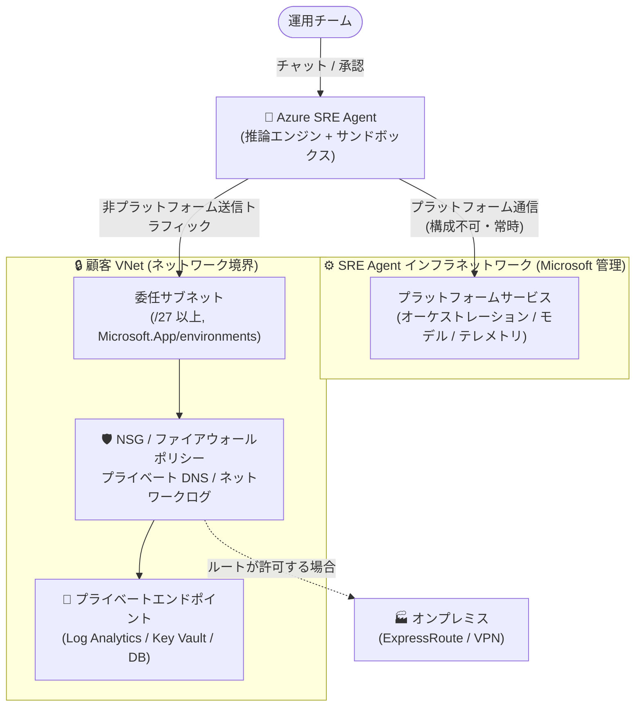

# Azure SRE Agent: VNet 統合が一般提供開始 (GA)

**リリース日**: 2026-08-26

**サービス**: Azure SRE Agent

**機能**: VNet Integration (仮想ネットワーク統合)

**ステータス**: Launched (GA)

[このアップデートのインフォグラフィックを見る](https://takech9203.github.io/azure-news-summary/20260826-sre-agent-vnet-integration.html)

## 概要

Azure SRE Agent の VNet 統合が一般提供 (GA) となった。VNet 統合により、SRE Agent は既存のネットワーク制御 — Network Security Group (NSG)、プライベート DNS、ファイアウォールポリシーなど — の内側で動作できるようになる。エージェントの非プラットフォーム系送信トラフィックは、顧客の仮想ネットワーク内の委任サブネットを経由してルーティングされ、他のワークロードと同じ NSG ルール、ファイアウォールポリシー、カスタム DNS、ネットワークログの対象となる。

これにより、パブリックアクセスを無効化した Log Analytics ワークスペースや Key Vault など、プライベートエンドポイントの背後にあるリソースに対しても、ネットワーク境界を変更することなくインシデント調査や緩和策の実行が可能になる。ExpressRoute や VPN で接続されたオンプレミスシステムにも、ネットワークのルートとルールが許可する範囲でアクセスできる。

SRE Agent には 3 つのネットワーク制御モード (Unrestricted / Limited / Azure VNet) が用意されており、セキュリティ要件に応じて選択できる。セキュリティ・コンプライアンス要件の厳しいエンタープライズ環境の本番デプロイには Azure VNet モードが推奨される。

**アップデート前の課題**

- SRE Agent の送信トラフィックはパブリックインターネット経由で流れており、企業のネットワーク制御 (NSG、ファイアウォール、カスタム DNS) を適用できなかった
- パブリックアクセスを無効化しプライベートエンドポイントの背後に配置したリソース (Log Analytics、Key Vault、データベースなど) にエージェントが到達できず、セキュリティ要件の厳しい環境で採用しにくかった
- エージェントの送信ネットワークアクティビティを自社のネットワークログで監査できなかった

**アップデート後の改善**

- 非プラットフォーム系の送信トラフィックが顧客 VNet 内の委任サブネットを経由し、NSG ルール・ファイアウォールポリシー・プライベート DNS・ネットワークログがすべて適用される
- プライベートエンドポイント背後のリソース、内部サービス、ExpressRoute/VPN 経由のオンプレミスシステムにアクセスできる
- ネットワーク境界の変更なしに、既存のネットワーク・セキュリティ・コンプライアンス制御を維持したまま SRE Agent を導入できる
- Azure Policy でインフラネットワークバイパスのトグルを制限・無効化でき、トラフィックが VNet の外に出ないことを組織として担保できる

## アーキテクチャ図

Azure VNet モードでは、エージェントの非プラットフォーム系送信トラフィックが顧客 VNet 内の委任サブネットを経由し、NSG・ファイアウォール・プライベート DNS の制御下でプライベートエンドポイント背後のリソースやオンプレミスに到達する。プラットフォームサービスへの通信のみ Microsoft 管理のインフラネットワークを経由する。

## サービスアップデートの詳細

### 主要機能

1. **3 つのネットワーク制御モード**
   - **Unrestricted**: ネットワーク制限なし。エージェントは任意のインターネットエンドポイントに到達可能 (デフォルト)。開発・テスト・非機密ワークロード向け
   - **Limited**: ワイルドカードベースの URL 許可リストで到達可能なエンドポイントを制御。VNet ルーティングなしでホストレベルの制御が必要な場合向け
   - **Azure VNet**: 非プラットフォーム系送信トラフィックをすべて顧客 VNet 経由でルーティングし、独自の DNS・ファイアウォールルールを適用。本番エンタープライズデプロイに推奨

2. **既存ネットワーク制御の適用**
   - 委任サブネット上の他のワークロードと同様に、NSG ルール、ファイアウォールポリシー、カスタム DNS、ネットワークログがエージェントに適用される
   - エージェントはサブネットが到達できる範囲にのみ到達でき、それ以上のアクセスはできない

3. **プライベートリソースへのアクセス**
   - プライベートエンドポイント背後のリソース (AMPLS 経由の Log Analytics ワークスペースなど)、内部サービス、ExpressRoute/VPN 接続のオンプレミスシステムにアクセス可能
   - VNet 接続時に「Use VNet's private DNS」オプションが自動で有効化され、プライベートエンドポイントのホスト名解決が可能

4. **インフラネットワークバイパスのトグル制御**
   - パッケージレジストリ (PyPI、npm、NuGet、Ubuntu apt)、コードリポジトリ (GitHub、GitHub Enterprise、Azure DevOps)、リモート MCP サーバー、追加ホストの各カテゴリを、Microsoft 管理のインフラネットワーク経由にするか VNet 経由にするかを個別に選択できる
   - トグルをオフにした場合、VNet 側で FQDN ベースのファイアウォールルール (Azure Firewall Premium など) を用意すれば VNet 経由で到達可能
   - Azure Policy でトグルを制限・無効化でき、運用者がトラフィックを VNet 外にルーティングすることを防止できる

5. **ネットワーク監査 (Network audit)**
   - **Settings > Workspace configuration > Inspect** で、エージェントからの送信リクエストの許可/拒否をホスト・メソッド・パス・判定とともに確認できる
   - Limited / Azure VNet ポリシーによってブロックされた宛先の特定に利用できる

### ネットワークがアクセスをブロックした場合の動作

NSG ルールで拒否された、またはルートが存在しない送信リクエストは、同じサブネット上の他のワークロードと同様のネットワークエラーとなる。エージェントは調査アウトプットに失敗を報告し (例: 「Log Analytics ワークスペースに到達できませんでした: 接続タイムアウト」)、到達可能なツールとデータで調査を継続する。重要なデータソースに到達できない場合は、調査が不完全である旨を報告する。

## 技術仕様

| 項目 | 詳細 |
|------|------|
| ネットワーク制御モード | Unrestricted (デフォルト) / Limited / Azure VNet |
| サブネットサイズ | /27 以上 |
| サブネット委任 | `Microsoft.App/environments` への委任が必須 |
| サブネットのリージョン | SRE Agent リソースと同一リージョン |
| サブネットの共有 | 不可 (専用サブネットが必要) |
| 通信方向 | 送信 (Egress) のみ。プライベートネットワークからエージェントへの受信 (プライベートエンドポイント) は非サポート |
| プラットフォームサービス通信 | オーケストレーション / モデルエンドポイント / テレメトリは常に Microsoft 管理インフラ経由 (構成不可) |
| コネクタトラフィック | パブリックインターネット経由 (VNet 経由にはならない) |
| プライベート DNS | VNet 接続時に「Use VNet's private DNS」が自動有効化。Private DNS ゾーン (例: `privatelink.ods.opinsights.azure.com`) の VNet リンクが必要 |
| ガバナンス | バイパストグルの操作は SRE Agent Administrator ロールにスコープ。Azure Policy による制限が可能 |

## 設定方法

### 前提条件

1. **Running** 状態の SRE Agent
2. /27 以上のサブネットを持つ Azure Virtual Network (サブネットは `Microsoft.App/environments` に委任済みであること)
3. 対象サブネットに対する **Network Contributor** ロール (または `Microsoft.Network/virtualNetworks/subnets/join/action` を含む同等の権限)
4. エージェントリソースに対する **SRE Agent Administrator** ロール

### Azure Portal

1. Azure Portal でエージェントを開き、**Settings** > **Workspace configuration** を選択する
2. **Networking** タブを選択し、Egress モードとして **Azure VNet** を選択する
3. **Browse subnets...** を選択し、**サブスクリプション**、**リソースグループ**、**仮想ネットワーク**、**サブネット** を選択して **Connect** を選択する (「Use VNet's private DNS」オプションが自動で有効化される)
4. **On the infra network** セクションで、インフラネットワーク経由にする公共サービスカテゴリ (MCP サーバー、パッケージレジストリ、コードリポジトリ、追加ホスト) のトグルを設定する
5. **Save** を選択する。Azure VNet カードに **Connected** バッジが表示される
6. プライベートエンドポイント背後のリソース (パブリックアクセス無効の Log Analytics ワークスペースなど) への問い合わせをエージェントに依頼し、VNet ルーティングが機能していることを確認する

補足:

- プライベートエンドポイント解決には、対象の Azure Private DNS ゾーン (例: Log Analytics は `privatelink.ods.opinsights.azure.com`、Key Vault は `privatelink.vaultcore.azure.net`) を VNet にリンクしておく必要がある。DNS が未構成の場合、エージェントはパブリックエンドポイントにフォールバックするか、接続に失敗する可能性がある
- VNet 接続中は Unrestricted / Limited モードのカードが無効化される。Egress モードを切り替えるには、先に VNet を切断する必要がある
- サブネットを変更するには、VNet をいったん切断して再接続する

## メリット

### ビジネス面

- セキュリティ・コンプライアンス要件の厳しい環境 (機密データ・規制対象データを扱うワークロード) でも SRE Agent を導入でき、AI 運用自動化の適用範囲が広がる
- ネットワーク境界を変更せずに既存のセキュリティ統制を維持できるため、セキュリティ審査・承認プロセスの負担を軽減できる
- 送信ネットワークアクティビティの監査証跡を自社のネットワークログで確保でき、コンプライアンス対応が容易になる

### 技術面

- プライベートエンドポイント背後のリソース (AMPLS 配下の Log Analytics、Key Vault、データベースなど) をエージェントが直接調査・操作できる
- ExpressRoute / VPN 経由でオンプレミスシステムにも到達でき、ハイブリッド環境の運用を統合できる
- NSG・Azure Firewall・プライベート DNS など既存のネットワークスキルと資産をそのまま適用できる
- Azure Policy とロールベースの制御により、ネットワーク経路のガバナンスを組織として強制できる
- 実行中のエージェントでモードを切り替えられ、設定はモード変更後も保持される

## デメリット・制約事項

- **送信 (Egress) のみ**: VNet 統合が制御するのは送信トラフィックのみで、プライベートネットワーク内からエージェントへの受信接続 (プライベートエンドポイント経由のインバウンド) はサポートされない
- **コネクタトラフィックは VNet を経由しない**: コネクタの通信はパブリックインターネット経由となる
- **プラットフォームサービス通信は構成不可**: オーケストレーション、モデルエンドポイント、テレメトリは常に Microsoft 管理のインフラネットワークを経由する
- **専用サブネットが必要**: /27 以上のサブネットを他のサービスと共有せずに割り当て、`Microsoft.App/environments` に委任する必要がある
- **パブリックサービス依存機能の考慮**: パッケージインストール、コードリポジトリアクセス、リモート MCP サーバーなどはパブリックサービスへの到達が必要であり、バイパストグルをオフにする場合は FQDN ベースのファイアウォールルール (Azure Firewall Premium など) を VNet 側に用意しないと該当機能が利用不可になる
- **ネットワーク監査は完全な監査証跡ではない**: Network audit はエージェントの egress ポリシー判定のみを対象とし、ランタイム・コネクタ・プラットフォーム・ファイアウォール・DNS・プロキシのすべてのイベントを含むわけではない

## ユースケース

### ユースケース 1: パブリックアクセス無効の Log Analytics ワークスペースの調査

**シナリオ**: セキュリティポリシーにより、Log Analytics ワークスペースを AMPLS (Azure Monitor Private Link Scope) 配下に置きパブリックアクセスを無効化している環境で、SRE Agent によるインシデント調査を行いたい。

**実装例**:

1. `Microsoft.App/environments` に委任した /27 以上の専用サブネットを VNet に作成
2. `privatelink.ods.opinsights.azure.com` などの Private DNS ゾーンを VNet にリンク
3. エージェントの **Workspace configuration > Networking** で **Azure VNet** モードを選択し、サブネットを接続
4. エージェントにパブリックアクセス無効のワークスペースへのクエリを依頼し、到達性を検証

**効果**: ネットワーク境界を緩めることなく、プライベート化された監視データに対する AI 主導のインシデント調査が可能になる。

### ユースケース 2: エンタープライズガバナンス下でのエージェント egress 統制

**シナリオ**: 規制業種の企業で、運用エージェントの送信トラフィックをすべて自社ファイアウォール経由にし、例外経路を組織的に禁止したい。

**実装例**:

1. Azure VNet モードでエージェントを構成し、送信トラフィックを Azure Firewall Premium 経由にルーティング
2. GitHub や PyPI など必要なパブリックサービスは FQDN ルールで許可し、インフラネットワークバイパスのトグルはオフに設定
3. Azure Policy でバイパストグルを制限し、運用者が VNet 外への経路を有効化できないよう強制
4. **Network audit** で許可/拒否された送信リクエストを定期レビュー

**効果**: エージェントのすべての非プラットフォームトラフィックが自社のホスト名ベース egress フィルタリングと監査の対象となり、コンプライアンス要件を満たしながら運用自動化を実現できる。

## 料金

VNet 統合自体の追加料金に関する記載は、現時点の公式ドキュメントでは確認できなかった。

Azure SRE Agent 本体の利用料金は Azure Agent Unit (AAU) で計測され、エージェント存続中の固定料金 (Always-on flow: 4 AAU/エージェント時間) と、処理量に応じた変動料金 (Active flow: 使用モデルとトークン量に応じた AAU) の合計で課金される。詳細は料金ページを参照。

- [Azure SRE Agent 料金ページ](https://azure.microsoft.com/pricing/details/sre-agent/)
- [Pricing and billing for Azure SRE Agent](https://learn.microsoft.com/en-us/azure/sre-agent/pricing-billing)

## 利用可能リージョン

VNet 統合では、サブネットが SRE Agent リソースと同一リージョンにある必要がある。SRE Agent の利用可能リージョンは公式ドキュメントを参照。

- [Supported regions](https://learn.microsoft.com/en-us/azure/sre-agent/supported-regions)

## 関連サービス・機能

- **Azure Virtual Network (VNet)**: エージェントの送信トラフィックをルーティングする委任サブネットをホストするネットワーク基盤
- **Network Security Group (NSG)**: 委任サブネット上のエージェントトラフィックに適用されるレイヤー 4 のアクセス制御
- **Azure Firewall (Premium)**: FQDN ベースのルールにより、GitHub や PyPI などパブリックサービスへのエージェントトラフィックを VNet 経由で許可するホスト名認識型 egress フィルタリング
- **Azure Private DNS / Private Link**: プライベートエンドポイントのホスト名解決に必要な Private DNS ゾーン (VNet へのリンクが必要)
- **Azure Monitor Private Link Scope (AMPLS)**: プライベート化された Log Analytics / Application Insights へのエージェントアクセスを実現する構成
- **Azure Policy**: インフラネットワークバイパストグルの制限・無効化により、組織的なネットワークガバナンスを強制
- **Azure ExpressRoute / VPN Gateway**: オンプレミスシステムへのエージェント到達を可能にするハイブリッド接続

## 参考リンク

- [インフォグラフィック](https://takech9203.github.io/azure-news-summary/20260826-sre-agent-vnet-integration.html)
- [公式アップデート情報](https://azure.microsoft.com/updates?id=569695)
- [Azure SRE Agent VNet integration is now generally available (Tech Community Blog)](https://techcommunity.microsoft.com/blog/appsonazureblog/azure-sre-agent-vnet-integration-is-now-generally-available/4549774)
- [Azure SRE Agent Network Integration (Microsoft Learn)](https://learn.microsoft.com/en-us/azure/sre-agent/network-integration)
- [Configure Network Controls for Azure SRE Agent (Microsoft Learn)](https://learn.microsoft.com/en-us/azure/sre-agent/configure-network-controls)
- [Security overview for Azure SRE Agent (Microsoft Learn)](https://learn.microsoft.com/en-us/azure/sre-agent/security-overview)
- [料金ページ](https://azure.microsoft.com/pricing/details/sre-agent/)

## まとめ

Azure SRE Agent の VNet 統合 GA は、AI 運用エージェントをエンタープライズのセキュリティ統制の内側に取り込むための重要なマイルストーンである。送信トラフィックが顧客 VNet の委任サブネットを経由することで、NSG・ファイアウォール・プライベート DNS・ネットワークログといった既存の制御がそのまま適用され、プライベートエンドポイント背後のリソースやオンプレミスシステムへの調査・緩和が可能になる。これまでネットワーク要件を理由に SRE Agent の導入を見送っていた組織は、まず開発環境で Azure VNet モードの動作 (特に Private DNS ゾーンのリンクと FQDN ベースの egress フィルタリング) を検証し、本番導入時には Azure Policy によるバイパストグルの統制を組み合わせることを推奨する。ただし、VNet 統合は送信のみを制御し、コネクタトラフィックは VNet を経由しない点には留意が必要である。

---

**タグ**: #Azure #SREAgent #VNetIntegration #GA #Networking #Security #NSG #PrivateDNS #AzureFirewall #PrivateEndpoint #AI #Operations
