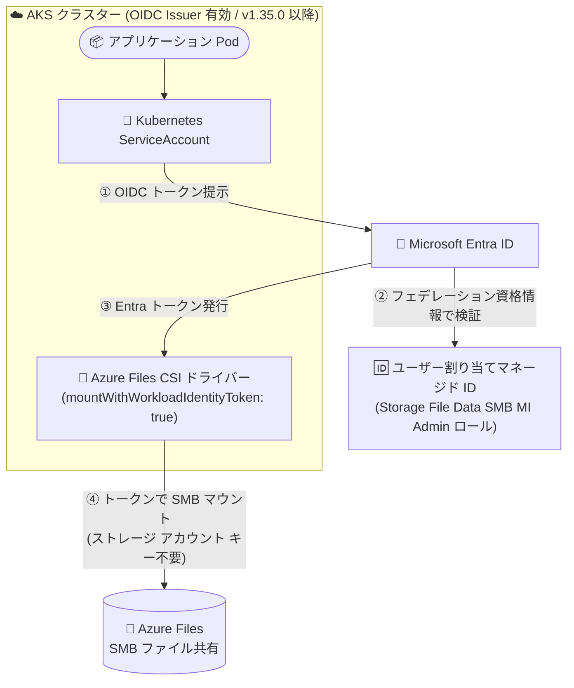

# Azure Kubernetes Service (AKS): Azure Files CSI ドライバー (SMB) の Workload Identity サポートが一般提供 (GA)

**リリース日**: 2026-08-28

**サービス**: Azure Kubernetes Service (AKS) / Azure Files

**機能**: Azure Files CSI ドライバー (SMB) の Workload Identity サポート

**ステータス**: Launched (GA)

[このアップデートのインフォグラフィックを見る](https://takech9203.github.io/azure-news-summary/20260828-aks-azure-files-csi-workload-identity.html)

## 概要

Azure Kubernetes Service (AKS) の Azure Files Container Storage Interface (CSI) ドライバーが、SMB ファイル共有への Pod レベル認証として Workload Identity をサポートし、一般提供 (GA) になりました。

これまでも AKS のマネージド ID サポートにより、ストレージ アカウント キーを使わずに Azure Files をマウントすることは可能でしたが、その場合の認証はノード レベル (kubelet identity) の権限に依存していました。今回の Workload Identity サポートにより、アプリケーション Pod ごとに最小権限のアクセスを構成できるようになり、Pod がアクセスできるデータを「その Pod が必要とするデータのみ」に厳密にスコープできます。厳格なコンプライアンス要件下で運用される規制業界にとって、粒度の細かいセキュリティ制御を実現する機能です。

この機能は、Azure Files と AKS をサポートするすべての Azure リージョンで利用可能です。

**アップデート前の課題**

- ストレージ アカウント キーを使わない認証はノード レベルのマネージド ID (kubelet identity) に依存しており、同一ノード上のワークロードに対してアクセス権限を Pod 単位で分離できなかった
- アクセス権限がノードのライフサイクルに紐付いており、アプリケーション単位の最小権限アクセスを実現しにくかった

**アップデート後の改善**

- Microsoft Entra Workload ID を利用した Pod レベルの認証で、Azure Files (SMB) をストレージ アカウント キーなしでマウント可能になった
- ServiceAccount とフェデレーション資格情報の組み合わせにより、Pod のアクセス範囲を必要なデータのみに限定する最小権限アクセスを構成できるようになった
- 規制業界などの厳格なコンプライアンス要件に対応する、粒度の細かいセキュリティ制御が可能になった

## アーキテクチャ図



Pod に紐付く ServiceAccount の OIDC トークンを Microsoft Entra ID がフェデレーション資格情報で検証し、マネージド ID のトークンを発行します。CSI ドライバーはこのトークンを使って SMB 共有をマウントするため、ストレージ アカウント キーやノード レベルの ID に依存しません。

## サービスアップデートの詳細

### 主要機能

1. **Pod レベルの最小権限アクセス**
   - Microsoft Entra Workload ID により、ノード単位ではなく Pod (ServiceAccount) 単位で Azure Files へのアクセス権限を付与
   - フェデレーション資格情報で Kubernetes ServiceAccount とユーザー割り当てマネージド ID を紐付け

2. **動的プロビジョニング (Dynamic PV) での利用**
   - StorageClass のパラメーターに `mountWithWorkloadIdentityToken: "true"` を指定
   - `clientID` でマネージド ID のクライアント ID を指定可能 (省略時は kubelet identity を使用)
   - CSI ドライバーのコントロール プレーン ID には対象ストレージ アカウントに対する `Storage Account Contributor` ロールが必要 (既定では AKS コントロール プレーン ID にノード リソース グループへの同ロールが割り当て済み)

3. **静的プロビジョニング (Static PV) での利用**
   - ストレージ アカウントで SMB OAuth を有効化 (`--enable-smb-oauth true`) した上で、PV の `volumeAttributes` に `mountWithWorkloadIdentityToken: "true"` を指定

4. **キーレス認証のためのロール**
   - マネージド ID に `Storage File Data SMB MI Admin` ロールを付与することで、ストレージ アカウント キーに依存せず Workload Identity トークンのみで Azure Files をマウント可能

## 技術仕様

| 項目 | 詳細 |
|------|------|
| 対象サービス | Azure Kubernetes Service (AKS)、Azure Files |
| プロトコル | SMB |
| 必要な AKS バージョン | 1.35.0 以降 |
| 対象ノード OS | Linux ノード |
| 認証方式 | Microsoft Entra Workload ID (OIDC フェデレーション) |
| 必要な RBAC ロール (マウント用 ID) | Storage File Data SMB MI Admin |
| 必要な RBAC ロール (動的プロビジョニング) | Storage Account Contributor (CSI ドライバー コントロール プレーン ID に対して) |
| 静的 PV の追加要件 | ストレージ アカウントで SMB OAuth の有効化 |
| 主要パラメーター | `mountWithWorkloadIdentityToken: "true"`、`clientID` (省略可、既定は kubelet identity) |

## 設定方法

### 前提条件

1. OIDC Issuer を有効化した AKS クラスター (`--enable-oidc-issuer`)、バージョン 1.35.0 以降
2. Azure ストレージ アカウントとファイル共有 (新規作成または既存)
3. ユーザー割り当てマネージド ID (新規作成または既存の再利用)
4. マネージド ID への `Storage File Data SMB MI Admin` ロールの付与
5. Kubernetes ServiceAccount とフェデレーション資格情報の作成

### Azure CLI

```bash
# 1. ユーザー割り当てマネージド ID を作成
az identity create --name $UAMI --resource-group $RESOURCE_GROUP
export USER_ASSIGNED_CLIENT_ID="$(az identity show -g $RESOURCE_GROUP --name $UAMI --query 'clientId' -o tsv)"

# 2. ストレージ アカウントに対して Storage File Data SMB MI Admin ロールを付与
export ACCOUNT_SCOPE=$(az storage account show --name $ACCOUNT --query id -o tsv)
az role assignment create \
  --role "Storage File Data SMB MI Admin" \
  --assignee $USER_ASSIGNED_CLIENT_ID \
  --scope $ACCOUNT_SCOPE

# 3. フェデレーション資格情報を作成 (ServiceAccount とマネージド ID を紐付け)
export AKS_OIDC_ISSUER="$(az aks show --resource-group $RESOURCE_GROUP --name $CLUSTER_NAME --query "oidcIssuerProfile.issuerUrl" -o tsv)"
az identity federated-credential create --name $FEDERATED_IDENTITY_NAME \
  --identity-name $UAMI \
  --resource-group $RESOURCE_GROUP \
  --issuer $AKS_OIDC_ISSUER \
  --subject system:serviceaccount:${SERVICE_ACCOUNT_NAMESPACE}:${SERVICE_ACCOUNT_NAME}

# 4. (静的 PV の場合) ストレージ アカウントで SMB OAuth を有効化
az storage account update --name $ACCOUNT --resource-group $STORAGE_RESOURCE_GROUP --enable-smb-oauth true
```

**動的プロビジョニング用 StorageClass の例:**

```yaml
apiVersion: storage.k8s.io/v1
kind: StorageClass
metadata:
  name: azurefile-csi-wi
provisioner: file.csi.azure.com
parameters:
  storageAccount: EXISTING_STORAGE_ACCOUNT_NAME # 省略時は新規アカウントを作成
  mountWithWorkloadIdentityToken: "true"
  clientID: "<managed-identity-client-id>"      # 省略時は kubelet identity を使用
reclaimPolicy: Delete
volumeBindingMode: Immediate
allowVolumeExpansion: true
mountOptions:
  - dir_mode=0777
  - file_mode=0777
  - mfsymlinks
  - cache=strict
  - nosharesock
  - actimeo=30
  - nobrl
```

**静的プロビジョニング用 PV の例 (抜粋):**

```yaml
apiVersion: v1
kind: PersistentVolume
metadata:
  name: pv-azurefile
spec:
  capacity:
    storage: 100Gi
  accessModes:
    - ReadWriteMany
  storageClassName: azurefile-csi
  csi:
    driver: file.csi.azure.com
    volumeHandle: "{resource-group-name}#{account-name}#{file-share-name}"
    volumeAttributes:
      storageAccount: EXISTING_STORAGE_ACCOUNT_NAME
      shareName: EXISTING_FILE_SHARE_NAME
      mountWithWorkloadIdentityToken: "true"
      clientID: "<managed-identity-client-id>"
```

## メリット

### ビジネス面

- 規制業界 (金融、医療など) の厳格なコンプライアンス要件に対応できる粒度の細かいアクセス制御を実現
- ストレージ アカウント キーの管理・ローテーション運用から脱却でき、キー漏えいリスクを低減

### 技術面

- アプリケーション ID がノードのライフサイクルに紐付かず、Pod (ServiceAccount) 単位で最小権限アクセスを構成可能
- 動的・静的の両方のプロビジョニング方式に対応し、既存の PV/PVC 運用に組み込みやすい
- ノード レベルの ID を共有する構成と異なり、同一ノード上の別ワークロードへの権限波及を防止

## デメリット・制約事項

- AKS バージョン 1.35.0 以降が必要
- Linux ノードのみ対応
- 対象プロトコルは SMB (今回の GA は SMB ファイル共有への認証が対象)
- 静的 PV で利用する場合、ストレージ アカウントで SMB OAuth の有効化が必要
- OIDC Issuer の有効化、フェデレーション資格情報の作成など、事前セットアップの手順が従来のキー ベース認証より多い

## ユースケース

### ユースケース 1: マルチテナント クラスターでのデータ分離

**シナリオ**: 複数チームのアプリケーションが同居する AKS クラスターで、チームごとに異なる Azure Files 共有を利用し、他チームのデータへのアクセスを禁止したい。

**実装例**: チームごとに ServiceAccount とユーザー割り当てマネージド ID を用意し、それぞれのストレージ アカウント (または共有) スコープにのみ `Storage File Data SMB MI Admin` ロールを付与。StorageClass / PV の `clientID` に各チームのマネージド ID を指定する。

**効果**: ノード レベルの ID を共有する構成と異なり、Pod 単位でアクセス可能なファイル共有を厳密に分離できる。

### ユースケース 2: ストレージ アカウント キー廃止によるセキュリティ強化

**シナリオ**: セキュリティ ポリシーによりストレージ アカウント キーの利用が禁止されており、Kubernetes Secret にキーを保存せずに Azure Files をマウントしたい。

**実装例**: 前提条件のセットアップ後、`mountWithWorkloadIdentityToken: "true"` を指定した StorageClass でステートフル ワークロードをデプロイする。

**効果**: キーの保管・ローテーションが不要になり、Microsoft Entra ID ベースのトークン認証に一本化できる。

## 料金

このアップデートに関する追加料金の情報はアナウンスに記載されていません。Azure Files および AKS の料金の詳細は以下の料金ページを参照してください。

- [Azure Files の料金](https://azure.microsoft.com/pricing/details/storage/files/)
- [Azure Kubernetes Service (AKS) の料金](https://azure.microsoft.com/pricing/details/kubernetes-service/)

## 利用可能リージョン

Azure Files と AKS をサポートするすべての Azure リージョンで利用可能です。

## 関連サービス・機能

- **Microsoft Entra Workload ID**: 本機能の基盤となる認証の仕組み。Kubernetes ServiceAccount の OIDC トークンとマネージド ID をフェデレーション資格情報で紐付ける
- **Azure Files**: マウント対象の SMB ファイル共有を提供するマネージド ファイル ストレージ サービス
- **Azure RBAC**: `Storage File Data SMB MI Admin` ロールなどにより、ID ベースのアクセス制御を実現
- **AKS OIDC Issuer**: Workload Identity の前提となる、クラスターの OIDC トークン発行機能

## 参考リンク

- [インフォグラフィック](https://takech9203.github.io/azure-news-summary/20260828-aks-azure-files-csi-workload-identity.html)
- [公式アップデート情報](https://azure.microsoft.com/updates?id=570120)
- [Create and manage persistent volumes with Azure Files in AKS - Use workload identity (Microsoft Learn)](https://learn.microsoft.com/azure/aks/create-volume-azure-files#use-workload-identity-to-access-azure-files-storage)
- [Workload identities - Microsoft Entra Workload ID (Microsoft Learn)](https://learn.microsoft.com/entra/workload-id/workload-identities-overview)
- [Azure Files の料金](https://azure.microsoft.com/pricing/details/storage/files/)

## まとめ

AKS の Azure Files CSI ドライバー (SMB) が Workload Identity に対応したことで、ストレージ アカウント キーにもノード レベルのマネージド ID にも依存しない、Pod 単位の最小権限アクセスが GA として利用可能になりました。規制業界などコンプライアンス要件の厳しい環境で AKS + Azure Files を利用している場合は特に有用です。AKS 1.35.0 以降の Linux ノードが前提となるため、まずクラスターのバージョンと OIDC Issuer の有効化状況を確認した上で、`Storage File Data SMB MI Admin` ロールとフェデレーション資格情報を用いた構成への移行を検討することを推奨します。

---

**タグ**: Azure Kubernetes Service, Azure Files, CSI Driver, Workload Identity, Microsoft Entra ID, SMB, Security, Storage, Containers, GA
