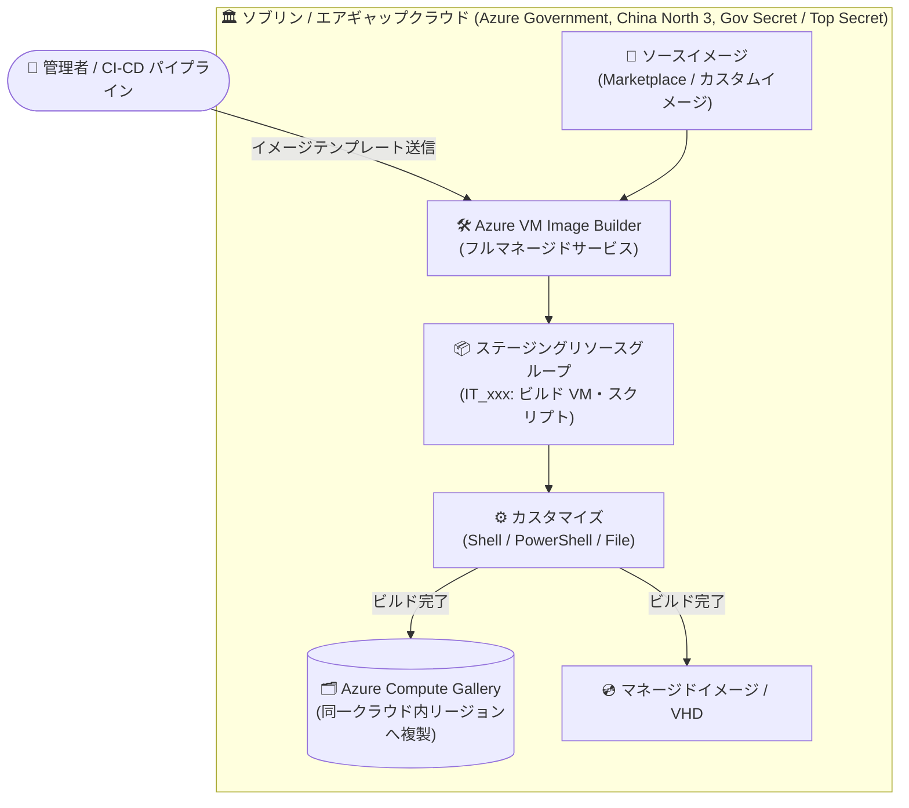

# Azure VM Image Builder: ソブリンクラウドおよびエアギャップクラウドでの一般提供開始

**リリース日**: 2026-08-28

**サービス**: Azure VM Image Builder

**機能**: ソブリンクラウド・エアギャップクラウドでの一般提供 (GA)

**ステータス**: Launched (GA)

[このアップデートのインフォグラフィックを見る](https://takech9203.github.io/azure-news-summary/20260828-vm-image-builder-sovereign-clouds.html)

## 概要

Azure VM Image Builder が、Azure Government、China North 3、Azure Government Secret、Azure Government Top Secret で一般提供 (GA) となりました。これにより、グローバル Azure で利用しているものと同じマネージドイメージビルドサービスを、ソブリンクラウドおよびエアギャップ (物理的に隔離された) 環境でも利用できるようになりました。

Azure VM Image Builder は、HashiCorp Packer をベースとしたフルマネージドのイメージビルドサービスです。イメージの構成 (ソースイメージ、カスタマイズ内容、配布先) をテンプレートとして定義しサービスに送信するだけで、イメージのビルドと配布が自動的に行われます。ビルド用のインフラストラクチャを自前で構築・運用する必要はありません。

今回の GA により、規制産業や政府・公共部門など、データレジデンシー、主権、分離に関する厳格な要件を持つ組織が、ローカルのコンプライアンス管理を維持したまま、標準化されたゴールデンイメージのパイプラインをクラウド全体で統一して運用できるようになります。

**アップデート前の課題**

- ソブリンクラウドやエアギャップ環境では VM Image Builder が利用できず (米国政府向け Fairfax リージョンではパブリックプレビュー扱い)、カスタムイメージ作成には自前のビルドインフラ (Packer 実行環境など) の構築・パッチ適用・運用が必要だった
- グローバル Azure とソブリンクラウドでイメージ作成のツールやプロセスが分断され、同一のテンプレート定義やワークフローを使い回せなかった

**アップデート後の改善**

- Azure Government、China North 3、Azure Government Secret、Azure Government Top Secret で、グローバル Azure と同じマネージドイメージビルドサービスが GA として利用可能になった
- 同一のイメージテンプレート定義とワークフローをグローバル Azure・Azure Government・ソブリンクラウド間で共通化でき、OS 構成・セキュリティベースライン・コンプライアンスチェックの反復可能なハードニング/検証ワークフローを構築できるようになった

## アーキテクチャ図



管理者や CI/CD パイプラインがイメージテンプレートを送信すると、VM Image Builder がサブスクリプション内のステージングリソースグループに一時的なビルド VM を作成してカスタマイズを実行し、完成したイメージを Azure Compute Gallery やマネージドイメージ/VHD として配布します。今回の GA により、このパイプライン全体をソブリン/エアギャップクラウド内で完結できます。

## サービスアップデートの詳細

### 主要機能

1. **ソブリン/エアギャップクラウドでの GA**
   - Azure Government、China North 3、Azure Government Secret、Azure Government Top Secret で一般提供開始
   - セルフホストのビルドインフラの展開・パッチ適用・運用が不要な、セキュアなフルマネージドサービスとしてイメージカスタマイズを自動化

2. **クラウド間で一貫したイメージパイプライン**
   - グローバル Azure、Azure Government、ソブリンクラウドで同一のテンプレート定義とワークフローを利用可能
   - イメージ作成プロセスの標準化により、環境ごとのツール分断を解消

3. **ハードニング・検証ワークフローの反復実行**
   - OS 構成、セキュリティベースライン、コンプライアンスチェックを反復可能なワークフローとして構築可能
   - 最新パッチ適用済みソースイメージからゴールデンイメージを迅速に再ビルド

4. **Azure Compute Gallery への配布**
   - ビルド成果物を Azure Compute Gallery に発行し、同一クラウド内のリージョン間で複製可能
   - マネージドイメージや VHD としての配布にも対応

## 技術仕様

| 項目 | 詳細 |
|------|------|
| 基盤技術 | HashiCorp Packer ベースのフルマネージドサービス |
| 対応 OS | Azure Marketplace のすべてのベース OS イメージ (Windows / Linux) |
| ソースイメージ | Azure Marketplace イメージ、既存カスタムイメージ (TrustedLaunchSupported / ConfidentialVMSupported はソースとしてサポート) |
| 配布先 | Azure Compute Gallery、マネージドイメージ、VHD |
| Hyper-V 世代 | Gen1 / Gen2 (配布イメージはソースと同一世代) |
| ビルド VM の既定サイズ | Standard_D1_v2 (Gen1) / Standard_D2ds_v4 (Gen2) |
| ステージングリソース | `IT_<DestinationResourceGroup>_<TemplateName>_(GUID)` 形式のリソースグループをサブスクリプション内に作成 |
| ネットワーク | 既存 VNet への接続に対応 (Private Link 経由、パブリック IP 不要)。DSC / Chef / Puppet などの構成サーバーとの通信が可能 |
| 認証・アクセス制御 | ユーザー割り当てマネージド ID + Azure RBAC でカスタマイズ成果物や Key Vault などのリソースへ最小権限アクセス |
| 操作方法 | Azure PowerShell、Azure CLI、ARM テンプレート、Azure Portal、DevOps タスク |

## 設定方法

### 前提条件

1. 対象クラウド (Azure Government、China North 3 など) のサブスクリプション
2. `Microsoft.VirtualMachineImages` リソースプロバイダーの登録
3. イメージ配布 (マネージドイメージ / Compute Gallery) への読み取り・書き込み権限を持つユーザー割り当てマネージド ID

### Azure CLI

```bash
# リソースプロバイダーの登録
az provider register --namespace Microsoft.VirtualMachineImages

# イメージテンプレートの作成 (テンプレート JSON を使用)
az image builder create \
  --resource-group myResourceGroup \
  --name myImageTemplate \
  --image-source "MicrosoftWindowsServer:WindowsServer:2022-datacenter:latest" \
  --managed-image-destinations myImage=eastus \
  --identity myIdentity

# イメージビルドの実行
az image builder run --resource-group myResourceGroup --name myImageTemplate
```

### Azure Portal

Azure Portal からもイメージテンプレートの作成・ビルド・検証が可能です (Image Template リソースの作成)。

## メリット

### ビジネス面

- 規制産業・政府/公共部門でも、データレジデンシーや主権要件を満たしながらイメージ作成を自動化できる
- 自前のイメージビルドインフラの構築・運用コストを削減できる
- グローバル Azure とソブリンクラウドでプロセスを統一でき、運用の学習コストと分断を解消できる

### 技術面

- テンプレート定義 (Infrastructure as Code) をクラウド間で再利用でき、環境ドリフトを防止できる
- マネージド ID + RBAC によりカスタマイズ成果物を公開せずに安全に取得できる
- Azure Compute Gallery との統合により、バージョン管理・複製・大規模配布が容易

## デメリット・制約事項

- イメージの複製 (レプリケーション) は同一クラウド内のリージョン間に限られる (アップデート記載より)
- イメージテンプレートリソースは不変 (immutable) であり、リソースの移動はサポートされない
- TrustedLaunch / ConfidentialVM の SecurityType イメージはソースイメージとしてサポートされない (TrustedLaunchSupported / ConfidentialVMSupported はサポート)
- ビルド VM に対する Azure ハイブリッド特典 (Windows Server) は現時点で非対応

## ユースケース

### ユースケース 1: 政府機関向けゴールデンイメージパイプラインの統一

**シナリオ**: 政府機関がグローバル Azure と Azure Government の両方でワークロードを運用しており、セキュリティベースラインを適用したゴールデンイメージを両環境で一貫して維持したい。

**実装例**:

```bash
# 同一のイメージテンプレート定義 (JSON) を Azure Government 側でも適用
az cloud set --name AzureUSGovernment
az login
az image builder create \
  --resource-group govImageRG \
  --name goldenImageTemplate \
  --defer  # 共通テンプレート JSON を利用
az image builder run --resource-group govImageRG --name goldenImageTemplate
```

**効果**: グローバル Azure で検証済みのテンプレート定義とワークフローをそのまま Azure Government に展開でき、環境ごとの個別作り込みを排除して、コンプライアンス準拠のゴールデンイメージを迅速に再ビルドできる。

### ユースケース 2: エアギャップ環境でのセキュリティハードニング自動化

**シナリオ**: Azure Government Secret / Top Secret 環境で、OS 構成・セキュリティベースライン・コンプライアンスチェックを組み込んだイメージを、自前のビルドインフラなしで定期的に更新したい。

**効果**: 隔離された環境内でフルマネージドのビルドパイプラインが完結し、最新パッチ適用済みのソースイメージからハードニング済みイメージを反復的に再生成できる。セルフホストのビルドサーバーの維持管理 (デプロイ・パッチ・運用) が不要になる。

## 料金

VM Image Builder 自体に追加のサービス料金はなく、イメージの作成・ビルド・保存の過程で使用されるコンピューティング、ネットワーク、ストレージのリソースに対して、通常の Azure 料金が課金されます。

| 項目 | 料金 |
|------|------|
| ビルド VM (ビルド実行中のみ) | Standard_D1_v2 (Gen1) / Standard_D2ds_v4 (Gen2) の VM 料金 |
| ステージングリソースグループのストレージ | 少額のストレージ料金 (テンプレート削除で解放可能) |
| イメージ配布 | 配布先リージョンへのネットワーク Egress 料金が発生する場合あり |

ビルド用リソースはビルドプロセスの間のみ存在し、完了後に削除されます (ステージングリソースグループとストレージアカウントを除く)。なお、ソブリンクラウドの料金はグローバル Azure と異なる場合があるため、各クラウドの料金体系を確認してください。

## 利用可能リージョン

今回 GA となったクラウド/リージョン:

- **Azure Government** (米国政府向けクラウド)
- **China North 3** (中国リージョン)
- **Azure Government Secret** (エアギャップ環境)
- **Azure Government Top Secret** (エアギャップ環境)

このほか、グローバル Azure では East US、West Europe、Japan East など多数のリージョンで提供済みです。最新のリージョン一覧は [VM Image Builder overview](https://learn.microsoft.com/azure/virtual-machines/image-builder-overview#regions) を参照してください。

## 関連サービス・機能

- **Azure Compute Gallery**: ビルドしたイメージの配布先。バージョン管理・リージョン間複製・大規模共有を担う
- **Azure Virtual Machines / Virtual Machine Scale Sets**: 作成したカスタムイメージからのデプロイ対象
- **Azure Virtual Desktop**: VM Image Builder でセッションホスト用イメージを構築可能
- **マネージド ID (Microsoft Entra ID)**: カスタマイズ成果物や Key Vault などへの安全なアクセスに使用
- **Azure DevOps**: VM Image Builder サービス DevOps タスクによる CI/CD パイプライン統合
- **Azure Stack**: VHD 形式で出力したイメージを Azure Stack で利用可能

## 参考リンク

- [インフォグラフィック](https://takech9203.github.io/azure-news-summary/20260828-vm-image-builder-sovereign-clouds.html)
- [公式アップデート情報](https://azure.microsoft.com/updates?id=570105)
- [Azure VM Image Builder overview (Microsoft Learn)](https://learn.microsoft.com/azure/virtual-machines/image-builder-overview)
- [イメージテンプレートの作成 (スキーマリファレンス)](https://learn.microsoft.com/azure/virtual-machines/linux/image-builder-json)
- [クイックスタートとサンプル (GitHub)](https://github.com/azure/azvmimagebuilder)

## まとめ

Azure VM Image Builder が Azure Government、China North 3、Azure Government Secret、Azure Government Top Secret で GA となり、ソブリン/エアギャップ環境でもグローバル Azure と同じマネージドイメージビルドサービスを利用できるようになりました。規制産業や政府・公共部門で厳格なデータレジデンシー・主権・分離要件を持つ組織にとって、自前のビルドインフラなしで標準化されたゴールデンイメージパイプラインを構築できる重要なアップデートです。該当環境でカスタムイメージを手動または自前の Packer 環境で作成している場合は、VM Image Builder への移行を検討することを推奨します。

---

**タグ**: Compute, Azure VM Image Builder, Azure Government, Sovereign Cloud, Air-gapped, Compute Gallery, GA
