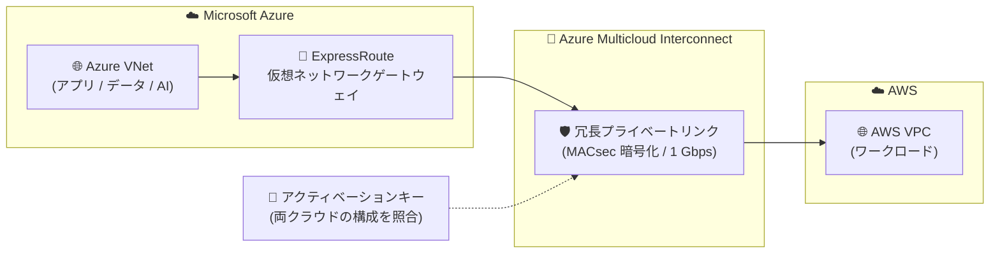

# Azure Multicloud Interconnect: パブリックプレビュー開始 (AWS とのプライベート接続)

**リリース日**: 2026-08-31

**サービス**: Azure Multicloud Interconnect

**機能**: Azure と対応クラウドプロバイダー間のマネージドプライベート接続 (パブリックプレビュー)

**ステータス**: In preview (Public Preview)

[このアップデートのインフォグラフィックを見る](https://takech9203.github.io/azure-news-summary/20260831-azure-multicloud-interconnect.html)

## 概要

Azure Multicloud Interconnect のパブリックプレビューが発表された。これは Azure と対応クラウドプロバイダー間のプライベート接続を提供するマネージドサービスで、プレビューでは最初の対応プロバイダーとして Amazon Web Services (AWS) が利用可能となる。複数クラウドにまたがるワークロードに対して、パブリックインターネットを経由しない専用経路を提供する。

アプリケーション、データ、AI サービス、ミッションクリティカルなワークロードを複数クラウドに分散させる組織が増える中、クラウド間接続の構築・運用の複雑さを軽減することが本サービスの目的である。Azure ポータルからクラウドプロバイダー、リージョン、帯域幅を選択し、ガイド付きの手順でオンボーディングするだけで、Azure 仮想ネットワーク (VNet) と AWS Virtual Private Cloud (VPC) をプライベートに接続できる。

基盤となる接続技術は Azure ExpressRoute だが、ユーザーが作成・管理するのは従来の ExpressRoute 回線ではなく Azure Multicloud Interconnect リソースであり、プロビジョニング、経路の多様性 (path diversity)、物理リンクの正常性監視と障害復旧を Azure と参加プロバイダーが協調して管理する。

**アップデート前の課題**

- Azure と他クラウド間のプライベート接続には、プロバイダー回線の調達、物理/仮想ルーター、クロスコネクト、VLAN、ポイントツーポイントアドレッシング、BGP ピアリングセッションなどを利用者自身が調整・構成する必要があった
- 冗長性 (経路の多様性、障害復旧) の設計・運用も利用者側の責任だった

**アップデート後の改善**

- Azure Multicloud Interconnect リソースを作成し、プロバイダーとアクティベーションキーを交換するだけで接続をプロビジョニングできる (回線・ルーター・BGP などの個別調整が不要)
- 1 つのインターコネクトが物理的に分離された複数拠点の冗長インフラで裏打ちされ、高可用性を前提に設計されたマネージドな回復性を提供
- 物理リンクでは MACsec (MAC Security) による暗号化が既定で有効

## アーキテクチャ図

Azure VNet は ExpressRoute ゲートウェイ経由で Multicloud Interconnect のマネージドプライベートリンクに接続し、AWS VPC 内のワークロードとパブリックインターネットを経由せずに通信する。接続の両端はアクティベーションキーで同一顧客・同一構成であることが確認される。

## サービスアップデートの詳細

### 主要機能

1. **プライベートなクラウド間接続**
   - Azure と接続先クラウドプロバイダー間のトラフィックが、パブリックインターネットではなくプライベート接続を経由する

2. **プロビジョニングの簡素化**
   - Azure Multicloud Interconnect リソースの作成とアクティベーションキーの交換だけで接続を確立。プロバイダー回線、物理/仮想ルーター、クロスコネクト、VLAN、ポイントツーポイントアドレッシング、BGP ピアリングの調整が不要

3. **マネージドな回復性**
   - 単一のインターコネクトが、物理的に分離された拠点にまたがる冗長インフラで構成され、高可用性を前提に設計。物理リンクの正常性監視と障害復旧は Azure とプロバイダーが協調して実施

4. **リンク暗号化**
   - Azure と対応クラウドプロバイダー間の物理リンクで MACsec が既定で有効

5. **アクティベーションキーによる双方向の開始**
   - Azure 側でキーを生成してプロバイダー側で引き換える、またはプロバイダー側のキーを Azure で引き換える、どちらの順序でも開始可能。プロバイダー、Azure リージョン、帯域幅、プロバイダーアカウントの一致を検証してからプロビジョニングが開始される

## 技術仕様

| 項目 | 詳細 |
|------|------|
| 対応クラウドプロバイダー | Amazon Web Services (AWS) のみ (プレビュー期間中) |
| 帯域幅 | 1 Gbps (プレビュー期間中) |
| 基盤技術 | Azure ExpressRoute (ただし管理リソースは Multicloud Interconnect リソース) |
| ピアリング | プライベート接続のみ対応 (Microsoft ピアリングは非対応) |
| リンク暗号化 | MACsec (既定で有効) |
| VNet 接続 | ExpressRoute 仮想ネットワークゲートウェイ経由 |
| SLA | プレビュー期間中は SLA なし (Azure プレビュー補足条項が適用) |

## 設定方法

### 前提条件

1. Azure サブスクリプション
2. 対応クラウドプロバイダー (AWS) のアカウント
3. ExpressRoute 仮想ネットワークゲートウェイ
4. Azure VNet とクラウドプロバイダー側仮想ネットワーク間で重複しないアドレス空間

### セットアップの流れ (4 ステージ)

1. **ExpressRoute 回線の作成**: ExpressRoute 回線を作成し、ポートタイプに「Azure Multicloud Interconnect」を選択
2. **Interconnect リソースの作成**: プライベートなクラウド間接続を提供する Azure Multicloud Interconnect リソースを作成
3. **プロバイダーセットアップ**: アクティベーションキーを生成または引き換え、対応クラウドプロバイダー (プレビューでは AWS) を選択
4. **ワークロードの接続**: 仮想ネットワークを接続し、アプリケーション・データ・AI ワークロードが両クラウド間で通信できるようにする

詳細な手順は公式ドキュメントの「[Create an Azure Multicloud Interconnect Preview resource](https://learn.microsoft.com/azure/multicloud-interconnect/create-interconnect)」および「[Redeem an activation key](https://learn.microsoft.com/azure/multicloud-interconnect/redeem-activation-key)」を参照。

## メリット

### ビジネス面

- マルチクラウド戦略 (Azure と AWS の併用) におけるクラウド間接続の構築・運用コストと期間を削減
- プレビュー期間中はサービス料金と Azure Egress 料金が無料のため、低コストで検証を開始できる
- ミッションクリティカルなワークロード向けに設計された組み込みの回復性

### 技術面

- パブリックインターネットを経由しないプライベート接続によるセキュリティとパフォーマンスの向上
- BGP・VLAN・クロスコネクト等の低レイヤー構成が不要になり、ネットワーク運用の負担を軽減
- MACsec による物理リンク暗号化が既定で有効
- 障害監視・復旧を含む回復性がマネージドで提供される

## デメリット・制約事項

- プレビュー期間中は AWS への接続のみ対応 (他プロバイダーの対応は別途発表予定)
- 帯域幅は 1 Gbps に制限される
- プライベート接続のみ対応。Microsoft ピアリングは利用不可
- 利用可能リージョンが 4 リージョンに限定される (下記参照)
- プレビュー期間中は SLA が提供されない (本番ワークロードへの適用は慎重に判断)
- Azure VNet と AWS VPC のアドレス空間が重複しないよう事前設計が必要

## 料金

プレビュー期間中は、Azure Multicloud Interconnect のサービス料金および Azure の Egress 料金は発生しない。

| 項目 | 料金 (プレビュー期間中) |
|------|------|
| Azure Multicloud Interconnect サービス料金 | 無料 |
| Azure Egress 料金 | 無料 |

GA 後の料金体系は現時点で公表されていない。最新情報は [Availability and limits](https://learn.microsoft.com/azure/multicloud-interconnect/availability-limits) を参照。なお、AWS 側で発生する費用については Azure のドキュメントに記載がないため、AWS 側の料金は別途確認が必要。

## 利用可能リージョン

プレビュー期間中は以下の Azure リージョンでインターコネクトを作成できる (リージョンの提供状況はプレビュー中に変更される可能性あり):

- Australia East
- East US
- Germany West Central
- West US

## 関連サービス・機能

- **Azure ExpressRoute**: Multicloud Interconnect の基盤となる接続技術。オンプレミスから Azure への接続には引き続き ExpressRoute を使用し、対応クラウドプロバイダーへの接続には Multicloud Interconnect を使用するという使い分けが公式に示されている
- **ExpressRoute 仮想ネットワークゲートウェイ**: Azure VNet 側のトラフィックの入口として必須のコンポーネント
- **AWS VPC**: プレビューで接続対象となるプロバイダー側の仮想ネットワーク

## 参考リンク

- [インフォグラフィック](https://takech9203.github.io/azure-news-summary/20260831-azure-multicloud-interconnect.html)
- [公式アップデート情報](https://azure.microsoft.com/updates?id=570364)
- [発表ブログ (aka.ms)](https://aka.ms/MulticloudInterconnect-blog)
- [Microsoft Learn: What is Azure Multicloud Interconnect Preview?](https://learn.microsoft.com/azure/multicloud-interconnect/overview)
- [Microsoft Learn: Availability and limits (対応リージョン・制限・料金)](https://learn.microsoft.com/azure/multicloud-interconnect/availability-limits)
- [Microsoft Learn: Azure ExpressRoute](https://learn.microsoft.com/azure/expressroute/expressroute-introduction)

## まとめ

Azure Multicloud Interconnect は、これまで利用者が自前で構成する必要のあった Azure と AWS 間のプライベート接続 (回線調達、ルーター、BGP、冗長化) を、リソース作成とアクティベーションキー交換だけで完結させるマネージドサービスである。MACsec 既定有効の暗号化と物理的に分離された冗長インフラを備え、マルチクラウド構成のネットワーク運用を大幅に簡素化する。プレビュー期間中はサービス料金・Egress 料金とも無料のため、Azure と AWS を併用している組織は対応 4 リージョン (East US、West US、Australia East、Germany West Central) での検証を検討する価値がある。ただし帯域は 1 Gbps 固定、SLA なしのプレビュー段階であるため、本番適用は GA を待つのが無難である。

---

**タグ**: Azure Multicloud Interconnect, ExpressRoute, Networking, Hybrid + multicloud, AWS, Public Preview
