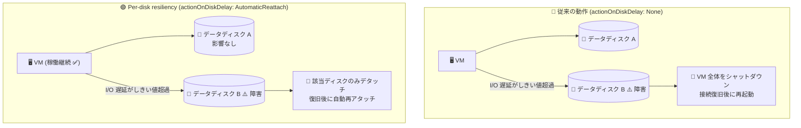

# Azure Disk Storage: Azure VM のディスク単位の回復性 (Per-disk resiliency) パブリックプレビュー

**リリース日**: 2026-08-31

**サービス**: Azure Disk Storage / Azure Virtual Machines

**機能**: Per-disk resiliency (ディスク単位の回復性)

**ステータス**: In preview

[このアップデートのインフォグラフィックを見る](https://takech9203.github.io/azure-news-summary/20260831-per-disk-resiliency-azure-vms.html)

## 概要

Azure VM にアタッチされたマネージドディスクの可用性や接続性が長時間失われた場合、従来 Azure プラットフォームは VM を強制的にシャットダウンし、ストレージ接続の復旧後に自動的に再起動する動作 (顧客の操作は不要) を取っていました。この動作は引き続きデフォルトのままです。

今回パブリックプレビューとして発表された Per-disk resiliency (ディスク単位の回復性) は、個々のデータディスクの一時的な喪失を許容できるワークロード向けの新しい選択肢です。データディスクの `actionOnDiskDelay` プロパティを `AutomaticReattach` に設定すると、そのディスクの I/O 遅延がプラットフォームのしきい値を超えた場合、影響を受けたディスクのみがオフライン化・デタッチされ、VM と残りのディスクは稼働を継続します。プラットフォーム側の問題が解決されると、Azure がディスクを自動的に再アタッチしてオンラインに戻します。

**アップデート前の課題**

- 1 つのデータディスクの接続障害でも、VM 全体が強制シャットダウンされ、他の正常なディスク上のワークロードも停止していた
- コンテナーごとにディスクをアタッチするマルチテナント構成や、バックアップ用の補助ディスクを持つ本番 VM でも、単一ディスクの問題がノード全体の再起動につながっていた

**アップデート後の改善**

- ディスク単位でオプトイン設定でき、障害の影響を該当データディスクのみに限定できる (VM は稼働継続)
- 接続復旧後は Azure がディスクを自動再アタッチし、オンラインに戻す (顧客の操作は不要)
- カスタマー マネージド キー (CMK) を失効・無効化した場合も、VM シャットダウンではなくディスクのデタッチで対応され、キーの再有効化後に再アタッチされる

## アーキテクチャ図



従来はデータディスク 1 台の接続障害で VM 全体が再起動されていましたが、Per-disk resiliency を有効化すると障害ディスクのみがデタッチされ、VM と他のディスクは稼働を継続します。

## サービスアップデートの詳細

### 主要機能

1. **ディスク単位の障害分離 (`AutomaticReattach`)**
   - データディスクの I/O 遅延がプラットフォームのしきい値を超えた場合、VM を再起動せずに該当ディスクのみをオフライン化・デタッチする
   - プラットフォーム側の問題解決後、Azure が自動的にディスクを再アタッチしてオンラインに戻す

2. **障害シーケンス (`AutomaticReattach` 設定時)**
   1. Azure がデータディスクへの I/O 遅延がしきい値を超えたことを検出
   2. ディスクをオフライン化しデタッチ (VM は稼働継続、該当ディスクへの I/O はエラーを返す)
   3. 問題解決後、Azure がディスクを再アタッチしオンライン化
   4. ディスクが VM から再び利用可能になる

3. **状態の可視化**
   - ディスクのオフライン中、VM のヘルス状態は **Degraded (低下)** として報告される
   - Azure Portal 上ではディスクはアタッチされたままと表示されるが、ゲスト OS からはデタッチ状態として認識される

## 技術仕様

| 項目 | 詳細 |
|------|------|
| 設定プロパティ | データディスクの `availabilityPolicy.actionOnDiskDelay` |
| 設定値 | `None` (デフォルト: 従来どおり VM 再起動) / `AutomaticReattach` (該当ディスクのみデタッチ・自動再アタッチ) |
| 対象ディスク | データディスクのみ (OS ディスクは対象外で従来動作を維持) |
| 設定単位 | マネージドディスクごとのオプトイン |
| 必要な機能フラグ | サブスクリプションで `Microsoft.Compute/AllowDiskAvailabilityPolicy` の登録が必要 |
| REST API バージョン | `2022-07-02` 以降 |
| オフライン中の I/O | エラーを返す (Linux: `No such file or directory` 等、Windows: `STATUS_NO_SUCH_DEVICE` / `ERROR_NO_SUCH_DEVICE`) |
| ゲスト OS での検出 | Linux: `udev` 等でアンマウント/再マウントを検出、Windows: Plug and Play 通知で検出 |

## 設定方法

### 前提条件

1. サポート対象リージョンで **2026 年 8 月 15 日以降に作成された VM** であること
2. Linux VM の場合、正しいデタッチ/再アタッチ動作に必要な SCSI タイムアウト修正を含むカーネルであること
3. サブスクリプションでプレビュー機能フラグ `AllowDiskAvailabilityPolicy` を登録済みであること
4. 最新の Azure CLI または Azure PowerShell (REST API の場合は API バージョン `2022-07-02` 以降)

### Azure CLI

```bash
# 1. プレビュー機能フラグの登録
az feature register --namespace Microsoft.Compute --name AllowDiskAvailabilityPolicy
az provider register --namespace Microsoft.Compute

# 2. 新規データディスク作成時に有効化
az disk create \
  --resource-group myResourceGroup \
  --name myDataDisk \
  --location westus \
  --size-gb 1024 \
  --sku Premium_LRS \
  --action-on-disk-delay AutomaticReattach

# 3. 既存データディスクで有効化 (VM の割り当て解除またはディスクのデタッチが必要)
az disk update \
  --resource-group myResourceGroup \
  --name myDataDisk \
  --action-on-disk-delay AutomaticReattach

# 4. 設定の確認
az disk show \
  --resource-group myResourceGroup \
  --name myDataDisk \
  --query availabilityPolicy
```

無効化する場合は `--action-on-disk-delay None` を指定します (同様に VM の割り当て解除またはディスクのデタッチが必要)。

### Azure Portal

現時点では Azure Portal からの設定はできません (CLI / PowerShell / REST API のみ)。

## メリット

### ビジネス面

- 単一ディスクの一時的な障害による VM 全体の停止を回避し、本番ワークロードの可用性を向上できる
- 復旧が完全自動 (デタッチ → 自動再アタッチ) のため、運用負荷の増加なしに回復性を高められる

### 技術面

- コンテナーごとにディスクをアタッチするマルチテナントノードで、1 つの永続ボリュームの障害が他の Pod に影響しない
- Azure 共有ディスクを使うクラスター構成で、共有ディスクへの接続影響時にも参加 VM の稼働を維持できる
- ディスク単位のオプトインのため、重要度に応じてディスクごとに動作を選択できる

## デメリット・制約事項

- サポート対象リージョンで **2026 年 8 月 15 日より前に作成された VM では利用不可** (従来どおり VM シャットダウンで回復)
- **OS ディスクは対象外** (データディスクのみ)
- 有効化は VM の割り当て解除中、またはディスクを VM にアタッチする前に行う必要がある
- VM / 仮想マシン スケール セットの作成時には有効化できない (ディスクリソースに設定してからアタッチする)
- Write Accelerator が有効な VM では未サポート (設定しても動作は変わらない)
- `actionOnDiskDelay` の設定は VM 復元ポイントに保持されない。Azure Backup / Azure Site Recovery でも保持されないため、復元後に再設定が必要
- 現時点で Azure Portal からは設定不可
- ディスクのオフライン中は該当ディスクへの I/O がエラーを返すため、アプリケーション側で一時的な I/O 障害を処理できる設計が必要
- Linux では、デタッチ/再アタッチでデバイスパスが変わる可能性があるため UUID ベースのマウント設定が推奨される。また、アンマウント時にマウントポイントが通常ディレクトリに戻り OS ディスク等へ誤書き込みされるのを防ぐため、マウントポイントの保護 (`chattr +i`) が推奨される。再アタッチ後はファイルシステムの検証・修復 (`fsck` / `xfs_repair`) が必要な場合がある

## ユースケース

### ユースケース 1: バックアップディスクを持つ本番 VM

**シナリオ**: 本番ワークロードが稼働する VM にバックアップ用データディスクをアタッチしている。バックアップディスクの接続障害で本番ワークロードが停止するのを避けたい。

**実装例**:

```bash
# バックアップ用ディスクのみ Per-disk resiliency を有効化
az disk update \
  --resource-group myResourceGroup \
  --name myBackupDisk \
  --action-on-disk-delay AutomaticReattach
```

**効果**: バックアップディスクの接続・可用性タイムアウトが発生しても本番ワークロードは中断されず、復旧後にディスクが自動再アタッチされる。

### ユースケース 2: コンテナーホスト (マルチテナントワークロード)

**シナリオ**: VM ノード上で多数のコンテナーが稼働し、Pod ごとに個別のデータディスク (永続ボリューム) をアタッチしている。

**効果**: 1 つの永続ボリュームの接続障害がノード全体の再起動を引き起こさず、他の Pod は影響を受けずに稼働を継続できる。

### ユースケース 3: 共有ディスクを使うクラスターアプリケーション

**シナリオ**: Windows Server Failover Cluster や Pacemaker などのクラスターマネージャーで Azure 共有ディスクを利用する高可用性構成。

**効果**: 共有ディスクへの接続影響時にも参加 VM の稼働を維持し、アプリケーション独自の HA / フェイルオーバーロジックに回復を委ねられる。

## 利用可能リージョン

プレビュー期間中は以下のリージョンで利用可能です。

| | | |
|---|---|---|
| Canada Central | Canada East | Central India |
| East Asia | Japan East | Korea Central |
| North Central US | Poland Central | South Africa North |
| Southeast Asia | Sweden Central | Switzerland North |
| UK South | UK West | West Central US |
| West US | West US 2 | West US 3 |

## 関連サービス・機能

- **Azure Virtual Machines**: 本機能の適用対象。データディスクの障害時に VM の稼働を継続できるようになる
- **Azure 共有ディスク**: クラスターアプリケーション向けの共有ブロックストレージ。Per-disk resiliency と組み合わせて参加 VM の可用性を向上できる
- **Azure Backup / Azure Site Recovery**: 復元後に `actionOnDiskDelay` 設定が保持されないため、再設定が必要
- **サーバー側暗号化 (カスタマー マネージド キー)**: キー失効時の動作が VM シャットダウンからディスクデタッチに変わる
- **Resource Health**: ディスクオフライン中は VM のヘルス状態が Degraded として報告される

## 参考リンク

- [インフォグラフィック](https://takech9203.github.io/azure-news-summary/20260831-per-disk-resiliency-azure-vms.html)
- [公式アップデート情報](https://azure.microsoft.com/updates?id=569711)
- [Microsoft Learn: Improve workload availability with per-disk resiliency (preview)](https://learn.microsoft.com/azure/virtual-machines/disks-per-disk-resiliency)
- [Microsoft Learn: Configure per-disk resiliency](https://learn.microsoft.com/azure/virtual-machines/disks-per-disk-resiliency-configure)
- [Microsoft Learn: Azure Disk Storage の概要](https://learn.microsoft.com/azure/virtual-machines/managed-disks-overview)

## まとめ

Per-disk resiliency は、単一のデータディスク障害が VM 全体のシャットダウンにつながる従来動作に対し、ディスク単位で障害を分離できる新しい選択肢です。コンテナーホスト、共有ディスククラスター、バックアップディスク付き本番 VM など、単一ディスクが単一障害点でない構成で特に有効です。一方、2026 年 8 月 15 日以降に作成された VM のみ対象、OS ディスク対象外、Portal 未対応、Backup/ASR で設定が保持されないなどプレビュー段階の制約が多いため、まずはサポートリージョン (Japan East を含む) の非本番環境で、アプリケーションが一時的な I/O エラーとディスク再アタッチを正しく処理できるかを検証することを推奨します。

---

**タグ**: Azure Disk Storage, Azure Virtual Machines, Storage, Preview, 高可用性, マネージドディスク
