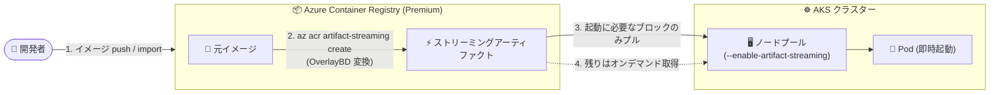

# Azure Kubernetes Service (AKS): Artifact Streaming の一般提供開始 (GA)

**リリース日**: 2026-09-01

**サービス**: Azure Kubernetes Service (AKS) / Azure Container Registry (ACR)

**機能**: Artifact Streaming on AKS

**ステータス**: Launched (GA)

[このアップデートのインフォグラフィックを見る](https://takech9203.github.io/azure-news-summary/20260901-aks-artifact-streaming.html)

## 概要

Azure Kubernetes Service (AKS) 上のコンテナー化ワークロードを、Azure Container Registry (ACR) の Artifact Streaming 機能で高速化できるようになりました。本機能により、イメージがノードに完全にプルされるのを待たずにワークロードをスケールできます。Azure Updates の情報によると、GA は 2026 年 7 月に開始され、2026 年 9 月 1 日にアナウンスされました。

Artifact Streaming は、コンテナーイメージのレイヤーを仮想ブロックデバイスに変換する OSS 技術「OverlayBD」を利用しています。従来のようにイメージ全体をダウンロードするのではなく、Pod の初期起動に必要なレイヤー (ブロック) のみを取得し、残りのデータは実行時に必要に応じてオンデマンドで取得します。これにより、特に大きなイメージにおける Pod 起動までの時間 (time-to-pod readiness) を短縮できます。ACR のドキュメントでは、イメージサイズに応じて time-to-pod readiness を 15% 以上短縮できるとされており、30 GB を超える大規模イメージで特に効果的です。

**アップデート前の課題**

- 標準のコンテナー起動では、Kubernetes がワークロード開始前にすべてのイメージレイヤーをダウンロードする必要があり、大きなイメージや多数の Pod の同時起動時にデプロイが遅延していた
- スケールアウト時に、新規ノードでのイメージプル完了を待つ必要があり、迅速なスケーリングの妨げになっていた
- マルチリージョン展開では、イメージのレプリケーションに時間とリソースが必要だった

**アップデート後の改善**

- Pod の初期起動に必要なレイヤーのみを取得して起動を開始し、残りはオンデマンドで取得するため、イメージプルの完了を待たずにワークロードをスケールできる
- 単一の ACR から複数リージョンの AKS クラスターへイメージをストリーミング可能 (geo レプリケーションの有無に関わらず動作し、プライベートエンドポイントとも併用可能)
- ノードプール単位のフラグ (`--enable-artifact-streaming`) で簡単に有効化できる

## アーキテクチャ図



ACR 上でイメージをストリーミングアーティファクトに変換し、AKS ノードは Pod の起動に必要なブロックのみを取得して即座に起動します。残りのデータは実行時に必要に応じてストリーミングされます。

## サービスアップデートの詳細

### 主要機能

1. **ブロックレベルのイメージストリーミング (OverlayBD)**
   - コンテナーイメージのレイヤーを仮想ブロックデバイスに変換し、ランタイムがブロックレベルでデータにアクセス
   - 起動時・実行時にアクセスされたブロックのみを取得するため、アプリケーションがイメージの一部しか使わない場合はその部分のみがプルされる

2. **ノードプール単位での有効化**
   - `az aks nodepool add` / `az aks nodepool update` の `--enable-artifact-streaming` フラグで新規・既存ノードプールに対して有効化可能
   - Node Auto Provisioning (NAP) 有効クラスターでは、AKSNodeClass CRD の `spec.artifactStreaming.enabled` フィールドで有効化可能

3. **ACR 側でのストリーミングアーティファクト管理**
   - リポジトリ単位・タグ単位でストリーミングアーティファクトを生成可能
   - リポジトリを「アクティブ」状態にすると、新しくプッシュされた互換イメージが自動的に変換される
   - 元イメージとストリーミングアーティファクトは同一レジストリ内に共存し、機能を無効化した後も両方にアクセス可能

### 効果 (ACR ドキュメントより)

- time-to-pod readiness を 15% 以上短縮 (イメージサイズに依存)
- 30 GB を超える大きなイメージで特に効果が高い

## 技術仕様

| 項目 | 詳細 |
|------|------|
| 基盤技術 | OverlayBD (containerd プロジェクトの OSS) |
| プル方式 | ブロックレベルのオンデマンド取得 (タグ指定のプルのみ対応) |
| 必要な ACR SKU | Premium のみ |
| 対応アーキテクチャ | Linux AMD64 のみ (Windows / ARM64 は非対応) |
| マルチアーキイメージ | AMD64 のみ対応 |
| Kubernetes バージョン | 1.25 以降 (AKS ドキュメント)、ACR ドキュメントでは 1.26 以降と記載 |
| ノード OS | Ubuntu ベースのノードプールは Ubuntu 20.04 以降 |
| Azure CLI | 2.87.0 以降 (AKS 側)、2.54.0 以降 (ACR 側) |
| 必要ロール | Azure Kubernetes Service Contributor Role (ノードプール構成の変更に必要) |
| geo レプリケーション | 不要 (リージョンをまたいで動作)。プライベートエンドポイントとの併用可 |

## 設定方法

### 前提条件

1. Premium SKU の ACR (AKS クラスターと統合済みであること)
2. Kubernetes バージョン 1.25 以降の AKS クラスター
3. Azure CLI 2.87.0 以降
4. Azure Kubernetes Service Contributor ロール

### Azure CLI

```bash
# 1. Premium SKU の ACR を作成 (既存の Premium レジストリがある場合は不要)
az acr create --resource-group myStreamingTest --name mystreamingtest --sku Premium

# 2. イメージをインポート (または push)
az acr import --source docker.io/jupyter/all-spark-notebook --repository jupyter/all-spark-notebook

# 3. ストリーミングアーティファクトを作成
az acr artifact-streaming create --image jupyter/all-spark-notebook:latest

# 4. ストリーミングアーティファクトの生成を確認
az acr manifest list-referrers --name jupyter/all-spark-notebook:latest

# 5. 新しくプッシュされるイメージの自動変換を有効化 (任意)
az acr artifact-streaming update --repository jupyter/all-spark-notebook --enable-streaming true

# 6a. 新規ノードプールで Artifact Streaming を有効化
az aks nodepool add \
    --resource-group myResourceGroup \
    --cluster-name myAKSCluster \
    --name myNodePool \
    --enable-artifact-streaming

# 6b. 既存ノードプールで有効化する場合
az aks nodepool update \
    --resource-group myResourceGroup \
    --cluster-name myAKSCluster \
    --name myNodePool \
    --enable-artifact-streaming

# 7. 有効化状態の確認
az aks nodepool show \
    --resource-group myResourceGroup \
    --cluster-name myAKSCluster \
    --name myNodePool \
    --query artifactStreamingProfile
```

### Azure Portal

ACR 側は Azure Portal からも操作できます。

1. Azure Portal で対象の ACR に移動
2. サービスメニューの **Services** > **Repositories** を選択
3. **Start artifact streaming** を選択 (以降、リポジトリに push された互換イメージは自動変換される)
4. 既存イメージを変換する場合は、対象イメージを選択して **Create streaming artifact** を選択

## メリット

### ビジネス面

- Pod 起動の高速化により、スパイク時のスケールアウトが迅速になり、ユーザー体験や SLA の維持に寄与
- 単一レジストリからのマルチリージョン展開により、イメージレプリケーションにかかる時間とリソースを削減
- 大規模イメージ (AI/ML、Java/C# などの依存関係が大きいワークロード) のデプロイ時間短縮

### 技術面

- time-to-pod readiness を 15% 以上短縮 (イメージサイズに依存、30 GB 超のイメージで特に有効)
- 多数の Pod を同時に作成・スケールする際の起動遅延を削減
- 起動時に不要なレイヤーを持つイメージ (依存関係を焼き込んだイメージなど) の初期化時間を最適化
- ノードプール単位のフラグ 1 つで有効化でき、既存クラスターにも適用可能

## デメリット・制約事項

- Premium SKU の ACR のみ対応 (Basic / Standard は不可)
- Linux AMD64 イメージのみ対応。Windows ベースのイメージと ARM64 イメージは非対応 (マルチアーキイメージも AMD64 のみ)
- タグ指定のイメージプルのみ対応。ダイジェスト指定のプルでは Artifact Streaming を利用できない
- CMK (カスタマーマネージドキー) 対応レジストリは非対応
- Kubernetes の `regcred` (`imagePullSecrets`) は非対応。非 Entra のスコープマップトークンや ACR 管理者ユーザー資格情報でのプルは、ストリーミングが有効でも通常のプルにフォールバックする
- Ubuntu ベースのノードプールは Ubuntu 20.04 以降が必要
- 起動時に大きなファイル (30 GB 超) を読み込む read-heavy なイメージでは効果がない。そのようなファイルはイメージレイヤーではなくボリュームとしてマウントすることが推奨される (起動に必須の場合はノードが輻輳する)
- Soft Delete ポリシーと併用時、アーティファクトを削除すると元イメージとストリーミング版の両方が削除されるが、保持期間中に表示・復元できるのは元イメージのみ
- ストリーミングアーティファクトの保存によりレジストリのストレージ消費が増加する (元イメージと変換後イメージの両方を保存するため)

## 料金

Artifact Streaming 機能自体の追加料金は公式ドキュメントに記載されていませんが、以下のコスト影響があります。

| 項目 | 内容 |
|------|------|
| ACR SKU | Premium SKU が必須 (500 GiB のストレージを含む) |
| ストレージ | ストリーミングアーティファクトの保存によりストレージ消費が増加。Premium SKU に含まれる 500 GiB を超えた分は 1 GB あたりの日額料金で追加課金 |

具体的な料金はリージョンにより異なります。詳細は [ACR 料金ページ](https://azure.microsoft.com/pricing/details/container-registry/) を参照してください。

## 関連サービス・機能

- **Azure Container Registry (ACR)**: 本機能の中核。Premium SKU でストリーミングアーティファクトの生成・保存を行う
- **AKS Node Auto Provisioning (NAP)**: AKSNodeClass CRD の `spec.artifactStreaming.enabled` フィールドで NAP 管理ノードにも Artifact Streaming を適用可能
- **ACR geo レプリケーション**: Artifact Streaming は geo レプリケーションの有無に関わらずリージョンをまたいで動作するが、併用も可能
- **プライベートエンドポイント**: Artifact Streaming はプライベートエンドポイント経由でも利用可能
- **OverlayBD (containerd)**: イメージレイヤーを仮想ブロックデバイスに変換する基盤 OSS 技術

## 参考リンク

- [インフォグラフィック](https://takech9203.github.io/azure-news-summary/20260901-aks-artifact-streaming.html)
- [公式アップデート情報](https://azure.microsoft.com/updates?id=570095)
- [Microsoft Learn: Artifact Streaming on AKS の概要](https://learn.microsoft.com/azure/aks/artifact-streaming-overview)
- [Microsoft Learn: AKS で Artifact Streaming を有効化する](https://learn.microsoft.com/azure/aks/artifact-streaming)
- [Microsoft Learn: ACR の Artifact Streaming](https://learn.microsoft.com/azure/container-registry/container-registry-artifact-streaming)
- [ACR 料金ページ](https://azure.microsoft.com/pricing/details/container-registry/)

## まとめ

AKS の Artifact Streaming が GA となり、大きなコンテナーイメージのプル待ち時間がスケーリングのボトルネックになっていたワークロードを、ノードプールのフラグ 1 つで高速化できるようになりました。特に 30 GB 超の大規模イメージや、多数の Pod を同時にスケールさせるシナリオで効果が高く、AI/ML や Java/C# 系の重いイメージを運用しているチームは検証の価値があります。ただし、Premium SKU の ACR が必須であること、Linux AMD64 のみの対応であること、タグ指定プルのみ対応といった制約があるため、既存のイメージ管理・デプロイフロー (ダイジェスト固定運用など) との整合性を確認した上での導入を推奨します。

---

**タグ**: AKS, Azure Kubernetes Service, Azure Container Registry, ACR, Artifact Streaming, OverlayBD, Containers, Compute, GA
