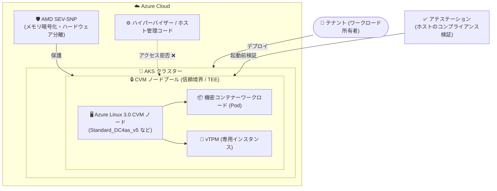

# Azure Kubernetes Service (AKS): Azure Linux 向け Confidential VM の一般提供開始

**リリース日**: 2026-09-01

**サービス**: Azure Kubernetes Service (AKS)

**機能**: Confidential VMs for Azure Linux

**ステータス**: Launched (GA)

[このアップデートのインフォグラフィックを見る](https://takech9203.github.io/azure-news-summary/20260901-aks-confidential-vms-azure-linux.html)

## 概要

AKS において、Azure Linux を OS とする Confidential VM (CVM) ノードプールが一般提供 (GA) となりました。CVM は、AMD SEV-SNP のセキュリティ機能を活用した VM ベースのハードウェア Trusted Execution Environment (TEE) を提供し、ハイパーバイザーやホスト管理コードから VM のメモリと状態へのアクセスを拒否することで、クラウド事業者のオペレーターアクセスに対する多層防御を実現します。

これにより、セキュリティクリティカルなデータや機密性の高い顧客データを扱うコンテナーワークロードを、アプリケーションコードの改修なしに AKS へ移行できるようになります。政府契約などのコンプライアンス要件を満たす必要があるワークロードにも適しています。Azure Linux Container Host は AKS 向けに最適化された軽量・セキュアな OS イメージであり、CVM と組み合わせることでセキュリティをさらに強化できます。

**アップデート前の課題**

- 機密性の高いコンテナーワークロードを AKS 上で実行する際、Azure Linux ノードプールでは CVM が一般提供されておらず、本番環境での採用が困難だった
- ハイパーバイザーやホスト管理コードからのアクセスに対する保護を、Azure Linux ベースのノードで本番利用可能な形で実現する手段が限られていた

**アップデート後の改善**

- Azure Linux 3.0 の CVM ノードプールが一般提供となり、本番環境で利用可能になった
- AMD SEV-SNP によるメモリ暗号化とハードウェアベースの分離を、コード改修なしで Azure Linux ベースのコンテナーワークロードに適用できるようになった

## アーキテクチャ図



CVM ノードプールでは、AMD SEV-SNP がハードウェアレベルでメモリを暗号化し、ハイパーバイザーやホスト管理コードからのアクセスを遮断します。CVM ノード上のすべての Pod は同一の信頼境界に含まれます。

## サービスアップデートの詳細

### 主要機能

1. **Azure Linux 3.0 での CVM ノードプールの一般提供**
   - `--os-sku AzureLinux` を指定した CVM ノードプールが本番利用可能に。Kubernetes バージョン 1.28〜1.36 で CVM を有効化すると Azure Linux 3 が既定となる

2. **ハードウェアベースの分離 (AMD SEV-SNP)**
   - 第 3 世代 AMD EPYC プロセッサで導入された AMD SEV-SNP テクノロジにより、VM・ハイパーバイザー・ホスト管理コード間の堅牢なハードウェアベース分離を実現 (Intel TDX ベースの CVM は現時点で AKS 未サポート)

3. **アテステーションと vTPM**
   - デプロイ前にホストのコンプライアンスを検証するカスタマイズ可能なアテステーションポリシー、およびキーとシークレットの保護のための専用 vTPM インスタンスを提供

4. **コード改修不要の移行**
   - アプリケーションコードを変更することなく、メモリ暗号化と強化されたセキュリティの恩恵を受けられる。CVM ノードプールは CVM 用に特別に構成されたカスタムノードイメージを使用

## 技術仕様

| 項目 | 詳細 |
|------|------|
| TEE テクノロジ | AMD SEV-SNP (第 3 世代 AMD EPYC プロセッサ) |
| 対応 OS SKU (Azure Linux) | Azure Linux 3.0 (Kubernetes 1.28〜1.36 で CVM 有効時の既定) |
| その他の対応 OS SKU | Ubuntu (20.04 / 24.04)。Ubuntu 22.04、Flatcar、Azure Linux OS Guard、Azure Container Linux、Windows は非対応 |
| 対応 VM サイズ例 | DCasv5 / DCadsv5 / DCasv6 / DCesv6 シリーズ (汎用)、ECasv5 / ECadsv5 / ECasv6 / ECesv6 シリーズ (メモリ最適化)、NCCadsH100v5 シリーズ (NVIDIA H100 GPU) |
| Intel TDX | AKS では現時点で未サポート |
| ノードイメージ | CVM 用に構成されたカスタムノードイメージを使用 |

## 設定方法

### 前提条件

1. 既存の AKS クラスターがあること
2. クラスターを作成するリージョンでサブスクリプションが CVM サイズを利用可能であり、CVM サイズのノードプールを作成するのに十分なクォータがあること

### Azure CLI

```bash
# Azure Linux を使用する CVM ノードプールを追加
az aks nodepool add \
    --resource-group myResourceGroup \
    --cluster-name myAKSCluster \
    --name cvmnodepool \
    --node-count 3 \
    --node-vm-size Standard_DC4as_v5 \
    --os-sku AzureLinux

# ノードプールが CVM サイズを使用していることを確認
az aks nodepool show \
    --resource-group myResourceGroup \
    --cluster-name myAKSCluster \
    --name cvmnodepool \
    --query 'vmSize'
```

## メリット

### ビジネス面

- 機密性の高い顧客データやセキュリティクリティカルなデータを扱うワークロードを、AKS の運用メリットを享受しながらクラウドに移行できる
- 政府契約をはじめとする各種コンプライアンス要件への対応が容易になり、認定・契約喪失のリスクを低減できる

### 技術面

- アプリケーションコードの改修なしにメモリ暗号化とハードウェアベースの分離を適用できる
- Azure Linux Container Host の特長 (軽量な約 400 パッケージ構成、セキュアサプライチェーン、CIS Level 1 ベンチマーク準拠、月次セキュリティパッチ) と CVM のハードウェアセキュリティを組み合わせられる
- アテステーションポリシーにより、デプロイ前にホストのコンプライアンスを検証できる

## デメリット・制約事項

- FIPS、ARM64、Trusted Launch、Pod Sandboxing とは併用できない
- 既存のノードプールを更新して CVM サイズへ移行することはできない (ノードプールのリサイズによる移行が必要)
- Windows ノードプールでは CVM を利用できない
- Intel TDX ベースの CVM は AKS では未サポート
- Azure Container Linux (ACL) は CVM ノードプールに未対応

## ユースケース

### ユースケース 1: 機密データを扱うコンテナーワークロードの AKS への移行

**シナリオ**: セキュリティクリティカルなデータや機密性の高い顧客データを処理するオンプレミスのコンテナーワークロードを、コード改修なしで AKS に移行する。

**実装例**:

```bash
# 機密ワークロード用の Azure Linux CVM ノードプールを追加し、
# ラベルを付与して機密ワークロードのみをスケジュール
az aks nodepool add \
    --resource-group myResourceGroup \
    --cluster-name myAKSCluster \
    --name cvmpool \
    --node-count 3 \
    --node-vm-size Standard_DC4as_v5 \
    --os-sku AzureLinux \
    --labels workload=confidential
```

**効果**: ハイパーバイザーやホスト管理コードからのアクセスを遮断した状態で機密ワークロードを実行でき、コンプライアンス要件を満たしながら AKS のスケーラビリティと運用性を活用できる。

### ユースケース 2: 政府・規制業界のコンプライアンス要件への対応

**シナリオ**: 政府契約など、データ保護に関する厳格なコンプライアンス要件が課される組織が、スケーラブルなデータ保護基盤として CVM ノードプールを採用する。

**効果**: ハードウェア TEE による保護とアテステーションにより、規制要件を満たすスケーラブルなソリューションを構築でき、認定・契約喪失のリスクを回避できる。

## 料金

CVM 対応 VM サイズ (DCasv5 / DCadsv5 / ECasv5 / ECadsv5 シリーズなど) の料金は、リージョンとサイズにより異なります。詳細は以下の料金ページおよび料金計算ツールを参照してください。

- [Azure Virtual Machines (Linux) 料金ページ](https://azure.microsoft.com/pricing/details/virtual-machines/linux/)
- [Azure 料金計算ツール](https://azure.microsoft.com/pricing/calculator/)

なお、Confidential VM は OS ディスクに加えて数 MB の暗号化された VM ゲスト状態 (VMGS) ディスクを使用し、月額ストレージコストが発生する場合があります。

## 利用可能リージョン

CVM は特定のリージョンで利用可能な専用ハードウェア上で動作します。利用可能リージョンは [リージョン別の製品提供状況ページ](https://azure.microsoft.com/global-infrastructure/services/?products=virtual-machines) を参照してください。

## 関連サービス・機能

- **Azure Confidential Computing**: CVM は Azure Confidential Computing の中核サービスであり、ハードウェア TEE によるデータの使用中 (in use) の保護を提供する
- **Azure Linux Container Host**: AKS 向けに最適化された軽量・セキュアな OS イメージ。今回のアップデートで CVM との組み合わせが GA となった
- **Azure Attestation**: CVM の起動時にプラットフォームの重要コンポーネントとセキュリティ設定を検証し、SEV-SNP が有効でない場合は VM の起動を防止する
- **Trusted Launch for Azure VMs**: CVM は Trusted Launch と同様のセキュアブート機能を提供する (ただし AKS の CVM ノードプールでは Trusted Launch との併用は不可)

## 参考リンク

- [インフォグラフィック](https://takech9203.github.io/azure-news-summary/20260901-aks-confidential-vms-azure-linux.html)
- [公式アップデート情報](https://azure.microsoft.com/updates?id=570100)
- [Use Confidential Virtual Machines (CVMs) in AKS (Microsoft Learn)](https://learn.microsoft.com/azure/aks/use-cvm)
- [About Azure confidential VMs (Microsoft Learn)](https://learn.microsoft.com/azure/confidential-computing/confidential-vm-overview)
- [Azure Linux Container Host for AKS の概要 (Microsoft Learn)](https://learn.microsoft.com/azure/azure-linux/intro-azure-linux)
- [料金ページ (Virtual Machines - Linux)](https://azure.microsoft.com/pricing/details/virtual-machines/linux/)

## まとめ

AKS の Azure Linux ノードプールで Confidential VM が一般提供となり、機密性の高いコンテナーワークロードをコード改修なしで本番環境の AKS に移行できるようになりました。AMD SEV-SNP によるハードウェアベースのメモリ暗号化・分離と、軽量でセキュアな Azure Linux Container Host の組み合わせにより、規制業界や政府系ワークロードにおけるコンプライアンス対応の選択肢が広がります。機密データを扱うワークロードを AKS で運用している、または移行を検討している場合は、FIPS / ARM64 / Trusted Launch / Pod Sandboxing との併用不可などの制約を確認のうえ、CVM ノードプール (例: `Standard_DC4as_v5` + `--os-sku AzureLinux`) の採用を検討することを推奨します。

---

**タグ**: `AKS` `Azure Kubernetes Service` `Confidential Computing` `Confidential VM` `Azure Linux` `AMD SEV-SNP` `Security` `GA`
