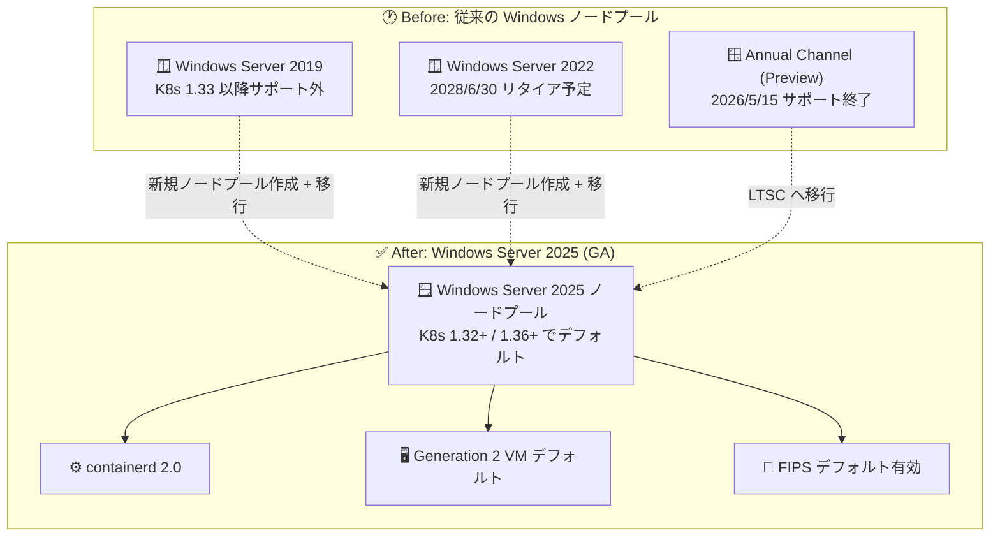

# Azure Kubernetes Service (AKS): Windows Server 2025 サポートの一般提供 (GA)

**リリース日**: 2026-09-01

**サービス**: Azure Kubernetes Service (AKS)

**機能**: Windows Server 2025 on AKS の一般提供 (GA)

**ステータス**: Launched (GA)

[このアップデートのインフォグラフィックを見る](https://takech9203.github.io/azure-news-summary/20260901-aks-windows-server-2025.html)

## 概要

Azure Kubernetes Service (AKS) で Windows Server 2025 ノードプールの一般提供 (GA) が発表されました。旧バージョンの Windows Server のサポート終了が近づく中、AKS 上で Windows ベースのワークロードを実行する組織にはモダナイズへの対応が求められており、本 GA はその移行先となる最新の LTSC (Long Term Servicing Channel) オプションを提供するものです。

Windows Server 2025 ノードプールでは、安定版 ABI (Stable ABI)、第 2 世代 (Generation 2) VM のデフォルト化、containerd 2.0、FIPS のデフォルト有効化といった改善が含まれます。Microsoft Learn のベストプラクティスでは、Windows Server 2025 はセキュリティとパフォーマンスが向上しており、AKS の Windows ノードプールで推奨される OS と位置付けられています。

なお、既存バージョンにはリタイア時期が設定されています。Windows Server 2019 は Kubernetes 1.33 以降でサポートされず、Windows Server 2022 は 2028 年 6 月 30 日にサポート終了 (Kubernetes 1.37 以降では利用不可)、Windows Server Annual Channel (プレビュー) は 2026 年 5 月 15 日にサポートが終了しています。Windows ワークロードを AKS で運用している場合、Windows Server 2025 への計画的な移行が重要です。

**アップデート前の課題**

- Windows Server 2019 は Kubernetes 1.33 以降でサポートされず、Windows Server 2022 も 2028 年 6 月 30 日のリタイアが予告されており、長期的な移行先となる GA 版の最新 OS 選択肢が必要だった
- Windows Server Annual Channel (プレビュー) は 2026 年 5 月 15 日にサポートが終了し、2027 年 5 月 15 日には既存ノードイメージが削除されるため、LTSC への移行が推奨されていた

**アップデート後の改善**

- Windows Server 2025 が GA となり、LTSC (3 年ごとにリリース、5 年間サポート) の最新バージョンとして本番環境で利用可能になった
- Generation 2 VM がデフォルトになり、containerd 2.0 を採用、FIPS がデフォルトで有効化されるなど、セキュリティとパフォーマンスが向上した
- Kubernetes 1.36 以降では Windows Server 2025 が Windows ノードプールのデフォルト OS となり、将来にわたる継続的な運用パスが明確になった

## アーキテクチャ図



従来の Windows Server 2019/2022 および Annual Channel のノードプールから、GA となった Windows Server 2025 ノードプールへの移行パスを示しています。移行は新しいノードプールを作成してワークロードを移し、旧ノードプールを廃止する方式で行います。

## サービスアップデートの詳細

### 主要機能

1. **安定版 ABI (Stable ABI)**
   - Windows Server 2025 の改善点として、安定版 ABI が提供されます

2. **Generation 2 VM のデフォルト化**
   - Windows での Generation 2 VM サポートは Windows Server 2022 から開始されましたが、Windows Server 2025 ではデフォルトになりました

3. **containerd 2.0 の採用**
   - Windows Server 2025 ノードプールではコンテナランタイムとして containerd 2.0 が使用されます

4. **FIPS のデフォルト有効化**
   - Windows Server 2025 では FIPS が必須であり、ノードプール作成時に `--enable-fips-image` を指定します

5. **Kubernetes 1.36 以降でのデフォルト OS 化**
   - Windows Server 2022 は Kubernetes 1.25〜1.35 のデフォルト、Windows Server 2025 は Kubernetes 1.36 以降のデフォルト OS です

## 技術仕様

| 項目 | 詳細 |
|------|------|
| OsType / OsSku | `windows` / `Windows2025` |
| サポート対象 Kubernetes バージョン | 1.32 以降 (1.36 以降ではデフォルト OS) |
| コンテナランタイム | containerd 2.0 |
| VM 世代 | Generation 2 VM がデフォルト |
| FIPS | 必須 (ノードプール作成時に `--enable-fips-image` を指定) |
| サービスチャネル | LTSC (3 年ごとにリリース、5 年間サポート) |
| 分離モード | プロセス分離のみサポート |
| ネットワーク | Azure CNI が必須 (kubenet は Windows 非対応)。Azure CNI Overlay が推奨 |
| サポートされるボリューム | Azure Disks、Azure Files (NTFS ボリュームとしてアクセス) |
| コンテナイメージ | ホスト OS バージョンと一致するイメージが必要 (Windows Server 2022 以降ベースのイメージ) |

### Windows Server バージョン別サポート状況

| バージョン | Kubernetes 対応 | リタイア時期 |
|-----------|----------------|-------------|
| Windows Server 2025 | 1.32 以降 (1.36 以降でデフォルト) | LTSC として 5 年間サポート |
| Windows Server 2022 | 1.25〜1.35 でデフォルト、1.37 以降は利用不可 | 2028 年 6 月 30 日 (ノードイメージは 2029 年 6 月 30 日に削除) |
| Windows Server 2019 | 1.33 以降はサポート外 (新規ノードプール作成不可) | - |
| Annual Channel (Preview) | - | 2026 年 5 月 15 日サポート終了 (ノードイメージは 2027 年 5 月 15 日に削除) |

## 設定方法

### 前提条件

1. Azure CLI 2.87.0 以降
2. Windows ノードプールをサポートするため、クラスターは Azure CNI ネットワークプラグインを使用すること
3. Windows Server ノードの管理者資格情報 (`--windows-admin-username` / `--windows-admin-password`、パスワードは 14 文字以上で複雑性要件を満たすこと)

### Azure CLI

```bash
# Windows ノードプール対応の AKS クラスターを作成 (Azure CNI を使用)
az aks create \
    --resource-group $RESOURCE_GROUP \
    --name $CLUSTER_NAME \
    --node-count 2 \
    --generate-ssh-keys \
    --windows-admin-username $WINDOWS_USERNAME \
    --windows-admin-password $WINDOWS_PASSWORD \
    --vm-set-type VirtualMachineScaleSets \
    --network-plugin azure

# Windows Server 2025 ノードプールを追加 (FIPS 有効イメージが必要)
az aks nodepool add \
    --resource-group $RESOURCE_GROUP \
    --cluster-name $CLUSTER_NAME \
    --os-type Windows \
    --os-sku Windows2025 \
    --enable-fips-image \
    --name npwin \
    --node-count 1
```

Kubernetes 1.36 以降のクラスターでは、OS SKU を指定しない場合でも Windows Server 2025 がデフォルトで使用されます。

### Windows ノードへのワークロード配置

Windows ノードで Pod を実行するには、マニフェストに nodeSelector を指定します。

```yaml
spec:
  nodeSelector:
    "kubernetes.io/os": windows
```

## メリット

### ビジネス面

- Windows Server 2019/2022 のサポート終了を見据えた、長期サポート (LTSC、5 年間) 付きの移行先が本番利用可能になった
- .NET Framework など Windows ネイティブアプリケーションのコンテナ化・モダナイズを、最新 OS 上で継続できる

### 技術面

- containerd 2.0、Generation 2 VM デフォルト化によるプラットフォームの最新化
- FIPS デフォルト有効化によるコンプライアンス・セキュリティ強化
- Kubernetes 1.36 以降でデフォルト OS となるため、クラスターアップグレードとの整合が取りやすい

## デメリット・制約事項

- Windows Server 2025 ノードプールは FIPS 有効イメージが必須 (`--enable-fips-image` の指定が必要)
- AKS はプロセス分離のみをサポートし、ホスト OS バージョンと一致するコンテナイメージが必要 (OS バージョン移行時はコンテナイメージの更新も必要)
- Windows ノードプールは Azure CNI が必須 (kubenet は非対応)
- ノード OS バージョンのアップグレードはインプレースでは行えず、新ノードプール作成 → ワークロード移行 → 旧ノードプール廃止の手順が必要
- Windows ノードではクライアントソース IP の保持が非サポート、External Traffic Policy が "Cluster" の場合はクラスターあたり約 500 サービスでポート枯渇の可能性があるなど、Windows 固有の制約は引き続き適用される

## ユースケース

### ユースケース 1: Windows Server 2019/2022 ノードプールからの移行

**シナリオ**: Kubernetes バージョンアップグレード (1.33 以降で WS2019 不可、1.37 以降で WS2022 不可) やリタイア時期 (WS2022 は 2028 年 6 月 30 日) に備え、既存の Windows ワークロードを Windows Server 2025 に移行する。

**実装例**:

```bash
# 1. Windows Server 2025 の新ノードプールを作成
az aks nodepool add \
    --resource-group $RESOURCE_GROUP \
    --cluster-name $CLUSTER_NAME \
    --os-type Windows \
    --os-sku Windows2025 \
    --enable-fips-image \
    --name npwin25 \
    --node-count 2

# 2. Windows Server 2025 対応のコンテナイメージでワークロードを新ノードプールへデプロイ
# 3. 動作確認後、旧ノードプールを削除
az aks nodepool delete \
    --resource-group $RESOURCE_GROUP \
    --cluster-name $CLUSTER_NAME \
    --name npwin22
```

**効果**: サポート終了前に計画的に最新 OS へ移行し、セキュリティパッチの継続提供とスケール操作の失敗リスク回避を実現できる。

### ユースケース 2: .NET Framework アプリケーションのモダナイズ

**シナリオ**: オンプレミスの Windows Server 上で稼働する .NET Framework アプリケーションをコンテナ化し、AKS の Windows Server 2025 ノードプールで運用する。

**効果**: Linux ノードプール (システムサービスや NGINX などのインフラコンポーネント) と Windows ノードプールを同一クラスターに共存させ、ハイブリッドなワークロードを一元管理できる。

## 料金

このアップデートに固有の料金情報は公式発表に記載されていません。Windows ノードプールのノード VM は通常の AKS の料金体系に従います。詳細は料金ページを参照してください。

- [AKS 料金ページ](https://azure.microsoft.com/pricing/details/kubernetes-service/)

## 関連サービス・機能

- **Azure CNI (Overlay / Dynamic IP Allocation)**: Windows ノードプールに必須のネットワークプラグイン。Azure CNI Overlay が推奨モード
- **Azure Disks / Azure Files**: Windows コンテナーでサポートされる永続ボリューム (NTFS としてマウント)
- **Managed Prometheus / Managed Grafana**: Windows Exporter により Windows ノード・Pod のメトリックを監視 (`--enable-windows-recording-rules` の指定が必要)
- **gMSA (Group Managed Service Accounts)**: Windows コンテナーの Active Directory 認証をサポート (GA)
- **AKS release tracker / AKS release notes**: 月次の Windows ノードイメージ更新とリタイア情報の追跡

## 参考リンク

- [インフォグラフィック](https://takech9203.github.io/azure-news-summary/20260901-aks-windows-server-2025.html)
- [公式アップデート情報](https://azure.microsoft.com/updates?id=570090)
- [Windows containers のベストプラクティス (Windows OS version)](https://learn.microsoft.com/azure/aks/windows-best-practices)
- [Windows Server on AKS FAQ](https://learn.microsoft.com/azure/aks/windows-faq)
- [クイックスタート: Windows Server コンテナーのデプロイ (Azure CLI)](https://learn.microsoft.com/azure/aks/learn/quick-windows-container-deploy-cli)
- [Windows Server 2022 リタイア発表 (Azure Updates)](https://azure.microsoft.com/updates?id=ws2022-retirement-aks)
- [AKS 料金ページ](https://azure.microsoft.com/pricing/details/kubernetes-service/)

## まとめ

Windows Server 2025 が AKS で GA となり、Windows ワークロードの長期的な移行先が確定しました。containerd 2.0、Generation 2 VM デフォルト化、FIPS デフォルト有効化などプラットフォームの近代化が図られており、Kubernetes 1.36 以降ではデフォルト OS となります。Windows Server 2019 は Kubernetes 1.33 以降で利用できず、Windows Server 2022 も 2028 年 6 月 30 日にリタイア、Annual Channel (プレビュー) は既にサポート終了しているため、AKS で Windows ワークロードを運用している組織は、Windows Server 2025 ノードプールへの移行計画 (新ノードプール作成、コンテナイメージ更新、旧プール廃止) の策定を早期に開始することを推奨します。

---

**タグ**: Azure Kubernetes Service, AKS, Windows Server 2025, Windows Containers, Compute, Containers, GA
