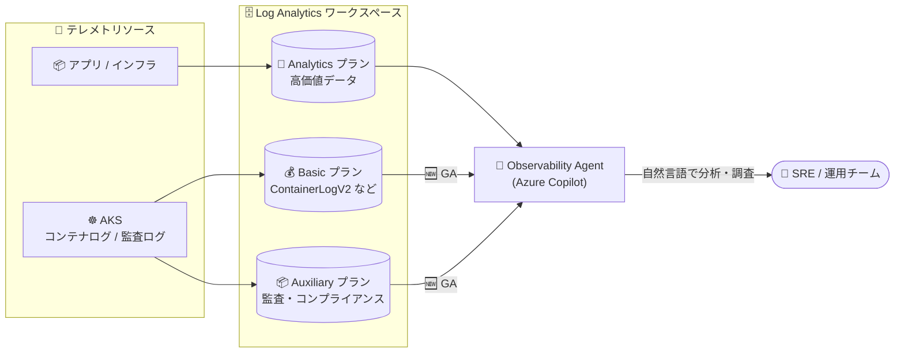

# Azure Monitor / Azure Copilot: Observability Agent が Basic・Auxiliary テーブルプランに対応

**リリース日**: 2026-09-01

**サービス**: Azure Monitor / Azure Copilot

**機能**: Observability Agent による Basic・Auxiliary テーブルプランのデータ分析対応

**ステータス**: Launched (GA)

[このアップデートのインフォグラフィックを見る](https://takech9203.github.io/azure-news-summary/20260901-azure-copilot-observability-agent-table-plans.html)

## 概要

Azure Monitor の AI 搭載運用支援機能である Azure Copilot Observability Agent が、対話型分析 (Chat with your data) および詳細調査 (Deep Investigation) において、Basic および Auxiliary テーブルプランに格納された Log Analytics データに対応し、一般提供 (GA) となりました。

Observability Agent は、自然言語によるログ・メトリック・テレメトリの探索、インシデント発生時のガイド付き調査、Azure Monitor issues による調査コンテキストの保存などを提供する AI エージェントです。今回のアップデートにより、コンテナの stdout/stderr (ContainerLogV2)、AKS 監査ログ、コントロールプレーンログ、ノードの syslog といった大量のテレメトリを低コストの Basic / Auxiliary テーブルプランに移行しても、エージェントによる AI 分析の対象として活用し続けられるようになります。

対象テーブルがすでに Basic または Auxiliary プランを使用している場合、ユーザー側の追加構成は不要です。エージェントはこれらのデータをメトリック、トレース、トポロジ、Azure リソースコンテキストと組み合わせて分析します。

**アップデート前の課題**

- 大量のテレメトリ (コンテナログ、監査ログなど) を低コストのテーブルプランに移行すると、AI エージェントによる分析対象から外れるという、コスト最適化と可観測性のトレードオフがあった

**アップデート後の改善**

- Basic / Auxiliary プランのテーブルも Observability Agent の対話型分析・詳細調査の対象となり、コスト効率の高いプランに移行しても AI 支援の運用分析を維持できる
- ContainerLogV2、AKS 監査ログ、コントロールプレーンログなどの高ボリュームテレメトリを Basic プランの候補にでき、ログコストを削減しやすくなった
- 追加設定不要で、既存の Basic / Auxiliary テーブルがそのまま分析対象になる

## アーキテクチャ図

従来からの Analytics プランに加え、Basic / Auxiliary プランのテーブルも Observability Agent の分析対象となり、ユーザーは自然言語ですべてのプランのログデータを横断的に調査できます。

## サービスアップデートの詳細

### 主要機能

1. **対話型分析 (Chat with your data) での Basic / Auxiliary データ対応**
   - 自然言語でログ・メトリック・関連テレメトリを探索する際に、Basic / Auxiliary プランのテーブルに格納されたデータも対象になる
   - 複雑な KQL クエリを書かずに、パターンの特定や関係性の理解が可能

2. **詳細調査 (Deep Investigation) での Basic / Auxiliary データ対応**
   - インシデント発生時に、アプリケーション・インフラ・Azure プラットフォームの各レイヤーからシグナルを収集・自動相関する調査で、Basic / Auxiliary プランのデータも活用される
   - 調査結果は Azure Monitor issues として保存し、チームで共有可能

3. **コスト最適化との両立**
   - ContainerLogV2、AKS 監査ログ、コントロールプレーンログといった高ボリュームテレメトリを Basic プランの候補にできる
   - 対象テーブルがすでに Basic / Auxiliary プランの場合、追加構成は不要

## 技術仕様

Log Analytics テーブルプランの比較 (Microsoft Learn より):

| 項目 | Analytics | Basic | Auxiliary |
|------|-----------|-------|-----------|
| 主な用途 | 継続監視・リアルタイム検知用の高価値データ | トラブルシューティング・インシデント対応用データ | 監査・コンプライアンス用の低頻度アクセスデータ |
| 取り込みコスト | 標準 | 低減 | 最小 |
| クエリ料金 | 込み | 別途 (スキャン量課金) | 別途 (スキャン量課金) |
| クエリ性能 | 最適化済み | 最適化済み | 未最適化 (低速) |
| KQL | フル機能 | 単一テーブルに限定 (lookup / union で Analytics テーブル最大 5 個まで拡張可) | 単一テーブルに限定 (同左) |
| クエリ可能な時間範囲 | 分析retention期間 | 過去 30 日まで | 総保持期間全体 |
| アラート | 対応 | Simple Log Alerts のみ | 非対応 |
| 総保持期間 | 最大 12 年 | 最大 12 年 | 最大 12 年 |

Observability Agent の主な制限事項 (Microsoft Learn より):

| 項目 | 詳細 |
|------|------|
| 会話の継続 | 同一会話は 24 時間まで |
| 言語サポート | 英語のみ完全サポート (他言語は限定的) |
| 暗号化 | カスタマーマネージドキー (CMK) は未対応 (Microsoft マネージドキーで暗号化) |
| 詳細調査の最適化対象 | AKS、Application Insights、仮想マシン上の分散システム |

## 設定方法

### 前提条件

1. Azure Copilot へのアクセス権 (Azure Copilot のアクセス制御が Observability Agent の利用を制御)
2. クエリ対象の Log Analytics ワークスペースへの `Microsoft.OperationalInsights/workspaces/query/*/read` 権限 (例: Log Analytics Reader ロール)
3. Basic / Auxiliary プランは従来 (レガシー) 価格レベルのワークスペースでは利用不可

### 利用手順

- Observability Agent のチャット・詳細調査は、リソースのプロビジョニングやセットアップなしで即座に利用可能
- 対象テーブルがすでに Basic / Auxiliary プランを使用している場合、今回の機能に関する追加構成は不要
- テーブルプランの変更方法は [Select a table plan](https://learn.microsoft.com/azure/azure-monitor/logs/logs-table-plans) を参照

## メリット

### ビジネス面

- 高ボリュームテレメトリを低コストプランへ移行してもAI 分析の対象に残せるため、可観測性を犠牲にせずログコストを削減できる
- インシデント調査の時間短縮 (time to understanding の短縮) と、調査コンテキストの保存・引き継ぎによるチーム運用の一貫性向上

### 技術面

- Basic / Auxiliary プランのデータをメトリック、トレース、トポロジ、Azure リソースコンテキストと組み合わせた横断的な分析が可能
- KQL の単一テーブル制約など Basic / Auxiliary プランのクエリ制限を意識せずに、自然言語でデータを探索できる
- 追加構成不要で既存環境にそのまま適用される

## デメリット・制約事項

- Basic / Auxiliary テーブルへのクエリはスキャンしたデータ量に基づき課金されるため、大量データへの頻繁な分析はクエリコストに注意が必要
- Basic テーブルの対話型クエリは過去 30 日までの時間範囲に制限される (それ以前のデータは検索ジョブが必要)
- Auxiliary テーブルのクエリは最適化されておらず、Analytics / Basic テーブルより応答が遅い場合がある
- Observability Agent 自体の制限 (会話は 24 時間まで、英語のみ完全サポート、CMK 未対応) は引き続き適用される

## 料金

Basic / Auxiliary テーブルのクエリは、クエリがスキャンするデータ量 (クエリの時間範囲内に取り込まれたデータ量) に基づいて課金されます。例えば、1 日あたり 100 GB を取り込むテーブルに対して 3 日分をスキャンするクエリは 300 GB 分が課金対象となります。

詳細は [Azure Monitor の料金ページ](https://azure.microsoft.com/pricing/details/monitor/) を参照してください。

## 利用可能リージョン

Observability Agent は Japan East、Japan West を含む 40 以上のリージョンで利用可能です (一部の処理はリージョン単位ではなく地理的単位で実行)。最新のリージョン一覧は [Observability Agent の概要ドキュメント](https://learn.microsoft.com/azure/azure-monitor/aiops/observability-agent-overview#regions) を参照してください。

## 関連サービス・機能

- **Azure Monitor / Log Analytics**: Observability Agent の分析対象となるログデータの格納基盤。テーブルプラン (Analytics / Basic / Auxiliary) によるコスト階層化を提供
- **Azure Copilot**: Observability Agent へのアクセスは Azure Copilot のアクセス管理で制御される
- **Azure Kubernetes Service (AKS)**: ContainerLogV2、監査ログ、コントロールプレーンログなど、Basic プラン候補となる高ボリュームテレメトリの主要な発生源。詳細調査の最適化対象でもある
- **Azure Monitor issues (プレビュー)**: 詳細調査の結果を保存し、チームで共有・フォローアップするための機能

## 参考リンク

- [インフォグラフィック](https://takech9203.github.io/azure-news-summary/20260901-azure-copilot-observability-agent-table-plans.html)
- [公式アップデート情報](https://azure.microsoft.com/updates?id=570250)
- [Azure Copilot Observability Agent の概要 (Microsoft Learn)](https://learn.microsoft.com/azure/azure-monitor/aiops/observability-agent-overview)
- [Basic / Auxiliary テーブルのクエリ (Microsoft Learn)](https://learn.microsoft.com/azure/azure-monitor/logs/basic-logs-query)
- [Azure Monitor Logs のテーブルプラン (Microsoft Learn)](https://learn.microsoft.com/azure/azure-monitor/logs/data-platform-logs#table-plans)
- [料金ページ (Azure Monitor)](https://azure.microsoft.com/pricing/details/monitor/)

## まとめ

このアップデートにより、「ログコストの最適化」と「AI 支援による運用分析」のトレードオフが解消されました。ContainerLogV2 や AKS 監査ログなどの高ボリュームテレメトリを Basic / Auxiliary プランに移行してコストを削減しつつ、Observability Agent による対話型分析・詳細調査の対象として活用し続けられます。すでに Observability Agent を利用しているチームは追加構成なしで恩恵を受けられるため、これを機に高ボリュームテーブルのプラン見直し (Analytics → Basic / Auxiliary への移行) を検討する価値があります。ただし、Basic / Auxiliary プランのクエリはスキャン量課金である点と、Basic テーブルの対話型クエリは過去 30 日までという制限には注意してください。

---

**タグ**: Azure Monitor, Azure Copilot, Log Analytics, Observability Agent, AIOps, DevOps, Management and governance, GA
