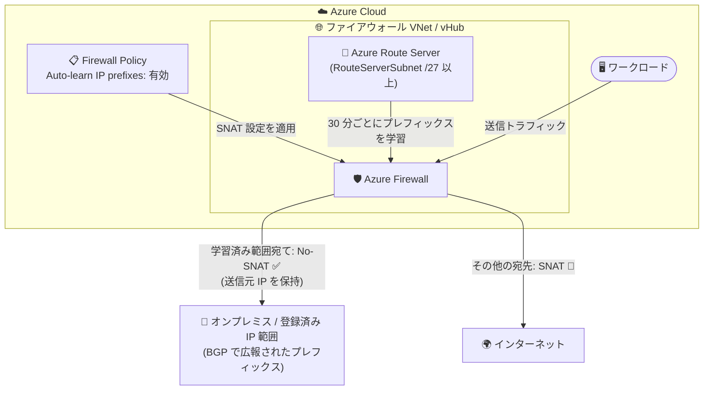

# Azure Firewall: Auto-learn SNAT routes の一般提供開始 (GA)

**リリース日**: 2026-09-01

**サービス**: Azure Firewall

**機能**: Auto-learn SNAT routes (SNAT ルートの自動学習)

**ステータス**: Launched (GA)

[このアップデートのインフォグラフィックを見る](https://takech9203.github.io/azure-news-summary/20260901-azure-firewall-auto-learn-snat-routes.html)

## 概要

Azure Firewall の Auto-learn SNAT routes (SNAT ルートの自動学習) 機能が一般提供 (GA) となりました。この機能を有効にすると、Azure Firewall は登録済み (registered) およびプライベートの宛先 IP プレフィックスを 30 分ごとに定期的に自動学習し、それらを No-SNAT 範囲として適用します。学習された範囲宛てのトラフィックは SNAT されないため、元の送信元 IP アドレスが保持されます。

Azure Firewall は既定では、宛先 IP が IANA RFC 1918 (プライベートアドレス) または RFC 6598 (共有アドレス空間) の範囲内にある場合、ネットワークルールで処理されるトラフィックを SNAT しません。しかし、組織が RFC 1918 / RFC 6598 以外の登録済み IP アドレス範囲を内部ネットワークとして利用している場合、既定ではそれらの宛先へのトラフィックがファイアウォールのプライベート IP に SNAT されてしまい、送信元が隠蔽されるという課題がありました。

Auto-learn SNAT routes は Azure Route Server との連携により BGP で学習したプレフィックスを内部ネットワークとして扱うことで、この SNAT 除外設定を自動化します。仮想ネットワーク (VNet) デプロイとセキュリティで保護された仮想ハブ (vHub) デプロイの両方でサポートされます。

**アップデート前の課題**

- RFC 1918 / RFC 6598 以外の登録済み IP 範囲を内部ネットワークとして使う場合、SNAT を回避するには管理者が SNAT プライベート IP 範囲 (例: `x.x.x.x/24`) を手動で指定・維持する必要があった
- ネットワーク構成の変更 (オンプレミス側のプレフィックス追加など) のたびに、ファイアウォールポリシーの SNAT 範囲リストを更新する運用負荷が発生していた
- SNAT により元の送信元 IP が隠蔽され、宛先側でのアクセス制御やログ分析に支障が出るケースがあった

**アップデート後の改善**

- 登録済み・プライベートの宛先プレフィックスを 30 分ごとに自動学習し、No-SNAT 範囲として自動適用
- 学習済み範囲宛てのトラフィックで元の送信元 IP アドレスが保持される
- SNAT 除外リストの手動メンテナンスが不要になり、SNAT 管理が簡素化される
- VNet デプロイと vHub (secured virtual hub) デプロイの両方に対応

## アーキテクチャ図



Azure Route Server が BGP で受信したプレフィックスを Azure Firewall が定期的に学習し、学習済み範囲宛てのトラフィックは SNAT せずに元の送信元 IP のまま転送します。それ以外の宛先 (インターネットなど) は従来どおり SNAT されます。

## サービスアップデートの詳細

### 主要機能

1. **登録済み・プライベートプレフィックスの自動学習**
   - Azure Firewall が 30 分ごとに登録済み (registered) およびプライベートの IP アドレス範囲を自動学習する
   - 学習されたアドレス範囲はネットワーク内部として扱われ、その範囲宛てのトラフィックは SNAT されない

2. **Azure Route Server との連携**
   - 自動学習には Azure Firewall と Azure Route Server の関連付けが必須
   - VNet デプロイでは、ファイアウォールと同じ仮想ネットワークに Azure Route Server をデプロイする
   - vHub デプロイでは Azure Route Server が既定でデプロイ・関連付け済みのため、ポリシーで有効化するだけでよい

3. **Firewall Policy での有効化**
   - どちらのデプロイモデルでも、関連付け完了後に Azure Firewall Policy で auto-learn を有効化する
   - ポータルの「Learned SNAT IP Prefixes」ブレードで学習済みプレフィックスを確認できる

## 技術仕様

| 項目 | 詳細 |
|------|------|
| 学習間隔 | 30 分ごと |
| 学習対象 | 登録済み (registered) およびプライベートの IP アドレス範囲 |
| 学習後の動作 | 学習済み範囲宛てのトラフィックは SNAT されない (No-SNAT) |
| 対象デプロイモデル | VNet デプロイ、セキュリティで保護された仮想ハブ (vHub) デプロイ |
| 必須コンポーネント | Azure Route Server との関連付け |
| VNet デプロイの要件 | ファイアウォールの VNet 内に **RouteServerSubnet** (最小 /27) と Azure Route Server が必要 |
| 有効化の場所 | Azure Firewall Policy の SNAT 設定 (`autoLearnPrivateRanges: Enabled`) |
| 設定手段 | Azure portal、Azure PowerShell、ARM テンプレート (**Azure CLI は非対応**) |
| SNAT 除外の適用範囲 | ネットワークルールのみ (アプリケーションルールは常に SNAT) |
| 学習済みプレフィックスの確認 | `Get-AzFirewallLearnedIpPrefix` またはポータルの「Learned SNAT IP Prefixes」 |

## 設定方法

### 前提条件

1. Azure Firewall と Azure Route Server の関連付けが必要
2. VNet デプロイの場合: ファイアウォールの仮想ネットワーク内に **RouteServerSubnet** という名前のサブネット (サイズ /27 以上) を作成し、同じ VNet に Azure Route Server をデプロイする
3. vHub デプロイの場合: Azure Route Server は既定でデプロイ・関連付け済みのため、追加のデプロイは不要
4. 関連付け完了後、Azure Firewall Policy で auto-learn SNAT を有効化する

### Azure PowerShell (VNet デプロイの例)

```powershell
# Route Server を既存のファイアウォールに関連付け
$routeServerId = "/subscriptions/<sub-id>/resourceGroups/<rg>/providers/Microsoft.Network/virtualHubs/<route-server-name>"
$azFirewall = Get-AzFirewall -Name $azureFirewallName -ResourceGroupName $rgname
$azFirewall.RouteServerId = $routeServerId
Set-AzFirewall -AzureFirewall $azFirewall

# Firewall Policy で auto-learn を有効化
$snat = New-AzFirewallPolicySnat -PrivateRange $privateRange -AutoLearnPrivateRange
$azureFirewallPolicy.Snat = $snat
Set-AzFirewallPolicy -InputObject $azureFirewallPolicy

# 学習済みプレフィックスの確認
Get-AzFirewallLearnedIpPrefix -Name $azureFirewallName -ResourceGroupName $rgname
```

### ARM テンプレート (Firewall Policy)

```json
{
   "type": "Microsoft.Network/firewallPolicies",
   "apiVersion": "2024-05-01",
   "properties": {
      "snat": {
         "autoLearnPrivateRanges": "Enabled"
      }
   }
}
```

### Azure Portal

**VNet ファイアウォールの場合:**

1. ファイアウォールを選択し、「Learned SNAT IP Prefixes」で Route Server を追加する
2. ファイアウォールポリシーの「Private IP ranges (SNAT)」で「Auto-learn IP prefixes」を有効にして「Apply」を選択する
3. ファイアウォールの「Learned SNAT IP Prefixes」で学習済みルートを確認する

**vHub ファイアウォールの場合:**

1. ファイアウォールポリシーの「Private IP ranges (SNAT)」で「Auto-learn IP prefixes」を有効にして「Apply」を選択する
2. ファイアウォールの「Learned SNAT IP Prefixes」で学習済みルートを確認する

## メリット

### ビジネス面

- SNAT 除外リストの手動メンテナンスが不要になり、ネットワーク運用の負荷とヒューマンエラーのリスクを削減できる
- GA となったため、本番環境で SLA の対象として安心して利用できる

### 技術面

- 元の送信元 IP アドレスが保持されるため、宛先側 (オンプレミスのファイアウォールやサーバー) での送信元ベースのアクセス制御・監査ログ分析が正確に行える
- RFC 1918 / RFC 6598 以外の登録済み IP 範囲を内部ネットワークとして使う環境でも、SNAT 動作を自動的に最適化できる
- ネットワーク構成の変更 (プレフィックスの追加・削除) が BGP 経由で 30 分ごとに自動反映される

## デメリット・制約事項

- **Azure Route Server が必須**: VNet デプロイでは、ファイアウォールと同じ VNet に RouteServerSubnet (最小 /27) と Azure Route Server を追加でデプロイする必要がある
- **Azure CLI 非対応**: auto-learn SNAT routes の構成は Azure CLI ではサポートされず、ARM テンプレート、Azure PowerShell、Azure portal を使用する必要がある
- **ネットワークルールのみに適用**: SNAT 除外 (プライベート範囲設定) はネットワークルールにのみ適用され、アプリケーションルールは宛先にかかわらず常に SNAT される
- **学習間隔は 30 分**: プレフィックスの学習は 30 分ごとの定期実行であり、即時反映ではない
- Firewall Policy に関連付けられたファイアウォールでは、SNAT 範囲はポリシー側で指定する必要がある (ファイアウォールの `PrivateRange` / `AdditionalProperties` は無視される)

## ユースケース

### ユースケース 1: 登録済みパブリック IP 範囲を内部ネットワークとして使用するハイブリッド環境

**シナリオ**: オンプレミスネットワークで RFC 1918 以外の自社登録済み IP 範囲を使用しており、Azure からオンプレミスへの通信で送信元 IP を保持したい。従来はこれらの範囲を SNAT プライベート範囲として手動登録・更新する必要があった。

**実装例**:

```powershell
# Route Server 関連付け後、ポリシーで auto-learn を有効化
$snat = New-AzFirewallPolicySnat -PrivateRange @("IANAPrivateRanges") -AutoLearnPrivateRange
$policy = Get-AzFirewallPolicy -Name "hub-fw-policy" -ResourceGroupName "rg-network"
$policy.Snat = $snat
Set-AzFirewallPolicy -InputObject $policy
```

**効果**: オンプレミス側で BGP 広報されたプレフィックスが自動的に No-SNAT 範囲として学習され、手動メンテナンスなしで送信元 IP が保持される。

### ユースケース 2: Virtual WAN (secured virtual hub) での SNAT 管理の簡素化

**シナリオ**: Azure Virtual WAN のセキュリティで保護された仮想ハブに Azure Firewall をデプロイしており、複数の拠点・VNet のプレフィックスに対する SNAT 除外を一元管理したい。

**実装例**: vHub では Azure Route Server が既定で関連付け済みのため、ファイアウォールポリシーの「Private IP ranges (SNAT)」で「Auto-learn IP prefixes」を有効化するだけでよい。

**効果**: 拠点の追加やアドレス変更のたびにポリシーを編集する必要がなくなり、Virtual WAN 全体の SNAT 管理が簡素化される。

## 料金

Auto-learn SNAT routes 機能自体に関する追加料金の記載は確認できませんでした。Azure Firewall の料金は、固定料金 (デプロイ時間単価) と従量料金 (データ処理量あたりの GB 単価) の組み合わせで構成されます。

| 項目 | Basic | Standard | Premium |
|------|-------|----------|---------|
| デプロイ料金 | 時間単価 | 時間単価 | 時間単価 |
| データ処理料金 | GB 単価 | GB 単価 | GB 単価 |
| キャパシティユニット (オプション) | 提供なし | 時間単価 | 時間単価 |

具体的な単価はリージョンにより異なるため、[Azure Firewall 料金ページ](https://azure.microsoft.com/pricing/details/azure-firewall/)を参照してください。なお、VNet デプロイで auto-learn を利用する場合は Azure Route Server のデプロイが別途必要となるため、[Azure Route Server の料金](https://azure.microsoft.com/pricing/details/route-server/)も考慮してください。

## 関連サービス・機能

- **Azure Route Server**: auto-learn SNAT routes の必須コンポーネント。BGP でプレフィックスを学習し、Azure Firewall に提供する。VNet デプロイでは同一 VNet へのデプロイが必要
- **Azure Virtual WAN (secured virtual hub)**: vHub デプロイでは Azure Route Server が既定で関連付け済みのため、ポリシーでの有効化のみで利用可能
- **Azure Firewall Manager**: VNet / vHub のアーキテクチャ選択とファイアウォールポリシーの一元管理に利用
- **Azure Firewall Policy**: auto-learn の有効化 (`autoLearnPrivateRanges`) や SNAT プライベート範囲の設定を行う管理リソース

## 参考リンク

- [インフォグラフィック](https://takech9203.github.io/azure-news-summary/20260901-azure-firewall-auto-learn-snat-routes.html)
- [公式アップデート情報](https://azure.microsoft.com/updates?id=570474)
- [Microsoft Learn: Azure Firewall SNAT private IP address ranges](https://learn.microsoft.com/azure/firewall/snat-private-range)
- [Microsoft Learn: Azure Route Server の構成 (クイックスタート)](https://learn.microsoft.com/azure/route-server/quickstart-configure-route-server-portal)
- [Microsoft Learn: Azure Firewall Manager のアーキテクチャオプション](https://learn.microsoft.com/azure/firewall-manager/vhubs-and-vnets)
- [料金ページ](https://azure.microsoft.com/pricing/details/azure-firewall/)

## まとめ

Azure Firewall の Auto-learn SNAT routes が GA となり、登録済み・プライベートの宛先プレフィックスを 30 分ごとに自動学習して No-SNAT 範囲として適用できるようになりました。RFC 1918 以外の IP 範囲を内部ネットワークとして使うハイブリッド環境や Virtual WAN 環境で、SNAT 除外リストの手動メンテナンスを不要にし、送信元 IP の保持を自動化できます。Azure Route Server との関連付けが必須である点、Azure CLI では構成できない点、SNAT 除外がネットワークルールにのみ適用される点に留意しつつ、SNAT 範囲を手動管理している環境では本機能への移行を検討することを推奨します。

---

**タグ**: Azure Firewall, Networking, Security, SNAT, Azure Route Server, Virtual WAN, GA
