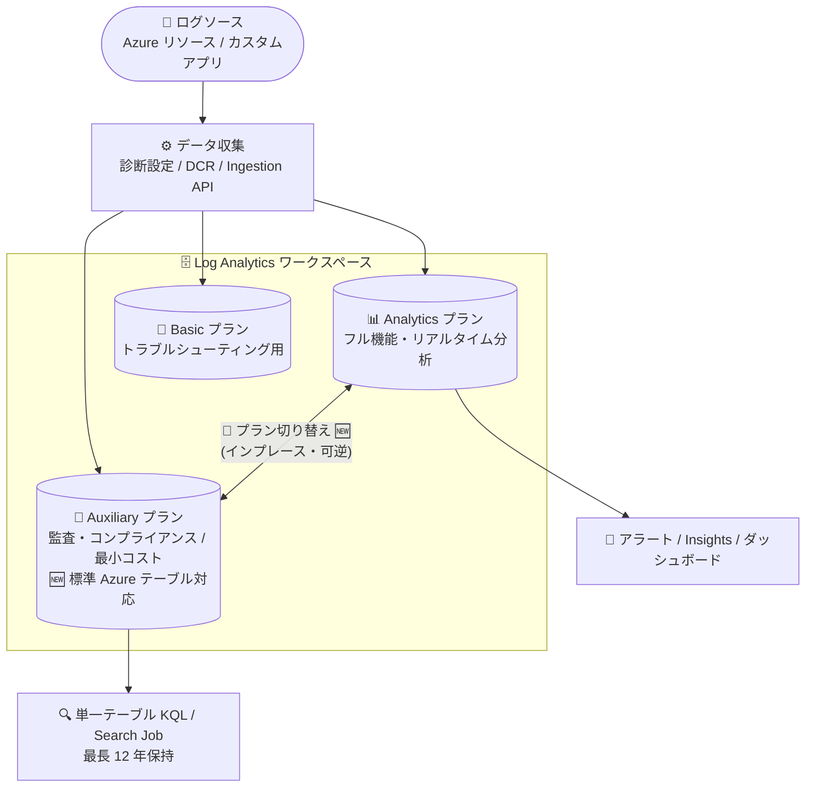

# Azure Monitor: Auxiliary Logs プランの Azure テーブル対応・プラン切り替え・ソブリンクラウド対応が GA

**リリース日**: 2026-09-01

**サービス**: Azure Monitor (Log Analytics)

**機能**: Auxiliary Logs プラン - Azure テーブル対応 / プラン切り替え / Azure Government・China リージョン対応

**ステータス**: Launched (GA)

[このアップデートのインフォグラフィックを見る](https://takech9203.github.io/azure-news-summary/20260901-azure-monitor-auxiliary-logs-ga-updates.html)

## 概要

Azure Monitor Logs の Auxiliary テーブルプランに関する 2 つのアップデートが同時に一般提供 (GA) されました。Auxiliary プランは、コンプライアンスや監査目的で保持するがほとんどクエリしない、大量・冗長なログを低コストで取り込み・保持するためのテーブルプランです。

**アップデート 1: ソブリンクラウド対応 (Updates ID: 569899)** — Auxiliary Logs プランがソブリンクラウドである Azure Government (Fairfax) および China リージョンで一般提供されました。政府機関や中国リージョンを利用する組織でも、監査・コンプライアンス用ログの低コスト保持が利用可能になります。

**アップデート 2: Azure テーブル対応とプラン切り替え (Updates ID: 569904)** — 要望の多かった 2 つの機能が GA になりました。(1) 従来の DCR ベースのカスタムテーブル (`_CL`) に加えて、標準 Azure テーブルの一部で Auxiliary プランが利用可能になりました。低価値データをカスタムパイプラインで変換することなく、元の標準テーブルのまま (テーブル名・スキーマ・既存クエリを維持して) 低コストプランに移行できます。(2) 既存テーブルを Analytics プランと Auxiliary プランの間で、テーブルを再作成せずにインプレースで切り替えられるようになりました。履歴・スキーマ・インテグレーションを維持したまま切り替えでき、ワークロードの変化に応じて完全に元に戻すことも可能です。

**アップデート前の課題**

- Auxiliary プランは DCR ベースのカスタムテーブル (`_CL`) のみ対応しており、標準 Azure テーブルのデータを低コストで保持するには、カスタムパイプラインを構築してデータを再形成 (カスタムテーブルへ転送) する必要があった
- 既存テーブルのプランを Analytics から Auxiliary に (またはその逆に) 変更する手段がなく、テーブルの再作成が必要だった
- Auxiliary プランはソブリンクラウド (Azure Government / China) では利用できなかった

**アップデート後の改善**

- 標準 Azure テーブルの一部 (AuditLogs、CommonSecurityLog、AKSAudit、AWSCloudTrail など) を Auxiliary プランで直接運用でき、テーブル名・スキーマ・既存クエリを維持したまま低コスト化が可能
- Analytics ⇔ Auxiliary のプラン切り替えがインプレースで可能になり、履歴・スキーマ・インテグレーションを維持しつつ、完全に可逆的に変更できる
- Azure Government (Fairfax) と China リージョンで Auxiliary Logs が GA となり、ソブリンクラウドでも利用可能

## アーキテクチャ図



3 つのテーブルプランへのデータフローと、今回 GA になった Analytics ⇔ Auxiliary のインプレースなプラン切り替えを示しています。Auxiliary プランは監査・コンプライアンス用途向けに最小コストで最長 12 年のデータ保持が可能です。

## サービスアップデートの詳細

### 主要機能

1. **標準 Azure テーブルの Auxiliary プラン対応**
   - 従来は DCR ベースのカスタムテーブル (`_CL`) のみが対象だったが、標準 Azure テーブルの一部でも Auxiliary プランを選択可能になった
   - テーブル名・スキーマ・既存クエリをそのまま維持できるため、カスタムパイプラインでデータを再形成する必要がない
   - 対応テーブルの例: `AuditLogs` (Entra ID 監査ログ)、`AADManagedIdentitySignInLogs`、`CommonSecurityLog` (CEF)、`AKSAudit`、`AWSCloudTrail`、`AZFWNetworkRule`、`DeviceEvents` など (対応状況はテーブルごとに異なる。[Logs table feature support](https://learn.microsoft.com/azure/azure-monitor/reference/tables-features) を参照)

2. **プラン切り替え (Plan Switching)**
   - 既存テーブルを Analytics プランと Auxiliary プランの間で、テーブルを再作成せずにインプレースで切り替え可能
   - 履歴データ・スキーマ・インテグレーションを維持したまま変更でき、完全に可逆的
   - 切り替えは **1 テーブルあたり週 1 回まで** に制限される
   - Azure Portal / Azure CLI / PowerShell / REST API で変更可能

3. **ソブリンクラウド対応**
   - Azure Government (Fairfax) および China リージョンで Auxiliary Logs プランが GA
   - Auxiliary プランの利用可能リージョンは、Qatar Central を除き Log Analytics の提供リージョンと一致

## 技術仕様

Analytics / Basic / Auxiliary プランの機能比較 (Microsoft Learn より):

| 項目 | Analytics | Basic | Auxiliary / Lake |
|------|-----------|-------|------------------|
| 主な用途 | 継続監視・リアルタイム検知・高度な分析 | トラブルシューティング・インシデント対応 | 監査・コンプライアンス用の低頻度アクセスデータ |
| 対応テーブル | すべて | 対応 Azure テーブル + DCR ベースカスタムテーブル | 対応 Azure テーブル + DCR ベースカスタムテーブル 🆕 |
| 取り込みコスト | 標準 | 低減 | 最小 |
| クエリ料金 | 込み | 別途 (スキャン GB 単位) | 別途 (スキャン GB 単位) |
| クエリ性能 | 最適化済み | 最適化済み | 低速 (リアルタイム分析には非推奨) |
| クエリ機能 | フル KQL | 単一テーブル KQL (Analytics テーブルとの `lookup` 可) | 単一テーブル KQL (Analytics テーブルとの `lookup` 可) |
| アラート | ✅ | ✅ (Simple Log Alerts) | ❌ |
| Insights / Restore / データエクスポートルール | ✅ | 一部対応 | ❌ |
| Microsoft Sentinel / Search Job | ✅ | ✅ | ✅ |
| Summary Rules | ✅ | ✅ (単一テーブル KQL) | ✅ (単一テーブル KQL) |
| 合計保持期間 | 最長 12 年 | 最長 12 年 | 最長 12 年 |

**プラン切り替え時の考慮事項:**

| 切り替え | 考慮事項 |
|----------|----------|
| Analytics → Auxiliary | アラートが動作しなくなる。クエリに追加課金 (Summary Rule クエリ含む)。リソースクエリスコープを使用する Summary Rule は動作しなくなる |
| Auxiliary → Analytics | フル機能が利用可能になるが、コストは増加する |
| 頻度制限 | プラン変更は 1 テーブルあたり週 1 回まで |

**プラン切り替え後のデータアクセス (データ継続性):**

- 切り替え前に取り込まれたデータは削除・移動されず、保持期間中保持される
- **Analytics → Auxiliary**: Analytics 期間中のデータは対話型クエリで引き続き参照可能 (切り替え日をまたぐクエリは部分的な結果になる場合があり、警告が表示される)
- **Auxiliary → Analytics**: Auxiliary 期間中のデータは対話型クエリでは参照不可。Search Job または `search` REST API でアクセスする

## 設定方法

### 前提条件

1. プラン変更には `Microsoft.OperationalInsights/workspaces/write` および `microsoft.operationalinsights/workspaces/tables/write` 権限が必要 (例: Log Analytics Contributor ロール)
2. 対象テーブルが Auxiliary プランをサポートしていること ([Logs table feature support](https://learn.microsoft.com/azure/azure-monitor/reference/tables-features) で確認)
3. Basic / Auxiliary プランはレガシー価格レベルのワークスペースでは利用不可

### REST API

```bash
# テーブルプランを Auxiliary に変更
PATCH https://management.azure.com/subscriptions/{SubscriptionId}/resourceGroups/{ResourceGroupName}/providers/Microsoft.OperationalInsights/workspaces/{WorkspaceName}/tables/{TableName}?api-version={ApiVersion}

{
  "properties": {
    "plan": "Auxiliary"
  }
}
```

Azure CLI では `az monitor log-analytics workspace table update --plan` で変更できます。

### Azure Portal

1. **Log Analytics ワークスペース** メニューから **テーブル** を選択
2. 対象テーブルのコンテキストメニューから **テーブルの管理** を選択
3. **テーブルプラン** ドロップダウンから **Analytics** / **Basic** / **Auxiliary / Lake** を選択 (選択したテーブルで利用可能なプランのみ表示される)
4. **保存** を選択

## メリット

### ビジネス面

- 監査・コンプライアンス用の大量ログを最小コストで最長 12 年保持でき、ログ保持コストを大幅に削減できる
- Azure Government / China リージョンの GA により、政府機関や中国でビジネスを行う組織もコンプライアンス要件を低コストで満たせる
- プラン切り替えが可逆的なため、ロックインなしにコスト最適化を試行できる

### 技術面

- 標準 Azure テーブルをそのまま Auxiliary プランで運用でき、カスタムパイプラインの構築・維持が不要になる
- テーブル名・スキーマ・既存クエリ・インテグレーションを維持したままプランを変更できるため、移行に伴う改修コストが最小限
- Microsoft Sentinel、Search Job、Summary Rules との連携は Auxiliary プランでも利用可能

## デメリット・制約事項

- Auxiliary プランではアラート、Insights、Restore、データエクスポートルール、Customer Lockbox、ワークスペースレプリケーションが利用できない
- クエリは単一テーブルの KQL に限定され (Analytics テーブルとの `lookup` は可)、クエリ性能は最適化されておらず低速。クエリはスキャンした GB 単位で別途課金される
- プラン切り替えは 1 テーブルあたり週 1 回まで
- Auxiliary → Analytics へ戻した場合、Auxiliary 期間中に取り込んだデータは対話型クエリでは参照できず、Search Job 等が必要
- Azure テーブルの Auxiliary プラン対応はテーブルごとに異なる (例: `AzureActivity`、`AzureDiagnostics`、`ContainerLogV2` などは非対応)
- レガシー価格レベルのワークスペースでは利用不可

## ユースケース

### ユースケース 1: セキュリティ監査ログの長期保持コスト最適化

**シナリオ**: Microsoft Sentinel を利用する SOC で、`CommonSecurityLog` (CEF ログ) や `AWSCloudTrail` などの大量の監査ログを規制要件により数年間保持する必要があるが、日常的にクエリするのはごく一部。

**実装例**:

```bash
# CommonSecurityLog テーブルを Auxiliary プランへ切り替え (REST API)
# 履歴・スキーマ・既存の Sentinel 連携を維持したまま取り込みコストを最小化
PATCH .../workspaces/{WorkspaceName}/tables/CommonSecurityLog?api-version={ApiVersion}
{ "properties": { "plan": "Auxiliary" } }
```

**効果**: テーブルを再作成せず、既存のスキーマとクエリ資産を維持したまま、取り込み・保持コストを最小化。必要時は Search Job や単一テーブル KQL で調査可能。

### ユースケース 2: Azure Government / China でのコンプライアンス対応

**シナリオ**: Azure Government (Fairfax) や China リージョンで運用する組織が、監査ログの長期保持要件 (最長 12 年) を低コストで満たしたい。

**効果**: これまで商用クラウドのみで利用可能だった Auxiliary プランをソブリンクラウドでも利用でき、コンプライアンス用ログ保持のコスト構造を商用クラウドと統一できる。

## 料金

Azure Monitor 料金ページで確認できた Auxiliary Logs の料金体系の概要 (具体的な単価は料金ページでリージョン・通貨を選択して確認):

| 項目 | 料金体系 |
|------|----------|
| 取り込み | GB 単位 (最小コスト)。ログ処理 (log processing) 料金が別途 GB 単位で課金 |
| 保持 | 30 日分は取り込みに込み。長期保持 (最長 12 年) は GB/月 単位 |
| クエリ | スキャンしたデータ GB 単位で課金 (Analytics プランのクエリは無料) |
| Search Job | スキャンした GB 単位 + 結果テーブルへの取り込み分は通常の取り込み料金 |

Microsoft Sentinel が有効なワークスペースでは、Auxiliary / Basic の取り込みは Sentinel のメーターで課金されます。最新の単価は [Azure Monitor 料金ページ](https://azure.microsoft.com/pricing/details/monitor/) を参照してください。

## 利用可能リージョン

- **ソブリンクラウド**: Azure Government (Fairfax) および China リージョンで GA (今回のアップデート)
- **その他**: Auxiliary テーブルプランの提供リージョンは、Qatar Central を除き Log Analytics の提供リージョンと一致 (Microsoft Learn より)

## 関連サービス・機能

- **Log Analytics ワークスペース**: Auxiliary プランはワークスペース内のテーブル単位で設定するテーブルプランの 1 つ
- **Microsoft Sentinel**: Auxiliary プランのテーブルも Sentinel から利用可能。Sentinel Datalake への Lake-only ingestion にも対応
- **Search Job**: Auxiliary プランのデータに対する大規模検索や、プラン切り替え前の Auxiliary データへのアクセスに使用
- **Summary Rules**: Auxiliary テーブルの生データを集約して Analytics テーブルに保存し、アラートやダッシュボードに活用するパターンに対応 (単一テーブル KQL に限定)
- **データ収集ルール (DCR)**: DCR ベースのカスタムテーブル (`_CL`) は引き続き Auxiliary プランに対応

## 参考リンク

- [インフォグラフィック](https://takech9203.github.io/azure-news-summary/20260901-azure-monitor-auxiliary-logs-ga-updates.html)
- [公式アップデート情報: Auxiliary Logs Plan in Azure Government and China regions](https://azure.microsoft.com/updates?id=569899)
- [公式アップデート情報: Auxiliary Logs Plan support for Azure tables and plan switching](https://azure.microsoft.com/updates?id=569904)
- [Tech Community Blog: Azure Monitor Auxiliary Logs expands with Azure tables support, plan switching, and sovereign clouds](https://techcommunity.microsoft.com/blog/azureobservabilityblog/azure-monitor-auxiliary-logs-expands-with-azure-tables-support-plan-switching-an/4525206)
- [Microsoft Learn: Azure Monitor Logs の概要とテーブルプラン比較](https://learn.microsoft.com/azure/azure-monitor/logs/data-platform-logs)
- [Microsoft Learn: テーブルプランの構成・変更](https://learn.microsoft.com/azure/azure-monitor/logs/logs-table-plans)
- [Microsoft Learn: Logs table feature support (プラン対応テーブル一覧)](https://learn.microsoft.com/azure/azure-monitor/reference/tables-features)
- [料金ページ](https://azure.microsoft.com/pricing/details/monitor/)

## まとめ

Azure Monitor Auxiliary Logs プランの 2 つの GA アップデートにより、(1) 標準 Azure テーブルを再形成なしで低コストプランに移行でき、(2) Analytics ⇔ Auxiliary のプラン切り替えがインプレース・可逆で可能になり、(3) Azure Government / China リージョンでも利用できるようになりました。大量の監査・コンプライアンスログを保持している組織にとって、ログコスト最適化の選択肢が大きく広がるアップデートです。まずは [Logs table feature support](https://learn.microsoft.com/azure/azure-monitor/reference/tables-features) で保有テーブルの Auxiliary 対応状況を確認し、クエリ頻度が低い大容量テーブルからプラン切り替えを検討することを推奨します。切り替え前には、アラート非対応・クエリ課金・週 1 回の切り替え制限などの制約を必ず確認してください。

---

**タグ**: Azure Monitor, Log Analytics, Auxiliary Logs, テーブルプラン, コスト最適化, コンプライアンス, Azure Government, China, GA
