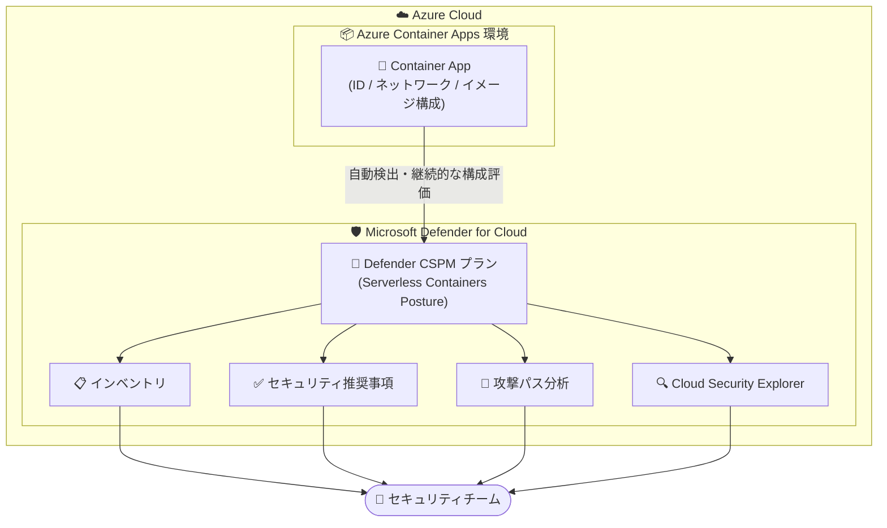

# Microsoft Defender for Cloud: Azure Container Apps サポート (Serverless Containers Posture) の一般提供開始

**リリース日**: 2026-09-01 (GA 提供開始: 2026 年 7 月)

**サービス**: Microsoft Defender for Cloud / Azure Container Apps

**機能**: Serverless Containers Posture による Azure Container Apps 環境のポスチャ管理

**ステータス**: Launched (GA)

[このアップデートのインフォグラフィックを見る](https://takech9203.github.io/azure-news-summary/20260901-defender-container-apps-posture.html)

## 概要

Microsoft Defender for Cloud の「Serverless Containers Posture」に Azure Container Apps 環境を取り込めるようになり、一般提供 (GA) が開始されました。これにより、セキュリティチームは単一のワークフローから、AKS などの Kubernetes 環境だけでなくサーバーレスコンテナー環境まで含めたコンテナー資産全体のポスチャ管理を実施できます。

本機能は Defender for Cloud の CSPM (Cloud Security Posture Management) 機能の一部として提供され、Azure Container Apps ワークロードに対するインベントリ、ポスチャ評価、攻撃パス分析 (Attack Path Analysis) を提供します。ID、ネットワーク、コンテナー/イメージ構成などの領域でリスク評価が可能になり、潜在的な露出をより迅速に特定できます。

**アップデート前の課題**

- Azure Container Apps は Defender for Cloud のコンテナーポスチャ管理の対象外であり、Kubernetes 環境 (AKS など) とサーバーレスコンテナー環境でセキュリティ管理のワークフローが分断されていた
- Container Apps リソースの ID・ネットワーク・コンテナー構成に関するリスクを、Defender for Cloud の統一されたビューで評価できなかった
- Container Apps を経由する攻撃経路を攻撃パス分析で可視化できず、露出の特定に手作業が必要だった

**アップデート後の改善**

- Azure Container Apps 環境を Defender for Cloud の Serverless Containers Posture に統合し、単一のワークフローでコンテナー資産全体のポスチャ管理を拡張できるようになった
- ID、ネットワーキング、コンテナー/イメージ構成などの領域で Container Apps リソースの可視性が向上し、リスク評価が容易になった
- 攻撃パス分析により潜在的な露出をより迅速に特定でき、統一されたセキュリティポスチャ・手作業の削減・Container Apps デプロイ保護の信頼性向上を実現

## アーキテクチャ図

Defender CSPM プランの Serverless Containers Posture が Azure Container Apps 環境を自動検出し、インベントリ・推奨事項・攻撃パス分析・Cloud Security Explorer を通じてセキュリティチームに単一ワークフローでリスク情報を提供する構成です。

## サービスアップデートの詳細

### 主要機能

1. **Azure Container Apps のインベントリ統合**
   - Defender for Cloud のインベントリに Container Apps ワークロードが表示され、他のコンテナー資産と合わせて一元管理できる

2. **継続的なポスチャ評価**
   - ID、ネットワーキング、コンテナー/イメージ構成などの領域で Container Apps リソースの構成を評価し、リスクをセキュリティ推奨事項として提示する

3. **攻撃パス分析 (Attack Path Analysis)**
   - Container Apps リソースが関与する潜在的な攻撃経路をマッピングし、優先的に対処すべき高リスクの問題を特定できる

4. **単一ワークフローによるコンテナー資産全体のカバレッジ拡張**
   - Kubernetes (AKS など) を対象としてきた Defender for Cloud のコンテナーポスチャ管理を、サーバーレスコンテナーである Container Apps にまで拡張し、統一されたセキュリティポスチャを実現する

### Serverless protection におけるポータル別の機能提供状況

Serverless protection の機能は、利用するポータルによって提供状況が異なります (Microsoft Learn「Serverless protection」ドキュメントより)。

| 機能 | Defender for Cloud ポータル | Defender ポータル |
|------|------|------|
| Defender CSPM プランによるオンボーディング | 対応 | 非対応 |
| 誤構成の推奨事項の確認 | 対応 | 対応 |
| Cloud Security Explorer でのクエリ作成 | 対応 | 非対応 |
| Cloud Inventory でのワークロード確認 | 対応 | 対応 |
| 攻撃パスの調査 | 対応 | 対応 |
| 脆弱性評価 | - | 対応 |

## 技術仕様

| 項目 | 詳細 |
|------|------|
| 提供プラン | Defender CSPM (Defender Cloud Security Posture Management) プラン |
| 有効化方法 | Defender CSPM プランを有効化し、Serverless protection コンポーネントをオンにする |
| 対象リソース | Azure Container Apps 環境およびワークロード |
| 評価領域 | ID、ネットワーキング、コンテナー/イメージ構成など |
| 提供機能 | インベントリ、ポスチャ評価 (推奨事項)、攻撃パス分析、Cloud Security Explorer |
| GA 時期 | 2026 年 7 月 (プレビュー期間なしで GA) |

## 設定方法

### 前提条件

1. 対象の Azure サブスクリプションで Defender CSPM プランを有効化できる権限を保有していること
2. Defender CSPM プランの設定を変更する適切なアクセス許可があること

### Azure Portal

1. [Azure Portal](https://portal.azure.com/) にサインインする
2. **Microsoft Defender for Cloud** > **環境設定 (Environment settings)** に移動する
3. Serverless protection を有効化する Azure サブスクリプションを選択する
4. **Defender CSPM** を選択し、**Serverless protection** のトグルをオンにする
5. **保存して閉じる (Save and close)** を選択する

サーバーレスカバレッジが必要なサブスクリプションごとに上記の手順を繰り返します。

## メリット

### ビジネス面

- Kubernetes とサーバーレスコンテナーを単一ワークフローで管理でき、セキュリティ運用の手作業を削減できる
- コンテナー資産全体で統一されたセキュリティポスチャを実現し、Container Apps デプロイ保護の信頼性が向上する
- GA 版として本番環境での利用が正式にサポートされる

### 技術面

- ID、ネットワーキング、コンテナー/イメージ構成の各領域で Container Apps リソースの可視性が向上する
- 攻撃パス分析により、Container Apps を経由する潜在的な露出を迅速に特定・優先順位付けできる
- Cloud Security Explorer のクエリ機能でポスチャ問題を能動的にハンティングできる (Defender for Cloud ポータル)

## デメリット・制約事項

- Serverless protection は無料の Foundational CSPM ではなく、有償の Defender CSPM プランの一部として提供されるため、課金が発生する
- 利用するポータルによって機能の提供状況が異なる (Cloud Security Explorer やオンボーディングは Defender for Cloud ポータルのみ)
- 本機能はポスチャ管理 (CSPM) であり、Defender for Containers が提供するようなランタイム脅威保護 (脅威検出アラート) を Container Apps に提供するものではない点に留意が必要

## 料金

Serverless Containers Posture は **Defender CSPM プラン** の一部として提供されます。Defender CSPM はクラウドの規模に応じた課金で、課金対象は Compute、データベース、ストレージ、サーバーレスコンテナーなどのリソースに限定されます。

| 項目 | 内容 |
|------|------|
| Foundational CSPM | 無料 (継続的評価、セキュリティ推奨事項、Secure Score など) |
| Defender CSPM | 有償。課金対象リソース数に応じた課金 |
| サーバーレスコンテナーの換算 | 実行中のコンテナー 2 個 = 課金対象リソース 1 個 |
| サーバーレス関数/Web アプリの換算 | 8 個 = 課金対象リソース 1 個 |

具体的な金額はリージョン・通貨によって異なるため、[Defender for Cloud 料金ページ](https://azure.microsoft.com/pricing/details/defender-for-cloud/)または Azure 料金計算ツールで確認してください。Defender for Cloud は最初の 30 日間無料で利用できます (Malware Scanning を除く)。

## 利用可能リージョン

公式アップデート情報および参照したドキュメントにリージョン別の提供状況の記載はありませんでした。最新の提供状況は [Defender for Cloud のサポートマトリックス](https://learn.microsoft.com/azure/defender-for-cloud/support-matrix-defender-for-cloud) を確認してください。

## 関連サービス・機能

- **Azure Container Apps**: 本アップデートの保護対象。サーバーレスコンテナー実行環境で、マネージド ID、シークレット管理、ネットワークセキュリティなどの組み込みセキュリティ機能を持つ
- **Defender CSPM**: 本機能を含むポスチャ管理プラン。攻撃パス分析、Cloud Security Explorer、リスクの優先順位付けなどを提供
- **Microsoft Defender for Containers**: Kubernetes クラスター (AKS など)、コンテナーレジストリ、イメージを対象とするコンテナーセキュリティプラン。ポスチャ管理・脆弱性評価・ランタイム脅威保護を提供し、本アップデートによりサーバーレスコンテナーへポスチャ管理のカバレッジが広がる
- **Serverless protection**: Azure Web Apps、Azure Functions、AWS Lambda を対象とする Defender CSPM のサーバーレス保護機能。Container Apps の Serverless Containers Posture もこの体験に統合される
- **Microsoft Defender XDR (Defender ポータル)**: 推奨事項の確認、Cloud Inventory、攻撃パス調査、脆弱性評価を Defender ポータルからも利用可能

## 参考リンク

- [インフォグラフィック](https://takech9203.github.io/azure-news-summary/20260901-defender-container-apps-posture.html)
- [公式アップデート情報](https://azure.microsoft.com/updates?id=570282)
- [Azure Container Apps セキュリティ概要 (Microsoft Learn)](https://learn.microsoft.com/azure/container-apps/security)
- [Serverless protection とは (Microsoft Learn)](https://learn.microsoft.com/azure/defender-for-cloud/serverless-protection)
- [Microsoft Defender for Containers の概要 (Microsoft Learn)](https://learn.microsoft.com/azure/defender-for-cloud/defender-for-containers-introduction)
- [料金ページ (Defender for Cloud)](https://azure.microsoft.com/pricing/details/defender-for-cloud/)

## まとめ

Azure Container Apps が Microsoft Defender for Cloud の Serverless Containers Posture に統合され GA となったことで、Kubernetes 中心だったコンテナーポスチャ管理をサーバーレスコンテナーまで単一ワークフローで拡張できるようになりました。Container Apps を本番運用している組織は、Defender CSPM プランの有効化と Serverless protection コンポーネントのオンボーディングを検討し、インベントリ・推奨事項・攻撃パス分析による継続的なリスク評価を運用に組み込むことを推奨します。なお、本機能は有償の Defender CSPM プランで提供されるため、実行中コンテナー数に基づく課金 (2 コンテナー = 1 課金リソース) を考慮したコスト見積もりも合わせて実施してください。

---

**タグ**: Microsoft Defender for Cloud, Azure Container Apps, Serverless Containers Posture, CSPM, セキュリティ, コンテナー, GA
