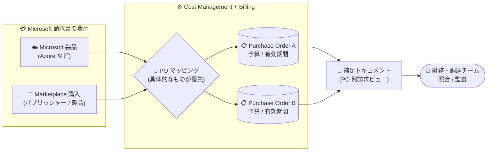

# Microsoft Marketplace: 購入注文書 (Purchase Order) マッピングの一般提供開始

**リリース日**: 2026-09-01

**サービス**: Microsoft Marketplace / Cost Management + Billing

**機能**: Purchase order mapping (購入注文書マッピング)

**ステータス**: Launched (GA)

[このアップデートのインフォグラフィックを見る](https://takech9203.github.io/azure-news-summary/20260901-marketplace-purchase-order-mapping.html)

## 概要

Microsoft Marketplace の購入を組織の会計要件に合わせて割り当てる「購入注文書 (Purchase Order: PO) マッピング」が一般提供 (GA) されました。Azure ポータルの Cost Management + Billing 内で購入注文書レコードを作成・管理し、Marketplace の購入を含む Microsoft 請求書の費用を PO に割り当てることで、組織のクラウドおよび AI 支出の照合 (リコンサイル) が容易になります。

購入注文書ごとに補足ドキュメント (supplemental documents) として請求ビューを生成でき、請求後最大 3 か月間は支出の再マッピング (remap) が可能なため、ビジネス要件の変化に柔軟に対応できます。マッピングは「すべての購入」といった広いスコープから、特定のパブリッシャー (ソフトウェア企業) や特定の Marketplace 製品といった細かい単位まで設定でき、複数のマッピングが一致する場合は最も具体的なマッピングが優先されます。

**アップデート前の課題**

- Microsoft 請求書上の Azure / Marketplace の費用を、社内の購買レコード (購入注文書) に対応付ける作業を組織側で手動で行う必要があった
- Azure インフラ費用とサードパーティー製ソフトウェア (Marketplace) 費用が単一の請求書に混在し、部門予算・調達プロセス・財務レポートごとの切り分けや照合が難しかった

**アップデート後の改善**

- Azure ポータル上で購入注文書を作成し、予算 (allocated budget)・有効期間・ステータスを管理しながら、Marketplace を含む費用を PO に自動割り当てできるようになった
- 購入注文書ごとの補足請求ビュー (supplemental documents) を生成でき、財務・調達・買掛チームによる月次照合や監査作業が簡素化された
- 請求後最大 3 か月間はマッピングを再適用 (Reapply mappings) して過去の請求済み費用の割り当てを修正できるようになった

## アーキテクチャ図

Azure / Marketplace の費用がマッピングルール (最も具体的なものが優先) に従って各購入注文書へ割り当てられ、PO 別の補足ドキュメントとして財務・調達チームの照合作業に利用される流れを示しています。

## サービスアップデートの詳細

### 主要機能

1. **購入注文書の作成・管理**
   - Azure ポータル上で PO レコードを作成し、名前・有効日 / 有効期限 (UTC)・説明・割り当て予算 (請求アカウント通貨)・ステータス (Active / Inactive) を管理できる
   - 「All POs」ビューで割り当て予算と利用済み予算 (utilized budget) を比較し、請求済み費用 (Billed charges) と保留中費用 (Pending charges) を確認できる

2. **クラウド費用のマッピング (割り当て)**
   - Marketplace の費用を、製品単位・パブリッシャー単位・広い支出カテゴリ単位で購入注文書に関連付けられる
   - 1 つの PO に複数のマッピングを設定可能。複数のマッピングが一致する場合は最も具体的なマッピング (例: パブリッシャー全体より製品単位) が優先される
   - 新規マッピングは既定では有効日から有効期限までの「将来の費用」にのみ適用される

3. **マッピングの再適用 (Reapply mappings)**
   - 直近 3 か月以内の日付範囲を指定し、請求済みの費用を最新のマッピング構成で再評価できる
   - 完了時には影響を受けた請求書の一覧と対象費用の金額が通知される
   - EA 顧客の場合、再マッピングによりリビリング (再請求) が発生することがあり、影響を受けた既存請求書は無効化され、新しい請求書と更新済み補足ドキュメントが発行される。MCA の場合は補足ドキュメントの更新のみで、既存請求書には影響しない

4. **補足ドキュメント (Supplemental documents)**
   - 請求プロファイルの「Invoice preferences」で有効化すると、PO マッピングに従って費用をグループ化した PO 別の請求ビューが生成される
   - MCA 顧客は補足ドキュメントの分割単位を「purchase order」または「invoice section」から選択できる (EA には適用されない)
   - 補足ドキュメントは社内の会計・照合プロセスを支援するものであり、Microsoft 請求書の置き換え、請求額の変更、支払期日の延長は行わない

### マッピングスコープ (広い順)

| スコープ | 対象 |
|------|------|
| 一般支出カテゴリ | すべての購入 / すべてのエンタイトルメント / すべての消費 (Azure + Marketplace) |
| Microsoft 製品 | すべての Microsoft 製品 / エンタイトルメント / 消費 (Marketplace を除く) |
| Marketplace 製品 | すべての Marketplace 製品 / エンタイトルメント / 消費 |
| 特定パブリッシャー | パブリッシャー ID の指定が必要 |
| 特定 Marketplace 製品 | パブリッシャー ID とオファー ID の指定が必要 (システムが ID を検証) |

パブリッシャー ID とオファー ID は、Marketplace 製品ページの URL (`//marketplace.microsoft.com/product/{publisherID}.{offerID}`) から確認できます。

## 技術仕様

| 項目 | 詳細 |
|------|------|
| 対象契約と必要権限 | Microsoft Customer Agreement (MCA-E): Billing administrator / Enterprise Agreement (EA): Enterprise administrator |
| 設定場所 | Azure ポータル > Cost Management + Billing > 請求プロファイル > Invoice management > Purchase orders |
| PO 名 | 英数字とダッシュが使用可能。作成後は変更不可 (過去の有効日も変更不可) |
| 編集可能フィールド (PO) | 説明、有効期限、ステータス、割り当て予算 |
| 編集可能フィールド (マッピング) | PO 名、ステータス、有効日、有効期限 (一括編集にも対応) |
| マッピング日付の制約 | マッピングの有効日 / 有効期限は、割り当て先 PO の有効日 / 有効期限の範囲内である必要がある |
| 再マッピング可能期間 | 直近 3 か月 |
| 補足ドキュメント設定 | 請求プロファイル単位で構成され、そのプロファイルで生成されるすべての補足ドキュメントに適用 |

## 設定方法

### 前提条件

1. 適切な請求権限 (MCA-E: Billing administrator、EA: Enterprise administrator) が割り当てられていること
2. Azure と Marketplace の支出に対する購入注文書の構成方針 (単一 PO / Azure と Marketplace で分離 / ベンダー別 / 製品別) を決めておくこと
3. Azure ポータルでの PO 管理と割り当てレビューの社内オーナーを決めておくこと

### Azure Portal

**購入注文書の作成:**

1. Azure ポータルで **Cost Management + Billing** に移動する
2. 請求スコープを選択する (Global administrator の場合はディレクトリ内の全スコープ表示も可能)
3. 左側ナビゲーションの **Billing profiles** から対象の請求プロファイルを選択する
4. Invoice management セクションの **Purchase orders** を選択する
5. **New purchase order** を選択し、一意の名前、有効日 / 有効期限 (UTC)、説明 (任意)、割り当て予算 (任意) を入力する
6. 作成時に **Add a mapping to this PO** チェックボックスを選択すると、その場でマッピングを追加できる

**マッピングの作成:**

1. **Purchase orders** ページで **New mapping** を選択する
2. **Map to** で割り当てるスコープを選択し、対象の PO 名を検索・選択する
3. 有効日 / 有効期限 (UTC) とステータス (Active / Inactive) を設定する
4. パブリッシャー単位の場合はパブリッシャー ID、製品単位の場合はパブリッシャー ID とオファー ID を入力し、**Create** を選択する

**補足ドキュメントの有効化:**

1. 請求プロファイルで Invoice management > **Invoice preferences** を開く
2. **Enable supplemental documents** をオンにする
3. MCA 顧客の場合、分割単位 (purchase order / invoice section) を選択し、**Save changes** を選択する

## メリット

### ビジネス面

- Marketplace を含むクラウド / AI 支出を社内の購買レコードと対応付けられ、予算管理・調達・財務レポートのプロセスと整合させやすい
- PO 別の補足請求ビューにより、財務・調達・買掛チームの月末照合や監査作業が簡素化される
- 割り当て予算と利用済み予算の比較により、PO 単位での予算超過を把握しやすくなる

### 技術面

- 「Azure と Marketplace で PO を分離」「ベンダー別 PO」「製品別 PO」など、組織の管理粒度に応じた柔軟な割り当て戦略を Azure ポータルだけで実装できる
- マッピングの優先順位ルール (具体的なものが優先) により、広いマッピングと個別マッピングを組み合わせた運用が可能
- 請求後最大 3 か月の再マッピングにより、マッピング作成漏れや割り当てミスを後から是正できる

## デメリット・制約事項

- 購入注文書レコードと補足ドキュメントは社内の会計・照合プロセスを支援するものであり、Microsoft 請求書の置き換え、請求額の変更、支払期日の延長は行わない
- 新規マッピングは既定では将来の費用にのみ適用され、過去の請求済み費用へ適用するには「Reapply mappings」の実行が必要 (対象は直近 3 か月まで)
- EA 顧客の場合、再マッピングによりリビリングが発生し、影響を受けた既存請求書が無効化される可能性があるため、実行前に影響の慎重な確認が必要
- PO 名と過去の有効日は作成後に変更できない
- パブリッシャー / 製品マッピングでは、リセラー名ではなくパブリッシャー ID・製品 ID を入力する必要がある (Marketplace 製品のパブリッシャーは販売元のリセラーと異なる場合がある)
- Microsoft Learn ドキュメントには、コスト割り当て・請求書照合を支援する機能が段階的にロールアウトされている旨の記載がある

## ユースケース

### ユースケース 1: Azure と Marketplace の支出を別々の PO で管理

**シナリオ**: Azure インフラ費用とサードパーティー製ソフトウェア費用を、別々の予算・調達プロセスで管理している組織。

**実装例**:

1. 購入注文書を 2 つ作成する
2. 「All Microsoft products」スコープのマッピングを作成し、Azure 用 PO に割り当てる
3. 「All Marketplace products」スコープのマッピングを作成し、Marketplace 用 PO に割り当てる

**効果**: 単一の Microsoft 請求書を、社内の予算区分に沿って自動的に切り分けて照合できる。

### ユースケース 2: ソフトウェアベンダーごとの PO 管理

**シナリオ**: 財務・調達チームがソフトウェアベンダーごとに個別の購入注文書を発行している組織。

**実装例**: ベンダーごとにパブリッシャー ID を指定したマッピングを作成し、そのベンダーの全支出を対応する PO に割り当てる。複数のパブリッシャーを 1 つの PO にまとめることも可能。

**効果**: ベンダー単位の支出を PO と直接対応付けられ、調達レコードとの照合が容易になる。

### ユースケース 3: 製品単位の詳細な財務トラッキング

**シナリオ**: 最も詳細な財務トラッキングが必要で、特定の Marketplace ソリューション (SaaS やコンテナー製品など) の月額 / 年額料金と使用量ベースの費用を個別に追跡したい組織。

**実装例**: パブリッシャー ID とオファー ID を指定した製品単位のマッピングを作成する。複数パブリッシャーの複数製品を 1 つの PO にまとめることも可能。

**効果**: 製品単位で割り当て予算と実際の費用を比較でき、パブリッシャー全体のマッピングと併用しても製品マッピングが優先されるため正確に切り分けられる。

## 料金

本機能自体の追加料金に関する記載は、アップデート情報および Microsoft Learn ドキュメントには確認できませんでした。詳細は以下を参照してください。

- [Cost Management + Billing ドキュメント](https://learn.microsoft.com/azure/cost-management-billing/)

## 利用可能リージョン

リージョン別の提供情報は公式アップデートには記載されていません。対象契約タイプ (MCA-E / EA) の詳細はドキュメントを参照してください。

- [Align cloud investments to your purchase orders for Microsoft Marketplace](https://learn.microsoft.com/marketplace/purchase-orders)

## 関連サービス・機能

- **Cost Management + Billing**: 購入注文書とマッピングの作成・管理は Azure ポータルの Cost Management + Billing (請求プロファイル配下の Invoice management) から行う
- **Microsoft Marketplace**: マッピング対象となるサードパーティー製ソリューション (SaaS、コンテナー製品など) の購入元。パブリッシャー ID / オファー ID は製品ページ URL から確認できる
- **請求書 / 補足ドキュメント (Invoice preferences)**: 請求プロファイル単位で補足ドキュメントを有効化し、PO 別の請求ビューを生成する

## 参考リンク

- [インフォグラフィック](https://takech9203.github.io/azure-news-summary/20260901-marketplace-purchase-order-mapping.html)
- [公式アップデート情報](https://azure.microsoft.com/updates?id=569700)
- [Microsoft Learn: Align cloud investments to your purchase orders for Microsoft Marketplace](https://learn.microsoft.com/marketplace/purchase-orders)
- [Microsoft Learn: Map your cloud spend to purchase orders for Microsoft Marketplace](https://learn.microsoft.com/marketplace/purchase-order-mapping)
- [Cost Management + Billing ドキュメント](https://learn.microsoft.com/azure/cost-management-billing/)

## まとめ

Microsoft Marketplace の購入注文書マッピングの GA により、Azure と Marketplace の支出を組織の購買・会計プロセスと直接対応付けられるようになりました。単一の Microsoft 請求書を PO 単位の補足ビューに分解でき、請求後 3 か月以内の再マッピングにも対応するため、FinOps や財務照合の運用負荷を大きく削減できます。MCA-E の Billing administrator または EA の Enterprise administrator 権限を持つ組織は、まず PO の構成方針 (Azure / Marketplace 分離、ベンダー別、製品別) を決めた上で、Azure ポータルの Cost Management + Billing からマッピングと補足ドキュメントの有効化を検討することを推奨します。なお、EA 顧客が再マッピングを行う場合はリビリング (既存請求書の無効化と再発行) が発生する可能性があるため、実行前に影響範囲の確認が必要です。

---

**タグ**: Microsoft Marketplace, Cost Management, Billing, Purchase Order, FinOps, GA, Launched
