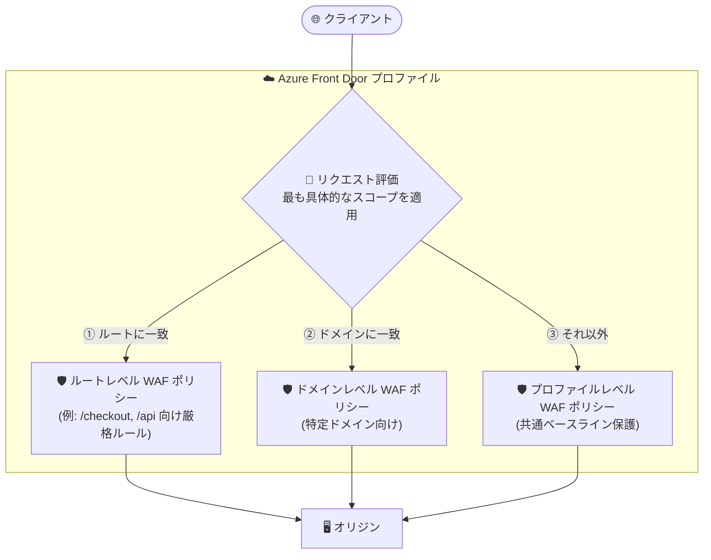

# Azure Front Door: プロファイルレベル / ルートレベル WAF ポリシー (Public Preview)

**リリース日**: 2026-09-02

**サービス**: Azure Front Door / Azure Web Application Firewall (WAF)

**機能**: プロファイルレベルおよびルートレベルの WAF ポリシー関連付け

**ステータス**: In preview

[このアップデートのインフォグラフィックを見る](https://takech9203.github.io/azure-news-summary/20260902-front-door-waf-profile-route-policies.html)

## 概要

Azure Front Door の Web Application Firewall (WAF) が、プロファイルレベルおよびルートレベルでの WAF ポリシー関連付けをパブリックプレビューでサポートした。これにより、WAF ポリシーは「プロファイル」「ドメイン」「ルート」の 3 つのスコープで関連付けできるようになった。

この機能により、Azure Front Door プロファイル全体に共通のベースライン保護を適用しつつ、サインイン・チェックアウト・API といった機密性の高い特定のルートには個別のポリシーを適用する、といった柔軟なセキュリティ構成が可能になる。ポリシーの重複を削減しながら、必要な箇所ではより細かいセキュリティ設定を実現できる。

複数のスコープが同一リクエストに該当する場合は、最も具体的なスコープのポリシーが適用される (ルートレベル > ドメインレベル > プロファイルレベル)。

**アップデート前の課題**

- WAF ポリシーはドメイン (フロントエンドホスト) 単位での関連付けが基本で、プロファイル全体への一括適用や、特定ルートのみへの適用ができなかった
- ドメイン数が多い環境では、同じベースライン保護を適用するために類似ポリシーの関連付けを繰り返す必要があり、ポリシーの重複が発生しやすかった
- サインインやチェックアウト、API など特定のパスだけに厳格なルールを適用したい場合、ルート単位での制御手段がなかった

**アップデート後の改善**

- プロファイルレベルのポリシーで、Azure Front Door プロファイル全体に共通のベースライン保護を一括適用できるようになった
- ルートレベルのポリシーで、特定のルート (パス) に対して個別の詳細な保護を適用できるようになった
- スコープは単独でも組み合わせても利用でき、「最も具体的なポリシーが勝つ」という明確な優先順位 (ルート > ドメイン > プロファイル) で動作する

## アーキテクチャ図

リクエストに複数スコープのポリシーが該当する場合、ルートレベル > ドメインレベル > プロファイルレベルの優先順位で、最も具体的なポリシーが 1 つ適用される。

## サービスアップデートの詳細

### 主要機能

1. **プロファイルレベルのポリシー関連付け**
   - Azure Front Door プロファイル全体に共有のベースラインポリシーを適用する
   - プロファイル配下の全トラフィックに共通の保護を一括で展開できる

2. **ルートレベルのポリシー関連付け**
   - 選択したルートに最も具体的なポリシーを適用する
   - サインイン、チェックアウト、API など機密性の高いパスに個別の厳格なルールを設定できる

3. **ドメインレベルのポリシー関連付け (従来からの方式)**
   - プロファイル内の特定ドメインにポリシーを適用する

4. **明確なポリシー優先順位**
   - 複数スコープが該当する場合、「ルートレベル → ドメインレベル → プロファイルレベル」の順で最も具体的なポリシーが適用される
   - 例: プロファイルレベルとルートレベルの両方に一致するリクエストには、ルートレベルのポリシーが適用される

## 技術仕様

| 項目 | 詳細 |
|------|------|
| ステータス | Public Preview (2026 年 9 月開始、GA 時期は未定) |
| 関連付けスコープ | プロファイル / ドメイン / ルートの 3 種類 (単独・組み合わせ両方可) |
| ポリシー優先順位 | ルートレベル > ドメインレベル > プロファイルレベル (最も具体的なスコープが適用) |
| 対象 SKU | Azure Front Door Standard / Premium (Standard はカスタムルールのみ、マネージドルールは Premium で利用可能) |
| WAF モード | Detection (検出のみ) / Prevention (ブロック) |
| ルールアクション | Allow / Block / Log / Redirect / Anomaly score (DRS 2.0 以降) |
| 構成手段 | Azure Portal、REST API、ARM テンプレート、Azure PowerShell、Azure Firewall Manager |

## 設定方法

### 前提条件

1. Azure Front Door Standard または Premium のプロファイルを作成済みであること
2. WAF ポリシーを作成する権限があること

### Azure Portal

1. **リソースの作成** から **Web Application Firewall (WAF)** を検索し、**作成** を選択
2. **Basics** タブで **Policy for** に **Global WAF (Front Door)** を選択し、Front Door のティア (Standard / Premium)、サブスクリプション、リソースグループ、ポリシー名を指定
3. **Association** タブで **Associate a Front door profile** を選択し、以下を設定して **Add**:
   - **Front door profile**: 対象の Azure Front Door プロファイル
   - **Association scope**: **Profile** / **Domain** / **Route** から選択
   - **Domain** または **Route** を選択した場合は、対象のドメイン (およびルート) を選択
4. 必要に応じて関連付けを追加し、**Review + create** > **Create** で作成

**補足**: 既に別の WAF ポリシーに関連付けられているドメインはグレーアウト表示される。別のポリシーに関連付けるには、既存の関連付けを先に削除する必要がある。

## メリット

### ビジネス面

- プロファイル全体への一括適用により、セキュリティベースラインの展開・運用工数を削減できる
- 決済・認証など重要な機能に対して的を絞った保護を適用でき、コンプライアンス要件への対応がしやすくなる

### 技術面

- 類似ポリシーの重複を削減し、WAF ポリシーの管理をシンプルにできる
- 「プロファイルでベースライン + 必要なルートのみ個別ポリシー」という段階的な構成が可能
- 優先順位のルールが明確 (最も具体的なスコープが勝つ) で、動作を予測しやすい

## デメリット・制約事項

- パブリックプレビューであり、GA 時期は未定。本番環境での利用は SLA などの観点から注意が必要
- 1 つのリクエストに適用される WAF ポリシーは 1 つのみ (複数スコープのポリシーが合成されるわけではない)
- マネージドルールセットは Azure Front Door Premium (および Classic) のみサポート。Standard はカスタムルールのみ
- ドメインを別のポリシーに関連付け直すには、既存の関連付けを先に削除する必要がある

## ユースケース

### ユースケース 1: 共通ベースライン + 機密ルートの強化

**シナリオ**: EC サイトで、サイト全体にはマネージドルールセットによる標準的な保護を適用しつつ、`/checkout` や `/signin` などの機密ルートにはレート制限や厳格なカスタムルールを追加したい。

**実装例**:

1. プロファイルレベルのポリシーとしてマネージドルールセット (DRS) を有効にしたベースラインポリシーを関連付ける
2. `/checkout`、`/signin` に対応するルートに、レート制限ルールや地理ベースのアクセス制御を含む個別ポリシーをルートレベルで関連付ける
3. 該当ルートへのリクエストにはルートレベルポリシーが適用され、それ以外はプロファイルレベルポリシーが適用される

**効果**: ポリシーの重複を減らしながら、リスクの高い経路に対してのみ強い保護を適用できる。

### ユースケース 2: マルチドメイン環境のポリシー統合

**シナリオ**: 1 つの Front Door プロファイルで多数のドメインを配信しており、これまでドメインごとに同じ内容のポリシー関連付けを繰り返していた。

**実装例**:

1. 共通の保護要件をまとめたポリシーをプロファイルレベルで 1 回だけ関連付ける
2. 要件が異なるドメインのみ、ドメインレベルまたはルートレベルのポリシーで上書きする

**効果**: ポリシー数と関連付け作業を削減し、設定漏れのリスクを低減できる。

## 料金

Azure Front Door Standard / Premium の料金体系 (料金ページより、米ドル):

| 項目 | Standard | Premium |
|------|----------|---------|
| 基本料金 | 月額 $35 | 月額 $330 |
| リクエスト料金 (1 万リクエストあたり、Zone 2: アジア太平洋・日本含む) | $0.0108 | $0.0168 |
| WAF / Private Link | 基本的なセキュリティ機能のみ | 追加料金なしで含まれる |

- Premium では WAF と Private Link の利用が追加料金なしで含まれる
- WAF アドオンの CAPTCHA は 1,000 CAPTCHA セッションあたり $0.4
- Front Door (classic) の WAF はポリシーとルール構成に基づく別課金

最新の料金は [Azure Front Door 料金ページ](https://azure.microsoft.com/pricing/details/frontdoor/) を参照。

## 関連サービス・機能

- **Azure Web Application Firewall**: 本アップデートの対象。Front Door のほか Application Gateway (リージョナル WAF) でも利用できる
- **Azure Front Door Standard / Premium**: WAF ポリシーの関連付け先。マネージドルールセットのフル機能は Premium で利用可能
- **Azure Firewall Manager**: WAF ポリシーを大規模に一元管理するための統合が提供されている
- **Azure Monitor / Log Analytics**: WAF のログ・メトリック監視に統合されており、トラフィック傾向やアラートを追跡できる
- **Azure DDoS Protection**: Web ワークロードでは WAF と併用が推奨されている

## 参考リンク

- [インフォグラフィック](https://takech9203.github.io/azure-news-summary/20260902-front-door-waf-profile-route-policies.html)
- [公式アップデート情報](https://azure.microsoft.com/updates?id=569804)
- [Azure Web Application Firewall on Azure Front Door の概要 (Microsoft Learn)](https://learn.microsoft.com/azure/web-application-firewall/afds/afds-overview)
- [チュートリアル: Azure Front Door 用 WAF ポリシーの作成 (Microsoft Learn)](https://learn.microsoft.com/azure/web-application-firewall/afds/waf-front-door-create-portal)
- [料金ページ](https://azure.microsoft.com/pricing/details/frontdoor/)

## まとめ

Azure Front Door WAF のポリシー関連付けが、従来のドメイン単位に加えてプロファイルレベル・ルートレベルに対応した (パブリックプレビュー)。「プロファイルでベースライン保護を一括適用し、必要なドメイン・ルートのみ個別ポリシーで上書きする」という運用が可能になり、ポリシーの重複削減と機密ルートの保護強化を両立できる。多数のドメイン・ルートを 1 つの Front Door プロファイルで運用している組織や、決済・認証パスに厳格な保護を求める組織は、まず検証環境でプロファイルレベルのベースラインポリシーとルートレベルポリシーの組み合わせ、および優先順位 (ルート > ドメイン > プロファイル) の動作を確認することを推奨する。

---

**タグ**: Azure Front Door, Web Application Firewall, WAF, Networking, Security, Public Preview
