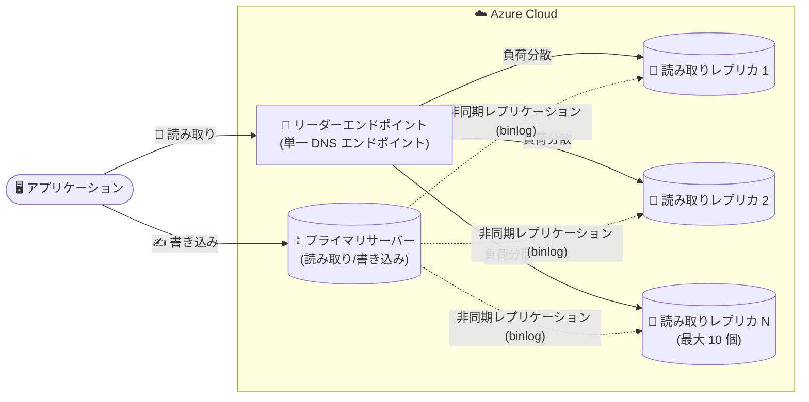

# Azure Database for MySQL: Reader Endpoint (Public Preview)

**リリース日**: 2026-09-02

**サービス**: Azure Database for MySQL - Flexible Server

**機能**: Reader Endpoint (リーダーエンドポイント)

**ステータス**: In preview

[このアップデートのインフォグラフィックを見る](https://takech9203.github.io/azure-news-summary/20260902-mysql-reader-endpoint.html)

## 概要

Azure Database for MySQL - Flexible Server で、複数の読み取りレプリカ利用時の接続管理を簡素化する「リーダーエンドポイント (Reader Endpoint)」のパブリックプレビューが発表されました。リーダーエンドポイントは、読み取り専用の接続トラフィックを複数のレプリカ間で自動的に負荷分散する単一の DNS エンドポイントを提供します。

Azure Database for MySQL はプライマリサーバーごとに最大 10 個の読み取りレプリカをサポートしています。読み取り専用トラフィックをリーダーエンドポイント経由でルーティングすることで、個々のレプリカエンドポイントを管理することなく、接続を効率的に管理しパフォーマンスを最適化できます。アプリケーションアーキテクチャがシンプルになり、スケーラビリティと耐障害性の両方が向上します。

リーダーエンドポイントはレプリカの可用性とレプリケーションラグを継続的に監視し、利用不可になったレプリカや設定された最大許容レプリケーションラグを超えたレプリカを、自動的にルーティング対象から除外します。ルーティングは接続レベルで行われ、個々のクエリの検査や書き込みトラフィックのルーティングは行いません。

**アップデート前の課題**

- 複数の読み取りレプリカを使用する場合、アプリケーション側で各レプリカの個別エンドポイント (ホスト名) を管理する必要があった
- 読み取りトラフィックの負荷分散には、ProxySQL のような接続プロキシの導入やマイクロサービスパターンでの作り込みなど、アプリケーション側での対応が必要だった
- レプリカの障害やレプリケーション遅延が発生した際、そのレプリカを読み取り対象から外す処理をアプリケーション側で実装する必要があった

**アップデート後の改善**

- 単一の DNS エンドポイントで読み取り接続を受け付け、複数レプリカへ自動的に負荷分散されるため、アプリケーションアーキテクチャが簡素化された
- レプリカの可用性とレプリケーションラグを継続監視し、条件を満たさないレプリカを自動的にルーティングから除外することで耐障害性が向上した
- ラウンドロビン (Rotational) とネットワーク遅延ベース (Performance) の 2 種類のルーティング方式を選択できるようになった

## アーキテクチャ図

アプリケーションは書き込みをプライマリサーバーへ、読み取りをリーダーエンドポイントへ送信します。リーダーエンドポイントは可用性とレプリケーションラグを監視しながら、新規の読み取り接続を適格なレプリカへ自動的に振り分けます。

## サービスアップデートの詳細

### 主要機能

1. **単一 DNS エンドポイントによる読み取り接続の負荷分散**
   - 複数の読み取りレプリカに対する新規接続を、単一の DNS エンドポイント経由で自動的に分散
   - 接続レベルのルーティングであり、個々のクエリの検査や書き込みトラフィックのルーティングは行わない

2. **レプリカの健全性の継続監視と自動除外**
   - レプリカの可用性とレプリケーションラグを継続的に監視
   - 利用不可のレプリカや、設定した最大許容レプリケーションラグを超えたレプリカは自動的にルーティング対象から除外

3. **2 種類のルーティング方式**
   - **Rotational**: 適格なレプリカ間でラウンドロビン方式により新規接続を分散
   - **Performance**: ネットワーク遅延情報を使用し、クライアントに最も近いと予想される適格なレプリカリージョンを選択

4. **柔軟な構成オプション**
   - ルーティングに参加する読み取りレプリカの選択
   - 適格なレプリカとみなす最大許容レプリケーションラグ
   - DNS TTL (選択されたレプリカの DNS マッピングをキャッシュできる時間)
   - 適格なレプリカが存在しない場合にプライマリサーバーで読み取りを処理するかどうか
   - 新規作成したレプリカを自動的にリーダーエンドポイントへアタッチするかどうか

5. **複数リーダーエンドポイントの作成**
   - 同一ソースサーバーに対して複数のリーダーエンドポイントを作成可能
   - アプリケーションやワークロードごとに、異なるレプリカ選択、ルーティング方式、レプリケーションラグしきい値、DNS TTL を使い分けられる

## 技術仕様

| 項目 | 詳細 |
|------|------|
| 対象サービス | Azure Database for MySQL - Flexible Server |
| 読み取りレプリカ数 | プライマリサーバーごとに最大 10 個 |
| ルーティング方式 | Rotational (ラウンドロビン) / Performance (ネットワーク遅延ベース) |
| ルーティングレベル | 接続レベル (クエリ検査・書き込みルーティングは非対応) |
| レプリケーション方式 | MySQL ネイティブの binlog によるファイル位置ベースの非同期レプリケーション |
| レプリカ対応価格レベル | General Purpose / Memory Optimized (Burstable は読み取りレプリカ非対応) |
| 監視 | Azure Monitor の「Replication lag in seconds」メトリックなど |

## 設定方法

### 前提条件

1. Azure Database for MySQL - Flexible Server のソースサーバーが General Purpose または Memory Optimized 価格レベルであること (読み取りレプリカの要件)
2. 読み取りレプリカが作成済みであること

パブリックプレビュー時点では Azure CLI はサポートされていないため、Azure Portal から構成します。作成時にルーティング方式、参加するレプリカ、最大許容レプリケーションラグ、DNS TTL などを構成できます。詳細な手順は [読み取りレプリカのドキュメント](https://learn.microsoft.com/azure/mysql/flexible-server/concepts-read-replicas) を参照してください。

## メリット

### ビジネス面

- アプリケーション側の接続管理・負荷分散ロジックの開発・運用コストを削減できる
- レプリカの追加・削除時にアプリケーションの接続設定を変更する必要がなく、読み取りスケールアウトの運用が容易になる
- ProxySQL などの外部プロキシを別途構築・運用せずに読み取り負荷分散を実現できる

### 技術面

- 単一 DNS エンドポイントにより接続文字列の管理がシンプルになる
- 障害やレプリケーション遅延が発生したレプリカを自動的に除外することで、古いデータの読み取りや接続エラーのリスクを低減できる
- 複数のリーダーエンドポイントを作成し、ワークロード特性 (レポーティング、BI、API など) に応じたルーティングポリシーを使い分けられる
- Performance ルーティングにより、クライアントに近いリージョンのレプリカへ接続を誘導できる

## デメリット・制約事項

パブリックプレビュー期間中は以下の制限があります。

- geo レプリカ (リージョン間レプリカ) は未サポート
- 作成後にルーティング方式を変更できない
- Azure CLI は未サポート
- `VERIFY_IDENTITY` モードの SSL 接続はリーダーエンドポイント経由で使用不可 (他の SSL モードはサポート)

また、読み取りレプリカ機能自体の考慮事項として以下があります。

- レプリケーションは非同期であり、ソースとレプリカ間に遅延が発生する (結果整合性)。遅延を許容できるワークロード向け
- リーダーエンドポイントは接続レベルのルーティングであり、書き込みトラフィックの振り分けやクエリ単位の読み書き分離は行わない
- 読み取りレプリカは Burstable 価格レベルでは利用できない

## ユースケース

### ユースケース 1: 読み取り集約型 Web アプリケーションのスケールアウト

**シナリオ**: EC サイトやニュースポータルなど読み取りが支配的なワークロードで、複数の読み取りレプリカに負荷を分散したい。

**実装例**: アプリケーションの読み取り用接続文字列をリーダーエンドポイントに設定し、書き込み用接続文字列はプライマリサーバーに設定する。Rotational ルーティングでレプリカ間に接続を均等分散する。

**効果**: レプリカの追加・削除時もアプリケーション変更が不要になり、読み取りスループットを柔軟にスケールできる。

### ユースケース 2: BI・分析ワークロードの分離

**シナリオ**: 本番トランザクションに影響を与えずに、BI や分析レポートのクエリを実行したい。

**実装例**: 分析用に別のリーダーエンドポイントを作成し、分析ワークロードが許容できるレプリケーションラグしきい値と対象レプリカを個別に構成する。

**効果**: 本番用と分析用でルーティングポリシーを分離し、プライマリサーバーへの負荷を回避しながらレポーティングを実行できる。

## 料金

リーダーエンドポイントには追加料金が発生します。適用されるコストの見積もりには [Azure 料金計算ツール](https://azure.microsoft.com/pricing/calculator/) を使用してください。

また、読み取りレプリカ自体は新しいサーバーとして扱われ、プロビジョニングされたコンピューティング (vCore) とストレージ (GB/月) に基づいてレプリカごとに課金されます。レプリカの実行コストはレプリカが稼働するリージョンによって異なります。

- [Azure Database for MySQL 料金ページ](https://azure.microsoft.com/pricing/details/mysql/)

## 関連サービス・機能

- **読み取りレプリカ (Read Replicas)**: リーダーエンドポイントの前提となる機能。binlog ベースの非同期レプリケーションで最大 10 個のレプリカへデータを複製する
- **Azure Monitor**: 「Replication lag in seconds」メトリックでレプリケーションラグを監視し、しきい値超過時のアラートを設定可能
- **ProxySQL**: 従来から読み取り負荷分散に利用されてきた軽量接続プロキシ。リーダーエンドポイントはマネージドな代替手段となる
- **Azure App Service / AKS / Virtual Machine Scale Sets**: アプリケーション層のスケールアウト基盤。データベース層の読み取りスケールと組み合わせて全体のスケーラビリティを確保する

## 参考リンク

- [インフォグラフィック](https://takech9203.github.io/azure-news-summary/20260902-mysql-reader-endpoint.html)
- [公式アップデート情報](https://azure.microsoft.com/updates?id=569653)
- [Microsoft Learn: Read Replicas - Azure Database for MySQL](https://learn.microsoft.com/azure/mysql/flexible-server/concepts-read-replicas)
- [Microsoft Learn: What's new in Azure Database for MySQL](https://learn.microsoft.com/azure/mysql/flexible-server/whats-new)
- [料金ページ](https://azure.microsoft.com/pricing/details/mysql/)

## まとめ

Azure Database for MySQL - Flexible Server のリーダーエンドポイントは、複数の読み取りレプリカ利用時に必要だった接続管理と負荷分散の作り込みを、単一のマネージド DNS エンドポイントに置き換えるアップデートです。レプリカの健全性監視と自動除外、2 種類のルーティング方式、ワークロードごとの複数エンドポイント構成など、読み取りスケールアウトの実運用に必要な機能が揃っています。読み取り集約型ワークロードで ProxySQL などの独自プロキシを運用している場合や、レプリカのエンドポイント管理が煩雑になっている場合は、パブリックプレビュー段階での評価を推奨します。なお、プレビュー期間中は geo レプリカ非対応、Azure CLI 非対応、ルーティング方式の作成後変更不可などの制限がある点に留意してください。

---

**タグ**: Azure Database for MySQL, Flexible Server, Reader Endpoint, Read Replica, Load Balancing, Databases, Public Preview
