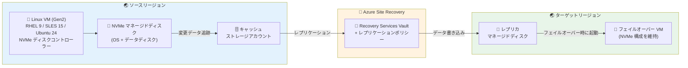

# Azure Site Recovery: Linux Azure VM における NVMe ディスクコントローラーサポート (GA)

**リリース日**: 2026-09-03

**サービス**: Azure Site Recovery

**機能**: Linux Azure VM における NVMe ディスクコントローラーサポート

**ステータス**: Launched (GA)

[このアップデートのインフォグラフィックを見る](https://takech9203.github.io/azure-news-summary/20260903-site-recovery-nvme-linux-vms.html)

## 概要

Azure Site Recovery が、NVMe ディスクコントローラーを搭載した第 2 世代 (Gen2) Linux Azure Virtual Machines に対する Azure-to-Azure シナリオでのレプリケーションおよびディザスタリカバリ (DR) の一般提供 (GA) を発表した。対象となる VM ファミリーには Da/Ea/Fa v6 シリーズや Ebsv5/Ebdsv5 シリーズなど、NVMe インターフェースを使用する VM が含まれる。本機能は 2026 年 5 月にプレビューが開始され、2026 年 8 月に GA に到達した。

NVMe (Non-Volatile Memory Express) ディスクコントローラーは、従来の SCSI コントローラーと比較して高いストレージ I/O パフォーマンスを提供する次世代のディスクインターフェースであり、Azure の v6 シリーズなど新世代 VM ファミリーではデフォルトのディスクコントローラーとして採用されている。NVMe ディスクコントローラーの Site Recovery サポートは、2026 年 4 月に Windows VM 向けのパブリックプレビューが発表されており、今回のアップデートで Linux VM (RHEL 9、SLES 15、Ubuntu 24) にも正式に拡大された。

これにより、高性能・I/O 集約型のワークロードを NVMe 対応 Linux VM 上で稼働させながら、Azure Site Recovery によるリージョン間のディザスタリカバリを構成できるようになった (データ変更率は ASR のチャーンサポート範囲内に限定される)。

**アップデート前の課題**

- NVMe ディスクコントローラーを使用する Linux Azure VM は Azure Site Recovery によるレプリケーションがサポートされていなかった (NVMe サポートは Windows VM のプレビューのみ)
- Da/Ea/Fa v6 シリーズや Ebsv5/Ebdsv5 シリーズなどの NVMe 対応 VM で Linux ワークロードを稼働させる場合、Azure-to-Azure の DR 構成ができなかった
- Linux ワークロードの新世代 VM ファミリーへの移行において、DR 要件がブロッカーとなることがあった

**アップデート後の改善**

- NVMe 対応 Gen2 Linux VM (RHEL 9、SLES 15、Ubuntu 24) に対する Azure-to-Azure レプリケーションが GA として利用可能になった
- すべての Azure パブリッククラウドリージョンでサポートされる
- Linux ワークロードでも新世代 NVMe 対応 VM ファミリーへの移行と DR 戦略を両立できるようになった

## アーキテクチャ図

ソースリージョンの NVMe 対応 Linux VM のディスク変更データがキャッシュストレージアカウント経由で追跡され、Recovery Services Vault を通じてターゲットリージョンのレプリカディスクにレプリケーションされる。フェイルオーバー時にはターゲットリージョンで NVMe 構成を維持した VM が起動される。

## サービスアップデートの詳細

### 主要機能

1. **NVMe 対応 Linux VM の Azure-to-Azure レプリケーション (GA)**
   - NVMe ディスクコントローラーを使用する Gen2 Linux Azure VM のレプリケーションとディザスタリカバリを正式サポート
   - Da/Ea/Fa v6 シリーズ、Ebsv5/Ebdsv5 シリーズなど NVMe インターフェースを使用する VM ファミリーが対象 (サポートマトリクスでは Ddsv6、Edsv6 も記載)

2. **対応 Linux ディストリビューション**
   - RHEL 9、SLES 15、Ubuntu 24 の 3 ディストリビューションをサポート

3. **高性能ワークロードへの対応**
   - 高性能・I/O 集約型ワークロードに対応 (データ変更率は ASR のチャーンサポート範囲内に限定)

## 技術仕様

| 項目 | 詳細 |
|------|------|
| サポート対象 OS | Linux: RHEL 9、SLES 15、Ubuntu 24 |
| サポート対象 VM ファミリー | Da/Ea/Fa v6 シリーズ、Ddsv6、Edsv6、Ebsv5/Ebdsv5 シリーズなど NVMe インターフェースを使用する VM |
| VM 世代 | 第 2 世代 (Gen2) のみ |
| サポート対象シナリオ | Azure-to-Azure |
| ステータス | 一般提供 (GA)。プレビュー開始: 2026 年 5 月、GA: 2026 年 8 月 |
| エフェメラル OS ディスク | 非サポート |
| ローカル NVMe ディスク | 非サポート |
| 混合コントローラー VM (SCSI + NVMe) | 非サポート (Lsv3 などの混合 SKU は対象外) |
| 利用可能リージョン | すべての Azure パブリッククラウドリージョン |

## メリット

### ビジネス面

- **Linux ワークロードの新世代 VM への移行促進**: NVMe 対応 VM への移行において DR 要件がブロッカーにならなくなり、最新の高性能 VM ファミリーの採用を推進できる
- **事業継続性の確保**: NVMe 対応 Linux VM を使用するワークロードに対しても Azure-to-Azure のディザスタリカバリ戦略を適用できる
- **GA による本番適用**: プレビューではなく GA のため、本番環境の DR 構成に正式に組み込める

### 技術面

- **高パフォーマンス VM での DR サポート**: NVMe の高 I/O パフォーマンスの恩恵を受けつつ、DR 構成を維持できる
- **Windows / Linux 両対応**: NVMe ディスクコントローラーのサポートが Windows (2026 年 4 月プレビュー発表) に続き Linux にも拡大され、混在環境でも一貫した DR 戦略を取れる
- **全パブリックリージョン対応**: リージョンを問わず NVMe 対応 Linux VM の DR を構成できる

## デメリット・制約事項

- **対応 Linux ディストリビューションの限定**: RHEL 9、SLES 15、Ubuntu 24 の 3 ディストリビューションに限定される
- **Gen2 VM のみ**: 第 1 世代 (Gen1) VM は対象外
- **Azure-to-Azure シナリオのみ**: オンプレミスから Azure へのシナリオは対象外
- **エフェメラル OS ディスク非サポート**: エフェメラル OS ディスクを使用する NVMe VM はレプリケーションできない
- **ローカル NVMe ディスク非サポート**: ローカル NVMe ディスクはレプリケーション対象外
- **混合コントローラー VM 非サポート**: Lsv3 シリーズのように SCSI と NVMe の混合コントローラーを持つ VM SKU はサポートされない
- **チャーンサポートの制限**: 高性能ワークロードへの対応は ASR のチャーン (データ変更率) サポート範囲内に限定される

## ユースケース

### ユースケース 1: v6 シリーズへの Linux ワークロード移行と DR 構成

**シナリオ**: 企業が RHEL 9 上で稼働するデータベースワークロードを既存の v5 シリーズ VM から Da/Ea v6 シリーズへ移行したいが、これまで NVMe 対応 VM では Linux の DR がサポートされておらず移行のブロッカーとなっていた。

**効果**: v6 シリーズの高パフォーマンス NVMe ディスク I/O を活用しつつ、Azure Site Recovery による Azure-to-Azure DR 構成を維持できる。GA のため本番環境にも正式に適用可能。

### ユースケース 2: Windows / Linux 混在環境での一貫した DR 戦略

**シナリオ**: NVMe 対応 VM 上で Windows と Linux (Ubuntu 24) のワークロードが混在する環境において、統一的な DR 戦略を構築したい。

**効果**: NVMe ディスクコントローラーのサポートが Windows と Linux の両方に提供されたことで、Recovery Services Vault を中心とした一貫したレプリケーション・フェイルオーバー運用を構成できる。

## 料金

Azure Site Recovery の料金は、保護対象インスタンス数に基づく月額課金である。NVMe 対応 Linux VM に対しても従来と同じ料金体系が適用される。

| 項目 | 料金 |
|------|------|
| Azure VM の保護 (Azure-to-Azure) | 保護インスタンスあたり月額課金 (月間の 1 日平均保護インスタンス数で計算) |
| レプリカストレージ / ストレージトランザクション / リージョン間送信データ転送 | 別途発生 |

無料枠: 各保護インスタンスは最初の 31 日間無料 (32 日目から課金開始)。ただし無料期間中もストレージやデータ転送などの関連費用は発生する。詳細は [Azure Site Recovery の料金ページ](https://azure.microsoft.com/pricing/details/site-recovery/) を参照。

## 利用可能リージョン

すべての Azure パブリッククラウドリージョンでサポートされる。

## 関連サービス・機能

- **[Azure Site Recovery](https://learn.microsoft.com/azure/site-recovery/)**: Azure VM、オンプレミス VM、物理サーバーのディザスタリカバリを提供するサービス。今回の NVMe Linux サポートはこのサービスの機能拡張
- **[Azure Virtual Machines v6 シリーズ](https://learn.microsoft.com/azure/virtual-machines/)**: Da/Ea/Fa v6 シリーズなど NVMe をデフォルトのディスクコントローラーとして採用する最新世代の VM ファミリー
- **[Azure Managed Disks](https://learn.microsoft.com/azure/virtual-machines/managed-disks-overview)**: Site Recovery によるレプリケーション対象となるマネージドディスク。NVMe インターフェースのマネージドディスクがサポート対象

## 参考リンク

- [インフォグラフィック](https://takech9203.github.io/azure-news-summary/20260903-site-recovery-nvme-linux-vms.html)
- [公式アップデート情報](https://azure.microsoft.com/updates?id=565103)
- [Microsoft Learn - Azure VM ディザスタリカバリのサポートマトリクス](https://learn.microsoft.com/azure/site-recovery/azure-to-azure-support-matrix)
- [詳細情報 (aka.ms/AsrNvmeLinuxSupport)](https://aka.ms/AsrNvmeLinuxSupport)
- [料金ページ - Azure Site Recovery](https://azure.microsoft.com/pricing/details/site-recovery/)

## まとめ

Azure Site Recovery が NVMe ディスクコントローラーを使用する Gen2 Linux VM (RHEL 9、SLES 15、Ubuntu 24) の Azure-to-Azure レプリケーションを一般提供 (GA) とした。2026 年 4 月に発表された Windows VM 向け NVMe サポートのプレビューに続き、Linux にも対象が拡大され、Da/Ea/Fa v6 シリーズや Ebsv5/Ebdsv5 シリーズなどの新世代 NVMe 対応 VM 上の Linux ワークロードに対してディザスタリカバリが構成可能になった。

Solutions Architect としての推奨アクションは以下の通り:

1. **NVMe 対応 VM への Linux ワークロード移行を計画している場合**: DR 要件がブロッカーでなくなったため、v6 シリーズなどへの移行計画を推進できる
2. **対応ディストリビューションの確認**: RHEL 9、SLES 15、Ubuntu 24 に限定されるため、対象ワークロードの OS バージョンを事前に確認する
3. **非対応構成の把握**: エフェメラル OS ディスク、ローカル NVMe ディスク、混合コントローラー VM (Lsv3 など) はサポート対象外である点に留意する
4. **チャーンレートの確認**: 高 I/O ワークロードでは、データ変更率が ASR のチャーンサポート範囲内に収まるかを事前に評価する

---

**タグ**: Azure Site Recovery, NVMe, Linux, RHEL 9, SLES 15, Ubuntu 24, Gen2 VM, ディザスタリカバリ, Azure-to-Azure, GA, Da/Ea/Fa v6, Ebsv5, Ebdsv5, レプリケーション
