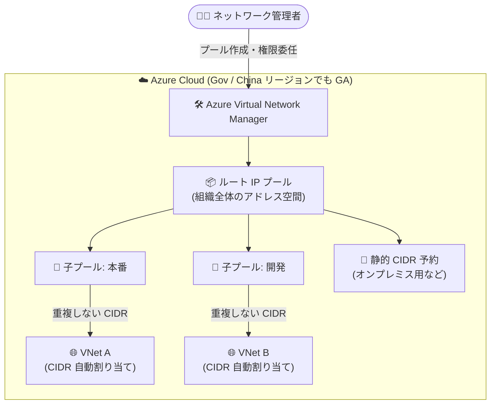

# Azure Virtual Network Manager: IPAM が Azure Government / 中国リージョンで一般提供 (GA)

**リリース日**: 2026-09-03

**サービス**: Azure Virtual Network Manager

**機能**: IP アドレス管理 (IPAM) の追加リージョン一般提供

**ステータス**: Launched (GA)

[このアップデートのインフォグラフィックを見る](https://takech9203.github.io/azure-news-summary/20260903-vnet-manager-ipam-gov-china-regions.html)

## 概要

Azure Virtual Network Manager の IP アドレス管理 (IPAM) 機能が、以下の追加リージョンで一般提供 (GA) となりました。

- **Azure Government**: US Gov Virginia、US Gov Texas、US Gov Arizona
- **Microsoft Azure operated by 21Vianet (中国)**: China North 3、China East 3

IPAM は、複雑なネットワーク環境における IP アドレスの計画と割り当てを一元管理する機能です。重複しない CIDR の自動割り当てにより、Azure・オンプレミス・マルチクラウド間のアドレス空間の競合を防止し、ネットワークリソース全体の IP 使用状況と割り当てを可視化します。Azure Policy との統合により、指定された IP プールを使用した仮想ネットワークの作成を強制でき、意図しないプレフィックスの重複を新規・既存の両方で防止できます。

**アップデート前の課題**

- Azure Government および中国リージョンでは Azure Virtual Network Manager の IPAM が利用できず、政府機関や中国でビジネスを展開する組織は IP アドレス管理をスプレッドシートやサードパーティ製 IPAM ツールなどで個別に行う必要があった

**アップデート後の改善**

- Azure Government (US Gov Virginia / US Gov Texas / US Gov Arizona) および中国 (China North 3 / China East 3) の各リージョンで、商用クラウドと同様の IPAM 機能が GA として利用可能になった
- ソブリンクラウド環境でも、IP プールによる一元的なアドレス計画、重複しない CIDR の自動割り当て、使用状況の可視化が利用できるようになった

## アーキテクチャ図



IPAM ではルートプールから階層的に子プール (最大 7 階層) を作成し、仮想ネットワーク作成時に重複しない CIDR を自動割り当てします。オンプレミスなど Azure 外で使用中のアドレス空間は静的 CIDR として予約し、競合を防止できます。

## サービスアップデートの詳細

### 主要機能

1. **IP アドレスプールによる一元管理**
   - IP アドレス計画のためのプールを作成し、CIDR グループを論理的に整理
   - ルートプールと子プールによる階層構造 (最大 7 階層) で、きめ細かなアドレス空間の管理が可能

2. **重複しない CIDR の自動割り当て**
   - 仮想ネットワークなどの CIDR 対応リソース作成時に、選択したプールから重複しない CIDR を自動割り当て
   - Azure・オンプレミス・マルチクラウド間のアドレス空間の競合を防止

3. **静的 CIDR の予約**
   - Azure 外で使用中、または IPAM が未対応のリソースが使用する CIDR をプール内で予約可能
   - 関連リソースの削除時には CIDR がプールに自動返却される

4. **使用状況の監視と可視化**
   - プール内の IP 総数、割り当て済み領域の割合などの使用状況統計を確認可能
   - プールに関連付けられたリソースの一覧により IP 使用状況を全体的に把握

5. **権限の委任**
   - IPAM Pool User ロールにより、他のユーザーへプール利用権限を委任可能
   - プールと仮想ネットワークの完全な可視性のためには Network Manager Read 権限の付与も必要

6. **Azure Policy との統合**
   - 指定された IP プールを使用した仮想ネットワーク作成を強制し、意図しないプレフィックス重複を防止

7. **クロスリージョン関連付け**
   - 単一の IPAM プールを複数リージョンの仮想ネットワークに関連付け可能
   - Azure PowerShell / Azure CLI により、異なるリージョンのプールとの関連付けをサポート

## 技術仕様

| 項目 | 詳細 |
|------|------|
| プール階層 | ルートプール + 子プール (最大 7 階層) |
| 対応アドレス | IPv4 および IPv6 アドレスプール |
| 割り当て方式 | 自動割り当て (重複しない CIDR) / 静的 CIDR 予約 |
| クロスリージョン | 単一プールを複数リージョンの VNet に関連付け可能 |
| 必要なロール | IPAM Pool User (委任時)、Network Manager Read (プール・VNet の完全な可視性に必要) |
| ポリシー統合 | Azure Policy により指定プールの使用を強制可能 |

## 設定方法

### Azure CLI

異なるリージョンの IPAM プールから CIDR を自動割り当てして仮想ネットワークを作成する例:

```bash
# IPAM プールから 100 個の IP アドレスを割り当てて VNet を作成
ipamAllocation='[{
  "numberOfIpAddresses": 100,
  "id": "/subscriptions/<subscription-id>/resourceGroups/<resource-group-name>/providers/Microsoft.Network/networkManagers/<network-manager-name>/ipamPools/<ipam-pool-name>"
}]'

az network vnet create \
    --name "<virtual-network-name>" \
    --resource-group "<resource-group-name>" \
    --ipam-allocations "$ipamAllocation" \
    --location "<region>"
```

既存の仮想ネットワークを IPAM プールに関連付ける場合は `az network vnet update` に `--ipam-allocations` を指定します。

## メリット

### ビジネス面

- 政府機関 (Azure Government) や中国でビジネスを展開する組織が、コンプライアンス要件を満たすソブリンクラウド環境内で IP アドレス管理を完結できる
- スプレッドシート管理やサードパーティ IPAM ツールへの依存を削減し、運用コストとヒューマンエラーのリスクを低減

### 技術面

- 重複しない CIDR の自動割り当てにより、VNet ピアリングやハイブリッド接続時のアドレス競合を未然に防止
- Azure Policy 統合により、ガバナンスを強制しつつセルフサービスでの VNet 作成を実現
- クロスリージョン関連付けにより、グローバルなアドレス空間の計画と統制が可能

## 料金

Azure Virtual Network Manager の IPAM は、**IPAM が管理するアクティブ IP アドレスごとの時間課金**です。「アクティブ IP アドレス」は、IPAM プールに関連付けられた仮想ネットワーク内のネットワークインターフェイスに紐づく IP アドレスを指します (プールに登録しただけの未使用アドレス空間は課金対象外)。

具体的な単価はリージョンにより異なるため、料金ページおよび料金計算ツールで確認してください。

- [Azure Virtual Network Manager の料金](https://azure.microsoft.com/pricing/details/virtual-network-manager/)

## 利用可能リージョン

今回新たに GA となったリージョン:

- US Gov Virginia
- US Gov Texas
- US Gov Arizona
- China North 3
- China East 3

その他の利用可能リージョンは [リージョン別の利用可能な製品](https://azure.microsoft.com/explore/global-infrastructure/products-by-region/?products=virtual-network-manager) を参照してください。

## 関連サービス・機能

- **Azure Virtual Network**: IPAM プールから CIDR を自動割り当てして VNet を作成・関連付けする対象リソース
- **Azure Policy**: 指定された IP プールを使用した VNet 作成を強制し、プレフィックス重複を防止
- **Azure RBAC**: IPAM Pool User / Network Manager Read ロールによるプール利用権限の委任

## 参考リンク

- [インフォグラフィック](https://takech9203.github.io/azure-news-summary/20260903-vnet-manager-ipam-gov-china-regions.html)
- [公式アップデート情報](https://azure.microsoft.com/updates?id=570557)
- [Microsoft Learn: What is IP address management (IPAM) in Azure Virtual Network Manager?](https://learn.microsoft.com/azure/virtual-network-manager/concept-ip-address-management)
- [料金ページ](https://azure.microsoft.com/pricing/details/virtual-network-manager/)

## まとめ

Azure Virtual Network Manager の IPAM が Azure Government (US Gov Virginia / Texas / Arizona) および中国 (China North 3 / China East 3) の各リージョンで GA となり、ソブリンクラウド環境でも IP アドレス空間の一元管理が可能になりました。政府機関や中国リージョンを利用する組織で、VNet の増加に伴うアドレス管理の複雑化や重複リスクに課題がある場合は、IPAM プールの導入と Azure Policy によるプール使用の強制を検討することを推奨します。課金はアクティブ IP アドレス単位の時間課金のため、導入前に対象 VNet 内の NIC 数をもとにコストを見積もってください。

---

**タグ**: Networking, Azure Virtual Network Manager, IPAM, Features, Management, Regions & Datacenters, GA
