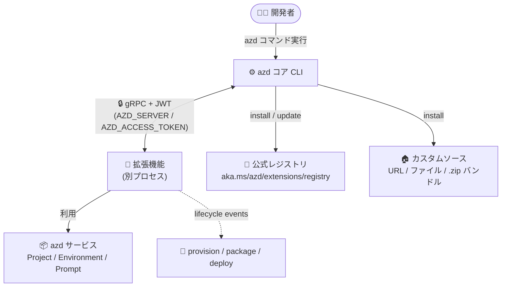

# Azure Developer CLI: Extension Framework の一般提供開始 (GA)

**リリース日**: 2026-09-08 (GA 時期: 2026 年 8 月)

**サービス**: Azure Developer CLI (azd)

**機能**: Extension Framework (拡張機能フレームワーク)

**ステータス**: Launched (GA)

[このアップデートのインフォグラフィックを見る](https://takech9203.github.io/azure-news-summary/20260908-azd-extension-framework.html)

## 概要

Azure Developer CLI (azd) の Extension Framework が一般提供 (GA) となりました。このフレームワークにより、開発者・チーム・パートナーは、独自のアプリケーション開発ワークフローに合わせたカスタム機能で azd を拡張できるようになります。

GA リリースにより、組織はカスタムツールの統合、開発・デプロイタスクの自動化、Azure 上のクラウドアプリケーション開発に合わせたカスタマイズされた体験を提供する拡張機能を構築・配布できます。拡張機能は azd 本体とは別プロセスとして動作し、gRPC で azd コアと通信するアーキテクチャを採用しています。公式レジストリに加え、プライベートな URL ベース / ファイルベースのレジストリや、自己完結型の `.zip` バンドルによる配布にも対応しており、組織固有のプロセスやツールを標準化された方法で組み込めます。

すでに Microsoft Foundry 向けの公式拡張機能スイート (`azure.ai.agents`、`azure.ai.projects` など、`azd ai` 名前空間) や、拡張機能開発用の開発者拡張 (`microsoft.azd.extensions`、`azd x` 名前空間) が提供されており、拡張機能エコシステムが成長を続けています。なお、フレームワーク自体は GA ですが、個々の拡張機能やその機能には独自のプレビューステータスが設定される場合があります。

**アップデート前の課題**

- azd のコア CLI が提供する機能の範囲を超えるカスタマイズができず、組織固有のツールやプロセスを azd のワークフローに組み込む標準的な手段がなかった
- Preview 期間中は拡張機能インターフェースが安定しておらず、本番用途での拡張機能の構築・配布に踏み切りにくかった

**アップデート後の改善**

- 拡張機能インターフェースが安定化され、コマンド追加・ライフサイクルイベント連携・カスタムプロバイダーなどを備えた拡張機能を本番用途で構築・配布できるようになった
- `azure.yaml` の `requiredVersions.extensions` によるプロジェクトレベルの拡張機能要件宣言とバージョン制約 (例: `^2.0.0`) が追加され、テンプレート利用時に必要な拡張機能を azd が自動解決できるようになった
- `azd x` 開発者拡張による作成・公開ワークフローが改善され、公式 / プライベート / 開発 / ナイトリーの多様な配布ソースと `.zip` バンドル配布に対応した

## アーキテクチャ図



azd コアと拡張機能は別プロセスとして動作し、JWT で保護された gRPC チャネルで通信します。拡張機能は公式レジストリまたはカスタムソースから取得され、コマンド追加やライフサイクルイベントを通じて azd のワークフローに統合されます。

## サービスアップデートの詳細

### 主要機能

1. **拡張機能の管理コマンド**
   - `azd extension list / install / upgrade / uninstall` により、拡張機能の検索・インストール・更新・削除が可能。依存関係の解決とバージョン制約 (`-v` で厳密なバージョン指定) をサポート

2. **柔軟な配布モデル (拡張機能ソース)**
   - 事前構成済みの公式レジストリ (https://aka.ms/azd/extensions/registry) に加え、URL ベース / ファイルベースのカスタムソースを追加可能 (NuGet / NPM フィードに相当する概念)
   - レジストリをホストしなくても、`azd x pack --bundle` で作成した自己完結型 `.zip` バンドルをローカルファイルまたは HTTPS URL から直接インストール可能
   - オプトイン方式の development / nightly レジストリも提供 (未署名・サポート対象外のためテスト用途向け)

3. **プロジェクトレベルの拡張機能要件**
   - `azure.yaml` の `requiredVersions.extensions` に拡張機能 ID とバージョン制約 (`latest`、厳密バージョン、セマンティックバージョン制約) を宣言でき、azd がプロジェクトに必要な拡張機能を解決・インストール

4. **多彩な統合ポイント (capabilities)**
   - `custom-commands`: 新しいコマンド名前空間の追加 (メタデータ・ヘルプ・例付き)
   - `lifecycle-events`: `preprovision` / `postdeploy` などのライフサイクルイベントハンドラー登録
   - `provisioning-provider` / `service-target-provider` / `framework-service-provider` / `validation-provider`: カスタムのプロビジョニング (Bicep / Terraform の置き換えも可)、デプロイターゲット、言語・フレームワークサポート、検証の提供
   - `mcp-server`: AI エージェント向けの Model Context Protocol (MCP) ツールの公開

5. **開発者拡張 (`azd x`) による開発・公開ワークフロー**
   - `azd x init / build / watch / pack / release / publish` で、スキャフォールドからビルド、パッケージング、GitHub リリース作成、レジストリ公開までを一貫してサポート

6. **Dev Container 統合**
   - azd の Dev Container Feature の `extensions` オプションで、コンテナビルド時に拡張機能を自動インストール可能

### 公式拡張機能の例 (Microsoft Foundry スイート)

`azd ai` 名前空間で提供される Foundry 向け公式拡張機能が既に利用可能です (一部機能はプレビュー継続):

- `azure.ai.projects` (Foundry プロジェクト管理)、`azure.ai.agents` (ホステッドエージェントのスキャフォールド・デプロイ・実行)、`azure.ai.connections`、`azure.ai.toolboxes`、`azure.ai.skills`、`azure.ai.routines`、`azure.ai.inspector`、`azure.ai.finetune`、およびメタ拡張 `microsoft.foundry`

## 技術仕様

| 項目 | 詳細 |
|------|------|
| 通信方式 | azd と拡張機能は別プロセスで動作し gRPC で通信。azd がランダムポートで gRPC サーバーを起動し `AZD_SERVER` 環境変数で通知 |
| 認証 | コマンド実行の有効期間に限定された署名付き JWT (`AZD_ACCESS_TOKEN`) で拡張機能に azd サービスへのアクセスを許可 |
| SDK | `azdext` (Go SDK)。gRPC クライアント、Project / Environment / Account / Prompt サービス呼び出し、ライフサイクルハンドラー登録などのヘルパーを提供 |
| 対応言語 | Go (最も充実、第一級 SDK)、.NET (C#)、Python、JavaScript のスターターテンプレートを `azd x init` で提供。gRPC 対応言語なら任意の言語で開発可能 (proto ファイルから生成) |
| マニフェスト | `extension.yaml` に capabilities を宣言し、azd が実行時に対応する権限を付与 |
| 配布形式 | レジストリ (公式 / URL / ファイル) または自己完結型 `.zip` バンドル |
| ソース名の制約 | 小文字 ASCII 英数字 1〜64 文字 (ハイフン・アンダースコアは中間のみ)。`azd`、`bundle` は予約済み |
| 料金 | azd はオープンソースの無料ツール (作成した Azure リソースには通常の料金が発生) |

## 設定方法

### 前提条件

1. Azure Developer CLI (azd) がインストールされていること

### 拡張機能の利用

```bash
# 利用可能な拡張機能の一覧表示 (タグでのフィルタも可能)
azd extension list --tags AI

# 拡張機能のインストール
azd extension install azure.ai.agents

# 自己完結型バンドルを HTTPS URL からインストール
azd extension install https://example.com/extensions/example.zip

# インストール済み拡張機能の一覧・アンインストール
azd extension list --installed
azd extension uninstall <extension-name>

# カスタム拡張機能ソースの追加
azd extension source add -n <name> -t url -l <registry-url>
```

### プロジェクトでの拡張機能要件の宣言 (azure.yaml)

```yaml
requiredVersions:
  extensions:
    azure.ai.agents: "latest"
    contoso.azd.tagger: "^2.0.0"
```

### 拡張機能の開発

```bash
# 開発者拡張のインストール
azd extension install microsoft.azd.extensions

# 新しい拡張機能プロジェクトのスキャフォールド
azd x init

# ビルド・監視・パッケージング・公開
azd x build
azd x watch
azd x pack
azd x publish
```

## メリット

### ビジネス面

- 組織固有のプロセスやツールを azd に統合でき、開発チーム全体のワークフローを標準化・簡素化できる
- パートナーやコミュニティによる拡張機能エコシステムが成長しており、コア CLI を超える機能を追加開発なしで活用できる
- GA によりインターフェースが安定し、本番用途の拡張機能への投資判断がしやすくなった

### 技術面

- 別プロセス + gRPC + JWT のモデルにより、拡張機能が azd の内部状態に直接アクセスすることなく、一貫性のある安全な方法で連携できる
- カスタムプロビジョニングプロバイダーにより、Bicep / Terraform 以外の独自のインフラ構成手段も統合可能
- MCP サーバー capability により、AI エージェントやエージェント型開発ツールとの連携を拡張機能として提供できる
- `azure.yaml` でのバージョン制約宣言により、テンプレート利用者の環境で必要な拡張機能が自動解決される

## デメリット・制約事項

- フレームワーク自体は GA だが、個々の拡張機能やその機能 (Foundry 拡張の一部など) にはプレビューステータスのものが残る
- development / nightly レジストリの拡張機能は未署名で Azure サポートの対象外。予告なく変更・削除される可能性があるため本番ワークフローでは使用しない
- Go 以外の言語 (.NET、Python、JavaScript) はサポートレベルに差があり、第一級の SDK ヘルパーは Go (`azdext`) のみ
- `azd extension install` の `-v` オプションは厳密なバージョンのみ受け付け、バージョン範囲や制約は指定不可 (`.zip` バンドルとの併用も不可)
- カスタムソース名には厳格な命名規則があり、無効な名前はエラーになる (正規化されない)

## ユースケース

### ユースケース 1: 組織標準のデプロイワークフローの配布

**シナリオ**: プラットフォームチームが、社内のタグ付け規則・検証ルール・デプロイ手順を拡張機能として実装し、プライベートレジストリ経由で全開発チームに配布する。

**実装例**:

```bash
# プライベートレジストリをソースとして追加
azd extension source add -n contoso -t url -l "https://internal.contoso.com/azd/registry.json"

# 社内拡張機能をインストール
azd extension install contoso.azd.tagger --source contoso
```

**効果**: 組織固有のガバナンス要件を azd の標準ワークフロー (provision / deploy) に自動的に組み込め、チームごとのばらつきを解消できる。

### ユースケース 2: AI エージェント開発 (Microsoft Foundry)

**シナリオ**: Foundry のホステッドエージェントを azd でスキャフォールドからデプロイまで一貫して管理する。

**実装例**:

```bash
azd extension install microsoft.foundry
# azd ai 名前空間のコマンドでエージェントをスキャフォールド・デプロイ・実行
```

**効果**: エージェント開発のライフサイクル全体を使い慣れた azd の開発者体験の中で完結できる。

## 関連サービス・機能

- **Microsoft Foundry**: 公式拡張機能スイート (`azd ai` 名前空間) の提供対象。エージェント・接続・ファインチューニングなどを azd から管理
- **Azure Functions / Azure Container Apps / Azure Container Registry / Azure Blob Storage / Key Vault**: azd テンプレートの主要なデプロイ先・依存サービス。拡張機能のサービスターゲットプロバイダーやライフサイクルイベントで連携可能
- **Model Context Protocol (MCP)**: 拡張機能が MCP サーバー capability を通じて AI エージェント向けツールを公開可能
- **Dev Containers**: azd の Dev Container Feature でコンテナビルド時に拡張機能を自動インストール

## 参考リンク

- [インフォグラフィック](https://takech9203.github.io/azure-news-summary/20260908-azd-extension-framework.html)
- [公式アップデート情報](https://azure.microsoft.com/updates?id=570881)
- [GA 発表ブログ (Azure SDK Blog)](https://devblogs.microsoft.com/azure-sdk/azd-extension-framework-ga/)
- [Microsoft Learn: azd 拡張機能の概要](https://learn.microsoft.com/azure/developer/azure-developer-cli/extensions/overview)
- [Microsoft Learn: 拡張機能開発の概念](https://learn.microsoft.com/azure/developer/azure-developer-cli/extensions/develop/extension-development-concepts)
- [GitHub: Extension Framework ドキュメント (azure/azure-dev)](https://github.com/Azure/azure-dev/blob/main/cli/azd/docs/extensions/extension-framework.md)

## まとめ

azd Extension Framework の GA により、azd は「固定機能の CLI」から「組織やエコシステムが拡張できるプラットフォーム」へと進化しました。gRPC + JWT による安全なプロセス分離モデル、公式 / プライベートレジストリと `.zip` バンドルによる柔軟な配布、`azure.yaml` でのバージョン制約宣言など、本番用途に必要な要素が揃っています。azd を利用しているチームは、まず `azd extension list` で公式拡張機能 (特に Foundry スイート) を確認し、組織固有のワークフローの標準化が課題であれば `azd x init` による独自拡張機能の開発を検討することを推奨します。

---

**タグ**: Developer Tools, Azure Developer CLI, azd, Extension Framework, GA, Open Source, SDK and Tools, Microsoft Foundry, MCP
