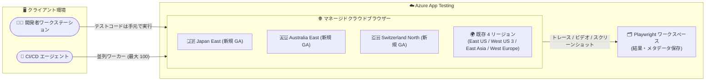

# Azure App Testing: Playwright Workspaces が Australia East、Japan East、Switzerland North で一般提供開始

**リリース日**: 2026-09-08

**サービス**: Azure App Testing (Playwright Workspaces)

**機能**: Playwright Workspaces の新リージョン展開 (Australia East、Japan East、Switzerland North)

**ステータス**: Launched (GA)

[このアップデートのインフォグラフィックを見る](https://takech9203.github.io/azure-news-summary/20260908-playwright-workspaces-new-regions.html)

## 概要

Azure App Testing の Playwright Workspaces が、新たに **Switzerland North、Japan East、Australia East** の 3 リージョンで一般提供 (GA) となりました。

Playwright Workspaces は、エンドツーエンドの Web テストのためのフルマネージドサービスです。クラウドホストされたマネージドブラウザーを使用して Playwright テストを大規模な並列実行で高速化でき、トレース・ビデオ・スクリーンショットなどの豊富なデバッグアーティファクトと、CI/CD とのシームレスな統合を提供します。既存の Playwright テストスイートをコード変更なしでそのまま利用でき、数分で使い始められます。

今回のリージョン拡大により、ワークスペースを配置できるリージョンは、従来の East US、West US 3、East Asia、West Europe に加えて計 7 リージョンとなり、日本・オーストラリア・スイスの顧客がより近いリージョンでテストインフラとテストデータを保持できるようになりました。

**アップデート前の課題**

- Playwright Workspaces のワークスペースは East US、West US 3、East Asia、West Europe の 4 リージョンに限定されており、日本・オーストラリア・スイスの顧客はワークスペース (テスト結果メタデータの保存先) を自国リージョンに配置できなかった
- Playwright Workspaces はワークスペースを配置したリージョン外で顧客データを保存・処理しないという設計のため、データレジデンシー要件のある組織 (特にスイスの金融機関や日本の規制業種など) では採用が難しかった

**アップデート後の改善**

- Japan East、Australia East、Switzerland North にワークスペースを作成でき、テスト実行メタデータや結果を国内リージョンに保持できるようになった
- クライアントマシン (開発端末や CI エージェント) に近いリージョンのブラウザーを利用することで、ネットワーク遅延を抑えた安定したテスト実行が可能になった

## アーキテクチャ図



テストコード (ワーカープロセス) はクライアントマシン上で実行され、リソース集約的なブラウザーのみがクラウド上のマネージドブラウザーとしてリモート実行されます。テスト結果はワークスペースのリージョンに安全に転送・保存されます。

## サービスアップデートの詳細

### 主要機能

1. **新規 3 リージョンでの GA**
   - Switzerland North、Japan East、Australia East で Playwright Workspaces が一般提供開始
   - 既存の East US、West US 3、East Asia、West Europe と合わせて 7 リージョンで利用可能

2. **並列リモートブラウザーによるテスト高速化**
   - クラウドインフラ上の多数の並列ブラウザーにテストを分散し、テストスイート全体の完了時間を短縮
   - 開発端末・ローカルインフラ・CI エージェントの処理能力を超えたスケールが可能

3. **マルチ OS・マルチブラウザー対応**
   - Windows / Linux 上のすべてのモダンブラウザー、および Android 版 Chrome と Mobile Safari のモバイルエミュレーションに対応
   - Playwright がサポートするすべてのブラウザーをサポート

4. **リージョナルアフィニティによる遅延最適化**
   - 既定ではクライアントマシンに最も近い Azure リージョンのリモートブラウザーでテストを実行
   - 設定を無効化すると、ワークスペースのリージョンに固定してブラウザーを実行可能

5. **リージョン内データレジデンシー**
   - ワークスペースをデプロイしたリージョン外で顧客データを保存・処理しない
   - ワークスペース内の全データは Microsoft 管理キー (サービスマネージドキー) で自動暗号化

## 技術仕様

| 項目 | 詳細 |
|------|------|
| サポートする Playwright バージョン | Playwright OSS 1.50 以上 |
| サポートするテストランナー | Playwright Test ランナー、NUnit テストランナー |
| ホストブラウザーの OS | Linux、Windows |
| サブスクリプションあたりのワークスペース数 | 2 / リージョン |
| ワークスペースあたりの並列ワーカー数 | 100 (GitHub リポジトリ経由で上限緩和申請が可能) |
| ユーザーあたりのアクセストークン数 | 10 / ワークスペース |
| データ暗号化 | サービスマネージドキーによる保存データの自動暗号化 |
| 新リージョンの送信 IP アドレス範囲 | Japan East: 48.210.1.160/27、Australia East: 4.237.175.160/27、Switzerland North: 51.107.243.192/27, 172.161.231.216/29 |

## 設定方法

### 前提条件

1. アクティブなサブスクリプションを持つ Azure アカウント
2. 既存の Playwright テストスイート (テストコードの変更は不要)

### Azure Portal でのワークスペース作成

1. [Azure Portal](https://portal.azure.com/) にサインインする
2. **リソースの作成** から「Playwright Workspaces」を検索して選択する
3. サブスクリプション、リソースグループ、ワークスペース名 (英数字 3〜64 文字)、場所 (今回追加された Japan East など) を指定する
4. **確認と作成** → **作成** でデプロイを開始する

### テストの実行

既存のテストコードを変更せず、サービス構成ファイルを追加してワークスペースのエンドポイントを指定するだけで利用できます。

```bash
# サービス構成を使用して並列ワーカー 30 でテストを実行
npx playwright test --config=playwright.service.config.ts --workers=30
```

## メリット

### ビジネス面

- 日本・オーストラリア・スイスの組織がデータレジデンシー要件を満たしつつマネージドテストインフラを採用可能
- テストインフラの構築・維持が不要になり、秒単位の従量課金で使った分だけ支払い
- テストスイートの完了時間短縮により、リリースサイクルの高速化に寄与

### 技術面

- クライアントマシンに近いリージョンのブラウザーを使用することでネットワーク遅延を削減し、テストの安定性が向上
- ワーカープロセスはローカルで実行され、ブラウザーのみクラウド実行のためテストコードが手元に残る (テストコードのアップロード不要)
- ファイアウォールのインバウンド許可なしに、パブリック/プライベートホストのアプリケーションや localhost 開発サーバーもテスト可能

## デメリット・制約事項

- ワークスペースは 1 サブスクリプションあたり 1 リージョンにつき 2 個まで (既定)
- 並列ワーカーはワークスペースあたり 100 まで (既定、上限緩和申請可)
- Playwright OSS 1.50 以上、Playwright Test / NUnit テストランナーのみサポート
- ワークスペースの別リソースグループへの移動は未サポート
- サービスポータルは現時点で英語のみ (他言語のローカライズは進行中)
- 並列ワーカーを増やしてもクライアントマシンのリソースがボトルネックになる場合があり、CI ランナーのスペック調整やシャーディングの検討が必要

## ユースケース

### ユースケース 1: 日本国内の CI/CD パイプラインでの E2E テスト高速化

**シナリオ**: 日本国内で開発する Web アプリケーションの E2E テストが CI エージェントの処理能力の制約で長時間化している。テスト結果データは国内に保持したい。

**実装例**:

```bash
# Japan East にワークスペースを作成後、既存テストスイートを高並列で実行
npx playwright test --config=playwright.service.config.ts --workers=50
```

**効果**: Japan East のワークスペースにテスト結果メタデータを国内保持しつつ、クラウドブラウザーの並列実行によりテストスイート完了時間を短縮。近接リージョンのブラウザー利用により遅延も最小化される。

## 料金

Playwright Workspaces はテスト分 (test minutes) に基づく従量課金で、**秒単位で課金**されます (使用した正確な時間分のみ支払い)。Linux OS 上のブラウザーと Windows OS 上のブラウザーで単価が異なります。

| 項目 | 料金 |
|------|------|
| Linux OS 上のクラウドブラウザー | 分単価 (料金ページ参照) |
| Windows OS 上のクラウドブラウザー | 分単価 (料金ページ参照) |

課金例: 50 テスト × 平均 12 秒 = 10 テスト分として課金。

無料枠: 30 日間の無料トライアルで最初の 100 テスト分が無料。

具体的な単価は [Azure App Testing 料金ページ](https://azure.microsoft.com/pricing/details/app-testing/) および [Azure 料金計算ツール](https://azure.microsoft.com/pricing/calculator/) を参照してください。

## 利用可能リージョン

今回の GA により、以下の 7 リージョンでワークスペースを利用できます。

| リージョン | 提供状況 |
|-----------|---------|
| Japan East | **新規 GA (今回追加)** |
| Australia East | **新規 GA (今回追加)** |
| Switzerland North | **新規 GA (今回追加)** |
| East US | 提供中 |
| West US 3 | 提供中 |
| East Asia | 提供中 |
| West Europe | 提供中 |

## 関連サービス・機能

- **Azure App Testing**: Playwright Workspaces を包含するアプリケーションテストサービス群。負荷テスト (Azure Load Testing) と E2E テストを統合的に提供
- **Azure Load Testing**: 大規模負荷テストのマネージドサービス。Playwright Workspaces と同じ Azure App Testing ファミリーに属し、機能テストと負荷テストを組み合わせた品質検証が可能
- **GitHub Actions / CI ツール**: Playwright CLI 経由で CI パイプラインに統合し、継続的な E2E テストを実現。高並列時は大きめの GitHub ホステッドランナーの利用が推奨される
- **Playwright Test Visual Studio Code 拡張機能**: リッチなエディター体験でのテスト作成・実行に対応

## 参考リンク

- [インフォグラフィック](https://takech9203.github.io/azure-news-summary/20260908-playwright-workspaces-new-regions.html)
- [公式アップデート情報](https://azure.microsoft.com/updates?id=570919)
- [What is Playwright Workspaces? (Microsoft Learn)](https://learn.microsoft.com/azure/app-testing/playwright-workspaces/overview-what-is-microsoft-playwright-workspaces)
- [Quickstart: Playwright テストを大規模に実行する](https://learn.microsoft.com/azure/app-testing/playwright-workspaces/quickstart-run-end-to-end-tests)
- [リージョナル遅延の最適化](https://learn.microsoft.com/azure/app-testing/playwright-workspaces/how-to-optimize-regional-latency)
- [制限とクォータのリファレンス](https://learn.microsoft.com/azure/app-testing/playwright-workspaces/resource-limits-quotas-capacity)
- [料金ページ (Azure App Testing)](https://azure.microsoft.com/pricing/details/app-testing/)

## まとめ

Playwright Workspaces の Japan East、Australia East、Switzerland North への展開は、これらの地域の組織にとってデータレジデンシーとネットワーク遅延の両面で採用障壁を取り除く重要なアップデートです。特に日本の Solutions Architect にとっては、E2E テスト結果データを国内リージョンに保持しながら、既存の Playwright テストスイートをコード変更なしでクラウドスケールの並列実行に移行できる点が大きな価値となります。まずは 30 日間の無料トライアル (100 テスト分) で、CI パイプラインのテスト完了時間短縮効果を検証することを推奨します。

---

**タグ**: Azure App Testing, Playwright Workspaces, Azure Load Testing, Developer Tools, DevOps, E2E Testing, Regions, GA
