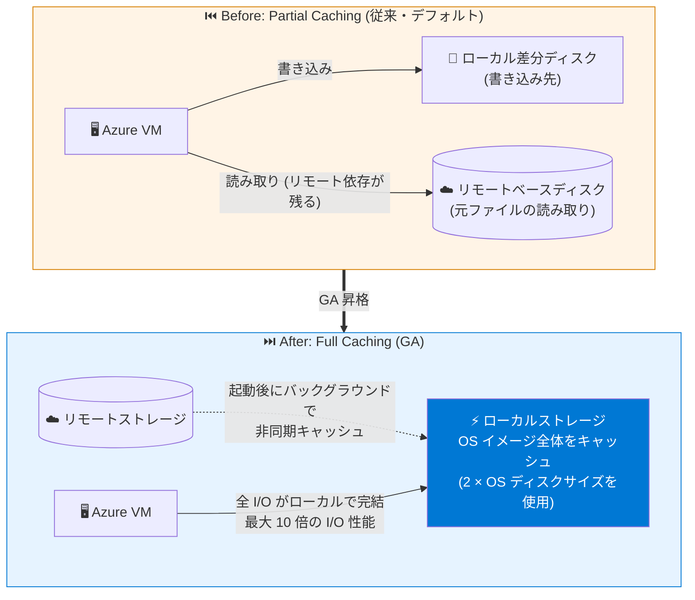

# Azure Virtual Machines: Ephemeral OS Disk with Full Caching が一般提供開始 (GA)

**リリース日**: 2026-09-09

**サービス**: Azure Virtual Machines / Virtual Machine Scale Sets

**機能**: Ephemeral OS Disk with Full Caching

**ステータス**: Launched (GA)

[このアップデートのインフォグラフィックを見る](https://takech9203.github.io/azure-news-summary/20260909-ephemeral-os-disk-full-caching-ga.html)

## 概要

Ephemeral OS Disk の Full Caching (完全キャッシュ) モードが、新規の Azure Virtual Machines (VM) および Virtual Machine Scale Sets (VMSS) 向けに一般提供 (GA) となった。2026 年 3 月のパブリックプレビュー発表を経て、すべての Azure パブリックリージョンで本番利用が可能になった。

Full Caching は、OS イメージ全体を VM のローカルストレージ (キャッシュディスク、リソースディスク、または NVMe ディスク) にキャッシュする機能である。キャッシュ完了後はリモートストレージへの読み取りが完全に排除され、一貫して高速なミリ秒未満クラスの OS ディスクアクセス、最大 10 倍の I/O パフォーマンス向上、ストレージ障害時の高い回復性を実現する。キャッシュ処理は VM 起動後にバックグラウンドで非同期に実行されるため、VM のプロビジョニング時間には影響しない。

AI のトレーニング・推論、クォーラムベースのデータベース、リアルタイム分析、大規模サービスなど、I/O センシティブなステートレスワークロード向けに設計されている。

**アップデート前の課題 (Preview 時点までの状況)**

- 従来の Ephemeral OS Disk (Partial Caching、デフォルト) では、OS ディスクがローカルストレージ上の差分ディスクとマネージドディスク上のベースディスクに分割され、元ファイルの読み取りはリモートのベースディスクから行われるため、リモートストレージへの依存が残っていた
- 悪天候や電源障害などに起因するリモートストレージの障害時に、VM のダウンタイムが発生するリスクがあった
- Full Caching はパブリックプレビュー段階であり、本番環境での利用が推奨されなかった

**アップデート後の改善**

- OS イメージ全体がローカルストレージにキャッシュされ、定常状態ではリモートストレージへの依存が完全に排除される
- リモートストレージの障害・中断時にも OS ディスクが利用可能であり続け、VM の回復性が向上する
- 最大 10 倍の I/O パフォーマンス向上と、一貫した低レイテンシの OS ディスクアクセスを実現
- キャッシュは起動後に非同期で実行されるため、VM 作成時間への影響がない
- GA となり、すべての Azure パブリックリージョンで本番利用が可能になった

## アーキテクチャ図

この図は、従来の Partial Caching と GA となった Full Caching の違いを示している。Partial Caching では元ファイルの読み取りがリモートのベースディスクに依存していたが、Full Caching では OS イメージ全体が起動後に非同期でローカルストレージにキャッシュされ、定常状態のすべての I/O がローカルで完結する。

## サービスアップデートの詳細

### 主要機能

1. **OS イメージの完全ローカルキャッシュ**
   - OS ディスク全体を VM のキャッシュディスク、リソース (テンプ) ディスク、または NVMe ディスクにキャッシュ
   - キャッシュ完了後は定常状態でリモートストレージへの読み取り・書き込みレイテンシを排除

2. **非同期バックグラウンドキャッシング**
   - キャッシュ処理は VM 起動後にバックグラウンドで実行される
   - VM の作成 (プロビジョニング) 時間に影響を与えない

3. **リモートストレージ障害への耐性**
   - 悪天候や電源障害などに起因するリモートストレージの中断時にも OS ディスクが利用可能
   - 汎用 VM および VMSS の回復性を大幅に向上

4. **VM/VMSS 両対応・広範な VM シリーズサポート**
   - 8 vCPU 以上の GPU、ストレージ最適化、メモリ最適化、HPC、汎用、コンピューティング最適化の各 VM シリーズで利用可能
   - Azure CLI、ARM テンプレート、REST API から有効化可能

### Preview からの主な変更点

| 項目 | Preview (2026-03) | GA (2026-09) |
|------|------|------|
| ステータス | パブリックプレビュー | 一般提供 (本番利用可能) |
| 提供リージョン | 限定的 | すべての Azure パブリックリージョン |
| 対応 VM シリーズ | 明確化されていなかった | 8 vCPU 以上の N/L/M/H シリーズ全世代、v5/v6/v7 の D/DC/E/Eb/EC シリーズ、v6/v7 の F シリーズ |
| パフォーマンス指標 | 明示なし | 最大 10 倍の I/O 性能向上、ミリ秒未満クラスの OS ディスクアクセスと公表 |
| 料金 | 明示なし | 標準の VM・ディスクコスト以外の追加料金なしと明記 |

## 技術仕様

| 項目 | 詳細 |
|------|------|
| ステータス | 一般提供 (GA) |
| 対象リソース | 新規の Azure VM、Azure VMSS (Flexible / Uniform) |
| 対応 OS | Linux VM、Windows VM |
| キャッシュ方式 | OS イメージ全体をローカルストレージ (キャッシュ / テンプ / NVMe ディスク) にキャッシュ |
| キャッシュタイミング | VM 起動後にバックグラウンドで非同期実行 |
| ローカル容量要件 | ローカルディスクサイズ > (2 × OS ディスクサイズ + 1 GiB) |
| ローカル容量への影響 | 利用可能なローカルストレージが OS ディスクサイズの 2 倍分減少 |
| 有効化方法 | `diffDiskSettings` の `enableFullCaching` プロパティを `true` に設定 (Azure CLI / ARM テンプレート / REST API) |
| 必要 API バージョン | `2025-04-01` 以降 |
| 提供リージョン | すべての Azure パブリックリージョン |
| データ永続性 | なし (ローカルストレージのため、Azure Storage には保存されない) |

### 対応 VM シリーズ (8 vCPU 以上)

| カテゴリ | 対応シリーズ |
|------|------|
| GPU / ストレージ最適化 / メモリ最適化 / HPC | すべての N シリーズ、L シリーズ、M シリーズ、H シリーズ |
| 汎用 / メモリ最適化 / Confidential | v5、v6、v7 の D、DC、E、Eb、EC シリーズ |
| コンピューティング最適化 | v6、v7 の F シリーズ |

2 vCPU および 4 vCPU の VM への対応は、今後のリリースで予定されている。

### Ephemeral OS Disk の 2 つのキャッシュモード

| モード | 動作 | 用途 |
|------|------|------|
| Partial Caching (デフォルト) | OS ディスクをローカルの差分ディスクとマネージドディスクのベースディスクに分割。書き込みは差分ディスク、元ファイルの読み取りはベースディスクから実施 | クラウドネイティブ・ステートレスアプリ向け。性能と効率のバランス重視 |
| Full Caching (GA) | OS ディスク全体をローカルストレージにキャッシュし、定常状態でリモートストレージ依存を排除 | I/O センシティブなステートレスワークロード (AI トレーニング/推論、クォーラム型 DB、データ分析、リアルタイム処理) |

既存の Ephemeral VM はすべて Partial Caching モードで作成されている。

## 設定方法

### 前提条件

1. OS ディスクがステートレスであること (Full Caching はステートレスワークロード向けに設計)
2. VM SKU のローカルディスクサイズが (2 × OS ディスクサイズ + 1 GiB) より大きいこと
3. API バージョン `2025-04-01` 以降を使用すること
4. 対応 VM シリーズ (8 vCPU 以上) を選択すること

### 有効化

デプロイテンプレートまたは REST API 呼び出しの `diffDiskSettings` セクションで `enableFullCaching` プロパティを `true` に設定する。Azure CLI、ARM テンプレート、REST API から有効化できる。詳細な手順は [Deploy Ephemeral OS disks](https://learn.microsoft.com/azure/virtual-machines/ephemeral-os-disks-deploy) を参照。

## メリット

### ビジネス面

- **本番利用が可能に**: GA となり、すべての Azure パブリックリージョンで本番ワークロードに適用できる
- **追加コストなし**: 標準の VM・ディスクコスト以外に Full Caching の追加料金は発生しない
- **可用性の向上**: リモートストレージ障害時にも OS ディスクが利用可能であり続けるため、ダウンタイムリスクを低減できる

### 技術面

- **最大 10 倍の I/O パフォーマンス**: 一貫して高速なミリ秒未満クラスの OS ディスクアクセスを実現
- **プロビジョニング時間への影響なし**: キャッシュは起動後にバックグラウンドで非同期実行されるため、VM 作成が遅くならない
- **リモート依存の排除**: キャッシュ完了後の定常状態では、OS ディスクのすべての読み書きがローカルで完結する

## デメリット・制約事項

- **ローカルストレージ消費**: 利用可能なローカルストレージが OS ディスクサイズの 2 倍分減少する (残りローカル容量 = 初期ローカル容量 - 2 × OS イメージサイズ)
- **VM サイズの制限**: 現時点では 8 vCPU 以上の対応シリーズに限定される (2/4 vCPU 対応は今後予定)
- **新規 VM/VMSS のみ**: 新規作成する VM および VMSS が対象
- **Ephemeral OS Disk 共通の制約**:
  - データの非永続性 (OS ディスクデータは Azure Storage に保存されない)
  - Stop-deallocate (停止・割り当て解除) 非対応
  - VM イメージキャプチャ、ディスクスナップショット、Azure Disk Encryption、Azure Backup、Azure Site Recovery、OS ディスクスワップ非対応
  - OS ディスクのリサイズは VM 作成時のみ可能

## ユースケース

1. **AI トレーニング・推論**
   - GPU 搭載の N シリーズ VM で、モデルロードや中間データアクセスなど I/O センシティブな処理の OS ディスクレイテンシを最小化

2. **クォーラムベースのデータベース**
   - ノード障害を前提とした分散データベースで、OS ディスクの一貫した低レイテンシとストレージ障害への耐性を確保

3. **リアルタイム分析・データ処理**
   - L シリーズ (ストレージ最適化) などで、リモートストレージ起因のレイテンシ変動を排除し安定した処理性能を実現

4. **大規模ステートレスサービス**
   - VMSS で運用する大規模サービスにおいて、リモートストレージ障害時の広域ダウンタイムリスクを低減

## 料金

Full Caching に追加料金は発生しない。標準の VM およびディスクコスト以外のコストは不要であることが公式ドキュメントに明記されている。Ephemeral OS Disk 自体も OS ディスクデータをローカル VM ストレージに保存するため、リモートのマネージドディスクに対するストレージ課金は発生しない。

- [Managed Disks 料金ページ](https://azure.microsoft.com/pricing/details/managed-disks/)
- [Virtual Machines 料金ページ](https://azure.microsoft.com/pricing/details/virtual-machines/)

## 利用可能リージョン

すべての Azure パブリックリージョンで利用可能 (対応 VM サイズが提供されているリージョン)。

## 関連サービス・機能

- **Azure Virtual Machines / VMSS**: Full Caching を利用する基盤コンピューティングサービス
- **Azure Managed Disks**: Partial Caching のベースディスクや、永続的な OS ディスクが必要な場合の選択肢
- **Trusted Launch**: Ephemeral OS Disk と併用可能 (VMGS 用に 1 GiB がローカルストレージから予約される)
- **Confidential VMs**: DC/EC シリーズ (v5/v6/v7) で Full Caching が利用可能
- **SSD ベースディスクサポート**: ベースディスクに Premium SSD / Standard SSD を選択して SLA を向上可能

## 参考リンク

- [インフォグラフィック](https://takech9203.github.io/azure-news-summary/20260909-ephemeral-os-disk-full-caching-ga.html)
- [公式アップデート情報](https://azure.microsoft.com/updates?id=570551)
- [Microsoft Learn - Ephemeral OS disks](https://learn.microsoft.com/azure/virtual-machines/ephemeral-os-disks)
- [Microsoft Learn - Deploy Ephemeral OS disks](https://learn.microsoft.com/azure/virtual-machines/ephemeral-os-disks-deploy)
- [過去レポート - パブリックプレビュー発表 (2026-03-30)](./2026-03-30-ephemeral-os-disk-full-caching.md)

## まとめ

2026 年 3 月にパブリックプレビューが開始された Ephemeral OS Disk の Full Caching モードが GA となり、すべての Azure パブリックリージョンで本番利用が可能になった。GA に伴い、対応 VM シリーズ (8 vCPU 以上の N/L/M/H 全世代、v5〜v7 の D/DC/E/Eb/EC、v6/v7 の F シリーズ)、最大 10 倍の I/O 性能向上、追加料金なしであることが明確化された。キャッシュは起動後に非同期で実行されるためプロビジョニング時間への影響がなく、リモートストレージ障害時の回復性も向上する。AI トレーニング/推論、クォーラム型データベース、リアルタイム分析などの I/O センシティブなステートレスワークロードを運用している場合は、ローカルディスク容量要件 (2 × OS ディスクサイズ + 1 GiB) と Ephemeral OS Disk 共通の制約 (非永続性、Stop-deallocate 非対応など) を確認した上で、`enableFullCaching` の有効化を検討することを推奨する。

---

**タグ**: #Azure #VirtualMachines #VMSS #EphemeralOSDisk #FullCaching #GA #Compute #Performance #Resiliency
