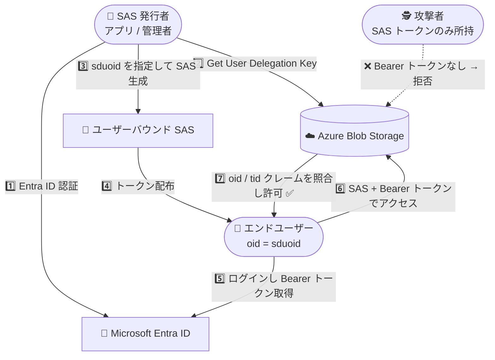

# Azure Storage: ユーザーバウンド ユーザー委任 SAS (User-Bound User Delegation SAS) が一般提供開始

**リリース日**: 2026-09-09

**サービス**: Azure Storage (Azure Blob Storage)

**機能**: User-bound user delegation SAS

**ステータス**: Launched (GA)

[このアップデートのインフォグラフィックを見る](https://takech9203.github.io/azure-news-summary/20260909-storage-user-bound-user-delegation-sas.html)

## 概要

Azure Storage の「ユーザーバウンド ユーザー委任 SAS (User-Bound User Delegation SAS)」が一般提供 (GA) となった。本機能は、ユーザー委任 SAS (User Delegation SAS) の柔軟性と Microsoft Entra ID のユーザーバウンドアクセスを組み合わせた、強化されたセキュア認証機能である。すべてのパブリックリージョンで利用可能となっている。

ユーザー委任 SAS は、SAS トークンの発行者 (delegator) が Entra ID で本人確認を行って作成するセキュアな SAS であり、トークンは発行者まで追跡可能で有効期間は最大 7 日間に制限される。ユーザー委任 SAS 自体は Azure Blobs、Azure Files、Azure Tables、Azure Queues で既に一般提供されており、ユーザーバウンド ユーザー委任 SAS はその拡張機能として位置づけられる。

ユーザーバウンド ユーザー委任 SAS では、SAS トークンの使用を特定のエンドユーザーの Entra ID アイデンティティに制限できる。これにより、アカウント SAS・サービス SAS・通常のユーザー委任 SAS よりもセキュアな SAS トークンを作成でき、SAS トークンが意図したユーザーのみによって使用されることを強制できる。本機能は 2026 年 2 月にパブリックプレビューとして発表されており ([Preview 時のレポート](2026-02-26-blob-storage-user-bound-delegation-sas.md))、今回 GA に昇格した。

**アップデート前の課題**

- 従来のユーザー委任 SAS は Entra ID 資格情報で署名されるものの、生成された SAS トークンを入手した任意のクライアントがトークン単体でリソースにアクセスできた (トークンの持ち出し・漏洩リスク)
- SAS トークン漏洩時、有効期限内であれば誰でもリソースにアクセス可能であった
- 本機能は 2026 年 2 月からパブリックプレビュー段階であり、本番環境での利用は推奨されなかった

**アップデート後の改善**

- SAS トークンの使用を `signedDelegatedUserObjectId` (`sduoid`) で指定した特定の Entra ID ユーザーに限定でき、指定ユーザー以外はトークンを使用できなくなった
- SAS トークン使用時に Entra ID ログイン (Bearer トークン) による本人確認が必須となり、トークン漏洩時の不正利用を防止できるようになった
- GA となり、すべてのパブリックリージョンで本番環境向けに利用可能になった

## アーキテクチャ図



SAS 発行者は Entra ID 認証を経てユーザー委任キーを取得し、エンドユーザーのオブジェクト ID (`sduoid`) を埋め込んだ SAS トークンを生成する。エンドユーザーは SAS トークンに加えて自身の Entra ID Bearer トークンを提示する必要があり、SAS トークンだけを入手した攻撃者はアクセスできない。

## サービスアップデートの詳細

### 主要機能

1. **ユーザーバウンド SAS トークン (`sduoid`)**
   - SAS トークン作成時に `signedDelegatedUserObjectId` (`sduoid`) フィールドでエンドユーザーの Entra ID オブジェクト ID を指定する
   - SAS トークン使用時、エンドユーザーは Entra ID ログイン (Bearer トークン) による本人確認が必要
   - Azure Storage は Bearer トークンの `oid` クレームと SAS の `sduoid` 値を照合し、一致しない場合はアクセスを拒否する

2. **クロステナント対応 (`skdutid`)**
   - `signedKeyDelegatedUserTenantId` (`skdutid`) フィールドにより、ストレージアカウントとは異なる Entra テナントに属するエンドユーザーへの SAS 発行が可能
   - Bearer トークンの `tid` クレームと `skdutid` 値が照合される
   - `skdutid` を使用する場合、`Get User Delegation Key` API 呼び出し時に `DelegatedUserTid` を指定する必要がある
   - クロステナントのユーザーバウンド SAS はデフォルトで許可されておらず、ストレージアカウントの `allowCrossTenantDelegationSas` プロパティを `true` に設定する必要がある

3. **発行者への追跡可能性 (ユーザー委任 SAS の特性)**
   - ユーザー委任 SAS は発行者 (delegator) が Entra ID で本人確認を行って作成するため、トークンを発行者まで追跡できる
   - トークンの有効期間は最大 7 日間に制限される

## 技術仕様

| 項目 | 詳細 |
|------|------|
| 必要な認可バージョン | `sv=2025-07-05` 以降 |
| SAS パラメータ (エンドユーザー OID) | `sduoid` (signedDelegatedUserObjectId) — Bearer トークンの `oid` クレームと照合 |
| SAS パラメータ (エンドユーザーテナント ID) | `skdutid` (signedKeyDelegatedUserTenantId) — Bearer トークンの `tid` クレームと照合。クロステナント時のみ必要 |
| ユーザー委任キーの最大有効期間 | 7 日間 |
| 認証方式 | SAS トークン + Entra ID Bearer トークン (併用必須) |
| クロステナント対応 | `allowCrossTenantDelegationSas` ストレージアカウントプロパティで制御 (デフォルト無効) |
| 同一テナント時の要件 | `skdutid` 未指定の場合、エンドユーザーはストレージアカウントと同一の Entra テナントに属している必要がある |
| ベースとなるユーザー委任 SAS の対応サービス | Azure Blobs / Azure Files / Azure Tables / Azure Queues (いずれも GA 済み) |

### 必要な RBAC ロール

ユーザー委任キーを要求するセキュリティプリンシパルには、`Microsoft.Storage/storageAccounts/{serviceType}/generateUserDelegationKey` アクションを含むロールが必要である。以下の組み込みロールが該当する:

- Contributor
- Storage Account Contributor
- Storage Blob Data Contributor
- Storage Blob Data Owner
- Storage Blob Data Reader
- Storage Blob Delegator
- Storage Queue Delegator
- Storage Table Delegator
- Storage File Delegator

`Get User Delegation Key` 操作はストレージアカウントレベルで動作するため、当該アクションはストレージアカウント、リソースグループ、またはサブスクリプションのスコープで割り当てる必要がある。

## 設定方法

### 前提条件

1. SAS 発行者となるセキュリティプリンシパルに、ユーザー委任キーを要求できる RBAC ロール (上記) を割り当てる
2. クロステナントでの利用が必要な場合、ストレージアカウントの `allowCrossTenantDelegationSas` プロパティを `true` に設定する
3. クライアント (SDK / ツール) が認可バージョン `2025-07-05` 以降に対応していることを確認する

### 利用手順 (REST API)

1. Microsoft Entra ID から OAuth 2.0 トークンを取得する
2. `Get User Delegation Key` 操作でユーザー委任キーを取得する (クロステナントの場合は `DelegatedUserTid` を指定)

```http
POST https://{account}.blob.core.windows.net/?restype=service&comp=userdelegationkey
Authorization: Bearer {OAuth token}
x-ms-version: 2025-07-05

<?xml version="1.0" encoding="utf-8"?>
<KeyInfo>
    <Start>2026-09-09T00:00:00Z</Start>
    <Expiry>2026-09-10T00:00:00Z</Expiry>
    <DelegatedUserTid>{end-user-tenant-id}</DelegatedUserTid>
</KeyInfo>
```

3. ユーザー委任キーを使用して SAS トークンを生成する。このとき `sduoid` にエンドユーザーの Entra ID オブジェクト ID を指定する (クロステナントの場合は `skdutid` も指定)
4. エンドユーザーは SAS トークンと自身の Entra ID Bearer トークンを併せて提示してリソースにアクセスする

```http
GET https://{account}.blob.core.windows.net/{container}/{blob}?{sas-token}
Authorization: Bearer {end-user-entra-token}
```

## メリット

### ビジネス面

- **トークン漏洩リスクの低減**: SAS トークン単体では使用できないため、漏洩時の被害を大幅に限定でき、セキュリティインシデントの影響を最小化できる
- **監査性・トレーサビリティの向上**: トークンは発行者まで追跡可能であり、使用者も特定の Entra ID ユーザーに限定されるため、データアクセスの説明責任を果たしやすい
- **追加コストなしで導入可能**: 本機能の利用に追加料金は発生しない

### 技術面

- **既存 SAS より高いセキュリティ**: アカウント SAS、サービス SAS、通常のユーザー委任 SAS のいずれよりもセキュアな SAS トークンを作成できる
- **既存ワークフローとの互換性**: 既存のユーザー委任 SAS の発行フローに `sduoid` (必要に応じて `skdutid`) パラメータを追加するだけで導入でき、大規模な設計変更は不要
- **クロステナントシナリオ対応**: 異なるテナントのユーザーに対しても、ストレージアカウント側の明示的なオプトインを前提に安全な委任が可能

## デメリット・制約事項

- **API バージョン要件**: 認可バージョン `sv=2025-07-05` 以降が必要であり、古い SDK やツールでは利用できない場合がある
- **クライアント実装の追加**: エンドユーザー側は SAS トークンに加えて Entra ID の Bearer トークンを提示する必要があり、匿名クライアントへの配布という従来の SAS の使い方はできない (これは本機能の意図的な設計である)
- **クロステナントはデフォルト無効**: クロステナントのユーザーバウンド SAS を利用するには `allowCrossTenantDelegationSas` プロパティの明示的な有効化が必要
- **ユーザー委任キーの有効期間制限**: ユーザー委任 SAS の有効期間は最大 7 日間であり、長期のアクセス委任には定期的な再発行が必要

## ユースケース

### ユースケース 1: 外部パートナーの特定ユーザーへの一時的なデータ共有

**シナリオ**: パートナー企業の特定ユーザーにのみ Blob へのアクセスを許可したい。トークンの転送・漏洩による第三者アクセスは防止したい。

**実装例**: `allowCrossTenantDelegationSas` を有効化したうえで、パートナーユーザーのテナント ID (`DelegatedUserTid` / `skdutid`) とオブジェクト ID (`sduoid`) を指定してユーザーバウンド SAS を発行する。

**効果**: SAS トークンが漏洩しても、指定されたユーザーの Entra ID Bearer トークンがなければアクセスできない。

### ユースケース 2: 規制産業でのユーザー単位のアクセス管理

**シナリオ**: 金融・医療などの規制産業で、ストレージへのアクセスを個人レベルで制御・追跡する必要がある。

**実装例**: エンドユーザーごとに `sduoid` を指定した個別のユーザーバウンド SAS を発行し、SAS の権限スコープと有効期限を最小限に設定する。

**効果**: SAS の柔軟な権限制御 (権限スコープ、有効期限、IP 制限) と Entra ID のアイデンティティベース認証を組み合わせた多層的なアクセス制御を実現できる。

## 料金

ユーザーバウンド ユーザー委任 SAS の利用に追加料金は発生しない。料金はストレージアカウントの種類に応じた標準のトランザクションコストに基づく。

詳細は [Azure Storage の価格](https://azure.microsoft.com/pricing/details/storage/blobs/) を参照のこと。

## 利用可能リージョン

すべてのパブリックリージョンで利用可能。

## 関連サービス・機能

- **Microsoft Entra ID**: エンドユーザーの本人確認と Bearer トークン (`oid` / `tid` クレーム) の発行に使用される
- **ユーザー委任 SAS (User Delegation SAS)**: 本機能の基盤となる既存機能。Azure Blobs、Azure Files、Azure Tables、Azure Queues で一般提供済み
- **Azure RBAC**: ユーザー委任キーの要求に必要な権限 (`generateUserDelegationKey` アクション) の管理に使用される

## 参考リンク

- [インフォグラフィック](https://takech9203.github.io/azure-news-summary/20260909-storage-user-bound-user-delegation-sas.html)
- [公式アップデート情報](https://azure.microsoft.com/updates?id=569241)
- [発表ブログ (Azure Storage Blog)](https://techcommunity.microsoft.com/blog/azurestorageblog/generally-available-restrict-usage-of-user-delegation-sas-to-an-entra-id-identit/4554967)
- [Create a user delegation SAS (REST API)](https://learn.microsoft.com/rest/api/storageservices/create-user-delegation-sas)
- [Get User Delegation Key (REST API)](https://learn.microsoft.com/rest/api/storageservices/get-user-delegation-key)
- [Azure Storage の価格](https://azure.microsoft.com/pricing/details/storage/blobs/)
- [Preview 時のレポート (2026-02-26)](2026-02-26-blob-storage-user-bound-delegation-sas.md)

## まとめ

ユーザーバウンド ユーザー委任 SAS の GA により、SAS トークンの「持ち出せば誰でも使える」という長年の課題に対する解決策が本番環境で利用可能になった。SAS トークンの使用を特定の Entra ID ユーザーに限定し、使用時に Bearer トークンによる本人確認を必須とすることで、アカウント SAS・サービス SAS・通常のユーザー委任 SAS のいずれよりも高いセキュリティを実現する。追加料金は不要で、すべてのパブリックリージョンで利用できる。

Solutions Architect としては、SAS を利用した外部共有やエンドユーザーへの直接アクセス提供を行っているワークロードにおいて、認可バージョン `2025-07-05` 以降への対応を確認のうえ、`sduoid` パラメータの追加によるユーザーバウンド化を推奨したい。特に規制産業やクロステナントのデータ共有シナリオでは、ゼロトラストの原則に沿ったアクセス制御の強化策として優先的に検討する価値がある。

---

**タグ**: `Azure Storage` `Azure Blob Storage` `Security` `SAS` `User Delegation SAS` `Microsoft Entra ID` `Authentication` `GA` `ゼロトラスト`
