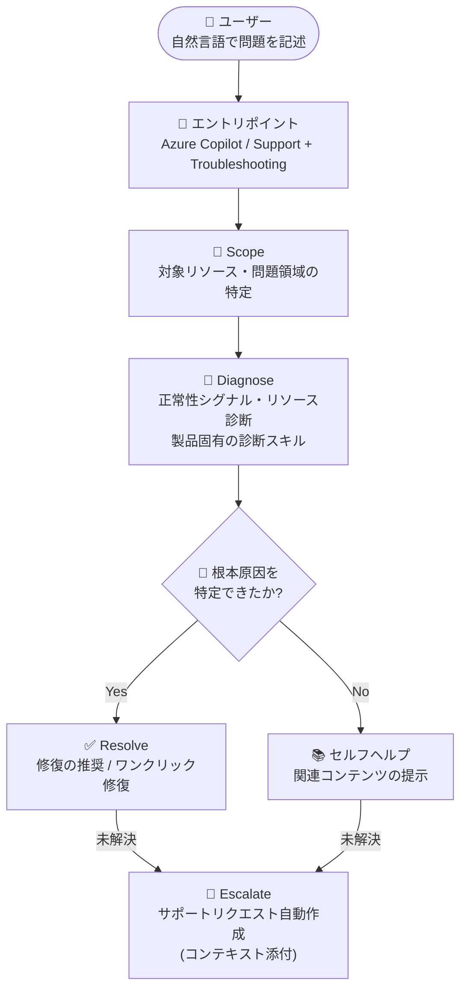

# Azure Copilot: Troubleshooting Agent の一般提供開始 (GA)

**リリース日**: 2026-09-10

**サービス**: Azure Copilot

**機能**: Troubleshooting Agent

**ステータス**: Launched (GA)

[このアップデートのインフォグラフィックを見る](https://takech9203.github.io/azure-news-summary/20260910-azure-copilot-troubleshooting-agent.html)

## 概要

Azure Copilot の Troubleshooting Agent が一般提供 (GA) となりました。Troubleshooting Agent は Azure Copilot に組み込まれた統合トラブルシューティング機能で、運用上の問題の調査と解決を迅速化します。Azure ポータルの **Azure Copilot** と **Support + Troubleshooting** の両方から利用でき、トラブルシューティングの分析情報・運用コンテキスト・推奨アクションを単一のエクスペリエンスに集約します。

エージェントは自然言語で記述された問題をもとに、対象リソースの特定、診断データの収集、根本原因の推定、修復手順の提案までを一貫して支援します。多くのケースではワンクリック修復も提供され、解決できない場合は必要な詳細情報を収集した上でサポートリクエストを自動作成できます。ユーザーの ID と Azure RBAC を尊重して動作し、修復アクションの実行判断は常にユーザーが保持します。

GA と同時に、Azure Compute (Virtual Machines / Virtual Machine Scale Sets / Compute Fleet) と Azure Kubernetes Service (AKS) 向けの詳細トラブルシューティング機能も一般提供となりました。Azure Local と Microsoft Entra 向けの機能はパブリックプレビューで提供されています。Microsoft はこれを「agentic cloud operations (エージェント型クラウド運用)」という新しい運用モデルの一環と位置付けています。

**アップデート前の課題**

- 問題調査のために公式ドキュメント全体を読み込み、必要な情報を自力で探す必要があった (Tech Community ブログ掲載の顧客コメントより)
- トラブルシューティングの分析情報、運用コンテキスト、推奨アクションが分散しており、単一の体験に統合されていなかった

**アップデート後の改善**

- 診断分析、運用コンテキスト、推奨アクションが Azure Copilot の単一のチャット体験に統合され、問題検出から解決までの時間を短縮
- 根本原因が特定できた場合はワンクリック修復を提供 (対応する問題・リソースタイプの場合)
- 解決できない場合は、セッションコンテキストを添付した状態でサポートリクエストを事前入力して作成でき、Microsoft サポートへのエスカレーションがスムーズに

## アーキテクチャ図



Troubleshooting Agent は「問題の記述 → スコープ特定 → 診断 → 解決 → エスカレーション」の 5 段階で調査を進めます。ユーザーの RBAC 権限の範囲内で診断を実行し、修復アクションはユーザーの承認なしには実行されません。

## サービスアップデートの詳細

### 主要機能

1. **統合されたトラブルシューティング体験**
   - 診断分析、運用コンテキスト、推奨アクションを単一のチャット体験に集約
   - Azure ポータルの Azure Copilot (New chat から「Troubleshooting」を選択) と Support + Troubleshooting の両方から利用可能

2. **環境に基づく根本原因診断**
   - 対象リソースの正常性シグナル、リソース診断、製品固有の診断スキルを実行して証拠を収集
   - 根本原因を特定した場合は、段階的な手順を含む修復策を提示。多くのケースでワンクリック修復も提供

3. **サポートリクエストへのシームレスなエスカレーション**
   - 解決できない場合、必要な詳細情報を収集してサポートリクエストを事前入力で作成
   - セッションコンテキストを添付した状態でライブサポートエージェントへ接続可能。送信前にユーザーが内容を確認・承認

4. **Azure Compute 向け詳細トラブルシューティング (GA)**
   - 対象: Virtual Machines、Virtual Machine Scale Sets、Azure Compute Fleet
   - 予期しない再起動、RDP/SSH 接続、CPU・ディスクパフォーマンス、ブート障害、割り当て/デプロイ失敗、VM Agent の正常性、スケールセットの異常インスタンス、Compute Fleet のキャパシティ問題などに対応 (読み取り専用診断を実行)

5. **AKS 向け詳細トラブルシューティング (GA)**
   - CrashLoopBackOff・起動失敗、停滞したデプロイ、Pod スケジューリングとキャパシティ制約、サービスディスカバリと接続性、スケーリング挙動、アップグレード後のリグレッション、OOM 終了、イメージプル失敗、クラスターパフォーマンス低下などを調査

6. **Azure Local / Microsoft Entra 向け機能 (パブリックプレビュー)**
   - Azure Local のクラスター更新・作成の失敗、Microsoft Entra のサインイン問題や MFA プロンプトの調査に対応

## 技術仕様

| 項目 | 詳細 |
|------|------|
| 提供形態 | Azure Copilot 組み込みのエージェント機能 |
| エントリポイント | Azure Copilot チャット / Support + Troubleshooting (Azure ポータル) |
| 調査フロー | Trigger → Scope → Diagnose → Resolve → Escalate の 5 段階 |
| 権限モデル | ユーザーの ID と Azure RBAC を尊重して動作 |
| アクション実行 | ユーザーの承認が必須 (承認なしにアクションは実行されない) |
| GA 対象の詳細診断 | Azure Compute (VM / VMSS / Compute Fleet)、AKS |
| プレビュー対象の詳細診断 | Azure Local、Microsoft Entra |
| アクセス管理 | テナントレベルで管理。管理者がエージェントごとに有効/無効を設定可能 |
| 言語サポート | 英語でフルサポート。その他の言語は限定的なサポート |

## 設定方法

### 前提条件

1. Azure Copilot へのアクセス権があること (テナント管理者が Microsoft Entra ユーザー/グループ単位でアクセスを制限している場合あり)
2. エージェントがテナントで有効化されていること (多くのテナントでは既定で有効。New chat に Troubleshooting Agent が表示されない場合は管理者に確認)
3. 診断対象リソースに対する適切な Azure RBAC 権限

### Azure Portal (Azure Copilot から開始)

1. Azure ポータルで Azure Copilot を開く
2. **New chat** のドロップダウンから **Troubleshooting** を選択
3. 発生している問題を記述する (現在のコンテキストから不明な場合は、対象リソースやサブスクリプションを明示)

### Azure Portal (Support + Troubleshooting から開始)

1. トラブルシューティングしたいリソースに移動
2. **?** を選択し、**Support + Troubleshooting** を選択
3. ガイド付きトラブルシューティングセッションを開始し、問題を記述

### サンプルプロンプト

```text
# 一般
"Help me investigate why my VM is unhealthy."
"Check to see if my resource has active errors."

# Compute
"My VM restarted last night and nobody did it. What happened?"
"I'm getting an AllocationFailed error when starting my VM."

# AKS
"My application containers keep restarting."
"My cluster isn't scaling even though traffic is increasing."
```

## メリット

### ビジネス面

- 追加コストなしで利用でき、問題検出から解決までの時間 (MTTR) を短縮
- サポートリクエスト作成時に問題・原因・修復候補が整理された状態でエスカレーションでき、サポートエンゲージメントの質が向上
- ドキュメント全体を調べる代わりに、必要な情報と確認ポイントを直接得られる (顧客事例より)

### 技術面

- ユーザーの RBAC 権限の範囲内で動作し、組み込みのガバナンスを確保
- 修復アクションは必ずユーザーの確認を経て実行されるため、意図しない変更のリスクを抑制
- Compute / AKS では製品固有の診断スキルによる深い診断が可能
- 調査結果の根拠 (証拠) を説明した上で次のステップを推奨

## デメリット・制約事項

- 一般的な問題の自動修復はすべての問題・リソースタイプで利用できるわけではない (その場合は詳細な手順の提示、またはサポートリクエスト作成で対応)
- トラブルシューティング機能は、現在利用可能な診断データと事前定義されたチェックに基づく
- 診断の深さと利用可能な修復は、Azure サービス・リソースタイプ・問題カテゴリにより異なる
- Azure Copilot エージェントはすべてのリソースタイプをサポートしているわけではない
- フルサポートは英語のみ。その他の言語での会話は限定的なサポート
- エージェントへのアクセスは段階的にロールアウトされるため、テナントによってはまだ表示されない場合がある

## 料金

Troubleshooting Agent は **追加コストなし** で利用できます。

| 項目 | 料金 |
|------|------|
| Troubleshooting Agent の利用 | 追加コストなし (個別ライセンス・サブスクリプション・クエリ単位の課金なし) |
| トラブルシューティング対象の Azure リソース | 通常どおり標準料金が適用 |
| Azure サポートプラン | 既存プランへの変更・影響なし |

## 関連サービス・機能

- **Azure Copilot Agents**: Troubleshooting (GA) のほか、Deployment / Optimization / Resiliency / Migration (プレビュー)、Observability (GA) の各エージェントが提供されている
- **Support + Troubleshooting**: Azure ポータルのサポート導線に Troubleshooting Agent が統合され、ガイド付きセッションから利用可能
- **Azure Virtual Machines / VMSS / Compute Fleet**: GA 対象の詳細診断が提供される Compute サービス群
- **Azure Kubernetes Service (AKS)**: アプリケーション、ネットワーク、スケーリング、アップグレードなどクラスター全般の詳細診断に対応
- **Azure Local / Microsoft Entra**: 詳細トラブルシューティング機能がパブリックプレビューで提供
- **Azure RBAC**: エージェントはユーザーのロールベースアクセス制御の範囲内で診断を実行

## 参考リンク

- [インフォグラフィック](https://takech9203.github.io/azure-news-summary/20260910-azure-copilot-troubleshooting-agent.html)
- [公式アップデート情報](https://azure.microsoft.com/updates?id=570980)
- [Tech Community ブログ: Azure Copilot announces General Availability of the Troubleshooting Agent](https://techcommunity.microsoft.com/blog/appsonazureblog/azure-copilot-announces-general-availability-of-the-troubleshooting-agent/4554549)
- [Microsoft Learn: Azure Copilot Troubleshooting Agent](https://learn.microsoft.com/en-us/azure/copilot/troubleshooting-agent)
- [Microsoft Learn: Agents in Azure Copilot](https://learn.microsoft.com/en-us/azure/copilot/agents)
- [Microsoft Learn: Manage access to Azure Copilot](https://learn.microsoft.com/en-us/azure/copilot/manage-access)

## まとめ

Azure Copilot Troubleshooting Agent の GA により、Azure 上の運用トラブルの調査・解決が単一のチャット体験に統合されました。追加コストなしで利用でき、RBAC とユーザー承認に基づくガバナンスが組み込まれているため、導入障壁は低いと言えます。特に VM / VMSS / Compute Fleet と AKS では製品固有の深い診断が GA となっており、これらのワークロードを運用するチームは、まず Support + Troubleshooting または Azure Copilot の New chat から Troubleshooting Agent を試し、既存のトラブルシューティング手順への組み込みを検討することを推奨します。テナント管理者は、Azure Copilot 管理センターでエージェントのアクセスポリシーを確認しておくとよいでしょう。

---

**タグ**: Azure Copilot, Troubleshooting Agent, Management and governance, AI, GA, AKS, Virtual Machines, Agentic Cloud Operations
