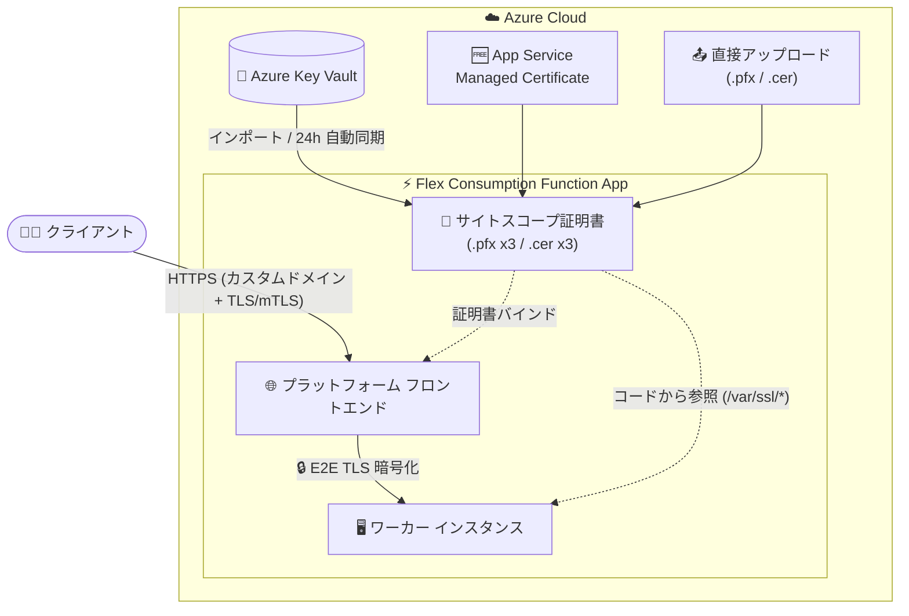

# Azure Functions: Flex Consumption の TLS/SSL 証明書とエンドツーエンド TLS 暗号化サポートが GA

**リリース日**: 2026-09-10

**サービス**: Azure Functions

**機能**: Flex Consumption プランにおける TLS/SSL 証明書 (site-scoped certificates) とエンドツーエンド TLS 暗号化のサポート

**ステータス**: Launched (GA)

[このアップデートのインフォグラフィックを見る](https://takech9203.github.io/azure-news-summary/20260910-functions-flex-consumption-tls-ssl.html)

## 概要

Azure Functions Flex Consumption プランで TLS/SSL 証明書のサポートが一般提供 (GA) となりました。新しい「サイトスコープ証明書 (site-scoped certificates)」モデルにより、証明書は同一 Webspace 内のアプリ間で共有されるのではなく、個々の Function App 単位にスコープされます。各 Function App は、直接アップロード、Azure Key Vault からのインポート、または無料の App Service Managed Certificate の発行により、最大 3 つの秘密証明書 (.pfx) と 3 つの公開証明書 (.cer) を保持できます。これにより、Flex Consumption 上でカスタムドメインへの証明書バインド、クライアント証明書認証、相互 TLS (mTLS) シナリオが可能になります。

あわせて、エンドツーエンド TLS 暗号化 (E2E TLS) も Flex Consumption で一般提供となりました。プラットフォームのフロントエンドと、関数コードを実行するワーカーとの間のトラフィックを暗号化できます。

**アップデート前の課題**

- Flex Consumption には TLS/SSL 証明書を管理する仕組みがなく、カスタム証明書を利用するシナリオ (カスタムドメインへの独自証明書のバインド、クライアント証明書認証、相互 TLS) に対応できなかった (今回のアップデートで新モデルとして導入。この機能提供前に作成された既存アプリには証明書の移行パスが現時点で存在しないことからも、従来は利用できなかったことが確認できる)
- プラットフォームのフロントエンドとワーカー間のトラフィック暗号化 (E2E TLS) は、Flex Consumption では GA 提供されていなかった

**アップデート後の改善**

- Function App 単位にスコープされたサイトスコープ証明書モデルにより、秘密証明書 (.pfx) 最大 3 つ + 公開証明書 (.cer) 最大 3 つを保持可能に
- 直接アップロード、Key Vault からのインポート、無料の App Service Managed Certificate、Azure で購入した App Service certificate の 4 つの取得経路に対応
- Key Vault で証明書を更新すると、バックグラウンドジョブが 24 時間以内に自動同期 (手動作業不要)
- `endToEndEncryptionEnabled` サイトプロパティにより、フロントエンドからワーカーまでのトラフィック暗号化を有効化可能に

## アーキテクチャ図



クライアントからフロントエンドまではサイトスコープ証明書による TLS/mTLS、フロントエンドからワーカーまでは E2E TLS 暗号化により、通信経路全体を暗号化できる構成を示しています。証明書は Key Vault インポート・直接アップロード・無料マネージド証明書の 3 経路で Function App 単位に登録します。

## サービスアップデートの詳細

### 主要機能

1. **サイトスコープ証明書 (site-scoped certificates)**
   - 証明書を Webspace 内で共有するのではなく、個々の Function App にスコープする新しいモデル
   - カスタムドメイン、クライアント証明書認証、相互 TLS シナリオに対応

2. **複数の証明書取得経路**
   - App Service Managed Certificate: カスタムドメイン向けにポータルで無料作成 (秘密証明書の上限にカウント)
   - App Service certificate: Azure で購入してインポート (秘密証明書の上限にカウント)
   - Key Vault からのインポート: PKCS12 証明書をインポート (秘密証明書の上限にカウント)
   - 秘密証明書 (.pfx) の直接アップロード
   - 公開証明書 (.cer) の直接アップロード (コードから証明書認証が必要なリモートサービスへアクセスする場合に使用)

3. **証明書の自動更新・同期**
   - 無料マネージド証明書はプラットフォームが自動更新
   - Key Vault インポート証明書は、Key Vault 側での更新後 24 時間以内に全インスタンスへ自動同期

4. **コードからの証明書アクセス**
   - 「Make accessible to app code」を有効にすると、証明書がファイルとして全インスタンスのランタイム環境にロードされる
   - 公開証明書 (.cer): `/var/ssl/certs`、秘密証明書 (.pfx): `/var/ssl/private` にサムプリント名で配置

5. **エンドツーエンド TLS 暗号化 (E2E TLS)**
   - プラットフォームのフロントエンドと、関数を実行するワーカー間のトラフィックを暗号化
   - ARM / Bicep テンプレートでサイトプロパティ `endToEndEncryptionEnabled` を `true` に設定して有効化

## 技術仕様

| 項目 | 詳細 |
|------|------|
| 対象プラン | Azure Functions Flex Consumption (Linux ベース) |
| 証明書モデル | サイトスコープ (Function App 単位。Webspace 内での共有なし) |
| 秘密証明書 (.pfx) 上限 | アプリあたり最大 3 つ (Managed Certificate / App Service certificate / Key Vault インポート / 直接アップロードの合計) |
| 公開証明書 (.cer) 上限 | アプリあたり最大 3 つ |
| 秘密証明書の要件 | 中間証明書とルート証明書を含むパスワード保護付き PFX 形式でエクスポート |
| ECC 証明書 | PFX としてアップロードすればサポート |
| コードからのアクセス | Linux のためファイルパス経由 (`/var/ssl/certs`, `/var/ssl/private`)。Windows 証明書ストアは使用不可 |
| Key Vault 認証 | マネージド ID + RBAC (`Key Vault Certificate User` ロール) を推奨 |
| E2E TLS の有効化方法 | ARM / Bicep のサイトプロパティ `endToEndEncryptionEnabled: true` |

## 設定方法

### 前提条件

1. Flex Consumption プランの Function App (既存アプリのうち本機能提供前に作成されたものには証明書の移行パスがないため、サイトスコープ証明書を使うには新規に Flex Consumption アプリを作成する必要がある)
2. Key Vault からインポートする場合: Function App のマネージド ID に対して Key Vault の `Key Vault Certificate User` ロールを付与
3. Key Vault のパブリックアクセスを無効化している場合: 「信頼された Microsoft サービスによるファイアウォールのバイパスを許可」を有効化

### Azure CLI (Key Vault アクセス用のマネージド ID 設定)

サイトスコープ証明書自体の管理は現時点で Azure CLI 未対応のため、Azure Portal または ARM/Bicep テンプレートを使用します。Key Vault インポートの前提となるマネージド ID の設定は CLI で行えます。

```bash
# マネージド ID を有効化
az functionapp identity assign \
    --resource-group <RESOURCE_GROUP> \
    --name <APP_NAME>

# マネージド ID のプリンシパル ID を取得
principalId=$(az functionapp identity show \
    --resource-group <RESOURCE_GROUP> \
    --name <APP_NAME> \
    --query principalId -o tsv)

# Key Vault Certificate User ロールを割り当て
az role assignment create \
    --role "Key Vault Certificate User" \
    --assignee "$principalId" \
    --scope "/subscriptions/<SUBSCRIPTION_ID>/resourceGroups/<RESOURCE_GROUP>/providers/Microsoft.KeyVault/vaults/<KEY_VAULT_NAME>"
```

### Azure Portal

**秘密証明書 (.pfx) のアップロード:**

1. Azure Portal で Function App を開く
2. 左メニューの **設定** > **証明書** を選択
3. **Bring your own certificates (.pfx)** > **+ Add certificate** を選択
4. **Source** で **Upload certificate (.pfx)** を選択し、.pfx ファイルとパスワードを入力
5. フレンドリ名を入力して追加

**Key Vault からのインポート:**

1. **Bring your own certificates (.pfx)** > **+ Add certificate** で **Import from Key Vault** を選択
2. サブスクリプション、Key Vault、証明書を選択し、**Validate** > **Add**

**App Service Managed Certificate (無料) の作成:**

1. カスタムドメイン設定で **TLS/SSL certificate** に **App Service Managed Certificate** を選択
2. 証明書は自動で作成・バインドされる (発行まで最大 10 分程度)

**コードから証明書へアクセスする場合:**

1. **証明書** ブレードで対象証明書の **...** から **Make accessible to app code** を選択
2. 証明書が全インスタンスにファイルとしてロードされる

**E2E TLS 暗号化 (ARM / Bicep):**

サイトプロパティ `endToEndEncryptionEnabled` を `true` に設定します。

## メリット

### ビジネス面

- 独自ドメイン + 独自証明書を要件とする本番ワークロードを、サーバーレス課金モデルの Flex Consumption で運用可能に
- App Service Managed Certificate を使えば証明書を無料で発行・自動更新でき、証明書の調達・更新コストを削減
- 通信経路全体 (クライアント → フロントエンド → ワーカー) の暗号化により、コンプライアンス要件・セキュリティ監査への対応がしやすくなる

### 技術面

- 証明書が Function App 単位にスコープされるため、Webspace 内の他アプリと共有されず分離性が高い
- Key Vault 連携により証明書のライフサイクル管理を一元化でき、更新は 24 時間以内に自動同期
- クライアント証明書認証・相互 TLS (mTLS) シナリオを Flex Consumption 上で実装可能
- ECC 証明書にも対応 (PFX としてアップロード)

## デメリット・制約事項

- 本機能の提供開始前に作成された既存アプリには、証明書の移行パスが現時点で存在しない。サイトスコープ証明書を使うには新しい Flex Consumption アプリの作成が必要
- サイトスコープ証明書の管理は Azure CLI 未対応 (Azure Portal または ARM/Bicep テンプレートを使用)
- 証明書の上限はアプリあたり秘密証明書 3 つ + 公開証明書 3 つ
- 秘密証明書は中間証明書・ルート証明書を含むパスワード保護付き PFX でエクスポートする必要がある
- Flex Consumption は Linux ベースのため、コードからは Windows 証明書ストアではなくファイルパス (`/var/ssl/certs`, `/var/ssl/private`) 経由で証明書を読み込む必要がある
- E2E TLS 暗号化の有効化は ARM / Bicep テンプレート経由 (`endToEndEncryptionEnabled` プロパティ)
- 直接アップロードした証明書は自動更新されない。新しい証明書をアップロードし、サムプリント参照がある場合はコードやアプリ設定の更新が必要

## ユースケース

### ユースケース 1: カスタムドメイン + 無料マネージド証明書での公開 API

**シナリオ**: Flex Consumption 上の HTTP トリガー関数を独自ドメイン (api.contoso.com) で公開し、無料の App Service Managed Certificate で HTTPS 化する。

**実装例**: Azure Portal のカスタムドメイン設定で **App Service Managed Certificate** を選択して自動発行・バインド。

**効果**: 証明書の購入・更新作業なしで独自ドメインの HTTPS API を運用できる (自動更新)。

### ユースケース 2: Key Vault で一元管理された証明書による mTLS API

**シナリオ**: 社内の証明書ガバナンスに従い、Key Vault で管理する証明書を Function App にインポートし、クライアント証明書認証 (mTLS) で B2B 連携 API を保護する。

**実装例**:

```bash
# マネージド ID に Key Vault Certificate User ロールを付与した上で、
# Portal の [証明書] > [Import from Key Vault] からインポート
az functionapp identity assign --resource-group rg-api --name func-b2b-api
```

**効果**: 証明書のローテーションは Key Vault 側で行うだけで、24 時間以内に Function App へ自動同期される。

### ユースケース 3: 規制業界向けのエンドツーエンド暗号化

**シナリオ**: 金融・医療など、通信経路全体の暗号化が求められるワークロードで、プラットフォーム内部 (フロントエンド → ワーカー) のトラフィックも暗号化する。

**実装例**: Bicep テンプレートでサイトプロパティ `endToEndEncryptionEnabled: true` を設定してデプロイ。

**効果**: クライアントからワーカーまでの通信経路全体が暗号化され、セキュリティ要件・監査要件に対応しやすくなる。

## 料金

サイトスコープ証明書・E2E TLS 暗号化自体の追加料金に関する情報は、今回のアップデート情報からは確認できませんでした。App Service Managed Certificate は無料で発行できます。

Flex Consumption プランの課金はオンデマンド (実行時間 + 実行回数、月間無料枠あり) と Always Ready (ベースラインメモリ + 実行分、無料枠なし) の 2 モードです。最新の料金は以下の料金ページを参照してください。

- [Azure Functions 料金ページ](https://azure.microsoft.com/pricing/details/functions/)

## 利用可能リージョン

リージョン固有の情報はアップデート情報からは確認できませんでした。Flex Consumption プラン自体は全リージョンでは提供されていないため、以下のコマンドで対応リージョンを確認できます。

```bash
az functionapp list-flexconsumption-locations --query "sort_by(@, &name)[].{Region:name}" -o table
```

## 関連サービス・機能

- **Azure Key Vault**: 証明書の一元管理とインポート元。マネージド ID + RBAC (`Key Vault Certificate User`) でアクセスし、更新は 24 時間以内に自動同期
- **App Service (App Service Managed Certificate / App Service certificate)**: 無料マネージド証明書の発行、および Azure で購入する証明書。サイトスコープ証明書モデルは App Service の証明書機能をアプリ単位にスコープしたもの
- **マネージド ID (Microsoft Entra ID)**: Key Vault へのアクセス認証に推奨される方式
- **Azure Functions Flex Consumption プラン**: VNet 統合、Always Ready インスタンス、ゼロスケールなどを備えた推奨サーバーレスホスティングプラン。本アップデートで TLS 関連機能が拡充

## 参考リンク

- [インフォグラフィック](https://takech9203.github.io/azure-news-summary/20260910-functions-flex-consumption-tls-ssl.html)
- [公式アップデート情報](https://azure.microsoft.com/updates?id=570940)
- [サイトスコープ証明書の構成 (Microsoft Learn)](https://learn.microsoft.com/azure/azure-functions/flex-consumption-how-to#configure-site-scoped-certificates)
- [エンドツーエンド TLS 暗号化の構成 (Microsoft Learn)](https://learn.microsoft.com/azure/azure-functions/flex-consumption-how-to#configure-end-to-end-tls-encryption)
- [Infrastructure as Code でのサイトスコープ証明書 (Microsoft Learn)](https://learn.microsoft.com/en-us/azure/azure-functions/functions-infrastructure-as-code#site-scoped-certificates)
- [ホスティングプラン別の証明書サポート比較 (Microsoft Learn)](https://learn.microsoft.com/azure/azure-functions/functions-scale#certificates)
- [Flex Consumption プランの概要 (Microsoft Learn)](https://learn.microsoft.com/azure/azure-functions/flex-consumption-plan)
- [料金ページ](https://azure.microsoft.com/pricing/details/functions/)

## まとめ

Flex Consumption プランで TLS/SSL 証明書 (サイトスコープ証明書) とエンドツーエンド TLS 暗号化が GA となり、カスタムドメインへの独自証明書バインド、クライアント証明書認証、mTLS といったエンタープライズのセキュリティ要件を、サーバーレス課金モデルのまま満たせるようになりました。これまでこれらの要件のために Premium プランなどを選択していたワークロードは、Flex Consumption への移行候補となります。ただし、本機能提供前に作成された既存アプリには証明書の移行パスがないため新規アプリの作成が必要である点、証明書管理が現時点で CLI 未対応 (Portal / ARM / Bicep) である点に注意してください。

---

**タグ**: Azure Functions, Flex Consumption, TLS/SSL, 証明書, mTLS, Key Vault, セキュリティ, Compute, Containers, IoT, GA
