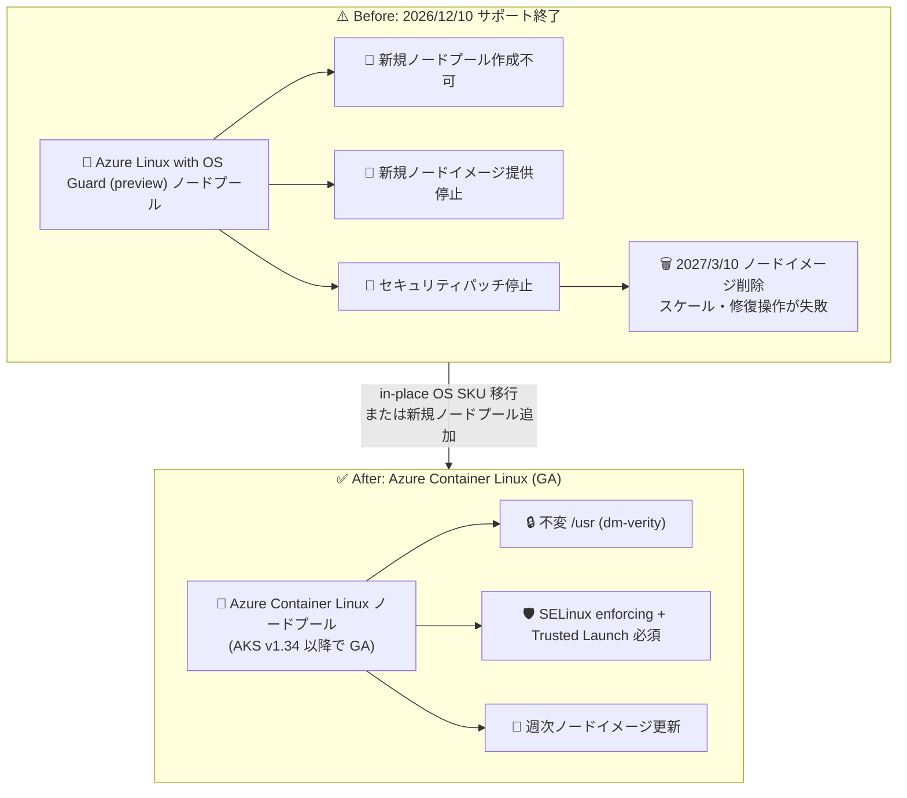

# Azure Kubernetes Service: Azure Linux with OS Guard の廃止 (Retirement)

**リリース日**: 2026-09-11

**サービス**: Azure Kubernetes Service (AKS)

**機能**: Azure Linux with OS Guard (preview) のサポート終了と Azure Container Linux への移行

**ステータス**: Retirement (廃止予告)

[このアップデートのインフォグラフィックを見る](https://takech9203.github.io/azure-news-summary/20260911-aks-azure-linux-os-guard-retirement.html)

## 概要

Azure Kubernetes Service (AKS) における Azure Linux with OS Guard (preview) のサポートが **2026 年 12 月 10 日** に終了することが発表されました。後継となるのは、AKS v1.34 以降で GA (一般提供) になっているコンテナ最適化 OS の **Azure Container Linux (ACL)** です。

2026 年 12 月 10 日以降、Azure Linux with OS Guard (preview) の新規ノードプールは作成できなくなり、既存ノードプール向けの新しいノードイメージの提供およびセキュリティパッチの適用も停止します。さらに **2027 年 3 月 10 日** には Azure Linux with OS Guard のノードイメージ自体が削除され、対象ノードプールではスケーリングや修復操作 (reimage / redeploy を含む) が失敗するようになります。

Azure Container Linux は Flatcar Container Linux をベースに、Azure Linux のパッケージ・サービシング・プラットフォーム統合を組み合わせた不変 (immutable) なコンテナ最適化 OS です。Microsoft Learn のドキュメントでは、OS Guard (preview) が提供していた Integrity Policy Enforcement (IPE) によるコード整合性などの機能は、将来のリリースで ACL に取り込まれる予定であると説明されています。

**アップデート前の課題**

- Azure Linux with OS Guard は preview のまま提供されており、GA 相当の長期サポートが約束された選択肢ではなかった
- セキュリティ強化 (不変 OS・コード整合性) を求めるユーザー向けの OS オプションが preview 機能に依存していた

**アップデート後の改善 (移行先の位置づけ)**

- 後継の Azure Container Linux は AKS v1.34 以降で GA となっており、本番利用可能なサポート対象の OS オプションとして提供される
- dm-verity による `/usr` の不変化、SELinux (enforcing モード)、Trusted Launch (Secure Boot + vTPM) 必須化など、ハードニングされたセキュリティ機能を標準搭載
- 週次のノードイメージ更新により、最新のセキュリティパッチが一貫して適用される

## アーキテクチャ図



2026 年 12 月 10 日のサポート終了・2027 年 3 月 10 日のイメージ削除に向けて、Azure Linux with OS Guard ノードプールを Azure Container Linux へ移行する流れを示しています。

## サービスアップデートの詳細

### 廃止スケジュール

| 日付 | 内容 |
|------|------|
| 2026 年 12 月 10 日 | Azure Linux with OS Guard (preview) のサポート終了。新規ノードプール作成不可、新規ノードイメージ提供停止、既存ノードプールへのセキュリティパッチ停止 |
| 2027 年 3 月 10 日 | Azure Linux with OS Guard のノードイメージを削除。以降、対象ノードプールのスケーリングおよび修復操作 (reimage / redeploy を含む) が失敗 |

### 移行オプション

1. **In-place OS SKU 移行**
   - 既存の Azure Linux with OS Guard ノードプールの OS SKU を `AzureContainerLinux` に変更する方式
   - 標準のノードイメージアップグレード処理としてノードプールが自動的に再イメージ化される
   - ノードプールの新規作成や名前変更は不要

2. **新規 ACL ノードプールの追加 + 既存ノードプールの削除**
   - `--os-sku AzureContainerLinux` を指定して新しいノードプールを追加し、ワークロードを移行・検証した後に、既存の Azure Linux with OS Guard ノードプールを削除する方式

### 移行先: Azure Container Linux (ACL) の主要機能

1. **不変性 (Immutability)**
   - `/usr` ディレクトリは dm-verity で保護された読み取り専用ボリュームとしてマウントされ、カーネルが署名済みルートハッシュを検証して改ざんを検出・ブロック

2. **SELinux による強制アクセス制御**
   - SELinux が既定で enforcing モードで動作し、プロセスによるシステムリソースへのアクセスを制限

3. **Trusted Launch と Secure Boot**
   - Trusted Launch (Secure Boot + vTPM) が必須。カーネル・initramfs・カーネルコマンドラインを単一の署名済みアーティファクトにまとめた Unified Kernel Image (UKI) によりブートチェーンの整合性を保証

4. **自動ノードイメージ更新**
   - 週次のイメージベース更新により、最新のセキュリティパッチとバグ修正を配信

5. **アーキテクチャ / GPU サポート**
   - AMD64 と ARM64 の両方をサポート (ARM64 は Trusted Launch 互換性のため Cobalt ベースの v6 SKU が必要)
   - AMD64 では NVIDIA GPU ノードプールをサポート
   - ノード自動プロビジョニング (NAP) をサポート

## 技術仕様

| 項目 | 詳細 |
|------|------|
| 廃止対象 | Azure Linux with OS Guard (preview) in AKS |
| 移行先 | Azure Container Linux (ACL)。Flatcar Container Linux 由来 + Azure Linux パッケージ / サービシング |
| ACL の GA 対応バージョン | AKS v1.34 以降 |
| ACL の必須要件 | Trusted Launch (Secure Boot + vTPM)。非 Trusted Launch 構成は提供なし |
| OS SKU 指定 | `--os-sku AzureContainerLinux` |
| サポートされる OS アップグレードチャネル | `NodeImage` および `None` のみ (`Unmanaged` / `SecurityPatch` は不変 `/usr` のため非互換) |
| ACL 非サポート機能 | Artifact Streaming、Pod Sandboxing、Confidential VM (CVM)、Generation 1 VM |
| ノードイメージのバージョン形式 | AKS の日付ベース形式 (例: `AKSAzureContainerLinux-202606.01.0`)、週次リリース |
| Azure CLI 要件 | ACL 利用は 2.86.0 以降 (in-place OS SKU 移行の前提条件としては 2.61.0 以降) |

## 設定方法 (移行手順)

### 前提条件

1. Azure CLI 2.86.0 以降 (`az version` で確認、`az upgrade` で更新)
2. ノードプールの VM サイズが Trusted Launch をサポートしていること (非対応の場合はサイズ変更または対応サイズでのノードプール再作成が必要)
3. 本番クラスターの移行前に、開発 / ステージング環境で ACL 上でのワークロード動作を検証すること
4. アップグレード中の Pod 退避に備え、十分な Pod Disruption Budget (PDB) を設定しておくこと

### Azure CLI

**オプション 1: In-place OS SKU 移行**

```bash
# 既存ノードプールを Azure Container Linux に移行 (ノードプールの再イメージ化が実行される)
az aks nodepool update \
    --resource-group $RESOURCE_GROUP \
    --cluster-name $CLUSTER_NAME \
    --name <existing-node-pool-name> \
    --os-sku AzureContainerLinux \
    --enable-secure-boot \
    --enable-vtpm
```

**オプション 2: 新規 ACL ノードプール追加 + 既存ノードプール削除**

```bash
# ACL ノードプールを追加 (System モードの例)
az aks nodepool add \
    --resource-group $RESOURCE_GROUP \
    --cluster-name $CLUSTER_NAME \
    --name aclsystem \
    --mode System \
    --os-sku AzureContainerLinux \
    --node-count 3

# ワークロードの移行・検証後、既存ノードプールを削除
az aks nodepool delete \
    --resource-group $RESOURCE_GROUP \
    --cluster-name $CLUSTER_NAME \
    --name <existing-node-pool-name>
```

**移行後の確認**

```bash
# ノードの OS を確認
kubectl get nodes -o wide

# ノードイメージバージョンを確認
az aks nodepool list \
    --resource-group $RESOURCE_GROUP \
    --cluster-name $CLUSTER_NAME \
    --query '[].{name: name, osSku: osSku, nodeImageVersion: nodeImageVersion}'
```

**ロールバック**: 移行で問題が発生した場合は、`az aks nodepool update --os-sku AzureLinux` のように OS SKU を以前の値に戻して再デプロイすることで、ノードプールを元の OS SKU に再イメージ化できます。

## メリット

### ビジネス面

- preview 機能への依存から脱却し、GA としてサポートされる OS オプション (ACL) に移行できる
- 週次のイメージ更新とサプライチェーンの信頼性 (署名済みパッケージ・署名済み UKI) により、コンプライアンス要件への対応が容易になる

### 技術面

- カーネルレベルで強制される `/usr` の不変性により、OS レベルの改ざんリスクを低減
- コンテナ実行に必要なコンポーネントのみを含む最小構成で攻撃対象領域を削減
- Trusted Launch / Secure Boot / vTPM による測定ブートと構成証明 (attestation) をネイティブサポート
- In-place OS SKU 移行を使えばノードプールを作り直さずに移行でき、問題発生時はロールバックも可能

## デメリット・制約事項

- **移行期限が明確**: 2026 年 12 月 10 日以降はセキュリティパッチが提供されず、2027 年 3 月 10 日以降はスケール・修復操作が失敗するため、それまでの移行が実質必須
- **OS Guard 固有機能の提供時期**: Integrity Policy Enforcement (IPE) によるコード整合性などの OS Guard (preview) 機能は、将来のリリースで ACL に取り込まれる予定 (アナウンス時点では ACL に未搭載)
- **Trusted Launch 必須**: ノードプールの VM サイズが Trusted Launch に対応している必要がある。Generation 1 VM は利用不可。ARM64 は Cobalt ベース (v6) SKU が必要
- **非サポート機能**: Artifact Streaming、Pod Sandboxing、Confidential VM (CVM) は ACL では利用不可。これらを使用中のクラスターには ACL ノードプールを追加できない場合がある
- **アップグレードチャネル制限**: ノード OS アップグレードチャネルは `NodeImage` と `None` のみ。`SecurityPatch` / `Unmanaged` は利用不可
- In-place OS SKU 移行は Azure Portal / PowerShell からは実行できない (Azure CLI のみ)。ノードプールの名前変更も不可

## ユースケース

### ユースケース 1: 既存 OS Guard ノードプールの in-place 移行

**シナリオ**: セキュリティ強化目的で Azure Linux with OS Guard (preview) ノードプールを運用中のチームが、ノードプール構成を変えずに廃止期限前に ACL へ移行する。

**実装例**:

```bash
# 1. 開発環境で ACL クラスターを作成しワークロードを検証
az aks create \
  --resource-group $DEV_RESOURCE_GROUP \
  --name $DEV_CLUSTER_NAME \
  --os-sku AzureContainerLinux \
  --node-count 3 \
  --generate-ssh-keys

# 2. 検証後、本番ノードプールを in-place 移行
az aks nodepool update \
    --resource-group $RESOURCE_GROUP \
    --cluster-name $CLUSTER_NAME \
    --name <os-guard-node-pool> \
    --os-sku AzureContainerLinux \
    --enable-secure-boot \
    --enable-vtpm
```

**効果**: 標準のノードイメージアップグレードと同じフローで移行が完了し、2026 年 12 月 10 日以降もセキュリティパッチとノードイメージ更新を継続して受けられる。

## 関連サービス・機能

- **Azure Container Linux (ACL)**: 本廃止の移行先。Flatcar Container Linux をベースにした不変・コンテナ最適化 OS (AKS v1.34 以降で GA)
- **Azure Linux**: AKS のノード OS オプションの 1 つ。ACL は Azure Linux の署名済みパッケージとサプライチェーンプロセスを継承
- **Trusted Launch (Secure Boot / vTPM)**: ACL の必須要件。ブートチェーンの整合性を保証
- **ノード OS 自動アップグレードチャネル**: ACL では `NodeImage` / `None` のみサポート
- **ノード自動プロビジョニング (NAP)**: ACL でサポートされるノードのスケーリング機能

## 参考リンク

- [インフォグラフィック](https://takech9203.github.io/azure-news-summary/20260911-aks-azure-linux-os-guard-retirement.html)
- [公式アップデート情報](https://azure.microsoft.com/updates?id=571257)
- [Azure Container Linux (ACL) for AKS Overview](https://learn.microsoft.com/en-us/azure/azure-linux/azure-container-linux-overview)
- [Tutorial: Migrate Nodes to Azure Container Linux (ACL) for AKS](https://learn.microsoft.com/en-us/azure/azure-linux/tutorial-migrate-azure-container-linux-aks)
- [Quickstart: Deploy an Azure Container Linux (ACL) AKS Cluster using the Azure CLI](https://learn.microsoft.com/en-us/azure/azure-linux/quick-deploy-azure-container-linux-aks-cli)
- [AKS Core Concepts (ノードとノードプール)](https://learn.microsoft.com/en-us/azure/aks/core-aks-concepts)

## まとめ

AKS の Azure Linux with OS Guard (preview) は 2026 年 12 月 10 日にサポートが終了し、2027 年 3 月 10 日にはノードイメージが削除されてスケール・修復操作が失敗するようになります。後継の Azure Container Linux (ACL) は AKS v1.34 以降で GA となっており、不変 `/usr` (dm-verity)、SELinux enforcing、Trusted Launch 必須といったハードニングを標準で備えています。OS Guard ノードプールを運用中の場合は、まず開発 / ステージング環境で ACL 上のワークロード動作と非サポート機能 (Pod Sandboxing、CVM、Artifact Streaming など) の影響を確認し、in-place OS SKU 移行または新規 ACL ノードプールへの切り替えを、セキュリティパッチが停止する 2026 年 12 月 10 日より前に完了させることを推奨します。

---

**タグ**: #AKS #AzureLinux #OSGuard #AzureContainerLinux #Retirement #Kubernetes #Security
