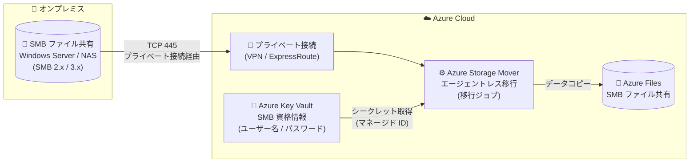

# Azure Storage Mover: オンプレミス SMB ファイル共有から Azure Files (SMB) へのエージェントレス移行 (Public Preview)

**リリース日**: 2026-09-11

**サービス**: Azure Storage Mover

**機能**: オンプレミス SMB ファイル共有から Azure Files (SMB) へのエージェントレス移行

**ステータス**: In preview

[このアップデートのインフォグラフィックを見る](https://takech9203.github.io/azure-news-summary/20260911-storage-mover-agentless-smb-migration.html)

## 概要

Azure Storage Mover が、オンプレミスの SMB ファイル共有から Azure Files (SMB) へのエージェントレス移行をパブリックプレビューとしてサポートした。Windows Server のファイルサービスや NAS の SMB 共有上のファイルデータを、移行エージェントのデプロイ・登録・保守なしで Azure に移行できるようになる。

Azure Storage Mover は、オンプレミスや AWS S3 などからファイル・フォルダーを Azure Storage に移行するためのフルマネージド移行サービスである。従来のオンプレミス SMB 共有の移行では、ソースストレージの近くに移行エージェント VM をデプロイし、Storage Mover リソースに登録して運用する必要があった。今回のアップデートにより、クラウドサービス側が移行のオーケストレーションとデータ転送を担うエージェントレス方式が SMB → Azure Files (SMB) のシナリオで利用可能になった。

エージェントレス SMB 移行では、Azure とソース SMB 共有をホストするネットワーク間のプライベート接続 (VPN / ExpressRoute など) が必要であり、ソース共有へのアクセスに使用する SMB 資格情報は Azure Key Vault のシークレットとして保管する。

**アップデート前の課題**

- オンプレミス SMB 共有の移行には、ソースの近くに移行エージェント VM をデプロイし、Storage Mover リソースへ登録する必要があった
- 移行エージェント VM の運用・保守 (更新、監視、リソース確保) が管理者の負担となっていた
- エージェント用の仮想化基盤を用意できない環境では導入のハードルが高かった

**アップデート後の改善**

- エージェント VM のデプロイ・登録・保守が不要になり、Azure 側のマネージドサービスだけで移行を実行できる
- ソースエンドポイント、ターゲットエンドポイント、プロジェクト、ジョブ定義を Azure Portal / Azure CLI から構成するだけで移行を開始できる
- SMB 資格情報は Azure Key Vault で安全に管理され、マネージド ID ベースの RBAC でアクセス制御される

## アーキテクチャ図



オンプレミスの SMB 共有からプライベート接続経由で Azure Storage Mover のエージェントレス移行ジョブがデータを読み取り、Azure Files (SMB) にコピーする。ソースへの認証には Azure Key Vault に格納した SMB 資格情報を使用する。

## サービスアップデートの詳細

### 主要機能

1. **エージェントレス移行**
   - 移行エージェント VM のデプロイ・登録・保守が不要。クラウドサービス側が移行のオーケストレーションと管理を提供する

2. **エージェントレス SMB ソースエンドポイント**
   - ソース SMB サーバーのホスト名 (FQDN) またはプライベート IP と共有名を指定してソースエンドポイントを作成する
   - SMB 資格情報 (ユーザー名 / パスワード) は Azure Key Vault の 2 つのシークレットとして格納し、シークレット名または URI で参照する

3. **プライベート接続対応**
   - ジョブ定義の「Private connections (Preview)」でプライベート接続リソースを指定し、Azure からソース共有へプライベートに到達する

4. **コピーモード (Additive / Mirror)**
   - 初回移行には Additive、ターゲットをソースと完全一致させたい場合には Mirror を使用する

5. **増分移行によるカットオーバー**
   - 初回コピー後に増分パスを繰り返し、最終カットオーバー時はソースへの書き込みを停止して最終増分パスを実行。ダウンタイムを最小化できる

### ファイル忠実性 (フィデリティ)

SMB ソースからの移行では、移行先の Azure ファイル共有と同レベルのファイル忠実性がサポートされる。フォルダー構造に加え、ファイル / フォルダーのタイムスタンプ、ACL、ファイル属性などのメタデータが維持される。

## 技術仕様

| 項目 | 詳細 |
|------|------|
| ソース | オンプレミス SMB ファイル共有 (Windows Server / NAS、SMB 2.x / 3.x) |
| ターゲット | Azure Files (SMB) ※エージェントレスでは Azure Blob コンテナーもサポート |
| ネットワーク要件 | Azure とソースネットワーク間のプライベート接続 (TCP 445 の到達性が必要) |
| 資格情報管理 | Azure Key Vault (ユーザー名 / パスワードの 2 シークレット) |
| ジョブあたりのオブジェクト数上限 | 5 億オブジェクト (超える場合はジョブを分割) |
| 同時実行ジョブ数 | サブスクリプションあたり最大 10 ジョブ |
| プレビュー中の推奨 | 同一ターゲットファイル共有に対しては同時に 1 ジョブのみ実行 |
| 非サポート | SMB 1.x ソース、NFS Azure ファイル共有ターゲット |
| データの扱い | コピー (移動ではない)。ソースデータは廃止まで SMB サーバーに残る |
| 必要な RBAC ロール | ソースエンドポイント ID: Key Vault Secrets User / ターゲットエンドポイント ID: Storage File Data Privileged Contributor |
| リソースプロバイダー | Microsoft.StorageMover (および Microsoft.HybridCompute) の登録が必要 |

## 設定方法

### 前提条件

1. プライベートネットワーク接続経由でアクセス可能なオンプレミス SMB ソースファイル共有 (Windows Server ファイルサービスまたは NAS)
2. Azure サブスクリプション内の Storage Mover リソース
3. Azure Storage アカウントと移行先の Azure ファイル共有
4. ソースへのプライベートアクセスのためのプライベート接続の構成
5. SMB 資格情報 (ユーザー名 / パスワード) を 2 つのシークレットとして格納した Azure Key Vault
6. Storage Mover リソースの作成と必要な RBAC ロール割り当ての権限

### Azure CLI

```bash
# エージェントレス SMB ソースエンドポイントを作成
az storage-mover endpoint create-for-smb \
  --resource-group <resource-group> \
  --storage-mover-name <storage-mover-name> \
  --name OnPremSmbSourceEndpoint \
  --host <smb-server-fqdn-or-ip> \
  --share-name <smb-share-name>

# Azure Files (SMB) ターゲットエンドポイントを作成
az storage-mover endpoint create-for-storage-smb-file-share \
  --resource-group <resource-group> \
  --storage-mover-name <storage-mover-name> \
  --name AzureFilesTargetEndpoint \
  --storage-account-id <storage-account-resource-id> \
  --file-share-name <target-file-share-name>

# プロジェクトを作成
az storage-mover project create \
  --resource-group <resource-group> \
  --storage-mover-name <storage-mover-name> \
  --name OnPremSmbMigrationProject

# ジョブ定義を作成 (初回移行は Additive を推奨)
az storage-mover job-definition create \
  --resource-group <resource-group> \
  --storage-mover-name <storage-mover-name> \
  --project-name OnPremSmbMigrationProject \
  --name OnPremSmbToAzureFilesJob \
  --source-name OnPremSmbSourceEndpoint \
  --target-name AzureFilesTargetEndpoint \
  --copy-mode Additive

# 移行ジョブを開始
az storage-mover job-definition start \
  --resource-group <resource-group> \
  --storage-mover-name <storage-mover-name> \
  --project-name OnPremSmbMigrationProject \
  --job-definition-name OnPremSmbToAzureFilesJob
```

### Azure Portal

1. Storage Mover リソースの「Resource Management」>「Storage endpoints」>「Source endpoints」>「Create endpoint」から、エージェントレス SMB ソースに対応する移行タイプ / ソースタイプを選択し、ホスト名 (または IP)、共有名、Key Vault、ユーザー名 / パスワードのシークレット (名前または URI) を指定してソースエンドポイントを作成
2. 「Target endpoints」>「Add endpoint」から、サブスクリプション、ストレージアカウント、ターゲットタイプ「File share」、プロトコル、移行先ファイル共有を指定してターゲットエンドポイントを作成
3. 「Projects」でプロジェクトを作成し、「Create job definition」でジョブ定義を作成。「Private connections (Preview)」セクションでプライベート接続リソースを追加
4. 「Migration jobs」からジョブ定義を開き「Start job」で移行を開始。転送ファイル数、スループット、エラーなどを監視

## メリット

### ビジネス面

- 移行エージェント VM のデプロイ・保守が不要になり、移行プロジェクトの立ち上げ工数と運用負担を削減できる
- 増分移行パターンによりカットオーバー時のダウンタイムを最小化でき、業務影響を抑えたファイルサーバーのクラウド移行が可能

### 技術面

- エージェント用の仮想化基盤 (VM の実行環境) を用意できない環境でも SMB 共有の移行が可能
- SMB 資格情報を Azure Key Vault で一元管理し、エンドポイントのマネージド ID と RBAC (Key Vault Secrets User / Storage File Data Privileged Contributor) によるアクセス制御で安全に移行できる
- ACL、タイムスタンプ、ファイル属性などのメタデータを維持したフルフィデリティ移行

## デメリット・制約事項

- パブリックプレビューのため、本番利用前に制限事項の確認が必要 (SLA の対象外)
- Azure とソース SMB 共有をホストするネットワーク間のプライベート接続 (VPN / ExpressRoute など、TCP 445 の到達性) が必須
- 1 移行ジョブあたり最大 5 億オブジェクト。超える場合はジョブの分割が必要
- 同時実行はサブスクリプションあたり最大 10 ジョブ。プレビュー中は同一ターゲットファイル共有に対して同時に 1 ジョブのみの実行が推奨
- SMB 1.x ソースは非サポート (SMB 2.x / 3.x を使用)
- データはコピーされる (移動ではない) ため、移行完了後のソース側の廃止作業は別途必要

## ユースケース

### ユースケース 1: オンプレミス Windows ファイルサーバーの Azure Files への移行

**シナリオ**: 老朽化したオンプレミスの Windows Server ファイルサーバーを廃止し、部門ファイル共有を Azure Files (SMB) に移行する。エージェント VM を追加でデプロイする余裕がない環境で、ダウンタイムを最小限に抑えたい。

**実装例**:

```bash
# 1. SMB 資格情報を Key Vault に格納 (ユーザー名 / パスワードの 2 シークレット)
az keyvault secret set --vault-name <kv-name> --name smb-username --value "<username>"
az keyvault secret set --vault-name <kv-name> --name smb-password --value "<password>"

# 2. ソース / ターゲットエンドポイント、プロジェクト、ジョブ定義を作成し初回コピーを実行
#    (「設定方法」の Azure CLI 手順を参照)

# 3. 増分パスを繰り返し、最終カットオーバー時にソースへの書き込みを停止して最終増分パスを実行
az storage-mover job-definition start \
  --resource-group <resource-group> \
  --storage-mover-name <storage-mover-name> \
  --project-name OnPremSmbMigrationProject \
  --job-definition-name OnPremSmbToAzureFilesJob
```

**効果**: エージェント VM の運用なしでファイルサーバーを移行でき、ユーザーは `\\<storage-account-name>.file.core.windows.net\<share-name>` 形式の UNC パスに切り替えるだけで移行後の共有を利用できる。

### ユースケース 2: NAS からのファイルデータ移行

**シナリオ**: 仮想マシンを実行できない (エージェントをホストできない) NAS アプライアンス上の SMB 共有を Azure Files へ移行する。

**効果**: エージェントレス方式により、NAS 側に追加コンポーネントを導入することなく、既存のプライベート接続経由でデータを Azure Files に移行できる。

## 料金

このアップデートに関する Storage Mover エージェントレス移行自体の料金情報は、今回確認した公式ドキュメントには記載がなかった。移行先の Azure Files のストレージ容量・トランザクションに応じた料金が発生するため、詳細は料金ページを参照。

- [Azure Files の料金](https://azure.microsoft.com/pricing/details/storage/files/)

## 利用可能リージョン

このプレビューの利用可能リージョンに関する公式情報は、今回確認したドキュメントには記載がなかった。最新情報は以下を参照。

- [Azure 製品のリージョン別提供状況](https://azure.microsoft.com/explore/global-infrastructure/products-by-region/)

## 関連サービス・機能

- **Azure Files**: 本アップデートの移行先となるフルマネージドのクラウドファイル共有サービス。SMB 共有としてマウント可能で、ACL などのメタデータを保持したまま移行できる
- **Azure Key Vault**: ソース SMB 共有への認証に使用するユーザー名 / パスワードをシークレットとして安全に格納。ソースエンドポイントのマネージド ID に Key Vault Secrets User ロールを割り当ててアクセスする
- **Azure Data Box**: 大容量の初期一括移行にはオフライン転送の Data Box を使用し、輸送中の差分を Storage Mover の「オンラインキャッチアップ」で同期する組み合わせが可能
- **VPN Gateway / ExpressRoute**: エージェントレス SMB 移行に必須のプライベート接続を提供するネットワークサービス
- **AzCopy**: 小規模なコピーに適したコマンドラインツール。1 TB を超える大規模移行では Storage Mover の利用が推奨されている

## 参考リンク

- [インフォグラフィック](https://takech9203.github.io/azure-news-summary/20260911-storage-mover-agentless-smb-migration.html)
- [公式アップデート情報](https://azure.microsoft.com/updates?id=570910)
- [Microsoft Learn: エージェントレス移行によるオンプレミス SMB ファイル共有の Azure Files への移行](https://learn.microsoft.com/azure/storage-mover/agentless-on-premises-files-migration)
- [Microsoft Learn: Azure Storage Mover の概要](https://learn.microsoft.com/azure/storage-mover/service-overview)
- [Microsoft Learn: Azure Storage Mover デプロイの計画](https://learn.microsoft.com/azure/storage-mover/deployment-planning)
- [Azure Files の料金](https://azure.microsoft.com/pricing/details/storage/files/)

## まとめ

Azure Storage Mover のエージェントレス SMB 移行 (パブリックプレビュー) により、移行エージェント VM のデプロイ・登録・保守なしで、オンプレミスの Windows Server や NAS の SMB 共有を Azure Files (SMB) へ移行できるようになった。Key Vault による資格情報管理とマネージド ID ベースの RBAC により、セキュアかつ運用負担の少ない移行が可能である。ファイルサーバーのクラウド移行を検討している場合、特にエージェント用 VM を用意しづらい NAS 環境では有力な選択肢となる。プライベート接続 (TCP 445 到達性) が必須である点と、プレビュー中の制限 (ジョブあたり 5 億オブジェクト、同時 10 ジョブなど) を確認のうえ、非本番環境での検証から始めることを推奨する。

---

**タグ**: Azure Storage Mover, Azure Files, SMB, Migration, Storage, Agentless, In preview
