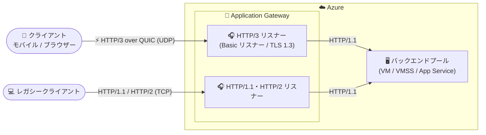

# Azure Application Gateway: HTTP/3 over QUIC サポート (Public Preview)

**リリース日**: 2026-09-14

**サービス**: Azure Application Gateway

**機能**: HTTP/3 over QUIC サポート

**ステータス**: In preview

[このアップデートのインフォグラフィックを見る](https://takech9203.github.io/azure-news-summary/20260914-application-gateway-http3-quic.html)

## 概要

Azure Application Gateway で HTTP/3 over QUIC のサポートがパブリックプレビューとして発表されました。HTTP/3 は HTTP の次世代バージョンであり、トランスポート層に TCP ではなく UDP ベースの QUIC プロトコルを使用します。これにより、接続確立時間の短縮、レイテンシの削減、モバイルや不安定なネットワーク環境における耐障害性の向上が実現されます。

HTTP/3 サポートにより、Application Gateway はフロントエンドのクライアント接続を QUIC 経由で処理できるようになります。Web アプリケーション、メッセージングプラットフォーム、モバイル体験、トランザクション処理、API など、レイテンシに敏感なワークロードのパフォーマンス向上に役立ちます。QUIC は接続確立のオーバーヘッドを削減し、独立したストリームをサポートすることで、パケットロスの影響を最小限に抑え、高レイテンシ・不安定なネットワーク上での応答性を改善します。

HTTP/3 はリスナーレベルで構成し、Basic リスナーに対して選択的に有効化できます。パブリックプレビュー期間中は、Azure Portal または REST API を使用して構成します。なお、HTTP/3 はフロントエンドのクライアント接続にのみ適用され、バックエンドへの接続は引き続き HTTP/1.1 が使用されます。

**アップデート前の課題**

- Application Gateway のフロントエンド接続は HTTP/1.1 および HTTP/2 (いずれも TCP ベース) のみに対応しており、TCP の 3 ウェイハンドシェイクと TLS ハンドシェイクによる接続確立のオーバーヘッドが発生していた
- TCP ベースのプロトコルでは、1 つのパケットロスや遅延が同一接続上の後続パケットの配信をブロックする「ヘッドオブラインブロッキング」が発生し、応答性が低下する場合があった
- クライアントがネットワークを切り替えて IP アドレスが変わると (例: モバイル回線から Wi-Fi へ)、接続の再確立と TLS ハンドシェイクのやり直しが必要だった

**アップデート後の改善**

- QUIC の 1-RTT ハンドシェイクにより接続確立レイテンシが削減され、初期ページロードのパフォーマンスが向上
- QUIC がストリームを独立して処理するため、あるストリームのパケットロスが他のストリームの進行をブロックしない (ヘッドオブラインブロッキングの解消)
- コネクション ID に基づく接続移行 (Connection Migration) により、クライアントの IP アドレスやポートが変わっても接続を維持でき、再ハンドシェイクを回避
- TLS 1.3 が QUIC に組み込まれており、セキュアな通信が標準で提供される

## アーキテクチャ図



HTTP/3 over QUIC はフロントエンドのクライアント接続にのみ適用され、Application Gateway からバックエンドへの通信は引き続き HTTP/1.1 で行われます。HTTP/3 はリスナー単位で有効化するため、従来プロトコルのリスナーと共存できます。

## サービスアップデートの詳細

### 主要機能

1. **高速な接続確立 (1-RTT ハンドシェイク)**
   - QUIC は TCP の 3 ウェイハンドシェイクを 1-RTT ハンドシェイクに置き換え、接続確立のレイテンシを削減する
   - Web アプリケーション、メッセージングプラットフォーム、音声アシスタント、トランザクションシステム、モバイルバンキング、通知サービス、API などのワークロードで、接続開始の高速化とユーザー体感遅延の削減が期待できる

2. **独立した HTTP ストリーム (ヘッドオブラインブロッキングの解消)**
   - 単一の QUIC 接続上で複数ストリームを多重化し、各ストリームを独立して処理する
   - あるストリームでパケットロスが発生しても他のストリームの進行をブロックしないため、Web ブラウジング、インスタントメッセージング、IoT 通信、API トラフィック、金融トランザクションなどの応答性が向上する

3. **接続移行 (Connection Migration)**
   - クライアントの IP アドレスとポートだけでなくコネクション ID を使用して接続を識別する
   - クライアントがネットワークを切り替えたり新しい IP アドレスを取得したりしても接続を継続でき、モバイル回線から Wi-Fi への移動時などに新規接続確立と TLS ハンドシェイクを回避できる

4. **リスナーレベルでの選択的な有効化**
   - ゲートウェイ全体ではなくリスナー単位で HTTP/3 を構成するため、対象のワークロードだけに段階的に適用できる
   - 新規リスナー作成時と既存リスナーの更新時のどちらでも有効化可能

## 技術仕様

| 項目 | 詳細 |
|------|------|
| プロトコル | HTTP/3 over QUIC (UDP ベーストランスポート) |
| 適用範囲 | フロントエンド (クライアント → Application Gateway) のみ |
| バックエンド通信 | HTTP/1.1 (変更なし) |
| 構成単位 | リスナーレベル (Basic リスナーのみ) |
| TLS 要件 | TLS 1.3 必須。TLS 1.3 をサポートする事前定義済み 2022 TLS ポリシーの構成が必要 |
| 構成手段 (プレビュー期間中) | Azure Portal、REST API (API バージョン 2023-02-01 以降) |
| REST API プロパティ | `httpListeners` 内の `enableHttp3: true` |

## 設定方法

### 前提条件

1. Application Gateway が作成済みであること (プレビュー期間中は、新規ゲートウェイ作成フロー内での HTTP/3 有効化は不可)
2. リスナーが TLS 1.3 をサポートする事前定義済み TLS ポリシー (2022 ポリシー) を使用していること。TLS 1.3 非対応の既定ポリシーを使用している場合、HTTP/3 は有効化できない
3. リスナーの種類が Basic であること (マルチサイトリスナーは非対応)
4. クライアントが HTTP/3 に対応していること

### Azure Portal

1. Azure Portal で対象の Application Gateway を開く
2. **設定** の **リスナー** を選択する
3. 既存の Basic リスナーを選択するか、新しい Basic リスナーを追加する
4. リスナーで HTTP/3 を有効化し、**保存** を選択する
5. HTTP/3 対応クライアントから Application Gateway に接続する

### REST API

Network Resource Provider の API バージョン **2023-02-01 以降** を使用します。

```jsonc
// 1. Application Gateways - Get で既存のリソース構成を取得
// 2. httpListeners コレクション内の対象リスナーで enableHttp3 を true に設定
"enableHttp3": true
// 3. Application Gateways - Create Or Update (PUT) でリソースを更新
```

なお、パブリックプレビュー期間中は Azure PowerShell、Azure CLI、Terraform はこの機能をサポートしていません (GA 時にサポート予定)。

## メリット

### ビジネス面

- 初期ページロードや接続開始の高速化により、レイテンシに敏感なワークロード (モバイルバンキング、トランザクション処理、通知サービスなど) のユーザー体験が向上する
- モバイルネットワークやパケットロスの多いネットワーク上のユーザーに対しても安定した応答性を提供でき、離脱率の低減が期待できる
- リスナー単位の有効化により、リスクを抑えながら段階的に新プロトコルを導入できる

### 技術面

- 1-RTT ハンドシェイクによる接続確立レイテンシの削減
- ストリームの独立処理による TCP ヘッドオブラインブロッキングの解消
- 接続移行によるネットワーク切り替え時の接続維持 (再ハンドシェイク不要)
- QUIC に組み込まれた TLS 1.3 によるセキュリティ
- バックエンドは HTTP/1.1 のままのため、バックエンドアプリケーションの改修が不要

## デメリット・制約事項

パブリックプレビュー期間中は以下の制限があります。

- マルチサイトリスナーは非対応 (Basic リスナーのみ)
- IPv6 リスナーおよび相互認証 (mutual authentication) は非対応
- Web Application Firewall (WAF) ゲートウェイでは HTTP/3 リスナーを使用できない
- Public-Private IP Same Port 機能は HTTP/3 リスナーでは非対応
- Azure PowerShell、Azure CLI、Terraform は非対応 (GA 時にサポート予定)。構成は Azure Portal または REST API のみ
- TLS 1.3 をサポートする事前定義済み 2022 TLS ポリシーの使用が必須
- プレビュー版のため SLA はなく、本番ワークロードでの使用は推奨されない ([プレビューの追加利用規約](https://azure.microsoft.com/support/legal/preview-supplemental-terms/) が適用)
- HTTP/3 はフロントエンド接続のみで、バックエンドへの gRPC over HTTP/3 のような用途には利用できない (バックエンドは HTTP/1.1)

## ユースケース

### ユースケース 1: モバイルアプリ向け API のレイテンシ改善

**シナリオ**: モバイルバンキングアプリの API を Application Gateway 経由で公開しており、モバイル回線の高レイテンシ・パケットロスにより API 応答の体感速度が低下している。

**実装例**: 対象 API 用の Basic リスナーに TLS 1.3 対応の 2022 事前定義 TLS ポリシーを構成し、Azure Portal からリスナーの HTTP/3 を有効化する。HTTP/3 対応のモバイルクライアントは QUIC で接続し、非対応クライアントは従来どおり HTTP/1.1・HTTP/2 で接続する。

**効果**: 1-RTT ハンドシェイクによる接続確立の高速化と、パケットロス時のヘッドオブラインブロッキング解消により、モバイルユーザーの体感遅延を削減できる。

### ユースケース 2: 移動中ユーザーのセッション継続性向上

**シナリオ**: メッセージングやリアルタイム通知を提供する Web アプリケーションで、ユーザーがモバイル回線と Wi-Fi を行き来するたびに再接続が発生している。

**実装例**: フロントエンドリスナーで HTTP/3 を有効化し、QUIC の接続移行 (コネクション ID ベースの接続識別) を活用する。

**効果**: クライアントの IP アドレスやポートが変わっても既存接続を維持でき、ネットワーク切り替え時の新規接続確立と TLS ハンドシェイクを回避してシームレスな体験を提供できる。

## 料金

料金ページに HTTP/3 に固有の追加料金の記載はありません。Application Gateway v2 SKU の料金は以下の 2 要素で構成されます。

| 項目 | 課金内容 |
|------|---------|
| 固定料金 | ゲートウェイの稼働時間あたりの課金 (Basic / Standard / WAF の各種別) |
| 容量ユニット | 容量ユニット時間あたりの従量課金 (コンピュートユニット、永続接続数、スループットの 3 要素で算定) |

受信データ転送は無料、送信データ転送には標準のデータ転送料金が適用されます。具体的な金額はリージョン・通貨によって異なるため、[Application Gateway 料金ページ](https://azure.microsoft.com/pricing/details/application-gateway/) および [Azure 料金計算ツール](https://azure.microsoft.com/pricing/calculator/) を参照してください。

## 利用可能リージョン

公式情報でプレビューの対象リージョンは確認できませんでした。最新情報は [Microsoft Learn ドキュメント](https://learn.microsoft.com/azure/application-gateway/http3-quic-support) を参照してください。

## 関連サービス・機能

- **Azure Front Door**: グローバルな L7 ロードバランサー。現時点でクライアント接続は HTTP/1.1・HTTP/2 のサポートにとどまり、HTTP/3 には対応していない。リージョナルな Application Gateway が HTTP/3 に先行対応した形となる
- **Azure Web Application Firewall (WAF)**: Application Gateway と統合してアプリケーションを保護するが、プレビュー期間中は WAF ゲートウェイで HTTP/3 リスナーを使用できない点に注意
- **Application Gateway の TLS ポリシー**: HTTP/3 の有効化には TLS 1.3 をサポートする事前定義済み 2022 TLS ポリシーが必須

## 参考リンク

- [インフォグラフィック](https://takech9203.github.io/azure-news-summary/20260914-application-gateway-http3-quic.html)
- [公式アップデート情報](https://azure.microsoft.com/updates?id=571123)
- [Microsoft Learn: HTTP/3 support in Azure Application Gateway (Preview)](https://learn.microsoft.com/azure/application-gateway/http3-quic-support)
- [Microsoft Learn: Azure Application Gateway ドキュメント](https://learn.microsoft.com/azure/application-gateway/)
- [料金ページ](https://azure.microsoft.com/pricing/details/application-gateway/)

## まとめ

Azure Application Gateway のフロントエンド接続で HTTP/3 over QUIC がパブリックプレビューとして利用可能になりました。1-RTT ハンドシェイク、ヘッドオブラインブロッキングの解消、接続移行という QUIC の特性により、特にモバイルや不安定なネットワーク上のレイテンシに敏感なワークロードで大きな効果が期待できます。バックエンドは HTTP/1.1 のままのため、バックエンドアプリケーションの改修なしに導入できる点も魅力です。

一方で、プレビュー期間中は Basic リスナー限定、WAF ゲートウェイ非対応、IPv6 リスナー・相互認証非対応、CLI/PowerShell/Terraform 非対応 (Portal・REST API のみ) といった制限があり、SLA も提供されません。まずは開発・検証環境のリスナーで有効化し、TLS 1.3 対応の 2022 TLS ポリシーへの移行準備とあわせて、HTTP/3 対応クライアントでの効果測定から始めることを推奨します。

---

**タグ**: Azure Application Gateway, HTTP/3, QUIC, Networking, Security, TLS 1.3, Public Preview
