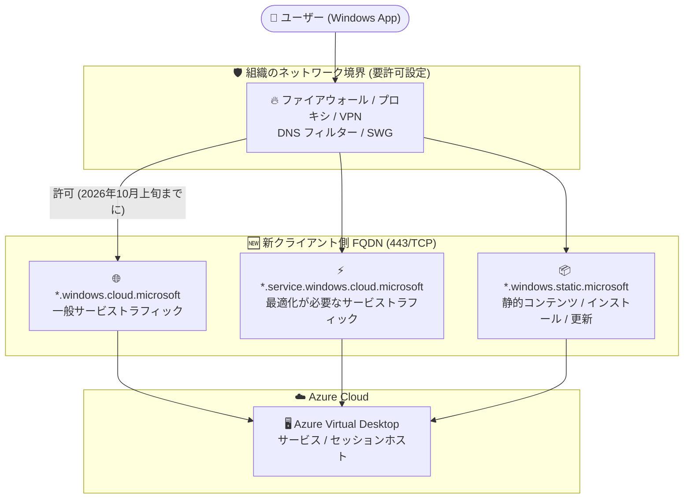

# Azure Virtual Desktop: Windows App の新しいクライアント側エンドポイント (FQDN) の発表

**リリース日**: 2026-09-14

**サービス**: Azure Virtual Desktop

**機能**: Windows App client-side endpoints (新しいワイルドカード FQDN)

**ステータス**: Announcement (2026 年 10 月上旬より適用開始)

[このアップデートのインフォグラフィックを見る](https://takech9203.github.io/azure-news-summary/20260914-avd-windows-app-client-endpoints.html)

## 概要

2026 年 10 月上旬より、Windows App は Azure Virtual Desktop (AVD) へのクライアント側サービストラフィックに、3 つの新しいワイルドカード FQDN (`*.windows.cloud.microsoft`、`*.service.windows.cloud.microsoft`、`*.windows.static.microsoft`) を使用開始します。これらのドメインは、すでにクラウド側 (セッションホスト側) の接続要件には含まれているものです。

今回の変更は Windows App の**クライアント側**の変更であり、以前のクラウド側ドメイン更新とは別の対応が必要です。Windows App を実行するデバイスにネットワーク制御 (ファイアウォール、プロキシ、VPN、DNS フィルタリング、Secure Web Gateway など) を適用している組織は、適用開始前にこれらのエンドポイントを許可する必要があります。エンドポイントに到達できない場合、ユーザーはサインインや接続の失敗を経験する可能性があります。

この取り組みは、ドメイン要件を統一する [Microsoft の全社的なアプローチ (cloud.microsoft ドメインへの統合)](https://learn.microsoft.com/microsoft-365/enterprise/cloud-microsoft-domain?view=o365-worldwide) の一環です。

**アップデート前の課題**

- AVD 関連のサービストラフィックは `*.wvd.microsoft.com` など複数の異なるドメイン体系に分散しており、Microsoft サービス全体でドメイン要件が統一されていなかった
- 新ドメイン (`*.cloud.microsoft` 系) はクラウド側 (セッションホスト) の接続要件には追加済みだったが、クライアント側デバイスのネットワーク制御では考慮されていない環境が存在する

**アップデート後の改善**

- Windows App のクライアント側トラフィックが、Microsoft 統一ドメイン体系 (`cloud.microsoft` / `static.microsoft`) に整理された 3 つのワイルドカード FQDN に集約される
- クラウド側とクライアント側で同一のドメイン群を使用するため、ネットワーク許可リストの管理が統一・簡素化される

## アーキテクチャ図



Windows App からの接続は、組織のネットワーク境界 (ファイアウォール、プロキシ、VPN、DNS フィルター、Secure Web Gateway) を通過して 3 つの新しいワイルドカード FQDN へ到達する必要があります。これらがブロックまたは TLS インスペクションで中断されると、サインイン・リソース検出・接続・アクティブセッションが失敗する可能性があります。

## サービスアップデートの詳細

### 主要機能

1. **3 つの新しいワイルドカード FQDN の使用開始**
   - 2026 年 10 月上旬より、Windows App がクライアント側サービストラフィックにこれらのドメインを使用開始する
   - いずれも 443/TCP のアウトバウンド HTTPS 通信

2. **クラウド側要件との統一**
   - 3 つの FQDN はすでにセッションホスト (クラウド側) の接続要件に含まれており、Microsoft Learn の必須 FQDN 一覧では「End user devices」セクションにも記載済み
   - クラウド側のドメイン更新を完了済みの組織でも、ユーザーデバイスに適用されるプロキシ・ファイアウォール・VPN・DNS フィルタリング・Secure Web Gateway のポリシーを改めて確認する必要がある

3. **Microsoft 統一ドメインへの移行の一環**
   - Microsoft 365 などで進む `cloud.microsoft` ドメインへの統合と同じ方針に基づく変更

### 影響を受ける組織

- Windows App を使用して Azure Virtual Desktop に接続している組織
- エンドユーザーデバイスにファイアウォール、プロキシ、VPN、DNS フィルタリング、Secure Web Gateway などの制御を適用している組織

### 想定される影響

エンドポイントが利用不可・ブロック・接続を中断する形でインスペクションされている場合、以下の場面でユーザーが障害を経験する可能性があります。

- サインイン
- リソース検出 (ワークスペースの列挙)
- 接続の確立
- アクティブなセッション中

## 技術仕様

| FQDN | 用途 | プロトコル / ポート |
|------|------|-------------------|
| `*.windows.cloud.microsoft` | 一般的な Windows クラウドサービストラフィック | TCP 443 |
| `*.service.windows.cloud.microsoft` | 最適化が必要なサービストラフィック | TCP 443 |
| `*.windows.static.microsoft` | 静的コンテンツ、インストール、更新アセット | TCP 443 |

**補足**:

- 適用開始時期: 2026 年 10 月上旬
- すべてアウトバウンド通信。AVD ではインバウンドポートを開放する必要はない
- Azure for US Government では別のドメイン体系 (`*.service.windows.usgovcloud.microsoft`、`*.windows.usgovcloud.microsoft`、`*.windows.usgovcloud-static.microsoft`) が使用される
- サービストラフィックの FQDN にはワイルドカード文字 (`*`) の使用が必須 (Microsoft Learn の記載による)
- Azure Firewall を使用している場合は、Azure Virtual Desktop のサービスタグ (`WindowsVirtualDesktop`) と FQDN タグの活用が推奨されている

## 推奨される対応 (2026 年 10 月上旬までに)

1. 該当するファイアウォールルール、プロキシ許可リスト、VPN 構成、DNS フィルター、Secure Web Gateway ポリシーで、3 つの FQDN への 443/TCP アウトバウンド HTTPS トラフィックを許可する
2. Windows App が Microsoft サービスへ到達するのを妨げる可能性がある TLS インスペクションやその他のトラフィック傍受を確認する。組織のポリシーで許可される場合は、このトラフィックを Microsoft へ直接ルーティングする
3. クライアントデバイスが管理されたネットワーク境界の内側にある場合は、承認や変更管理プロセスにリードタイムがかかるため、できるだけ早期にネットワーク制御の管理チームと調整を開始する
4. ヘルプデスクへ周知し、社内のネットワークドキュメントとトラブルシューティングガイドを更新する

接続確認には、Microsoft Learn で案内されている *Azure Virtual Desktop Agent URL Tool* (セッションホスト側の必須 FQDN 到達性チェック) も活用できます。

## メリット

### ビジネス面

- 事前対応により、2026 年 10 月の切り替え時にユーザーのサインイン・接続障害を回避できる
- Microsoft サービス全体でドメイン要件が統一されることで、長期的な許可リストの運用負荷が低減する

### 技術面

- クラウド側とクライアント側で同一のワイルドカード FQDN を許可すればよく、ネットワークポリシーの一貫性が向上する
- 3 つの FQDN はすべて 443/TCP のみであり、追加ポートの開放が不要

## デメリット・制約事項

- エンドユーザーデバイスにネットワーク制御を適用しているすべての組織で、期日 (2026 年 10 月上旬) までの許可リスト更新が必須。未対応の場合、サインイン・リソース検出・接続・セッション中の障害が発生し得る
- TLS インスペクション (SSL 復号) を行っている環境では、対象トラフィックの除外設定やインスペクションポリシーの見直しが必要になる場合がある
- 在宅勤務者の家庭用ルーターの DNS フィルタリングや、サードパーティ SWG 製品など、IT 部門の直接管理外の制御ポイントも影響を受ける可能性がある
- クラウド側 (セッションホスト側) のドメイン更新を完了済みでも、クライアント側は別途確認が必要 (今回の変更はクラウド側更新とは独立)

## ユースケース

### ユースケース 1: プロキシ / SWG 経由でインターネットに出る企業クライアント環境

**シナリオ**: 全社のクライアント PC がプロキシと Secure Web Gateway 経由でのみインターネットに接続でき、許可リスト方式で運用している企業。従業員は Windows App で AVD のデスクトップに接続している。

**実装例**:

```text
# プロキシ / SWG 許可リストに追加するエントリ (アウトバウンド HTTPS 443/TCP)
*.windows.cloud.microsoft
*.service.windows.cloud.microsoft
*.windows.static.microsoft

# あわせて確認する項目
- 上記 FQDN が TLS インスペクションの対象から除外されているか
  (ポリシー上可能なら Microsoft へ直接ルーティング)
- DNS フィルタリング製品で cloud.microsoft / static.microsoft 配下が
  ブロックカテゴリに含まれていないか
```

**効果**: 2026 年 10 月の切り替え後も、ユーザーのサインイン・接続が中断なく継続する。

### ユースケース 2: Azure Firewall / NSG で保護された AVD 環境の全体点検

**シナリオ**: セッションホスト側は Azure Firewall (FQDN タグ・サービスタグ) で制御済みの組織が、今回の発表を機にクライアント側を含むエンドツーエンドの接続要件を点検する。

**効果**: クラウド側 (セッションホスト) とクライアント側 (エンドユーザーデバイス) の両方で統一ドメイン (`cloud.microsoft` 系) が許可されていることを確認でき、切り替え時の障害リスクとトラブルシューティング工数を削減できる。

## 関連サービス・機能

- **Windows App**: AVD、Windows 365、Microsoft Dev Box などへの接続に使用する統合クライアント。今回の変更の直接の対象
- **Azure Firewall**: AVD 用のサービスタグ (`WindowsVirtualDesktop`) と FQDN タグを提供しており、セッションホスト側のアウトバウンド制御の簡素化に利用できる
- **ネットワークセキュリティグループ (NSG)**: サービスタグを使用したアウトバウンドアクセス制限に利用可能
- **Windows 365**: 同じ `windows.cloud.microsoft` 系ドメインを使用する関連サービスであり、共通のネットワーク要件を持つ
- **Microsoft Entra ID**: `login.microsoftonline.com` への認証トラフィックは引き続き必要 (今回の 3 FQDN とは別に許可が必要)

## 参考リンク

- [インフォグラフィック](https://takech9203.github.io/azure-news-summary/20260914-avd-windows-app-client-endpoints.html)
- [公式アップデート情報](https://azure.microsoft.com/updates?id=571360)
- [Required FQDNs and endpoints for Azure Virtual Desktop (Microsoft Learn)](https://learn.microsoft.com/azure/virtual-desktop/required-fqdn-endpoint?tabs=azure)
- [Microsoft unified cloud.microsoft domain (Microsoft Learn)](https://learn.microsoft.com/microsoft-365/enterprise/cloud-microsoft-domain?view=o365-worldwide)
- [Check access to required FQDNs and endpoints for Azure Virtual Desktop (Microsoft Learn)](https://learn.microsoft.com/azure/virtual-desktop/check-access-validate-required-fqdn-endpoint)
- [Use Azure Firewall to protect Azure Virtual Desktop deployments (Microsoft Learn)](https://learn.microsoft.com/azure/firewall/protect-azure-virtual-desktop)

## まとめ

2026 年 10 月上旬から、Windows App のクライアント側トラフィックが 3 つの新しいワイルドカード FQDN (`*.windows.cloud.microsoft`、`*.service.windows.cloud.microsoft`、`*.windows.static.microsoft`) を使用開始します。エンドユーザーデバイスにファイアウォール・プロキシ・VPN・DNS フィルタリング・Secure Web Gateway を適用している組織は、期日までに 443/TCP のアウトバウンド許可設定と TLS インスペクションの見直しを行わないと、サインインや接続の障害が発生する可能性があります。クラウド側のドメイン更新を完了済みの組織も、クライアント側は別途対応が必要です。ネットワーク制御の変更には承認・変更管理のリードタイムが必要なため、Solutions Architect としては、ネットワーク管理チームとの調整を今すぐ開始し、ヘルプデスクへの周知と社内ドキュメントの更新までを 10 月上旬までに完了させることを推奨します。

---

**タグ**: Azure Virtual Desktop, Windows App, FQDN, ネットワークセキュリティ, ファイアウォール, プロキシ, Compute, Virtual Desktop Infrastructure, Announcement
