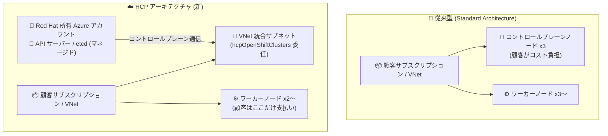

# Azure Red Hat OpenShift: Hosted Control Planes (Public Preview)

**リリース日**: 2026-09-16

**サービス**: Azure Red Hat OpenShift

**機能**: Hosted Control Planes (HCP)

**ステータス**: In preview

[このアップデートのインフォグラフィックを見る](https://takech9203.github.io/azure-news-summary/20260916-aro-hosted-control-planes.html)

## 概要

Azure Red Hat OpenShift (ARO) の新しいデプロイオプション「hosted control planes (HCP)」がパブリックプレビューになりました。HCP は、OpenShift のコントロールプレーン (API サーバー、etcd データベースなど) を、顧客のアプリケーションが稼働するワーカーノードから分離し、フルマネージドサービスとして実行するアーキテクチャです。コントロールプレーンは Red Hat が所有する Azure アカウント内でホストされ、Microsoft と Red Hat の SRE によって運用されます。

顧客のサブスクリプションにデプロイするのはワーカーノードのみとなり、クラスターのプロビジョニングは約 15〜20 分で完了します (従来型は約 45 分)。コントロールプレーンとノードプールのライフサイクルが分離されるため、それぞれを個別にアップグレードでき、マルチクラスター環境の運用が簡素化されます。マネージド ID と Workload Identity による短命・自動ローテーションのトークンを利用し、etcd の既定暗号化やユーザー独自キー (BYOK) にも対応します。

従来型のスタンダードアーキテクチャも引き続き完全にサポートされ、開発が継続されます。

**アップデート前の課題**

- 従来型 (スタンダードアーキテクチャ) では、コントロールプレーンが顧客のサブスクリプション内の専用 VM (コントロールプレーンノード 3 台) 上で稼働し、そのコストを顧客が負担する必要があった
- クラスター作成に最低でもコントロールプレーンノード 3 台 + ワーカーノード 3 台が必要で、プロビジョニングに約 45 分かかっていた
- コントロールプレーンとワーカーノードのアップグレードが一体化されており、協調プロセスとして同時に実施する必要があった
- Ingress コントローラーやイメージレジストリなどのプラットフォームコンポーネント用に専用のインフラストラクチャノードが使用されていた

**アップデート後の改善**

- コントロールプレーンは Red Hat 所有の Azure アカウントでホストされ、顧客はワーカーノード (最低 2 台) の分のみを支払う
- クラスターのプロビジョニング時間が約 15〜20 分に短縮
- コントロールプレーンと各ノードプールを個別にアップグレード可能。コントロールプレーンの z-stream (パッチ) アップグレードは Red Hat SRE により自動的に管理される
- コントロールプレーンは自動的にリージョン内の 3 つの可用性ゾーンにまたがって配置される
- 専用インフラストラクチャノードが不要 (プラットフォームコンポーネントはワーカーノード上で稼働)

## アーキテクチャ図



従来型ではコントロールプレーンとワーカーノードの両方が顧客の VNet 内に配置されるのに対し、HCP ではコントロールプレーンが Red Hat 所有の Azure アカウントに分離され、`Microsoft.RedHatOpenShift/hcpOpenShiftClusters` に委任された専用の VNet 統合サブネット経由でワーカーノードと通信します。

## サービスアップデートの詳細

### 主要機能

1. **フルマネージドなコントロールプレーン**
   - API サーバーや etcd などのコントロールプレーンコンポーネントを Red Hat 所有の Azure アカウント内の分離環境でホストし、Microsoft と Red Hat の SRE が運用する
   - コントロールプレーンは自動的に 3 つの可用性ゾーンにまたがって配置される

2. **高速なクラスタープロビジョニング**
   - クラスター作成が約 15〜20 分で完了 (従来型は約 45 分)
   - 開発・テスト環境をアイドル時にスケールダウンし、必要時にスケールアップ可能。実験の高速化とインフラコストの最適化に寄与

3. **コントロールプレーンとノードプールのライフサイクル分離**
   - コントロールプレーンと各ノードプールを個別にアップグレード可能
   - コントロールプレーンの z-stream (パッチ) アップグレードは Red Hat SRE により自動実施

4. **セキュリティの強化**
   - マネージド ID / Workload Identity により、保存された資格情報の代わりに短命で自動ローテーションされるトークンを使用
   - 既定で etcd 暗号化 (プラットフォームマネージドキー) が有効。BYOK (Bring Your Own Key) にも対応し、データレジデンシー・ソブランティ・規制要件への準拠を支援
   - 既存の ID プロバイダーとの統合が可能

5. **ノードプールモデル**
   - 各ノードプールは単一の可用性ゾーンにデプロイされ、複数のノードプールを異なるゾーンに配置することで高可用性を実現
   - 最小構成はワーカーノード 2 台

## 技術仕様

| 項目 | 従来型 (Standard) | Hosted Control Planes (HCP) |
|------|------------------|------------------------------|
| コントロールプレーンのホスト先 | 顧客サブスクリプション内の専用 VM | Red Hat 所有の Azure アカウント |
| 仮想ネットワーク | コントロールプレーン + ワーカーノードを顧客 VNet に配置 | ワーカーノードのみ顧客 VNet に配置。コントロールプレーンとは委任された VNet 統合サブネット経由で通信 |
| 可用性ゾーン | 単一またはマルチゾーンを選択 | コントロールプレーンは自動で 3 ゾーン構成 |
| ノードプール | マシンセットで定義。単一/複数ゾーンに配置可 | 各ノードプールは単一ゾーン。ゾーンごとに別プールを配置して HA を実現 |
| インフラストラクチャノード | 専用インフラノードを使用 | 不要 (プラットフォームコンポーネントはワーカーノードで稼働) |
| クラスターアップグレード | コントロールプレーンとワーカーを一体で実施 | 個別にアップグレード可。CP のパッチは Red Hat SRE が自動管理 |
| 最小構成 | コントロールプレーン 3 台 + ワーカー 3 台 | ワーカー 2 台のみ |
| プロビジョニング時間 | 約 45 分 | 約 15〜20 分 |
| 課金対象 | 全ノード (CP 3 台 + ワーカー) + ライセンス | ワーカーノードのみ (最低 2 台) |
| ネットワークプラグイン (既定) | - | OVN-Kubernetes |
| リソースタイプ | `Microsoft.RedHatOpenShift/openShiftClusters` | `Microsoft.RedHatOpenShift/hcpOpenShiftClusters` |

## 設定方法

### 前提条件

1. Azure CLI バージョン 2.67.0 以上と、ARO HCP CLI 拡張 (wheel ファイルを https://aka.ms/aro-hcp-cli からダウンロードして `az extension add --source <path>` でインストール)
2. クラスターの作成・実行に最低 20 コアのリソースクォータ
3. リソースグループまたはサブスクリプションに対する Contributor + User Access Administrator 権限、または Owner 権限
4. リソースプロバイダーの登録: `Microsoft.RedHatOpenShift`、`Microsoft.Compute`、`Microsoft.Storage`、`Microsoft.Authorization`
5. ネットワーク: ワーカーサブネットに加え、`Microsoft.RedHatOpenShift/hcpOpenShiftClusters` に委任した VNet 統合サブネットが必要
6. コントロールプレーン/データプレーンオペレーター用のユーザー割り当てマネージド ID と、所定のロール割り当て

### Azure CLI

```bash
# リソースプロバイダーの登録
az provider register --namespace Microsoft.RedHatOpenShift --wait

# VNet 統合サブネットの作成 (委任が必須)
az network vnet subnet create \
  --name "${CUSTOMER_VNET_INTEGRATION_SUBNET_NAME}" \
  --vnet-name "${CUSTOMER_VNET_NAME}" \
  --resource-group "${CUSTOMER_RG_NAME}" \
  --address-prefixes 10.0.1.0/24 \
  --network-security-group "${CUSTOMER_NSG}" \
  --delegations Microsoft.RedHatOpenShift/hcpOpenShiftClusters

# HCP クラスターの作成 (マネージド ID・ロール割り当ての作成後)
az aro hcp cluster create \
  --name "${CLUSTER_NAME}" \
  --resource-group "${CUSTOMER_RG_NAME}" \
  --location "${LOCATION}" \
  --version "${CLUSTER_VERSION}" \
  --channel-group stable \
  --subnet-id "${SUBNET_ID}" \
  --vnet-integration-subnet-id "${VNET_INTEGRATION_SUBNET_ID}" \
  --nsg "${NSG_ID}" \
  --managed-resource-group-name "${MANAGED_RESOURCE_GROUP}" \
  --user-assigned-identities "..." \
  --operators-authentication "..."

# ノードプールの作成 (最低 2 レプリカ)
az aro hcp cluster nodepool create \
  --cluster-name "${CLUSTER_NAME}" \
  --name "${NP_NAME}" \
  --resource-group "${CUSTOMER_RG_NAME}" \
  --replicas 2 \
  --vm-size Standard_D8s_v3 \
  --version "${NP_VERSION}" \
  --channel-group stable
```

クラスターの作成方法は Azure CLI、REST API、Bicep に対応しています。Bicep テンプレートの完全な例は Microsoft Learn のクイックスタートを参照してください。既定のデプロイでは API サーバー / Ingress ともに Public、ネットワークは OVN-Kubernetes、etcd 暗号化はプラットフォームマネージドキー、ワーカーノードは `Standard_D8s_v3` x 2 (64 GiB StandardSSD_LRS OS ディスク) となります。

## メリット

### ビジネス面

- コントロールプレーンノード (3 台) と専用インフラノードのコストが不要になり、ワーカーノード (最低 2 台) のみの支払いでクラスターを運用できる
- プロビジョニングが約 15〜20 分に短縮され、実験の加速・テストサイクルの短縮・本番投入の迅速化につながる
- 開発・テスト環境をアイドル時にスケールダウンしてインフラ支出を最適化できる
- VM・コンテナ・クラウドネイティブアプリケーションを単一の AI-ready プラットフォームで実行でき、自社のペースでモダナイゼーションを進められる

### 技術面

- コントロールプレーンの運用 (パッチ適用を含む) を Microsoft / Red Hat の SRE に委任でき、チームはアプリケーション開発に集中できる
- コントロールプレーンとノードプールのライフサイクル分離により、アップグレードの柔軟性が向上し、マルチクラスター環境の運用が簡素化される
- コントロールプレーンが自動的に 3 つの可用性ゾーンにまたがる構成となる
- マネージド ID / Workload Identity による短命トークン、既定の etcd 暗号化、BYOK 対応でセキュリティ・コンプライアンスが強化される

## デメリット・制約事項

- パブリックプレビュー段階であり、本番環境での利用は想定されていない (プレビューは非本番・テスト用)
- プレビューの提供リージョンは 8 リージョンに限定される (下記参照)
- 各ノードプールは単一の可用性ゾーンにのみデプロイされるため、ワーカーの高可用性には複数ノードプールをゾーンごとに配置する設計が必要
- コントロールプレーンノードが顧客サブスクリプション内に存在しないため、従来型のようにコントロールプレーン VM を直接参照・操作することはできない
- クラスター作成には多数のユーザー割り当てマネージド ID (コントロールプレーン用 8 個、データプレーン用 3 個、サービス用 1 個) と所定のロール割り当ての事前準備が必要
- ARO HCP CLI 拡張は wheel ファイルからの手動インストールが必要 (プレビュー時点)
- 最低 20 コアのクォータが必要で、新規サブスクリプションの既定クォータでは不足する

## ユースケース

### ユースケース 1: 開発・テスト環境のコスト最適化

**シナリオ**: OpenShift 上でアプリケーションを開発しているチームが、営業時間外はほぼ使われない開発・テスト用クラスターのコストを削減したい。

**実装例**:

```bash
# アイドル時: ノードプールをスケールダウン (コントロールプレーンはマネージドのため課金対象外)
az aro hcp cluster nodepool update \
  --cluster-name dev-cluster \
  --name np1 \
  --resource-group dev-rg \
  --replicas 2

# 繁忙時: ノードプールをスケールアップ
az aro hcp cluster nodepool update \
  --cluster-name dev-cluster \
  --name np1 \
  --resource-group dev-rg \
  --replicas 6
```

**効果**: 支払い対象がワーカーノードのみのため、アイドル期間のスケールダウンがそのままコスト削減に直結する。約 15〜20 分でクラスターを新規作成できるため、必要なときに環境を作って破棄する運用も現実的になる。

### ユースケース 2: マルチクラスター環境の運用簡素化

**シナリオ**: 複数リージョン・複数環境 (開発/ステージング/本番) で多数の OpenShift クラスターを運用しており、アップグレード作業の負荷が大きい。

**効果**: コントロールプレーンのパッチアップグレードは Red Hat SRE が自動管理し、ノードプールはアプリケーションの都合に合わせて個別にアップグレードできる。ネットワークのカスタマイズと運用の一貫性を維持しながら、リージョン・環境をまたいだスケールが可能になる。

## 料金

HCP ではワーカーノード (最低 2 台) 分のみを支払い、コントロールプレーンノードや専用インフラノードのコストは発生しません。具体的な料金は公式料金ページを参照してください。

- [Azure Red Hat OpenShift 料金ページ](https://azure.microsoft.com/pricing/details/openshift/)

## 利用可能リージョン

パブリックプレビューは以下の 8 リージョンで利用可能です。

- UK South
- Canada Central
- Australia East
- Switzerland North
- Brazil South
- Central India
- East US 2
- West Europe

## 関連サービス・機能

- **Azure Red Hat OpenShift (Standard Architecture)**: 従来型のデプロイオプション。コントロールプレーンを顧客サブスクリプション内で稼働させる。引き続き完全サポート・開発継続
- **Azure Kubernetes Service (AKS)**: Azure のマネージド Kubernetes サービス。OpenShift プラットフォームの機能 (開発者ツール、オペレーター等) が不要な場合の選択肢
- **Microsoft Entra ID / マネージド ID / Workload Identity**: HCP のオペレーター認証はユーザー割り当てマネージド ID とフェデレーション資格情報 (短命トークン) で構成される
- **Azure Virtual Network**: ワーカーノードは顧客 VNet に配置され、コントロールプレーンとは委任された VNet 統合サブネット経由で通信する

## 参考リンク

- [インフォグラフィック](https://takech9203.github.io/azure-news-summary/20260916-aro-hosted-control-planes.html)
- [公式アップデート情報](https://azure.microsoft.com/updates?id=571621)
- [Azure Blog (Tech Community)](https://techcommunity.microsoft.com/blog/appsonazureblog/azure-red-hat-openshift-with-hosted-control-planes-now-available-in-public-previ/4555997)
- [Microsoft Learn: Standard と Hosted Control Planes のアーキテクチャ比較](https://learn.microsoft.com/azure/openshift/concepts-classic-hosted-control-planes-comparison)
- [Microsoft Learn: HCP クラスター作成クイックスタート](https://learn.microsoft.com/azure/openshift/quickstart-create-default-hosted-cluster)
- [料金ページ](https://azure.microsoft.com/pricing/details/openshift/)

## まとめ

Azure Red Hat OpenShift の hosted control planes は、コントロールプレーンを Red Hat 所有アカウントのフルマネージドサービスとして分離することで、コスト (ワーカーノードのみの課金・最低 2 台)、スピード (プロビジョニング約 15〜20 分)、運用性 (ライフサイクル分離・自動パッチ) を大きく改善する新しいデプロイオプションです。OpenShift をマルチクラスターで運用している組織や、開発・テスト環境のコスト最適化を検討している Solutions Architect は、プレビュー対象リージョンでの検証を推奨します。本番ワークロードは引き続きスタンダードアーキテクチャを利用しつつ、GA に向けて HCP の評価を進めるとよいでしょう。

---

**タグ**: Azure Red Hat OpenShift, Containers, OpenShift, Hosted Control Planes, Kubernetes, Public Preview
