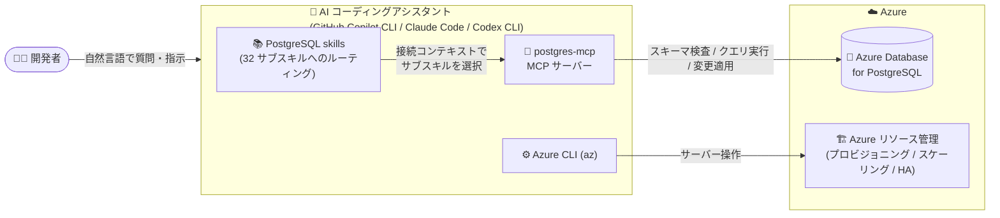

# Azure Database for PostgreSQL: PostgreSQL skills と MCP プラグイン (Public Preview)

**リリース日**: 2026-09-16

**サービス**: Azure Database for PostgreSQL

**機能**: PostgreSQL skills and MCP plugin

**ステータス**: In preview

[このアップデートのインフォグラフィックを見る](https://takech9203.github.io/azure-news-summary/20260916-postgresql-skills-mcp-plugin.html)

## 概要

Azure Database for PostgreSQL 向けの「PostgreSQL skills and MCP plugin」が Public Preview として発表されました。このプラグインは、対応する AI コーディングアシスタント (GitHub Copilot CLI、Claude Code、Codex CLI) を、コンテキストを認識した PostgreSQL エキスパートに変えるものです。ガイダンスの提供だけでなく、接続されたデータベースに対して実際に操作を実行できます。

プラグインは、PostgreSQL および Azure Database for PostgreSQL に関する専門家がキュレーションしたスキル群 (合計 32 のサブスキル) と、ライブなデータベースコンテキストの検査・クエリ実行・変更適用・データベース運用を支援する MCP サーバー (`@microsoft/postgres-mcp`) をバンドルしています。ユーザーのスキーマ、PostgreSQL バージョン、拡張機能、Azure 環境を利用して、一般的な推奨事項ではなく環境に即したガイダンスを提供します。質問内容と接続コンテキストに基づいて、汎用 PostgreSQL ガイダンスと Azure 固有ガイダンスの間を自動的にルーティングします。

カバーするシナリオは、クエリ・インデックスチューニング、ベクトル検索と RAG (Retrieval-Augmented Generation)、JSONB、パーティショニング、セキュリティ、Azure のプロビジョニングとスケーリング、高可用性とフェイルオーバー、ポイントインタイムリストア、AI 関数、Apache AGE によるナレッジグラフなど多岐にわたります。プラグイン自体は GitHub リポジトリ [microsoft/postgres-skills](https://github.com/microsoft/postgres-skills) で MIT ライセンスのオープンソースとして公開されています。

**アップデート前の課題**

- 既定の AI アシスタントは接続先データベースのコンテキストを持たず、実際の環境に適合するとは限らない汎用的な SQL やスニペットを提案していた
- マネージドデータベースでは動作しない (壊れる可能性のある) コマンドを自信を持って推奨してしまうことがあった
- セルフホストの PostgreSQL と Azure のマネージドサービスを区別できず、「何ができるか」を説明するだけで実行はできなかった

**アップデート後の改善**

- ライブなスキーマ、サービスレベル、設定を先に読み取ったうえで、環境に合わせた回答を提示するようになった
- マネージドサービス向けのガードレールと正しい Azure ワークフローを適用し、破壊的な操作の前には明示的な確認を求めるようになった
- クエリ実行、インデックス作成、プロビジョニング、リストアなどを、確認を経て AI アシスタントが実際に実行できるようになった
- 接続を検出してセルフホスト / Azure を判別し、適切なガイダンス (汎用・Azure 固有・グラフ) に自動ルーティングするようになった

## アーキテクチャ図



開発者の質問を受けた AI アシスタントは、skills が接続コンテキストに応じて適切なサブスキルを選択し、postgres-mcp がデータベース内の操作を、Azure CLI がマネージドサービスのリソース操作を担当します。

## サービスアップデートの詳細

### 主要機能

1. **専門家がキュレーションした 32 のサブスキル**
   - PostgreSQL 汎用 (11 サブスキル): ベクトル検索 (pgvector/HNSW)、RAG パイプライン、拡張機能管理、高度なインデックス、JSONB パターン、テーブルパーティショニング、行レベルセキュリティ、全文検索、接続管理、レプリケーション、クエリパフォーマンス
   - Azure Database for PostgreSQL (11 サブスキル): DiskANN ベクトル検索、azure_ai 拡張による生成 AI パターン、インテリジェントチューニング (Query Store)、Entra ID 認証、組み込み PgBouncer、HA・災害復旧、ネットワーク・SSL、プロビジョニング、拡張機能ライフサイクル、メジャーバージョンアップグレード
   - グラフ (pg-graph、10 サブスキル): Apache AGE によるオントロジー導出、グラフ構築、openCypher クエリ、自然言語からの Cypher 生成、グラフ拡張 RAG、説明可能性

2. **postgres-mcp MCP サーバー**
   - `npx` 経由でローカルに起動し、ライブなデータベースに対してクエリ実行、変更適用、スキーマ検査、グラフの構築・走査を実行
   - 接続先が Azure かどうかを検出し、ガイダンスのルーティングに利用

3. **Azure CLI 統合**
   - プロビジョニング、スケーリング、サーバーパラメーター、HA とフェイルオーバー、レプリカ、ポイントインタイムリストア、ネットワーク、アップグレードなどのマネージドサービス操作を実行

4. **自動ルーティングと Azure HorizonDB (Preview) 対応**
   - 質問と接続コンテキストに基づき、汎用 PostgreSQL / Azure 固有 / グラフのガイダンスを自動選択
   - 接続先が HorizonDB クラスター (`*.horizondb.azure.com`) の場合は、Flexible Server の手順ではなく HorizonDB 固有のガイダンス (クラスター、`az horizondb`、パラメーターグループ) にルーティングし、HorizonDB で未提供の機能をフラグする

5. **セキュリティガードレール**
   - データベース書き込み、CSV インポート、グラフ書き込み、Azure リソース変更の前に明示的な確認を要求
   - データベースコンテンツを信頼できないデータとして扱い、タスクに必要な範囲に取得を最小化
   - バンドルされた MCP 構成では postgres-mcp のテレメトリが無効化され、データベースコンテンツはプラグインのテレメトリとして Microsoft に送信されない

## 技術仕様

| 項目 | 詳細 |
|------|------|
| 対応 AI コーディングアシスタント | GitHub Copilot CLI、Claude Code、Codex CLI |
| サブスキル数 | 32 (PostgreSQL 汎用 11 + Azure 11 + グラフ pg-graph 10) |
| MCP サーバー | [`@microsoft/postgres-mcp`](https://github.com/microsoft/postgres-mcp) (npx でローカル起動) |
| 対応 PostgreSQL 環境 | ローカル、セルフホスト、他クラウド、Azure Database for PostgreSQL、Azure HorizonDB (Preview) |
| 前提ソフトウェア | Node.js LTS (npx を含む)、対応 AI エージェントのアカウント |
| Azure 操作 | Azure CLI (`az`) 経由 (認証後) |
| データベース権限 | 接続に使用する PostgreSQL ロールの権限に従う (最小権限・読み取り専用プロファイルを推奨) |
| ライセンス | MIT (オープンソース、GitHub: microsoft/postgres-skills) |

## 設定方法

### 前提条件

1. Node.js LTS がインストールされていること (`node --version` / `npx --version` で確認)
2. 対応 AI エージェント (Claude Code、GitHub Copilot CLI、Codex CLI のいずれか) がインストール・サインイン済みであること
3. Azure リソース操作を行う場合は Azure CLI で認証できること

### インストール (CLI)

```bash
# Claude Code の場合
claude plugin marketplace add microsoft/postgres-skills
claude plugin install postgres-skills@postgres-skills

# GitHub Copilot CLI の場合
copilot plugin marketplace add microsoft/postgres-skills
copilot plugin install postgres-skills@postgres-skills

# Codex CLI の場合
codex plugin marketplace add microsoft/postgres-skills
codex plugin install postgres-skills@postgres-skills
```

インストール後、エージェントを起動して以下のように依頼すると、読み取り専用プロファイルでの安全な接続をガイドしてくれます。

```text
Help me connect postgres-skills to my PostgreSQL database using a read-only profile.
```

パスワードはチャットには入力せず、非表示のパスワードプロンプトでのみ入力します。詳細はリポジトリの setup and security guide (plugin/SETUP.md) を参照してください。

## メリット

### ビジネス面

- PostgreSQL / Azure Database for PostgreSQL の専門知識がないメンバーでも、専門家がキュレーションしたベストプラクティスに沿った運用・開発が可能になる
- チューニングやトラブルシューティングにかかる調査時間を短縮し、開発生産性を向上できる
- プラグイン自体はオープンソース (MIT) であり、追加のライセンス費用なしに導入を試せる

### 技術面

- 汎用的な回答ではなく、実際のスキーマ・バージョン・拡張機能・Azure 環境に基づいたガイダンスが得られる
- ガイダンスにとどまらず、確認を経てクエリ実行・インデックス作成・プロビジョニング・リストアまで実行できる
- ベクトル検索、RAG、Apache AGE によるナレッジグラフなど、AI アプリケーション開発のシナリオを PostgreSQL 内で完結して支援する
- マネージドサービス固有の制約 (例: PITR は新サーバーを作成する、ストレージは縮小不可、メジャーバージョンアップグレードは一方向) を考慮した安全なワークフローを適用する

## デメリット・制約事項

- Public Preview であり、本番環境以外での評価・テスト用途が想定される
- MCP サーバーは接続したデータベースに対して、その PostgreSQL ロールの権限で操作できるため、専用の最小権限ロールと読み取り専用の接続プロファイルの使用が推奨される
- クエリ結果や診断情報は AI アシスタントとの対話の一部となるため、機密データベースや本番データベースへの接続前にデータアクセスの開示事項 (plugin/SETUP.md) の確認が必要
- パッケージのインストールに npm レジストリへのアクセスが必要。Azure ワークフローは認証後に Azure CLI で Azure と通信する
- 対応 AI エージェントの有償アカウント等が別途必要 (例: Claude Code は Pro/Max/Team/Enterprise/Console アカウント、GitHub Copilot CLI は Copilot サブスクリプション)

## ユースケース

### ユースケース 1: クエリパフォーマンスの回帰調査

**シナリオ**: デプロイ後にクエリの応答時間が 200ms から 8 秒に悪化した。原因を特定して修正したい。

**実装例**:

```text
My query went from 200ms to 8 seconds after deployment
```

**効果**: ライブな実行プランとバッファ使用状況を分析して回帰の原因を特定し、適切なインデックスやチューニングを確認のうえ適用できる。

### ユースケース 2: ベクトル検索 / RAG の構築

**シナリオ**: 製品カタログに対するベクトル検索を Azure Database for PostgreSQL 上にセットアップし、100 万行のデータをデータベース内で埋め込み処理したい。

**実装例**:

```text
Set up vector search for my product catalog
Batch-embed 1 million rows without leaving the database
```

**効果**: 環境に適したベクトルインデックス (HNSW / DiskANN) を選択して拡張機能とインデックスを適用し、`azure_ai` 拡張でサービス制限を考慮しながらバッチ埋め込みを安全に処理できる。

### ユースケース 3: Apache AGE によるナレッジグラフ構築

**シナリオ**: 既存のドキュメントやテーブルからナレッジグラフを構築し、グラフ走査で質問に回答したい。

**実装例**:

```text
Turn my documents into a knowledge graph
Answer this by traversing my graph
```

**効果**: データからオントロジーを導出 (人間のレビューを挟む) して Apache AGE 上にグラフを構築し、検証済みの openCypher クエリで回答を得られる。すべて PostgreSQL 内で完結する。

## 料金

プラグイン自体は MIT ライセンスのオープンソースとして無料で提供されます。接続先の Azure Database for PostgreSQL や、`azure_ai` 拡張から利用する Azure AI サービスなどには、それぞれの通常料金が適用されます。

- [Azure Database for PostgreSQL の料金](https://azure.microsoft.com/pricing/details/postgresql/)

## 関連サービス・機能

- **Azure Database for PostgreSQL**: 本プラグインの主対象となるマネージド PostgreSQL サービス。プロビジョニング、スケーリング、HA、PITR などを Azure CLI 経由で操作
- **Azure HorizonDB (Preview)**: 各 Azure サブスキルが HorizonDB 固有セクションを持ち、クラスターやパラメーターグループなど HorizonDB 向けのガイダンスにルーティング
- **azure_ai 拡張**: データベース内での埋め込み生成や AI 関数の利用を支援するサブスキルが含まれる
- **Apache AGE**: PostgreSQL 上のグラフ拡張。pg-graph スキルがオントロジー導出からグラフ構築、openCypher クエリまでをカバー
- **Azure MCP Server**: Azure リソースを自然言語で管理する別の MCP サーバー。PostgreSQL 向けツール (サーバー/DB/テーブル一覧、クエリ実行、スキーマ取得、パラメーター設定) を提供しており、本プラグインと補完関係にある

## 参考リンク

- [インフォグラフィック](https://takech9203.github.io/azure-news-summary/20260916-postgresql-skills-mcp-plugin.html)
- [公式アップデート情報](https://azure.microsoft.com/updates?id=569664)
- [Tech Community Blog: Postgres Skills: Give Your AI Agent PostgreSQL Expertise](https://techcommunity.microsoft.com/blog/adforpostgresql/postgres-skills-give-your-ai-agent-postgresql-expertise/4556705)
- [GitHub: microsoft/postgres-skills](https://github.com/microsoft/postgres-skills)
- [GitHub: microsoft/postgres-mcp](https://github.com/microsoft/postgres-mcp)
- [Microsoft Learn: Azure MCP Server Tools for Azure Database for PostgreSQL](https://learn.microsoft.com/en-us/azure/developer/azure-mcp-server/tools/azure-database-postgresql)
- [料金ページ](https://azure.microsoft.com/pricing/details/postgresql/)

## まとめ

PostgreSQL skills and MCP plugin は、AI コーディングアシスタントを「もっともらしい汎用アドバイスを返す存在」から「実際のデータベース環境を理解し、確認を経て操作まで実行できる PostgreSQL エキスパート」へと変える Public Preview のプラグインです。32 の専門サブスキルと postgres-mcp、Azure CLI の組み合わせにより、クエリチューニングからベクトル検索・RAG、Apache AGE によるナレッジグラフまで幅広いシナリオをカバーします。GitHub Copilot CLI、Claude Code、Codex CLI を利用している PostgreSQL 開発チームは、まず読み取り専用の接続プロファイルと最小権限ロールを用意し、非本番環境で評価を開始することを推奨します。

---

**タグ**: Azure Database for PostgreSQL, MCP, AI コーディングアシスタント, PostgreSQL, ベクトル検索, RAG, Apache AGE, Public Preview, Databases, Hybrid + multicloud
