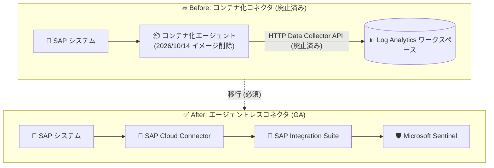

# Microsoft Sentinel: SAP コンテナイメージの削除 (2026 年 10 月 14 日)

**リリース日**: 2026-09-16

**サービス**: Microsoft Sentinel (SAP アプリケーション向けソリューション)

**機能**: コンテナ化 SAP データコネクタのコンテナイメージ削除 (Retirement Update)

**ステータス**: Retirement (廃止アナウンス)

[このアップデートのインフォグラフィックを見る](https://takech9203.github.io/azure-news-summary/20260916-sentinel-sap-container-images-retirement.html)

## 概要

Microsoft Sentinel の SAP アプリケーション向けソリューションで使用されてきた「コンテナ化 SAP データコネクタ (containerized SAP data connector agent)」は、2026 年 9 月 14 日に廃止 (retire) され、現在はサポートおよびメンテナンスの対象外となっている。今回のアップデートでは、その後続措置として **2026 年 10 月 14 日にコンテナイメージ自体が削除される** ことが発表された。

イメージ削除後は、新規のイメージ取得 (pull)、インストール、再デプロイ、スケーリング、エージェントの置き換え、ディザスタリカバリーがすべて不可能になる。現時点では、TLS 要件を満たす既存エージェントは廃止済みの HTTP Data Collector API 経由でログ送信を継続できるが、これは無サポート状態での暫定的な動作にすぎない。Microsoft は、サポートされている後継の **SAP エージェントレスデータコネクタ (agentless data connector)** への移行を必須としている。

エージェントレスコネクタは SAP Cloud Connector と SAP Integration Suite を利用して SAP システムからログを取得する方式で、既に GA (一般提供) されている。新規のコンテナ化エージェントの作成は既に無効化されている。

**アップデート前の課題**

- コンテナ化エージェントは Docker コンテナのホスト VM の運用、コンテナ管理、SAP SDK の更新など、継続的なメンテナンス負荷が発生していた
- 廃止 (2026 年 9 月 14 日) 後もイメージが残っていたため、無サポートの構成が再デプロイ可能な状態にあった

**アップデート後の変化**

- 2026 年 10 月 14 日以降、コンテナイメージの新規 pull・インストール・再デプロイ・スケーリング・置き換え・ディザスタリカバリーが不可能になる
- サポートされる構成はエージェントレスデータコネクタのみとなり、SAP NetWeaver 側にフットプリントのないシンプルなアーキテクチャに一本化される

## アーキテクチャ図



コンテナ化エージェント経由のログ収集 (Before) は廃止され、SAP Cloud Connector と SAP Integration Suite を利用するエージェントレスコネクタ (After) がサポートされる唯一の構成となる。

## サービスアップデートの詳細

### 廃止スケジュール

1. **2026 年 9 月 14 日 (済)**: コンテナ化 SAP データコネクタが廃止。サポート・メンテナンス終了。エージェントは SAP ログの Microsoft Sentinel への配信を停止 (新規コンテナ化エージェントの作成は既に無効化済み)
2. **2026 年 10 月 14 日**: コンテナイメージを削除。新規 pull、インストール、再デプロイ、スケーリング、エージェント置き換え、ディザスタリカバリーが不可能になる

### 移行先: SAP エージェントレスデータコネクタ

Microsoft Learn の移行ガイドによると、エージェントレスコネクタには以下の利点がある。

1. **デプロイの簡素化**
   - SAP NetWeaver 側にフットプリントを持たないゼロフットプリント構成

2. **メンテナンス負荷の削減**
   - コンテナ管理や SAP 標準アップデート対応が不要

3. **将来性のあるアーキテクチャ**
   - SAP Integration Suite と SAP Cloud Connector をベースとし、既存の SAP 統合プロセスを再利用できる

4. **スケーラビリティの向上**

### 機能パリティ

- 既存の分析ルール、ワークブック、ハンティングクエリ、プレイブック、ウォッチリストはエージェントレスコネクタでも引き続き機能する
- KQL 関数は fuzzy union 演算子により、両方のデータソース (例: `ABAPAuditLog_CL` と `ABAPAuditLog`) を併用期間中も統合して扱える
- 収集対象にはセキュリティ監査ログ、変更ドキュメントログ、ユーザーマスタデータ (ロール・権限含む) などが含まれる
- 分析ルール名から "SAPCon" プレフィックスは削除された
- SAP HANA データベースや OS レベルの検出は別コネクタでカバーされるため対象外

## 移行手順 (推奨パス)

移行ガイドでは、コンテナ化エージェントとエージェントレスコネクタを並行稼働させてから切り替える方式が推奨されている。

1. **Assess (評価)**: 既存のコンテナ化エージェント構成を確認し、監視対象の SAP システム、収集ログ種別、カスタム構成を特定する
2. **Review (比較)**: コンテナ化エージェントとエージェントレスコネクタの構成オプション・機能を比較する
3. **Deploy (展開)**: コンテンツハブから SAP アプリケーション向けソリューションを展開し、エージェントレスコネクタをセットアップする
4. **Validate (検証)**: 必要な SAP テーブル・ログ種別が正しく収集されているか KQL で確認する

```kql
let startTime = ago(1h);
let endTime = now();
ABAPAuditLog
| where TimeGenerated between (startTime .. endTime)
| summarize Count = count() by SourceSystem, bin(TimeGenerated, 5m)
| order by TimeGenerated desc
```

5. **Monitor (並行監視)**: 一定期間、両コネクタを並行稼働させ、分析ルール・ワークブック・プレイブックが期待どおり動作することを確認する
6. **Decommission (廃止)**: 検証完了後、コンテナ化 SAP エージェントを廃止する (「Stop SAP data collection」の手順に従う)

## デメリット・制約事項

- **SAP 権限の見直しが必要**: エージェントレスコネクタはコンテナ化エージェントより少ないが異なる SAP 権限を必要とする。SAP システム上の Sentinel 用ユーザー・ロールの権限を見直すこと
- **課金上の識別方法の変更**: 廃止による価格・課金メーターの変更はないが、エージェントレスコネクタはコンテナ化コネクタと異なる識別方法を使用する。特定の SAP SID に課金除外を設定している場合は、移行前に確認しアカウント担当者に相談すること
- **クロスワークスペース展開オプションの UI からの削除**: SAP データと SOC データを別ワークスペースに分離する展開オプションは、Microsoft Defender ポータルの統合ワークスペースにより不要となり、ポータル UI から削除された (ARM API では引き続きサポート)
- **2026 年 9 月 14 日以降**: エージェントレスコネクタで必要なログが取り込まれていない場合、対象 SAP システムに関する分析ルールなどの依存コンテンツは結果を返さなくなる

## 対応 SAP システム

エージェントレスデータコネクタは SAP NetWeaver ベースのシステムに対応する。

| 対象 | 例 |
|------|-----|
| RISE with SAP | SAP S/4HANA Cloud, Private Edition |
| オンプレミス | SAP S/4HANA on-premises |
| 従来型 ERP | SAP ERP Central Component (ECC) |
| その他 | SAP Business Warehouse (BW) など |

## 関連サービス・機能

- **SAP Cloud Connector**: エージェントレスコネクタが SAP システムへの接続に利用する。既存の SAP 統合プロセスを再利用できる
- **SAP Integration Suite**: エージェントレスコネクタのログ取得基盤
- **Log Analytics ワークスペース**: SAP ログの格納先。テーブル名が変更される (例: `ABAPAuditLog_CL` → `ABAPAuditLog`)
- **Microsoft Defender ポータル**: 統合ワークスペースにより、従来のクロスワークスペース展開が不要に

## 参考リンク

- [インフォグラフィック](https://takech9203.github.io/azure-news-summary/20260916-sentinel-sap-container-images-retirement.html)
- [公式アップデート情報](https://azure.microsoft.com/updates?id=571342)
- [移行ガイド: Migrate to the Microsoft Sentinel agentless SAP data connector](https://learn.microsoft.com/azure/sentinel/sap/sap-agent-migrate)
- [Microsoft Learn: Deploy the Microsoft Sentinel solution for SAP applications](https://learn.microsoft.com/azure/sentinel/sap/deployment-overview)
- [SAP agentless connector GA 発表 (Tech Community)](https://techcommunity.microsoft.com/blog/microsoftsentinelblog/microsoft-sentinel-for-sap-agentless-connector-ga/4464490)

## まとめ

コンテナ化 SAP データコネクタは 2026 年 9 月 14 日に廃止済みで、2026 年 10 月 14 日にはコンテナイメージ自体が削除され、再デプロイやディザスタリカバリーを含む一切の新規展開が不可能になる。現在も TLS 準拠の既存エージェントは暫定的にログ送信を継続できるが、無サポート状態であり、障害時に復旧手段を失うリスクが高い。Microsoft Sentinel で SAP を監視しているすべての組織は、エージェントレスデータコネクタを並行展開してログ収集を検証し、10 月 14 日のイメージ削除前に移行を完了させることを強く推奨する。その際、SAP 権限の見直しと課金除外設定の確認を忘れずに行うこと。

---

**タグ**: Microsoft Sentinel, SAP, Retirement, データコネクタ, エージェントレス, セキュリティ, SIEM
