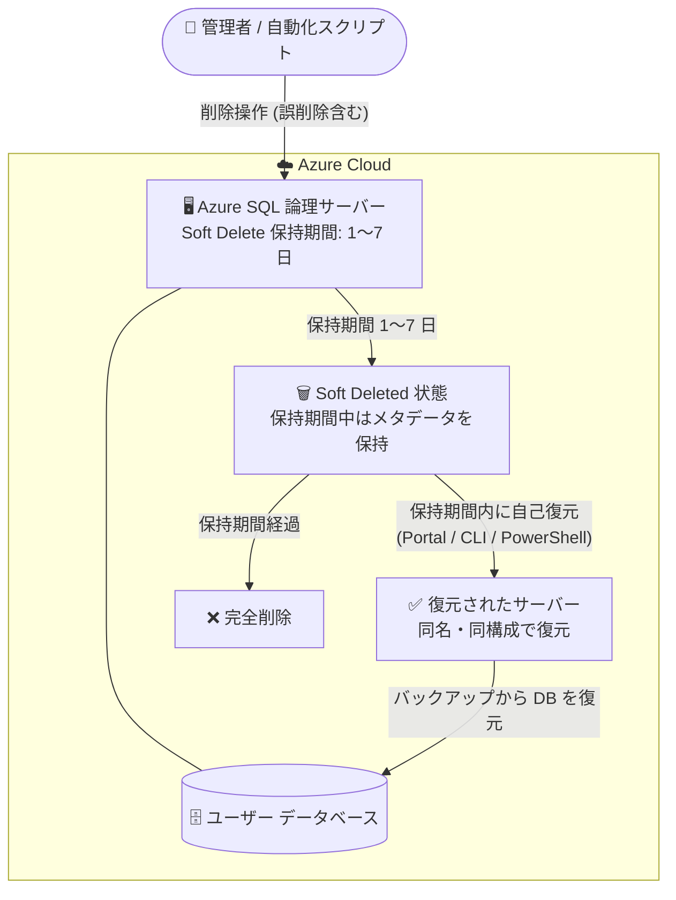

# Azure SQL Database: 2026 年 9 月中旬アップデート (論理サーバーの Soft Delete)

**リリース日**: 2026-09-16

**サービス**: Azure SQL Database

**機能**: 論理サーバーの Soft Delete (削除保護) 構成と自己復元

**ステータス**: In preview

[このアップデートのインフォグラフィックを見る](https://takech9203.github.io/azure-news-summary/20260916-sql-mid-september-updates.html)

## 概要

2026 年 9 月中旬の Azure SQL アップデートとして、以下の機能強化がパブリックプレビューで発表されました。

- **Azure SQL 論理サーバーの Soft Delete 構成**: 論理サーバーに Soft Delete (削除保護) の保持期間を構成できるようになりました。論理サーバーが削除されると、サーバーは「論理削除 (soft deleted)」状態に移行し、構成した保持期間内であればユーザー自身で復元できます。誤って論理サーバーを削除してしまった場合でも、Microsoft サポートに問い合わせることなく、保持期間内に予測可能かつ一貫した方法で自己復旧できます。

保持期間は論理サーバー単位で **0〜7 日** の範囲で設定します (0 は Soft Delete 無効)。なお、作成から 2 年を超える論理サーバーには自動的に 7 日間の保持期間が設定され、2 年未満のサーバーは既定で無効です。

**アップデート前の課題**

- Soft Delete 保持が構成されていない論理サーバーを削除すると即時に完全削除となり、保持・復旧のオプションがなかった
- 誤削除からの復旧をユーザー自身で予測可能・一貫した方法で行う手段がなく、Microsoft サポートへの問い合わせが必要だった
- 自動化スクリプトや一括クリーンアップ操作での誤削除が、取り返しのつかない損失につながるリスクがあった

**アップデート後の改善**

- 削除された論理サーバーが保持期間中は soft deleted 状態で保持され、Azure portal / PowerShell / Azure CLI からユーザー自身で一覧表示・復元が可能になった
- 誤削除をサポートに依頼せず、保持期間内に予測可能かつ一貫した方法で自己復旧できるようになった
- 復元されたサーバーは削除時と同じ名前・構成で元の状態に復元され、サーバー復元後は保持期間内のデータベースをバックアップから復元できる

## アーキテクチャ図



Soft Delete を有効化した論理サーバーは削除後も保持期間中は soft deleted 状態で保持され、ユーザー自身で復元できます。保持期間を過ぎると完全削除されます。

## サービスアップデートの詳細

### 主要機能

1. **Soft Delete 保持期間の構成**
   - 論理サーバー単位で保持期間を 0〜7 日で設定 (0 は無効化、削除すると復旧不可)
   - Azure portal (既存サーバーの「Delete protection (preview)」ペイン)、PowerShell (`-SoftDeleteRetentionDays`)、Azure CLI (`--soft-delete-retention-days`) で構成可能
   - PowerShell / CLI ではサーバー新規作成時にも設定可能 (Portal では既存サーバーのみ)

2. **Soft Deleted サーバーの一覧表示**
   - Azure portal の「Restore deleted server」ペイン、PowerShell の `Get-AzSqlDeletedServer`、CLI の `az sql server deleted-server list` でリージョン内の復元可能なサーバーを一覧表示

3. **削除されたサーバーの自己復元**
   - PowerShell の `Restore-AzSqlServer`、CLI の `az sql server restore`、または Portal から復元
   - 復元されたサーバーは削除時と同じ名前・構成で、削除時点の元の状態に復元される
   - サーバー復元後、保持期間内のデータベースは「Backups」ペインから手動で復元可能

## 技術仕様

| 項目 | 詳細 |
|------|------|
| 対象リソース | Azure SQL Database の論理サーバー |
| 保持期間の設定範囲 | 0〜7 日 (0 = Soft Delete 無効) |
| 既定値 | 作成から 2 年超のサーバー: 自動的に 7 日 / 2 年未満のサーバー: 無効 |
| 必要なロール | SQL Server Contributor |
| 必要なツールバージョン | Azure PowerShell Az モジュール 15.4.0 以降 / Azure CLI 2.84.0 以降 |
| 復元後のサーバー | 削除時と同じ名前・構成で元の状態に復元 |
| データベースの扱い | サーバー削除時にユーザー DB も削除。サーバー復元後、保持期間内であればバックアップから復元可能 |

## 設定方法

### 前提条件

1. Azure サブスクリプションと Azure SQL 論理サーバー
2. SQL Server Contributor ロールのメンバーであること
3. PowerShell / CLI を使用する場合: Az モジュール 15.4.0 以降、または Azure CLI 2.84.0 以降

### Azure CLI

```bash
# 新規サーバー作成時に Soft Delete 保持期間 7 日を設定
az sql server create \
  --name <server-name> \
  --resource-group <resource-group-name> \
  --location <azure-region> \
  --administrator-login <admin-username> \
  --administrator-login-password <admin-password> \
  --soft-delete-retention-days 7

# 既存サーバーの保持期間を 7 日に更新
az sql server update \
  --name <server-name> \
  --resource-group <resource-group-name> \
  --soft-delete-retention-days 7

# リージョン内の soft deleted サーバーを一覧表示
az sql server deleted-server list --location <azure-region>

# 削除されたサーバーを復元
az sql server restore \
  --name <server-name> \
  --resource-group <resource-group-name> \
  --location <azure-region>
```

### Azure Portal

**保持期間の構成 (既存サーバーのみ):**

1. Azure portal で対象の論理サーバーに移動
2. **Data Management** の **Delete protection (preview)** を選択
3. **Keep deleted servers (in days)** に 1〜7 の値を入力 (`Not enabled` または `0` は無効状態)
4. **Apply** を選択して保存

**削除されたサーバーの復元:**

1. Azure portal の **Azure SQL hub** に移動
2. **Azure SQL Database** の **SQL logical servers** ペインを開く
3. コマンドバーの **Restore** を選択し、サブスクリプション・場所・削除済みサーバーをドロップダウンから選択
4. **Restore** を選択して復元

## メリット

### ビジネス面

- 誤削除による論理サーバーの不可逆的な損失リスクを軽減し、ヒューマンエラーに対する復旧バッファを確保できる (ガバナンス・保護)
- Microsoft サポートへの問い合わせが不要になり、復旧までの手順が予測可能・一貫したものになる

### 技術面

- 自動化スクリプト、スクリプトによるクリーンアップ、一括操作時の運用上の安全性が向上する
- 開発・テスト環境でサーバーの削除と復元を安全に実施できる
- Portal / PowerShell / Azure CLI のいずれからも構成・一覧表示・復元が可能

## デメリット・制約事項

- プレビュー段階の機能である
- 保持期間の上限は 7 日で、それを超えると完全削除される
- Microsoft Entra 認証のみを強制する組み込み Azure Policy を使用している場合、削除されたサーバーを復元できない (復元するにはポリシーを削除してから復元する)
- 論理サーバーの削除時にマネージド ID も削除される
- 復元後、カスタマー マネージド キー (CMK) による暗号化は再構成が必要
- 以下のサーバーレベル構成は soft delete 時に破棄され、復元後に再構成が必要: フェールオーバー グループ、geo レプリケーション リンク、サーバー DNS エイリアス、プライベート エンドポイント接続、ファイアウォール規則、エラスティック ジョブ エージェント、Microsoft Entra ID のサーバー ID、CMK/TDE 暗号化キー、Data Sync グループ、Synapse ワークスペース リンク
- Azure portal では新規サーバー作成時に保持期間を設定できない (既存サーバーのみ)
- 保持期間満了前に完全削除したい場合は、いったん復元して保持期間を 0 に設定してから再削除する必要がある

## ユースケース

### ユースケース 1: 誤削除からの自己復旧

**シナリオ**: 運用チームが一括クリーンアップ スクリプトの実行中に、本番用の論理サーバーを誤って削除してしまった。Soft Delete 保持期間 (7 日) が構成されていたため、サポートに問い合わせることなく自己復旧する。

**実装例**:

```bash
# 削除されたサーバーを確認
az sql server deleted-server show \
  --name prod-sql-server \
  --location japaneast

# サーバーを復元
az sql server restore \
  --name prod-sql-server \
  --resource-group prod-rg \
  --location japaneast

# 復元後、Portal の「Backups」ペインから保持期間内のデータベースを復元し、
# ファイアウォール規則・プライベート エンドポイント・フェールオーバー グループ等を再構成
```

**効果**: 誤削除された論理サーバーを保持期間内にユーザー自身で復元でき、復旧時間と手順の不確実性を削減できる。

## 料金

このアップデートに関する個別の料金情報は公式ページでは確認できませんでした。詳細は以下の料金ページを参照してください。

- [Azure SQL Database の料金](https://azure.microsoft.com/pricing/details/azure-sql-database/)

## 関連サービス・機能

- **Azure SQL Database 自動バックアップ / ポイントインタイム リストア**: サーバー復元後、保持期間内のユーザー データベースはバックアップから復元する。Soft Delete はサーバー メタデータの保護、バックアップはデータベース データの保護を担う
- **Azure Policy (Microsoft Entra 認証のみの強制)**: このポリシーが適用されていると削除済みサーバーを復元できないため、併用時は注意が必要
- **Microsoft Entra ID / マネージド ID**: サーバー削除時にマネージド ID とサーバー ID が削除されるため、復元後に再構成が必要
- **カスタマー マネージド キー (CMK) / TDE**: 復元後に暗号化キーの再構成が必要

## 参考リンク

- [インフォグラフィック](https://takech9203.github.io/azure-news-summary/20260916-sql-mid-september-updates.html)
- [公式アップデート情報](https://azure.microsoft.com/updates?id=571056)
- [Microsoft Learn: 削除された論理サーバーの復元 (プレビュー)](https://learn.microsoft.com/azure/azure-sql/database/deleted-logical-server-restore)
- [料金ページ](https://azure.microsoft.com/pricing/details/azure-sql-database/)

## まとめ

Azure SQL 論理サーバーの Soft Delete がパブリックプレビューとなり、誤削除された論理サーバーを保持期間 (最大 7 日) 内にユーザー自身で復元できるようになりました。従来は Soft Delete 未構成のサーバーを削除すると即時完全削除で復旧オプションがなく、自己復旧の一貫した手段がありませんでしたが、今後はサポートへの問い合わせなしで予測可能に復旧できます。Solutions Architect としては、(1) 重要な論理サーバーへの保持期間設定 (2 年未満のサーバーは既定で無効な点に注意)、(2) 復元後に再構成が必要なサーバーレベル構成 (ファイアウォール規則、プライベート エンドポイント、フェールオーバー グループ、CMK など) の把握と復旧手順書への反映、(3) Entra 認証のみを強制する Azure Policy との非互換の確認を推奨します。

---

**タグ**: Azure SQL Database, Databases, Hybrid + multicloud, Soft Delete, 削除保護, バックアップ・復元, In preview
