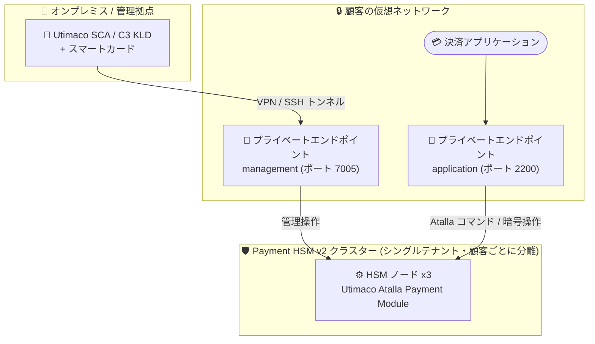

# Azure Payment HSM: Azure Payments HSM v2 (Public Preview)

**リリース日**: 2026-09-17

**サービス**: Azure Payment HSM

**機能**: Azure Payments HSM v2 パブリックプレビュー

**ステータス**: In preview

[このアップデートのインフォグラフィックを見る](https://takech9203.github.io/azure-news-summary/20260917-payments-hsm-v2.html)

## 概要

Azure Payments HSM v2 のパブリックプレビューが発表されました。Payments HSM v2 は、決済処理、クレデンシャル発行、PIN 処理、鍵管理、認証データ保護のための高可用性・シングルテナントの Payment HSM サービスです。顧客は分離されたシングルテナントの Payment HSM クラスターに対する排他的な管理コントロールを保持しつつ、基盤インフラストラクチャ、可用性、ライフサイクル運用は Microsoft が管理します。

Payment HSM v2 は PCI DSS および PCI 3DS 準拠の Azure データセンターで稼働し、FIPS 140-3 Level 3、PCI DSS、PCI 3DS、PCI PIN (PTS) 認定のセキュリティインフラストラクチャ上で提供されます。Payment HSM クラスターは顧客ごとに分離されているため、顧客自身の PCI ソリューション内の検証済みコンポーネントとしてデプロイでき、継続的な監査・コンプライアンス対応を簡素化できます。

v2 は Thales payShield 10K ハードウェアを使用する既存の Azure Payment HSM (v1) とは別の並行サービスであり、両サービスは共存します。v2 では Utimaco Atalla Payment Module (APM) のソフトウェアインターフェイスを通じて、PIN 処理、EMV トランザクションサポート、鍵管理などの決済特化コマンドセットを利用します。

**アップデート前の課題**

- 従来の Azure Payment HSM (v1) は Thales payShield 10K を使う "BareMetal" サービスで、HSM デバイスをペアでプロビジョニングし、高可用性構成は顧客側で構成・管理する必要があった
- 顧客はバックアップ・DR・回復性の要件を満たすため、HSM サブスクリプション (物理デバイス) の容量計画とライフサイクル管理を自ら担う必要があった
- 物理 HSM アプライアンスの調達・展開・スケーリングを伴う運用オーバーヘッドが、新しい決済サービスの提供スピードを低下させていた

**アップデート後の改善**

- Microsoft が基盤インフラ・可用性・ライフサイクル運用を管理する高可用性クラスターとして提供され、物理 HSM アプライアンスの展開・管理なしで決済暗号処理の容量をスケール可能に
- クラスターは Azure Private Link (プライベートエンドポイント) 経由で顧客の仮想ネットワークに直接統合され、トラフィックは Microsoft ネットワーク内に留まる
- FIPS 140-3 Level 3 認定インフラ (v1 の payShield 10K は FIPS 140-2 Level 3 / PCI HSM v3 認定) 上で稼働し、計画メンテナンスウィンドウなしで運用される

## アーキテクチャ図



顧客の仮想ネットワークから management (7005) と application (2200) の 2 つのプライベートエンドポイント経由で、シングルテナントの HSM クラスター (ノード 1〜3) に接続します。HSM の初期管理は Utimaco の SCA ユーティリティと C3 Key Loading Device (KLD)、スマートカードを使用し、VPN または SSH ポートフォワーディング経由で行います。

## サービスアップデートの詳細

### 主要機能

1. **シングルテナント・高可用性クラスター**
   - サブスクリプションごとに顧客の完全な管理下に置かれるシングルテナント HSM クラスターを提供。Microsoft は顧客データにアクセスできず、クラスター解放時にはデータがゼロ化・消去される
   - Microsoft が基盤インフラ・可用性・ライフサイクル運用を管理し、計画メンテナンスウィンドウは存在しない (必要なアップグレードや障害ハードウェア交換時は事前通知あり)

2. **Utimaco Atalla Payment Module (APM) インターフェイス**
   - PIN 処理、EMV トランザクションサポート、鍵管理など決済特化のコマンドセットを提供
   - HSM 管理には Utimaco Secure Configuration Assistant (SCA)、C3 Key Loading Device (KLD)、管理者/バックアップ用スマートカードを使用

3. **Azure Private Link によるネットワーク統合**
   - `management` (ポート 7005) と `application` (ポート 2200) の 2 つのプライベートリンクグループ ID を公開し、それぞれ個別のプライベートエンドポイントを作成
   - プライベート DNS ゾーン `privatelink.phsm.azure.net` で各ノードの FQDN (`mgmt<1-3>.` / `app<1-3>.<pool-name>-<unique-string>.privatelink.phsm.azure.net`) を解決

4. **PCI コンプライアンス対応**
   - PCI DSS / PCI 3DS 準拠の Azure データセンターで稼働し、FIPS 140-3 Level 3、PCI DSS、PCI 3DS、PCI PIN 認定のセキュリティインフラ上で提供
   - 顧客ごとに分離されたクラスターを自社の PCI ソリューションの検証済みコンポーネントとして組み込み可能

## 技術仕様

| 項目 | 詳細 |
|------|------|
| リソースタイプ | `Microsoft.HardwareSecurityModules/paymentHsmClusters` |
| SKU | Family: `B`、Name: `Payments_v2` |
| API バージョン | `2025-12-01-preview` |
| HSM インターフェイス | Utimaco Atalla Payment Module (APM) |
| クラスター構成 | HSM ノード x3 (`mgmt1-3` / `app1-3` の FQDN) |
| 管理ポート | 7005 (管理・運用操作、KLD からのアクセスにも使用) |
| アプリケーションポート | 2200 (Atalla コマンド・暗号操作のデータプレーン) |
| ネットワーク | プライベートエンドポイント必須 (`publicNetworkAccess: Disabled`)、プライベート DNS ゾーン `privatelink.phsm.azure.net` |
| クライアント認証証明書 | 自己署名ルート CA (NIST P-256 / prime256v1 の EC 公開鍵)。中間 CA や他のアルゴリズム・鍵タイプは非サポート |
| 認定・コンプライアンス | FIPS 140-3 Level 3、PCI DSS、PCI 3DS、PCI PIN |
| メンテナンス | 計画メンテナンスウィンドウなし (必要時は事前通知) |

## 設定方法

### 前提条件

1. アクティブな Azure アカウントとサブスクリプション。プレビュー期間中はゲート付きオンボーディングモデルのため、Microsoft アカウントマネージャーまたは Microsoft カスタマーサポート経由でサブスクリプションの登録・有効化が必要
2. Utimaco Support Portal のアカウントとエンタイトルメント。Microsoft の承認後、Utimaco Azure チームがオンボーディングを直接支援 (新規アカウントの処理・有効化には最大 48 時間)
3. Utimaco からのウェルカムパッケージ受領 (SCA アプリケーション、C3 KLD、スマートカード等) の確認
4. 管理/アプリケーション両インターフェイス用の信頼 CA 証明書 (NIST P-256 の EC 鍵による自己署名ルート CA) の作成
5. サブスクリプションごとに `Microsoft.Network` の `AllowPrivateEndpoints` 機能の登録 (未登録の場合、ネットワーク構成手順が失敗する)
6. リソースグループ、仮想ネットワーク、プライベートエンドポイント、プライベート DNS ゾーン、Payment HSM v2 リソースの作成権限とサブスクリプション機能の登録権限を持つ ID

### Azure CLI / PowerShell

```bash
# AllowPrivateEndpoints 機能の登録 (Azure CLI)
az account set --subscription "<subscription-id>"
az feature register --namespace Microsoft.Network --name AllowPrivateEndpoints
az feature show --namespace Microsoft.Network --name AllowPrivateEndpoints \
  --query properties.state --output tsv
```

```powershell
# Payment HSM v2 クラスターの作成 (Azure PowerShell)
$server = @{
    Location = "<region-name>"
    Sku = @{ Family = "B"; Name = "Payments_v2" }
    ResourceName = "<hsm-name>"
    ResourceType = "Microsoft.HardwareSecurityModules/paymentHsmClusters"
    ResourceGroupName = "<hsm-resource-group-name>"
    ApiVersion = "2025-12-01-preview"
    Properties = @{
        autoGeneratedDomainNameLabelScope = "TenantReuse"
        applicationTrustedIssuer          = $applicationTrustedIssuer
        managementTrustedIssuer           = $managementTrustedIssuer
        publicNetworkAccess               = "Disabled"
    }
    Force = $true
}
New-AzResourceGroup -Name $server.ResourceGroupName -Location $server.Location -Force
$hsm = New-AzResource @server -Verbose
```

作成後、management / application それぞれのプライベートエンドポイントを個別のサブネットに作成し、プライベート DNS ゾーングループに接続します。オンプレミスの管理端末 (KLD 含む) からはサイト間 VPN、ポイント対サイト VPN、または Azure VM (ジャンプボックス) 経由の SSH ポートフォワーディングで管理ポートに接続します。詳細な手順は [クイックスタート](https://learn.microsoft.com/azure/payment-hsm-v2/quickstart-powershell) を参照してください。

## メリット

### ビジネス面

- 物理 HSM ハードウェアの調達・展開・スケーリングが不要になり、決済インフラのモダナイゼーションと新しい決済サービスの提供を加速できる
- オンプレミス HSM 基盤の導入を回避し、Azure の従量利用モデルでシングルテナントの Payment HSM 容量を利用できる (初期投資の抑制)
- 顧客ごとに分離されたクラスターを自社の PCI ソリューションの検証済みコンポーネントとして展開でき、継続的な監査・コンプライアンス対応を簡素化できる

### 技術面

- Microsoft がインフラ・可用性・ライフサイクルを管理する高可用性クラスターにより、HSM の容量計画・ライフサイクル管理の運用負荷を削減
- プライベートエンドポイント経由で仮想ネットワークに直接統合され、トラフィックがパブリックインターネットに露出しない
- 鍵主権を維持: Microsoft は顧客データにアクセス不可、クラスター解放時はデータをゼロ化・消去
- 鍵管理、PIN 処理、EMV 操作、クレデンシャル発行など PCI 規制対象の機能を包括的にサポート

## デメリット・制約事項

- プレビュー期間中はゲート付きオンボーディングモデルであり、Microsoft アカウントマネージャーまたはカスタマーサポート経由での申請・承認が必要
- プレビュー期間中の利用可能リージョンは West US と West Europe の 2 リージョンのみ
- Utimaco アカウント・エンタイトルメントおよび物理的なウェルカムパッケージ (SCA、C3 KLD、スマートカード) の受領が前提となり、オンボーディングに時間を要する
- クライアント信頼証明書は NIST P-256 の EC 鍵による自己署名ルート CA のみサポート (中間 CA や他の鍵タイプは不可)
- プライベートエンドポイントが必須で、プレビュー中は `AllowPrivateEndpoints` 機能の手動登録が必要
- バックアップ・DR・回復性の目標を満たす十分な HSM 容量の維持は引き続き顧客の責任
- v1 (Thales payShield) とは HSM ベンダー・インターフェイスが異なる (v2 は Utimaco Atalla) ため、既存 payShield ベースのアプリケーションをそのまま移行できるかは個別に検証が必要

## ユースケース

### ユースケース 1: 決済処理・オーソリゼーション

**シナリオ**: カード・モバイル決済のオーソリゼーション、PIN / EMV クリプトグラム検証、3D セキュア認証を、物理 HSM を運用せずに Azure 上で実行する。

**効果**: 低レイテンシかつ高可用性の決済暗号処理を、需要に応じて容量追加しながら利用できる。

### ユースケース 2: 決済クレデンシャル発行

**シナリオ**: カード、モバイルセキュアエレメント、ウェアラブル、コネクテッドデバイス、HCE アプリケーション向けのクレデンシャル発行基盤を構築する。

**効果**: シングルテナントの HSM クラスター上で鍵主権を維持しながら発行業務をクラウド化できる。

### ユースケース 3: 鍵・機微データ保護

**シナリオ**: POS / mPOS / SPOC の鍵管理、ATM・POS 向けリモート鍵ローディング、PIN 生成・ルーティング、P2PE、PCI DSS 対応のセキュリティトークン化、EMV ペイメントトークン化を実施する。

**効果**: PCI 認定インフラ上で機微な決済資産を保護し、監査・コンプライアンス対応を簡素化できる。

## 料金

**パブリックプレビュー期間中は無料で利用できます** (Microsoft Learn ドキュメントに明記)。

v2 固有の GA 後の料金は現時点で公開されていません。参考として、既存の Azure Payment HSM (v1) は LMK 数 x パフォーマンスレベル (60 / 250 / 2500 CPS) の組み合わせによる時間単位の従量課金です。詳細は [Azure Payment HSM 料金ページ](https://azure.microsoft.com/pricing/details/payment-hsm/) を参照してください。

## 利用可能リージョン

プレビュー期間中は以下の 2 リージョンで利用可能:

- West US (米国西部)
- West Europe (西ヨーロッパ)

## 関連サービス・機能

- **Azure Payment HSM (v1)**: Thales payShield 10K ハードウェアを使用する既存の Payment HSM サービス。v2 とは別の並行サービスとして共存する
- **Azure Cloud HSM**: 決済特化ではなく汎用的な暗号鍵ストレージが必要な場合の選択肢
- **Azure Private Link / プライベートエンドポイント**: v2 クラスターへの接続に必須。management / application の 2 つのグループ ID に対しエンドポイントを作成する
- **Azure Private DNS**: `privatelink.phsm.azure.net` ゾーンで HSM ノードの FQDN を解決する
- **Azure VPN Gateway**: オンプレミスの管理端末 (KLD 等) から管理インターフェイスへ接続するためのサイト間 / ポイント対サイト VPN を提供する

## 参考リンク

- [インフォグラフィック](https://takech9203.github.io/azure-news-summary/20260917-payments-hsm-v2.html)
- [公式アップデート情報](https://azure.microsoft.com/updates?id=570509)
- [Microsoft Learn: What is Azure Payment HSM v2?](https://learn.microsoft.com/azure/payment-hsm-v2/overview)
- [Microsoft Learn: Quickstart - Create an Azure Payment HSM v2](https://learn.microsoft.com/azure/payment-hsm-v2/quickstart-powershell)
- [Microsoft Learn: What is Azure Payment HSM? (v1)](https://learn.microsoft.com/azure/payment-hsm/overview)
- [料金ページ](https://azure.microsoft.com/pricing/details/payment-hsm/)

## まとめ

Azure Payments HSM v2 は、Microsoft がインフラ・可用性・ライフサイクルを管理する高可用性・シングルテナントの Payment HSM クラスターを提供する新サービスのパブリックプレビューです。v1 (Thales payShield 10K の BareMetal 提供) と異なり、Utimaco Atalla Payment Module ベースのマネージドクラスターとして提供され、FIPS 140-3 Level 3 / PCI PIN 認定インフラと Private Link 統合により、決済暗号基盤のクラウド化における運用負荷とコンプライアンス対応を大きく軽減します。

決済処理・カード発行・PIN 処理を扱う金融機関や決済事業者の Solutions Architect は、プレビューが無料である今のうちに West US / West Europe での検証を検討する価値があります。ゲート付きオンボーディング (Microsoft への申請 + Utimaco アカウント・機材の手配) に時間がかかるため、早めにアカウントチームへ相談することを推奨します。

---

**タグ**: Azure Payment HSM, Payments HSM v2, Security, PCI DSS, PCI PIN, FIPS 140-3, HSM, Utimaco, Private Link, In preview
