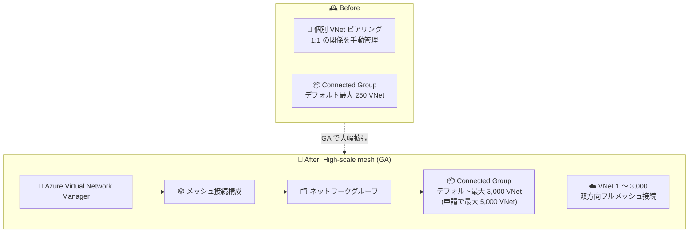

# Azure Virtual Network Manager: High-scale mesh (高スケールメッシュ) の一般提供開始

**リリース日**: 2026-09-17

**サービス**: Azure Virtual Network Manager

**機能**: High-scale mesh (Connected Group による高スケールメッシュ接続)

**ステータス**: Launched (GA)

[このアップデートのインフォグラフィックを見る](https://takech9203.github.io/azure-news-summary/20260917-vnet-manager-high-scale-mesh.html)

## 概要

Azure Virtual Network Manager (AVNM) の Connected Group を利用した High-scale mesh (高スケールメッシュ) が一般提供 (GA) となりました。提供対象リージョンでは、1 つのメッシュ接続構成 (mesh connectivity configuration) でデフォルトで最大 3,000 の仮想ネットワーク (VNet) を接続でき、さらに大規模な IP 接続についても申請ベースで利用可能です。

AVNM のメッシュトポロジは、個別の VNet ピアリングを作成・維持することなく、ネットワークグループに含まれるすべての VNet 間に双方向接続を確立します。この接続は VNet ピアリングではなく、AVNM 独自の Connected Group という接続構造で実現されており、有効ルート上では次ホップタイプ `ConnectedGroup` として表示されます。従来の Connected Group は 1 グループあたり最大 250 VNet がデフォルト上限でしたが、High-scale mesh により最大 3,000 VNet まで拡張されます。アプリケーションや事業部門ごとに VNet を分離したまま、慣れ親しんだネットワークグループと接続構成のモデルで、大規模環境の VNet 間直接接続をシンプルに管理できます。

**アップデート前の課題**

- 大量の VNet を相互接続するには、個別の VNet ピアリング (1:1 のマッピング) を作成・維持する必要があり、VNet 数の増加に伴い管理負荷が急増していた
- AVNM の Connected Group はデフォルトで 1 グループあたり最大 250 VNet までであり、それを超える大規模環境を単一メッシュで構成できなかった
- 3,000 VNet 規模の接続はプレビュー機能 (`AllowHighScaleConnectedGroup`) の登録と申請フォームによる承認が必要だった

**アップデート後の改善**

- 提供対象リージョンでは、単一のメッシュ接続構成でデフォルトで最大 3,000 VNet を接続可能になった (GA)
- さらに高いスケール (Connected Group あたり最大 5,000 VNet、または接続 VNet 群の合計プライベート IP アドレス空間 128,000 超) も申請フォームによるリクエストで対応可能
- 個別ピアリングの作成・維持が不要になり、ネットワークグループへの VNet 追加だけで接続が自動的に確立される

## アーキテクチャ図

従来は個別ピアリングや 250 VNet 上限の Connected Group で管理していた大規模環境を、GA した High-scale mesh では単一のメッシュ接続構成で最大 3,000 VNet (申請により 5,000 VNet) まで接続できます。

## サービスアップデートの詳細

### 主要機能

1. **単一メッシュで最大 3,000 VNet を接続**
   - 提供対象リージョンでは、1 つのメッシュ接続構成でデフォルトで最大 3,000 VNet を接続可能
   - 従来の Connected Group のデフォルト上限 (250 VNet) から大幅に拡張

2. **申請ベースのさらなるスケール拡張**
   - Connected Group あたり最大 5,000 VNet への拡張、または接続・ピアリングされた VNet 群のプライベート IP アドレス空間を 128,000 アドレス超にスケールする場合は、スケーリングリクエストフォームで申請可能

3. **Connected Group による接続 (ピアリング不要)**
   - VNet ピアリングの 1:1 マッピングを使わず、Connected Group 構造で VNet 群全体の双方向接続を確立
   - 有効ルートの次ホップタイプは `ConnectedGroup` と表示され、VNet の「ピアリング」ブレードには表示されない
   - メッシュ内の VNet の IP プレフィックス変更は自動的に同期される

4. **既存の管理モデルをそのまま利用**
   - ネットワークグループ (静的メンバーシップ / Azure Policy ベースの動的メンバーシップ) と接続構成という既存の AVNM モデルで管理
   - セキュリティ管理者ルール (security admin rules)、NSG、VNet フローログと組み合わせて直接接続のガバナンス・監視が可能

## 技術仕様

| 項目 | 詳細 |
|------|------|
| 接続方式 | Connected Group (VNet ピアリングではなく AVNM 独自の接続構造) |
| Connected Group あたりの VNet 数 (デフォルト) | 250 |
| High-scale mesh 有効時の VNet 数 | 最大 3,000 (提供対象リージョンでデフォルト利用可能。GA 発表時点) |
| 申請による拡張 | 最大 5,000 VNet / プライベート IP アドレス空間 128,000 アドレス超 (スケーリングリクエストフォームで申請) |
| Connected Group あたりのプライベートエンドポイント数 | デフォルト 2,000 (High-scale private endpoints 有効化で最大 20,000) |
| 1 VNet が所属できる Connected Group 数 | 最大 2 (ソフトリミット。申請フォームで調整可能) |
| メッシュの範囲 | デフォルトはリージョナルメッシュ。Global mesh を有効化するとリージョン間接続が可能 |
| 重複アドレス空間 | 同一 Connected Group 内で重複可能だが、重複 IP 宛の通信はドロップされる。`ConnectedGroupAddressOverlap` プロパティを `Disallowed` に設定して重複を禁止することも可能 |
| hub-and-spoke との関係 | hub-and-spoke 構成のスポークネットワークグループで direct connectivity を有効化した場合も Connected Group が作成される |

## 設定方法

### 前提条件

1. Azure Virtual Network Manager インスタンスを作成し、対象 VNet をスコープに含めること
2. 対象 VNet を含むネットワークグループ (静的または動的メンバーシップ) を作成すること
3. Connected Group がサポートされるリージョンであること (「利用可能リージョン」参照)
4. Microsoft Learn の制限事項ドキュメント (2026-09-16 更新時点) では、高スケール Connected Group の利用にはサブスクリプションでの `AllowHighScaleConnectedGroup` 機能フラグの登録 (表示名: Enable High Scale Connected Group) と有効化フォームの提出が案内されている。GA 発表では提供対象リージョンでデフォルトで最大 3,000 VNet を接続可能とされているため、最新の手順は公式ドキュメントを確認すること

### Azure Portal

1. AVNM の「構成 (Configurations)」ページで接続構成を作成し、トポロジとして「メッシュ」を選択する
2. 対象のネットワークグループをトポロジに追加し、必要に応じて Global mesh (リージョン間接続) を有効化する
3. 「View topology」タブで接続構成のトポロジを視覚的に確認する
4. 接続構成を対象リージョンにデプロイする (デプロイするまで構成は有効化されない)

## メリット

### ビジネス面

- 数千 VNet 規模の大企業・マルチチーム環境でも、個別ピアリングの作成・維持コストなしにネットワーク接続を一元管理できる
- アプリケーションや事業部門ごとに VNet を分離したガバナンスモデルを維持したまま、VNet 間の直接通信を実現できる
- ネットワークグループの動的メンバーシップにより、新規 VNet が自動的にメッシュへ参加するため、運用の俊敏性が向上する

### 技術面

- ハブを経由しない VNet 間直接通信により、ハブ経由ルーティングに起因するレイテンシを削減できる
- ピアリングの上限を超えるスケール (最大 3,000 VNet、申請により 5,000 VNet) の接続を単一構成で実現できる
- メッシュ内の IP プレフィックス変更が自動同期されるため、アドレス変更時の接続維持が容易
- セキュリティ管理者ルールや VNet フローログと組み合わせ、直接接続に対するセキュリティ制御・監視を維持できる

## デメリット・制約事項

- Connected Group は提供対象リージョンに限定される (下記「利用可能リージョン」参照)
- 同一 Connected Group 内で IP アドレス空間の重複は許容されるが、重複アドレス宛のトラフィックはルーティングが非決定的となるためドロップされる
- High-scale private endpoints を有効化したメッシュでは、VNet 間の IP アドレス重複はサポートされない
- 1 つの VNet が所属できる Connected Group は最大 2 (ソフトリミット)
- Azure VMware Solution、Nutanix Cloud Clusters on Azure、Oracle Database@Azure、Azure Payment HSM などの BareMetal インフラストラクチャは Connected Group でサポートされない
- 3,000 VNet を超えるスケールや 128,000 アドレス超のプライベート IP 空間は申請フォームによるリクエストが必要
- セキュリティ管理者ルールは、AVNM 管理下の VNet 内のプライベートエンドポイントには現時点で適用されない

## ユースケース

### ユースケース 1: 大規模エンタープライズでの VNet 間直接通信

**シナリオ**: 数百〜数千の VNet をチーム・アプリケーション単位で分離して運用している企業が、ハブを経由せずに VNet 間の低レイテンシな直接通信を実現したい。

**実装例**: Azure Policy ベースの動的ネットワークグループで対象 VNet (例: 特定タグ付き VNet) を自動収集し、メッシュ接続構成をデプロイする。新規 VNet はタグ付与だけで自動的にメッシュへ参加する。

**効果**: 個別ピアリングの作成・削除が不要になり、最大 3,000 VNet 規模でも接続管理を単一構成に集約できる。

### ユースケース 2: hub-and-spoke と組み合わせたハイブリッド構成

**シナリオ**: 共有サービス (ゲートウェイ、ファイアウォールなど) はハブに集約しつつ、信頼済みスポーク VNet 同士はハブを経由せず直接通信させたい。

**実装例**: hub-and-spoke 接続構成でスポークネットワークグループの direct connectivity を有効化する。スポーク間は Connected Group (次ホップタイプ `ConnectedGroup`)、ハブ-スポーク間はピアリングで接続される。

**効果**: ハブ経由の余分なホップを排除してパフォーマンスを改善しつつ、共有サービスへのアクセスは維持できる。

## 料金

Azure Virtual Network Manager の料金は、アクティブな AVNM 構成がデプロイされた VNet 数に基づいて課金されます (VNet ベース課金の導入前に作成されたインスタンスはサブスクリプションベース課金がデフォルトで、VNet ベース課金へのオプトインが可能)。同一 AVNM インスタンスから複数の構成が同じ VNet にデプロイされても、課金は VNet あたり 1 回分のみです。

| 項目 | 課金単位 |
|------|---------|
| Virtual Network Manager (VNet ベース) | 管理対象 VNet あたり / 時間 |
| Virtual Network Manager (サブスクリプションベース) | 管理対象サブスクリプションあたり / 時間 |
| VNet ピアリング料金 | AVNM が作成した接続を経由するトラフィック量に対して別途適用 |

具体的な単価はリージョン・通貨により異なるため、[Azure Virtual Network Manager 料金ページ](https://azure.microsoft.com/pricing/details/virtual-network-manager/) および [Azure 料金計算ツール](https://azure.microsoft.com/pricing/calculator/) で確認してください。

## 利用可能リージョン

Connected Group は以下のリージョンでサポートされています (Microsoft Learn 制限事項ドキュメント 2026-09-16 更新時点):

Asia East、Asia Southeast、Australia Central、Australia Central 2、Australia East、Australia Southeast、Brazil South、Canada Central、Canada East、North Europe、West Europe、France Central、Germany West Central、Central India、South India、West India、Japan East、Japan West、Korea Central、Korea South、Mexico Central、Norway East、Qatar Central、South Africa North、Sweden Central、Switzerland North、Switzerland West、UAE North、UK South、UK West、Central US、East US、East US 2、US North、US South、West US、West US 2、West US 3、West Central US、East US 2 EUAP、Central US EUAP

## 関連サービス・機能

- **Azure Virtual Network (VNet ピアリング)**: 従来の 1:1 接続手段。Connected Group はピアリング上限を超えるスケールで VNet 群を単一エンティティとして接続する代替手段
- **AVNM セキュリティ管理者ルール (Security Admin Rules)**: NSG より先に評価される組織全体のセキュリティルール。メッシュによる直接接続に対するガバナンスを提供
- **AVNM High-scale private endpoints**: Connected Group あたりのプライベートエンドポイント数を 2,000 から最大 20,000 に拡張する関連機能
- **Azure Virtual WAN**: メッシュ接続構成内のスポーク VNet を Virtual WAN ハブに接続することも可能 (hub-and-spoke 構成での Virtual WAN ハブ利用はプレビュー)
- **VNet フローログ / Network Watcher**: メッシュ内トラフィックの監視・記録に利用

## 参考リンク

- [インフォグラフィック](https://takech9203.github.io/azure-news-summary/20260917-vnet-manager-high-scale-mesh.html)
- [公式アップデート情報](https://azure.microsoft.com/updates?id=571572)
- [Connectivity configurations in Azure Virtual Network Manager (Microsoft Learn)](https://learn.microsoft.com/azure/virtual-network-manager/concept-connectivity-configuration)
- [Limitations with Azure Virtual Network Manager (Microsoft Learn)](https://learn.microsoft.com/azure/virtual-network-manager/concept-limitations)
- [Azure Virtual Network Manager FAQ (Microsoft Learn)](https://learn.microsoft.com/azure/virtual-network-manager/faq)
- [料金ページ](https://azure.microsoft.com/pricing/details/virtual-network-manager/)

## まとめ

Azure Virtual Network Manager の High-scale mesh が GA となり、単一のメッシュ接続構成でデフォルト最大 3,000 VNet (申請により最大 5,000 VNet) を接続できるようになりました。従来の Connected Group のデフォルト上限 250 VNet や個別ピアリング管理の限界を大きく超えるスケールを、既存のネットワークグループ + 接続構成モデルのまま本番利用できます。数百以上の VNet を運用する組織は、ピアリング運用からの移行候補として本機能を評価することを推奨します。導入時は Connected Group の対応リージョン、IP アドレス重複時の通信ドロップ、BareMetal 系サービスの非サポートなどの制約を事前に確認してください。

---

**タグ**: Networking, Azure Virtual Network Manager, Connected Group, Mesh, GA, Launched
