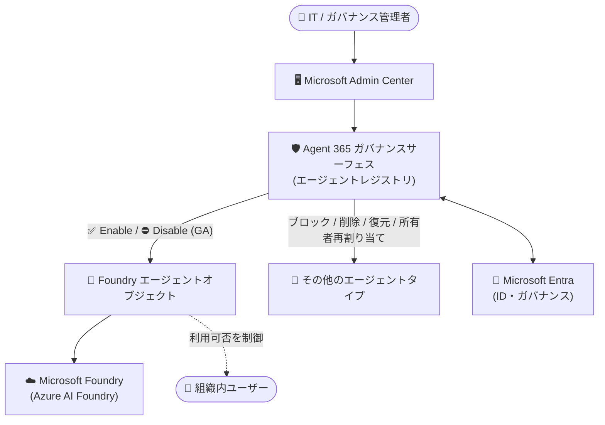

# Microsoft Foundry: Agent 365 における Foundry エージェントの有効化・無効化コントロール

**リリース日**: 2026-09-18

**サービス**: Microsoft Foundry

**機能**: Agent 365 における Foundry エージェントの有効化・無効化コントロール (Enable and disable controls for Microsoft Foundry agents in Agent 365)

**ステータス**: Launched (GA)

[このアップデートのインフォグラフィックを見る](https://takech9203.github.io/azure-news-summary/20260918-foundry-agent-365-enable-disable.html)

## 概要

Microsoft Foundry のエージェントオブジェクトに対する有効化 (enable) / 無効化 (disable) アクションが、Microsoft Admin Center 内の Agent 365 ガバナンスサーフェスで一般提供 (GA) されました。管理者は、組織全体で Foundry エージェントを利用可能にするかどうかを、他の同種のエージェントアプリケーション操作と同じ昇格 (elevation) パターンを使用して制御できます。開発者の介入は不要です。

このアップデートは、Foundry エージェントを他のエージェントタイプと並べて Admin Center に統合することで、ガバナンス上の重要なギャップを埋めるものです。IT チームとガバナンスチームは、組織内のエージェント資産全体 (agent estate) を一貫して管理し、「どのエージェントがアクティブであるか」に関するコンプライアンス・セキュリティ要件を満たすことができます。また、ブロック / ブロック解除、削除、復元、所有者の再割り当てといった、より広範な Agent 365 および Microsoft Entra のガバナンス操作も引き続き拡充されています。

**アップデート前の課題**

- Foundry エージェントの利用可否の制御が Admin Center の Agent 365 ガバナンスサーフェスに統合されておらず、他のエージェントタイプと一貫した管理ができなかった
- 組織内でエージェントの有効・無効を切り替える際に、管理者が開発者側の対応に依存する場面があった

**アップデート後の改善**

- 管理者が Microsoft Admin Center の Agent 365 ガバナンスコントロールから、Foundry エージェントの有効化・無効化を直接実行できるようになった (開発者の介入が不要)
- Foundry エージェントが他のエージェントタイプと同じ管理面 (Admin Center) に統合され、エージェント資産全体を一貫したパターンで管理できるようになった
- どのエージェントがアクティブかを組織として統制でき、コンプライアンス・セキュリティ要件への対応が容易になった

## アーキテクチャ図

管理者は Microsoft Admin Center の Agent 365 ガバナンスサーフェスから、Foundry エージェントの有効化・無効化を他のエージェントタイプと同じ操作パターンで制御できます。

## サービスアップデートの詳細

### 主要機能

1. **Foundry エージェントの有効化・無効化アクション (GA)**
   - Microsoft Admin Center 内の Agent 365 ガバナンスサーフェスで、Foundry エージェントオブジェクトに対する enable / disable アクションが一般提供
   - 組織全体で対象の Foundry エージェントを利用可能にするかどうかを管理者が制御できる

2. **一貫した管理操作パターン**
   - 同種のエージェントアプリケーション操作に適用されるものと同じ昇格 (elevation) パターンを使用
   - 開発者の介入なしに管理者が操作を完結できる

3. **エージェント資産の統合ガバナンス**
   - Foundry エージェントが他のエージェントタイプと並んで Admin Center で管理可能になり、エージェント資産全体を一貫して管理できる
   - ブロック / ブロック解除、削除、復元、所有者再割り当てなど、Agent 365 と Microsoft Entra の広範なガバナンス操作も引き続き拡充中

## 技術仕様

| 項目 | 詳細 |
|------|------|
| 対象オブジェクト | Microsoft Foundry のエージェントオブジェクト |
| 操作 | 有効化 (Enable) / 無効化 (Disable) |
| 管理面 | Microsoft Admin Center 内の Agent 365 ガバナンスサーフェス |
| 操作モデル | 同種のエージェントアプリケーション操作と同じ昇格 (elevation) パターン |
| ステータス | 一般提供 (GA)。GA 時期は 2026 年 8 月 |
| 関連ガバナンス操作 | ブロック / ブロック解除、削除、復元、所有者再割り当て (Agent 365 / Microsoft Entra 側で拡充中) |

## 設定方法

### 前提条件

1. Microsoft Agent 365 が利用可能であること (少なくとも 1 ユーザーが対象の Microsoft Agent 365 ライセンスでライセンスされている必要がある。Microsoft E5 との組み合わせが推奨)
2. Microsoft Admin Center へのアクセス権を持つ管理者アカウント (Microsoft Learn のドキュメントでは、Foundry エージェント関連の承認操作に Global Administrator または AI Administrator ロールが必要とされている)

### Microsoft Admin Center

公式アップデート情報によると、利用を開始するには Microsoft Admin Center を開き、Agent 365 のガバナンスコントロールを使用します。Microsoft 365 admin center では **Agents** > **All agents** からエージェントを管理できます。

## メリット

### ビジネス面

- どのエージェントが組織内でアクティブかを統制でき、コンプライアンス・セキュリティ要件を満たしやすくなる
- IT / ガバナンスチームがエージェント資産全体を一元的に管理でき、ガバナンスの抜け漏れを削減できる

### 技術面

- 開発者の介入なしに、管理者が Foundry エージェントの利用可否を切り替えられる
- 他のエージェントタイプと同じ昇格パターン・同じ管理面での操作となるため、運用手順を統一できる
- Agent 365 / Microsoft Entra の広範なガバナンス操作 (ブロック、削除、復元、所有者再割り当てなど) と組み合わせたライフサイクル管理が可能

## デメリット・制約事項

- 本コントロールの利用には Microsoft Admin Center (Agent 365 ガバナンスサーフェス) の利用が前提となる
- Microsoft Agent 365 はユーザー単位のライセンス体系であり、利用には対象ライセンスが必要
- ブロック / ブロック解除、削除、復元、所有者再割り当てなどの周辺ガバナンス操作は「引き続き拡充中」とされており、すべての操作が同時に揃っているとは限らない

## ユースケース

### ユースケース 1: インシデント発生時のエージェント緊急停止

**シナリオ**: 組織内で利用中の Foundry エージェントに想定外の動作やセキュリティ上の懸念が見つかった場合、IT 管理者が開発チームの対応を待たずに、Admin Center からそのエージェントを即座に無効化して組織全体での利用を停止する。

**効果**: 開発者の介入を待つことなくリスクを封じ込められ、問題解消後は同じ管理面から有効化して復旧できる。

### ユースケース 2: エージェント資産の統合ガバナンス

**シナリオ**: 複数のチームが Foundry エージェントやその他のエージェントを展開している企業で、ガバナンスチームが Admin Center の Agent 365 レジストリからすべてのエージェントを棚卸しし、承認済みのエージェントのみを有効化した状態に保つ。

**効果**: 「どのエージェントがアクティブか」を単一の管理面で統制でき、監査・コンプライアンス対応が容易になる。

## 料金

本アップデート自体の追加料金に関する記載は確認できませんでした。Microsoft Agent 365 はユーザー単位のライセンス体系です。詳細は以下を参照してください。

- [Microsoft Agent 365 のプランと価格](https://www.microsoft.com/microsoft-agent-365)
- [Microsoft Agent 365 Licensing FAQs](https://www.microsoft.com/licensing/faqs/122)

## 関連サービス・機能

- **Microsoft Agent 365**: エージェントの観測 (Observe)・統制 (Govern)・保護 (Secure) を提供するコントロールプレーン。本アップデートのガバナンスサーフェスを提供する
- **Microsoft Admin Center (Microsoft 365 admin center)**: Agent 365 のエージェントレジストリとガバナンスコントロールの操作画面
- **Microsoft Entra**: エージェントの ID 管理とガバナンス操作 (ブロック、削除、復元、所有者再割り当てなど) を提供
- **Microsoft Foundry (Azure AI Foundry)**: エージェントの開発・ホスティング基盤。本アップデートで管理対象となるエージェントオブジェクトを提供
- **Microsoft Purview / Microsoft Defender**: Agent 365 と連携し、エージェントに対するデータ保護・脅威検出を提供

## 参考リンク

- [インフォグラフィック](https://takech9203.github.io/azure-news-summary/20260918-foundry-agent-365-enable-disable.html)
- [公式アップデート情報](https://azure.microsoft.com/updates?id=571826)
- [Microsoft Foundry Agent Service ドキュメント](https://learn.microsoft.com/azure/ai-foundry/agents/)
- [Microsoft Agent 365 overview](https://learn.microsoft.com/microsoft-agent-365/overview)
- [Quickstart: Build your first autopilot (Microsoft Foundry / Agent 365)](https://learn.microsoft.com/azure/ai-foundry/agents/how-to/agent-365)
- [Microsoft Agent 365 のプランと価格](https://www.microsoft.com/microsoft-agent-365)

## まとめ

Microsoft Foundry エージェントの有効化・無効化コントロールが Microsoft Admin Center の Agent 365 ガバナンスサーフェスで GA となり、管理者は開発者の介入なしに、組織全体での Foundry エージェントの利用可否を他のエージェントタイプと同じパターンで制御できるようになりました。Foundry エージェントを含むエージェント資産全体の統合ガバナンスが可能になる重要なアップデートです。Foundry エージェントを組織で運用している場合は、Admin Center の Agent 365 ガバナンスコントロールを確認し、エージェントの棚卸しと有効・無効の統制ポリシーの整備を進めることを推奨します。

---

**タグ**: Microsoft Foundry, Agent 365, Microsoft Admin Center, AI + Machine Learning, Governance, GA
