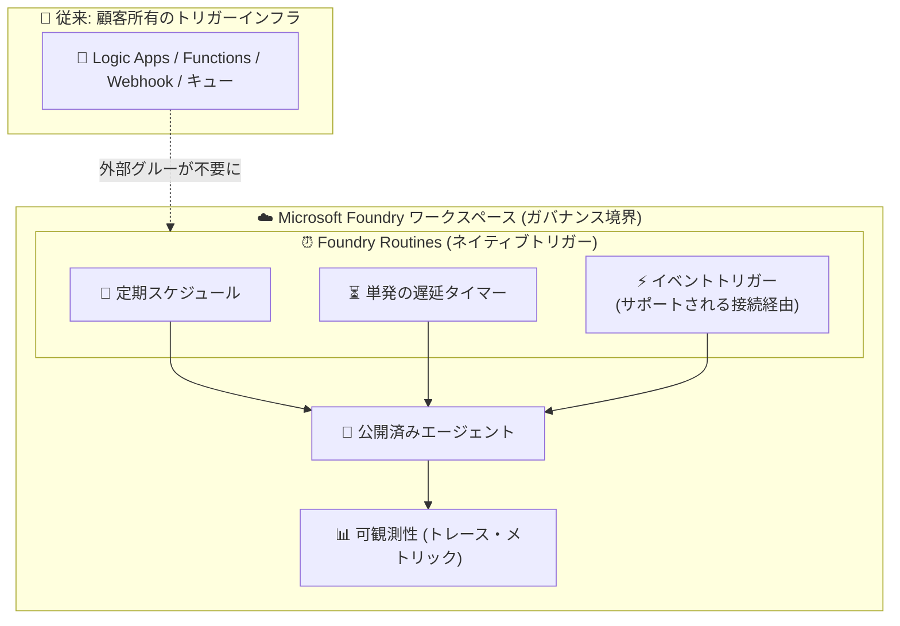

# Foundry Agent Service: Foundry Routines (Public Preview)

**リリース日**: 2026-09-18

**サービス**: Microsoft Foundry (Foundry Agent Service)

**機能**: Foundry Routines - 公開済みエージェントを自動実行するネイティブトリガー機能

**ステータス**: In preview

[このアップデートのインフォグラフィックを見る](https://takech9203.github.io/azure-news-summary/20260918-foundry-agent-service-routines.html)

## 概要

Foundry Agent Service に、公開済み (published) エージェントを自動実行するためのネイティブなトリガープリミティブ「Foundry Routines」がパブリックプレビューとして追加されました。

本番運用されるエージェントは、スケジュールに基づく定期実行や、ビジネスイベントの発生をきっかけとした実行が求められることが多くあります。これまでは、そのために Logic Apps、Azure Functions、Webhook、キュー、カスタムストレージ、個別の ID・ロール割り当てといった外部の「グルー (接着剤)」インフラを組み合わせて構築する必要がありました。Routines は、定期スケジュール、単発の遅延タイマー、サポートされる接続経由のイベントベーストリガーを提供し、トリガー・実行・可観測性をガバナンスの効いた Foundry ワークスペース内に統合します。

利用を開始するには、Foundry Agent Service で公開済みエージェントに Routine を追加します。なお、本プレビューは評価目的であり、本番環境向けの SLA は適用されません。

**アップデート前の課題**

- エージェント自体は Foundry でガバナンスされる一方、トリガー層は Logic Apps・Azure Functions・Webhook・キュー・カスタムストレージなどを組み合わせた顧客所有のインフラであり、独自の構成・監視・障害モードを個別に管理する必要があった
- トリガー用の外部サービスごとに ID とロール割り当てを別途構成する必要があった

**アップデート後の改善**

- 定期スケジュール、単発の遅延タイマー、イベントベーストリガーが Foundry のネイティブ機能として利用可能になった
- トリガー、実行、可観測性がガバナンスの効いた Foundry ワークスペース内で完結し、外部スケジューラー/トリガーの組み立てが不要になった

## アーキテクチャ図

従来は Logic Apps や Functions などの外部インフラで組み立てていたトリガー層が、Foundry Routines として Foundry ワークスペース内にネイティブに統合されます。トリガー、エージェント実行、可観測性が同一のガバナンス境界内で完結します。

## サービスアップデートの詳細

### 主要機能

1. **定期スケジュール (Recurring schedules)**
   - スケジュールに基づいて公開済みエージェントを繰り返し自動実行する

2. **単発の遅延タイマー (One-shot delayed timers)**
   - 指定した遅延の後に 1 回だけエージェントを実行する

3. **イベントベーストリガー (Event-based triggers)**
   - サポートされる接続 (supported connections) を通じて、ビジネスイベントの発生を契機にエージェントを実行する

4. **ガバナンス境界内での一元管理**
   - トリガー、実行、可観測性を Foundry ワークスペース内に保持し、外部インフラの構成・監視・障害対応を不要にする

## 技術仕様

| 項目 | 詳細 |
|------|------|
| 対象 | Foundry Agent Service の公開済み (published) エージェント |
| トリガー種別 | 定期スケジュール / 単発の遅延タイマー / イベントベーストリガー (サポートされる接続経由) |
| 利用開始方法 | Foundry Agent Service で公開済みエージェントに Routine を追加 |
| ステータス | パブリックプレビュー (評価目的、本番 SLA 対象外) |

## メリット

### ビジネス面

- 外部スケジューラー/トリガーインフラ (Logic Apps、Functions、Webhook、キューなど) の構築・運用コストを削減できる
- トリガー層を含めてエージェント全体が Foundry のガバナンス下に入り、監査・管理の一貫性が向上する

### 技術面

- トリガー用インフラの個別の構成・監視・障害モードの管理が不要になる
- トリガー用の外部サービスに対する ID・ロール割り当ての個別管理が不要になる
- スケジュール実行・遅延実行・イベント駆動実行を単一のネイティブプリミティブで実現できる

## デメリット・制約事項

- パブリックプレビューであり評価目的の位置付け。本番環境向けの SLA は適用されない
- 対象は公開済み (published) エージェントであり、公開前のエージェントに Routine を追加する手順は案内されていない
- イベントベーストリガーは「サポートされる接続」経由に限定される (対応する接続の一覧は現時点の公式発表では明記されていない)

## ユースケース

### ユースケース 1: 定期レポート生成エージェント

**シナリオ**: 日次・週次でデータを収集しレポートを生成するエージェントを、外部スケジューラーなしで定期実行したい。

**効果**: Routines の定期スケジュールにより、Logic Apps や Functions のタイマーを別途構築せずに、Foundry 内でスケジュール実行と実行履歴の監視が完結する。

### ユースケース 2: ビジネスイベント駆動のエージェント実行

**シナリオ**: 新規チケットの起票などのビジネスイベントを契機に、エージェントに即座に対応させたい。

**効果**: サポートされる接続経由のイベントベーストリガーにより、Webhook やキューなどのイベント連携インフラを自前で運用することなく、イベント駆動でエージェントを起動できる。

## 料金

Routines 自体の料金情報は現時点で公式発表では確認できませんでした。詳細は以下の料金ページを参照してください。

- [Microsoft Foundry の料金](https://azure.microsoft.com/pricing/details/microsoft-foundry/)

## 利用可能リージョン

利用可能リージョンの情報は現時点で確認できませんでした。詳細は以下を参照してください。

- [Foundry Agent Service ドキュメント](https://learn.microsoft.com/azure/ai-foundry/agents/overview)

## 関連サービス・機能

- **Azure Logic Apps**: 従来のエージェントトリガー手段。Foundry (classic) では Logic Apps の Foundry Agent Service コネクタと数百のトリガーを組み合わせたイベント駆動実行が案内されていたが、Routines によりトリガーを Foundry 内にネイティブに保持できるようになる
- **Azure Functions**: 従来、スケジュール/イベント駆動のエージェント起動用グルーコードとして利用されてきた選択肢。Routines により単純なトリガー用途では不要になる
- **Foundry の可観測性 (Observability)**: エージェントのトレース・メトリック・Application Insights 統合。Routines によるトリガー実行も Foundry ワークスペース内の可観測性の範囲に含まれる
- **エージェントの公開 (Publishing)**: エージェントを安定したエンドポイントを持つ管理対象リソースに昇格する機能。Routines は公開済みエージェントを対象とする

## 参考リンク

- [インフォグラフィック](https://takech9203.github.io/azure-news-summary/20260918-foundry-agent-service-routines.html)
- [公式アップデート情報](https://azure.microsoft.com/updates?id=563536)
- [Foundry Agent Service の概要 (Microsoft Learn)](https://learn.microsoft.com/azure/ai-foundry/agents/overview)
- [Microsoft Foundry の料金](https://azure.microsoft.com/pricing/details/microsoft-foundry/)

## まとめ

Foundry Routines は、これまで Logic Apps や Azure Functions などの外部インフラで組み立てる必要があったエージェントのトリガー層を、Foundry Agent Service のネイティブ機能として提供するパブリックプレビューです。定期スケジュール、単発の遅延タイマー、イベントベーストリガーをガバナンスの効いた Foundry ワークスペース内で一元管理でき、トリガーインフラの構成・監視・ID 管理の負担を大幅に軽減します。エージェントの定期実行やイベント駆動実行を外部サービスで実現している場合は、評価環境で公開済みエージェントに Routine を追加して検証を始めることを推奨します。ただしプレビュー期間中は本番 SLA の対象外である点に注意してください。

---

**タグ**: AI + machine learning, Microsoft Foundry, Foundry Agent Service, Foundry Routines, Microsoft Build, Feature, Public Preview
