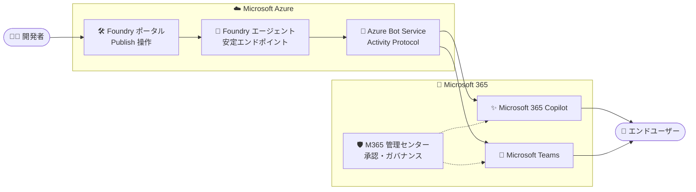

# Microsoft Foundry: Microsoft 365 Copilot / Teams へのエージェント公開が一般提供 (GA)

**リリース日**: 2026-09-18

**サービス**: Microsoft Foundry

**機能**: Foundry エージェントの Microsoft 365 Copilot および Microsoft Teams への公開

**ステータス**: Launched (GA)

[このアップデートのインフォグラフィックを見る](https://takech9203.github.io/azure-news-summary/20260918-foundry-agents-m365-copilot-teams.html)

## 概要

Microsoft Foundry で開発したエージェントを Microsoft 365 Copilot および Microsoft Teams に公開する機能が一般提供 (GA) になりました。エージェントは、それを必要とする人々に届いて初めて価値を発揮しますが、これまで Foundry 開発者には、作成したエージェントを Microsoft 365 全体で運用可能にするネイティブな手段がありませんでした。

本機能により、Foundry ポータルからエージェントを Microsoft 365 Copilot と Teams のエージェントストアに直接公開でき、エンドユーザーは普段の業務の場でエージェントを発見・利用できます。公開時には Teams アプリマニフェストのコンパイル、Azure Bot Service リソースの作成、Activity Protocol の有効化などが自動的に行われます。

重要な点として、Microsoft は「配布はガバナンスの放棄を意味しない (distribution does not mean giving up governance)」と説明しています。公開後のエージェントも Microsoft Entra と Agent 365 による統一的なガバナンス管理が継続され、IT 管理者は初日からエージェント群を一元的に可視化できます。

**アップデート前の課題**

- Foundry で開発したエージェントを Microsoft 365 で運用するためのネイティブな公開手段がなかった
- デプロイパイプライン、ボット登録、アプリマニフェストの準備を個別に行う必要があった

**アップデート後の改善**

- Foundry ポータルの Publish 操作だけで Microsoft 365 Copilot と Teams のエージェントストアに公開できるようになった
- マニフェスト生成・Bot Service 作成・Activity Protocol 有効化が公開フローで自動化された
- Microsoft Entra と Agent 365 によるガバナンスが公開後も維持され、管理者がエージェントを一元管理できるようになった

## アーキテクチャ図



Foundry ポータルの Publish 操作により、エージェントの安定エンドポイントが Azure Bot Service (Activity Protocol) 経由で Microsoft 365 Copilot と Teams に接続されます。組織スコープで公開する場合は Microsoft 365 管理センターでの管理者承認を経てエンドユーザーに配布されます。

## サービスアップデートの詳細

### 主要機能

1. **Foundry ポータルからの直接公開 (Direct publish)**
   - Publish ボタンから「Teams and Microsoft 365 Copilot」を選択し、名前・バージョン・説明などのメタデータを入力するだけで公開できる
   - Foundry が Teams アプリマニフェストを `.zip` パッケージとしてコンパイルし、Microsoft 365 Copilot / Teams のエージェントカタログに代理で提出する

2. **公開スコープの選択とアクセス制御**
   - **Just you (個人)**: 管理者承認不要で即時利用可能。エージェントストアの「Your agents」に表示され、リンク共有で特定ユーザーに展開できる (`BotServiceRbac` 認可)
   - **People in your organization (組織)**: Microsoft 365 管理センターでの管理者承認後、「Built by your org」としてテナント全ユーザーに公開される (`BotServiceTenant` 認可)

3. **安定エンドポイントによるバージョン管理**
   - エンドユーザーは常に安定エンドポイント経由でエージェントと対話するため、再公開せずに新しいエージェントバージョンをロールアウトできる
   - バージョンセレクターが「Always use latest」(既定) の場合、新バージョンが自動的に M365 / Teams で提供される

4. **マニフェストのダウンロードとカスタマイズ (Download & customize)**
   - エージェントマニフェストを ZIP でダウンロードしてカスタマイズし、Teams に手動でサイドロードする方法も選択可能

5. **公開後も継続するガバナンス**
   - 公開されたエージェントは Microsoft Entra と Agent 365 で統一的に管理され、テナントのアプリポリシーでアクセス制御できる
   - 管理者は Microsoft 365 管理センターで承認リクエストと公開済みエージェントを一元的に可視化できる

## 技術仕様

| 項目 | 詳細 |
|------|------|
| 公開先チャネル | Microsoft 365 Copilot、Microsoft Teams |
| 通信プロトコル | Activity Protocol (公開フローで自動的に有効化) |
| 認可スキーム | `BotServiceRbac` (個人スコープ) / `BotServiceTenant` (組織スコープ) |
| 公開時に作成されるリソース | Azure Bot Service リソース (既存の場合は読み取り専用で表示) |
| 必要なリソースプロバイダー | `Microsoft.BotService` |
| 公開方法 | Foundry ポータル (Direct publish / Download & customize)、REST API |
| メタデータ | 名前、公開バージョン (major.minor.patch)、短い説明、説明、開発者名 (32 文字以内)、任意で開発者サイト・利用規約・プライバシーステートメントの URL (HTTPS 必須) |
| バージョンロールアウト | 安定エンドポイント経由。バージョンセレクター更新のみで再公開不要 |

## 設定方法

### 前提条件

1. Microsoft Foundry ポータルへのアクセスと、テスト済みのエージェントバージョンを持つ Foundry プロジェクト
2. Foundry プロジェクトスコープでの **Foundry User** ロール (エージェントの作成・管理・公開)
3. 公開先リソースグループでの Azure Bot Service 作成・チャネル構成権限 (`Microsoft.BotService/botServices/write`、`Microsoft.BotService/botServices/channels/write`)。**Azure Bot Service Contributor Role** がこれらを付与 (Contributor / Owner でも可。Foundry ロールでは付与されない)
4. サブスクリプションでの `Microsoft.BotService` リソースプロバイダーの登録

### Azure CLI

```bash
# Microsoft.BotService リソースプロバイダーを登録
az provider register --namespace Microsoft.BotService
```

### Foundry ポータル

1. 公開するアクティブなエージェントバージョンを確認する (**Details** タブの **Active version** で「Always use latest」または特定バージョンを選択)
2. **Publish** を選択し、**Teams and Microsoft 365 Copilot** を選択する
3. Azure Bot Service リソースが自動作成される (既存の場合は読み取り専用で表示)
4. 名前、公開バージョン、説明、開発者名などのメタデータを入力する
5. **Next: Publish options** で **Direct publish** を選択し、公開スコープ (**Just you** / **People in your organization**) を選択する
6. **Publish** を選択する。組織スコープの場合は Microsoft 365 管理センターで管理者が承認する

## メリット

### ビジネス面

- エンドユーザーが普段業務を行う Microsoft 365 Copilot / Teams 上でエージェントを発見・利用でき、エージェントの価値がユーザーに届きやすくなる
- 個別のデプロイパイプラインやボット登録が不要になり、エージェントの組織展開までのリードタイムを短縮できる
- 管理者承認フローとテナントのアプリポリシーにより、統制の取れた組織全体への配布が可能

### 技術面

- マニフェスト生成、Bot Service 作成、Activity Protocol 有効化が公開フローで自動化される
- 安定エンドポイントにより、公開後も再公開なしで新しいエージェントバージョンをロールアウトできる
- Microsoft Entra と Agent 365 による統一的なガバナンス・可視化が公開後も維持される

## デメリット・制約事項

- パブリックネットワークアクセスを無効にしたプロジェクトでは、Foundry ポータルからの公開はサポートされない。REST API を使用し、`enable_m365_public_endpoint` でソース IP フィルター付きのパブリック Activity Protocol ルートを有効化する必要がある
- 組織スコープでの公開には Microsoft 365 管理者による承認が必要
- 旧形式のエージェント (レガシー Agent Application 形式) は GA の公開フローでは新規公開できず、新形式への移行が必要 (既存の旧形式エージェントは引き続き動作・更新可能)
- Foundry ロールだけでは公開に必要な Bot Service の権限が付与されないため、別途 Azure Bot Service Contributor Role などの割り当てが必要
- 公開時にエージェントの名前・アイコン・説明や、ユーザーのクエリに対するエージェントの応答データが Microsoft 365 / Teams 側で処理・保存されるため、組織のコンプライアンス・データ所在地・ガバナンス要件との整合を事前に評価する必要がある

## ユースケース

### ユースケース 1: 社内ナレッジエージェントの全社展開

**シナリオ**: Foundry で開発した社内 FAQ / ナレッジ検索エージェントを、全社員が Teams と Microsoft 365 Copilot から利用できるようにする。

**実装例**:

1. Foundry ポータルでエージェントをテストし、アクティブバージョンを確定する
2. **Publish** → **Teams and Microsoft 365 Copilot** で「People in your organization」スコープを選択して公開する
3. Microsoft 365 管理センター (**Requests**) で管理者が承認する
4. エージェントストアの「Built by your org」から全社員が利用開始する

**効果**: 社員は使い慣れた Teams / Copilot の UI からエージェントを発見・利用でき、専用アプリの配布や個別のボット登録作業が不要になる。

### ユースケース 2: パイロットユーザーでの段階的な検証

**シナリオ**: 本番展開前に、少人数のパイロットチームでエージェントの応答品質を検証する。

**実装例**:

1. 「Just you」スコープで公開する (管理者承認不要、即時利用可能)
2. エージェントストアの「Your agents」からエージェントリンクをパイロットメンバーに共有する
3. フィードバックを反映して新バージョンを作成する。バージョンセレクターが「Always use latest」なら再公開不要で新バージョンが提供される
4. 検証完了後、「People in your organization」スコープで組織全体に公開する

**効果**: 管理者承認を待たずに素早く検証を開始でき、安定エンドポイントにより検証中の改善サイクルも高速に回せる。

## 料金

このアップデート自体の追加料金に関する公式情報は、アップデートページでは確認できませんでした。Microsoft Foundry (エージェント実行時のモデル利用など) および公開時に作成される Azure Bot Service の料金が適用されます。詳細は以下の料金ページを参照してください。

- [Microsoft Foundry の料金](https://azure.microsoft.com/pricing/details/ai-foundry/)
- [Azure Bot Service の料金](https://azure.microsoft.com/pricing/details/bot-services/)

## 利用可能リージョン

リージョン別の提供状況は公式情報で確認できませんでした。最新の提供状況は以下を参照してください。

- [リージョン別の利用可能な製品](https://azure.microsoft.com/global-infrastructure/services/)

## 関連サービス・機能

- **Microsoft 365 Copilot**: 公開先チャネルの 1 つ。エージェントストア経由でエージェントを発見・利用できる
- **Microsoft Teams**: 公開先チャネルの 1 つ。チャットにエージェントを追加して利用できる
- **Azure Bot Service**: 公開時に自動作成され、Activity Protocol によるメッセージ交換を仲介する
- **Microsoft Entra**: 公開されたエージェントの ID (Entra Agent ID) とガバナンスを担う
- **Agent 365**: 公開後のエージェント群の一元的な可視化・管理を提供する
- **Microsoft 365 管理センター**: 組織スコープ公開時の承認と、テナントのアプリポリシーによるアクセス制御を行う

## 参考リンク

- [インフォグラフィック](https://takech9203.github.io/azure-news-summary/20260918-foundry-agents-m365-copilot-teams.html)
- [公式アップデート情報](https://azure.microsoft.com/updates?id=571816)
- [Microsoft Learn: Publish agents to Microsoft 365 Copilot and Microsoft Teams](https://learn.microsoft.com/en-us/azure/foundry/agents/how-to/publish-copilot)
- [Microsoft Learn: Agent applications in Microsoft Foundry](https://learn.microsoft.com/en-us/azure/foundry/agents/how-to/agent-applications)
- [Microsoft Learn: Agent 365 でのエージェント公開](https://learn.microsoft.com/azure/foundry/agents/how-to/agent-365)
- [Microsoft Foundry の料金](https://azure.microsoft.com/pricing/details/ai-foundry/)

## まとめ

Microsoft Foundry エージェントを Microsoft 365 Copilot と Teams に公開する機能が GA となり、開発したエージェントをエンドユーザーの日常業務の場に届けるネイティブな経路が確立されました。マニフェスト生成や Bot Service 作成が自動化される一方、Microsoft Entra / Agent 365 によるガバナンスは公開後も維持されるため、統制と配布スピードを両立できます。エージェントの組織展開を検討している場合は、Bot Service 関連の RBAC 権限と `Microsoft.BotService` プロバイダー登録を準備した上で、まず「Just you」スコープでのパイロット公開から始めることを推奨します。パブリックネットワークアクセスを無効化したプロジェクトでは REST API 経由の公開手順が必要になる点に注意してください。

---

**タグ**: AI + machine learning, Microsoft Foundry, Microsoft 365 Copilot, Microsoft Teams, Azure Bot Service, Agent, GA
